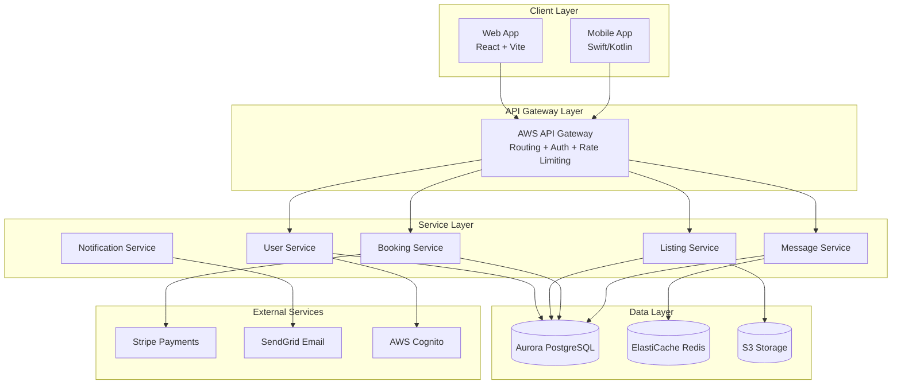
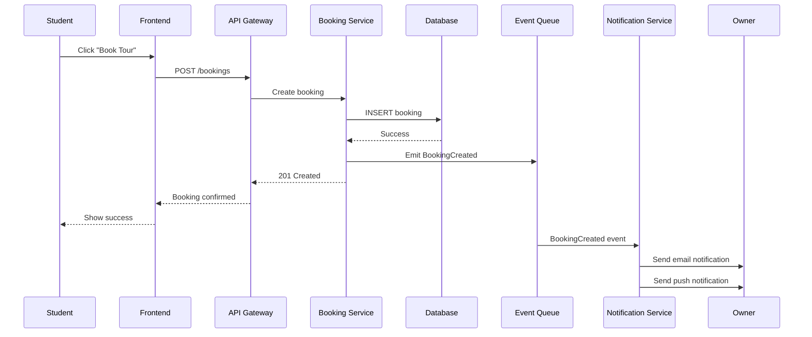
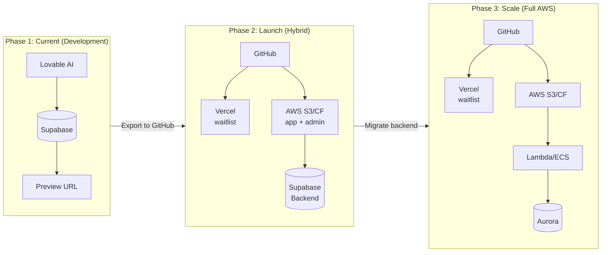

# Plan: Update plan2.md with Airbnb Architecture Case Study & Advanced System Design Education

## Overview

This update will **add approximately 1,500+ new lines** to the existing plan2.md file, integrating comprehensive Airbnb architecture insights adapted for Roomy. The update will preserve all existing content while adding new sections and expanding relevant existing sections.

---

## New Sections to Add

### 1. NEW SECTION: "PART 19: Airbnb Architecture Case Study (Applied to Roomy)"

This will be the largest new addition, covering Airbnb's architecture evolution and how it applies to Roomy's current and future state:

#### 19.1 Airbnb's Architecture Evolution Journey

```text
Version 1 (Monolith):
- Single Ruby on Rails application (they called it "monorail")
- Model, View, Controller in one repository
- Good for startup phase

Version 2 (Hybrid - Monolith + SOA):
- Monorail handles routing and view layer
- New services handle business logic, data model, access

Version 3 (Full SOA - No Monolith):
- API Gateway handles all routing, middleware, session
- Presentation Services aggregate data
- Data Services handle database access
- Derived Data Services apply business logic
```

Detailed ASCII diagrams recreating the reference images (Service-Oriented Architecture, Version 3 Without Monorail, etc.)

#### 19.2 Airbnb's Service Types (Adapted for Roomy)

| Service Type | Airbnb Purpose | Roomy Equivalent |
|--------------|----------------|------------------|
| Data Service | Entry-point for all reads/writes | Supabase tables + RLS |
| Derived Data Service | Business logic on top of data | Edge Functions |
| Mid-Tier Service | Complex business logic | Future Lambda services |
| Presentation Service | Aggregate for frontend | React Query hooks |

#### 19.3 Roomy's Current vs Future Architecture

**Current State (Lovable + Supabase):**
```text
React Frontend → Supabase (PostgREST + Edge Functions) → PostgreSQL
```

**Future State (AWS):**
```text
React Frontend → API Gateway → Lambda/ECS → Aurora PostgreSQL
         ↓
    Presentation Services → Mid-Tier Services → Data Services
```

#### 19.4 Core Domain Services for Roomy

Based on the Airbnb microservices system diagram (Image 1), adapted for Roomy:

**User Management Service:**
- Multi-role Authentication (Student, Owner, Admin)
- Secure Registration Flow
- Session Management
- Admin Controls

**Property Management Service (Dorm/Apartment):**
- Complete Property Lifecycle
- Media Handling (images, 360 tours, videos)
- Availability Calendar
- Smart Search with filters

**Booking Service:**
- Tour booking flow
- Reservation processing
- Payment integration (Stripe)
- Status management

**Messaging Service:**
- Real-time message delivery
- Read receipts and reactions
- Voice notes
- Support conversations

**Notification Service:**
- Email notifications (SendGrid/SES)
- Push notifications
- In-app notifications
- SMS (future)

**Review Service (Future):**
- Student reviews of dorms
- Owner responses
- Rating aggregation

---

### 2. NEW SECTION: "PART 20: Event-Driven Architecture"

Based on Airbnb's event-driven design:

#### 20.1 Why Events Matter

- Loose coupling between services
- Complete audit trail for debugging
- Enables analytics from event streams
- Compliance and regulatory requirements

#### 20.2 Roomy Event Flow Diagram

```text
User Action → Edge Function → Database Insert → Trigger → Event Queue
                                                            ↓
    ┌──────────────────────────────────────────────────────┴──────────────┐
    │                                                                     │
    ▼                                   ▼                                 ▼
Notification Service           Analytics Service              Audit Log Service
(sends emails/push)            (tracks metrics)              (stores for compliance)
```

#### 20.3 Current Implementation (Supabase Realtime)

- PostgreSQL triggers for events
- Supabase Realtime for WebSocket subscriptions
- Edge Functions for async processing

#### 20.4 Future Implementation (AWS)

- Amazon EventBridge for event routing
- SQS for queue processing
- SNS for fan-out notifications

---

### 3. NEW SECTION: "PART 21: Migration Strategies (Monolith to Services)"

Based on Airbnb's migration journey (Images 3-6):

#### 21.1 Re-routing Queries to Data Services

Diagram showing how Airbnb intercepted ActiveRecord queries and routed them to new services. For Roomy:
- Current: React → Supabase Client → PostgREST → PostgreSQL
- Future: React → API Gateway → Lambda → Aurora

#### 21.2 Migrating Reads Safely

**Dual Read Pattern:**
```text
1. Issue reads to both old path (Supabase) and new path (AWS)
2. Compare responses in background
3. Once 100% match, switch all traffic to new path
```

#### 21.3 Migrating Writes Safely

**Shadow Database Pattern:**
```text
1. Write to production database via old path
2. Write to shadow database via new path
3. Compare shadow vs production reads
4. Once clean, switch writes to new path
```

#### 21.4 Roomy Migration Phases

**Phase 1: Keep Supabase for Development**
- Build fast with Lovable
- All 76+ tables in Supabase
- Edge Functions for backend logic

**Phase 2: Hybrid (Production Launch)**
- Frontend deployed to AWS (S3 + CloudFront)
- Backend remains on Supabase (no change)
- Monitor performance and scale needs

**Phase 3: Database Migration (When Needed)**
- Set up Aurora PostgreSQL
- Use pg_dump/pg_restore
- Dual reads for validation
- Switch after 100% match

**Phase 4: Backend Migration (When Needed)**
- Rewrite Edge Functions as Lambda
- Deploy API Gateway
- Gradual traffic shift

---

### 4. NEW SECTION: "PART 22: Advanced Infrastructure Tools"

Based on Airbnb's internal tools (Images 7-10):

#### 22.1 API Framework Concept

How Airbnb uses Thrift for inter-service communication. For Roomy:
- Current: REST APIs with JSON
- Future: Consider gRPC or remain with REST + OpenAPI

#### 22.2 Canary Deployments

```text
Traffic Router → Production (95%) → Metrics
              → Canary (5%)     → Compare
              
If canary metrics are good, promote to 100%
If canary metrics are bad, rollback automatically
```

Implementation with GitHub Actions + AWS CodeDeploy.

#### 22.3 Parallel Task Execution (Powergrid Concept)

For operations requiring multiple validations:
```text
Special Offer Request
        ↓
   Fetch Listing Data
        ↓
┌───────┬───────┬───────┐
│       │       │       │
▼       ▼       ▼       ▼
Security  Availability  User    (parallel)
Validate  Validate      Validate
        ↓
   Aggregate Results
        ↓
   Send Response
```

#### 22.4 Service Blocks / Facades

Simplifying complex service dependencies:
```text
Presentation Services
        ↓
┌───────────────┬───────────────┬───────────────┐
│ User Entity   │ Listing Entity│ Availability  │
│ Facade        │ Facade        │ Entity Facade │
└───────────────┴───────────────┴───────────────┘

Each facade encapsulates multiple internal services
```

---

### 5. NEW SECTION: "PART 23: Production-Ready Backend Design"

#### 23.1 Three Core Domains for Roomy

| Domain | Services | Data Stores |
|--------|----------|-------------|
| **Users** | Auth, Profiles, Roles | users, students, owners, admins |
| **Listings** | Dorms, Rooms, Beds, Search | dorms, rooms, beds, dorm_photos |
| **Transactions** | Bookings, Payments, Reviews | bookings, reservations, payments |

#### 23.2 API Design Principles

- RESTful endpoints with comprehensive input validation
- Error handling with consistent error codes
- Rate limiting per endpoint
- Versioning strategy (v1, v2)

#### 23.3 Multi-Database Strategy

| Data Type | Database | Reason |
|-----------|----------|--------|
| User Data | PostgreSQL | Consistency, relationships |
| Property Data | PostgreSQL | Complex queries, joins |
| Booking Data | PostgreSQL | ACID transactions |
| Cache | Redis | Speed, sessions |
| Events | Append-only log | Audit trail |

#### 23.4 Observability

- Structured logging (CloudWatch)
- Metrics collection (CloudWatch Metrics)
- Distributed tracing (X-Ray) - for future microservices
- Alerting (CloudWatch Alarms)

---

### 6. UPDATE EXISTING SECTION: "PART 4: Roomy Architecture Decisions"

Add comparison table:

| Architecture Aspect | Airbnb (at scale) | Roomy (current) | Roomy (future) |
|---------------------|-------------------|-----------------|----------------|
| Backend | 500+ microservices | Supabase (modular monolith) | AWS (service-oriented) |
| Database | Multiple DBs per service | Single PostgreSQL | Aurora + Redis |
| Event System | Custom event bus | PostgreSQL triggers | EventBridge + SQS |
| API Style | Thrift RPC + REST | REST (PostgREST) | REST + WebSocket |

---

### 7. UPDATE EXISTING SECTION: "PART 14: AWS Education"

Add new subsection on Airbnb's AWS-like patterns:

#### 14.4 Airbnb-Style Patterns on AWS

- Event-driven with EventBridge
- Service mesh with App Mesh (future)
- Canary deployments with CodeDeploy

---

## Mermaid Diagrams to Add

### Diagram 1: Roomy Service Architecture (Future State)



### Diagram 2: Event Flow for Booking



### Diagram 3: Roomy Architecture Migration Path



---

## Files to Modify

| File | Action | Lines Added |
|------|--------|-------------|
| `.lovable/plan2.md` | Update with new sections | ~1,500+ |

## Execution Summary

1. **Preserve** all existing content in plan2.md
2. **Add** 5 new major sections (Parts 19-23)
3. **Update** 2 existing sections with new content
4. **Include** 3+ Mermaid diagrams
5. **Include** 10+ ASCII architecture diagrams recreating the reference images
6. **Include** detailed tables comparing Airbnb vs Roomy architecture

This update will make plan2.md a comprehensive 4,500+ line document serving as both:
- Educational guide for founders/team understanding web architecture
- Technical blueprint for future engineers joining Roomy

