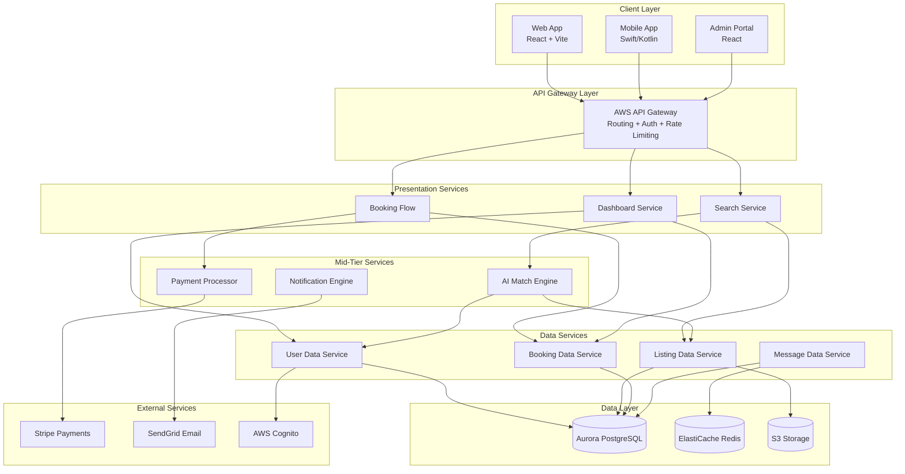
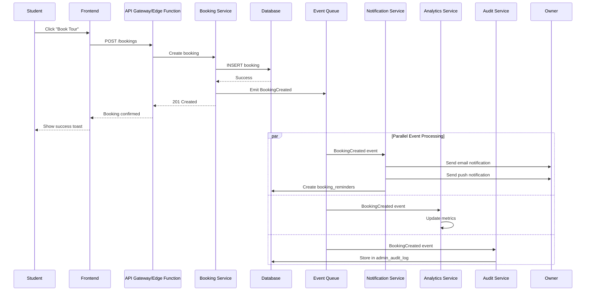
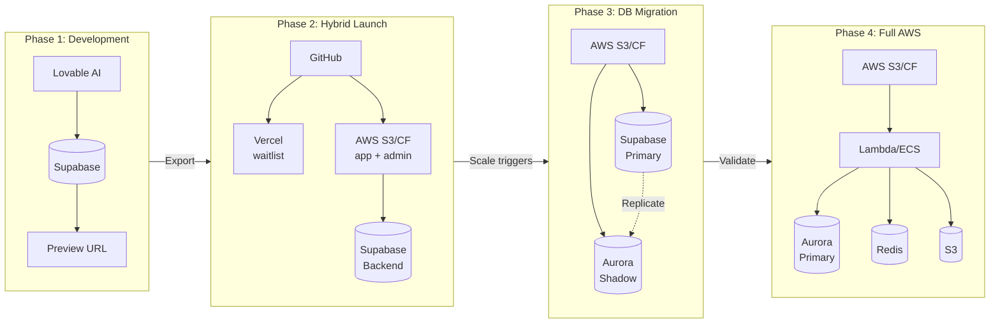

# Roomy Platform Complete Educational Guide & Architecture Plan v3

> **Document Version:** 3.0  
> **Updated:** February 2026  
> **Purpose:** Comprehensive educational guide + implementation roadmap for the Roomy student housing platform

---

## TABLE OF CONTENTS

### Foundation (Parts 1-6)
1. [Executive Summary](#executive-summary)
2. [Web Development Fundamentals](#part-1-web-development-fundamentals)
3. [Master Technology Classification](#part-2-master-technology-classification)
4. [Web Application Architecture Types](#part-3-web-application-architecture-types)
5. [Roomy Architecture Decisions](#part-4-roomy-architecture-decisions)
6. [Software Company Structure](#part-5-software-company-structure)
7. [Feature Production Line](#part-6-feature-production-line)

### Technical Implementation (Parts 7-12)
8. [Complete Technology Stack](#part-7-complete-technology-stack)
9. [Three-Subdomain Architecture](#part-8-three-subdomain-architecture)
10. [Deployment Strategy](#part-9-deployment-strategy)
11. [Migration Strategy](#part-10-migration-strategy)
12. [Implementation Timeline](#part-11-implementation-timeline)
13. [DevOps Engineer Hiring Guide](#part-12-devops-engineer-hiring-guide)

### Platform & Infrastructure (Parts 13-18)
14. [Lovable Capabilities](#part-13-lovable-capabilities)
15. [AWS Education](#part-14-aws-education)
16. [Cost Estimates](#part-15-cost-estimates)
17. [Database Schema Reference](#part-16-database-schema-reference)
18. [Security Implementation](#part-17-security-implementation)
19. [CI/CD Workflows](#part-18-cicd-workflows)

### Advanced Architecture (Parts 19-23)
20. [Airbnb Architecture Case Study](#part-19-airbnb-architecture-case-study)
21. [Event-Driven Architecture](#part-20-event-driven-architecture)
22. [Migration Strategies (Monolith to Services)](#part-21-migration-strategies)
23. [Advanced Infrastructure Tools](#part-22-advanced-infrastructure-tools)
24. [Production-Ready Backend Design](#part-23-production-ready-backend-design)

### Infrastructure & Operations (Parts 24-27) - NEW
25. [Waitlist Project Technical Specification](#part-24-waitlist-project-technical-specification)
26. [Email Infrastructure Strategy](#part-25-email-infrastructure-strategy)
27. [Domain & DNS Infrastructure](#part-26-domain-dns-infrastructure)
28. [Email Migration (Zoho → Google Workspace)](#part-27-email-migration-zoho-google-workspace)

---

## EXECUTIVE SUMMARY

### What This Document Is

This is a **comprehensive educational guide** that explains every aspect of building a modern web and mobile platform from scratch. It's designed for founders, product managers, and aspiring developers who want to understand:

- **What each technology does** (not just what it's called)
- **How a software company is organized** (departments, roles, responsibilities)
- **How a feature moves from idea to user's screen** (the complete production pipeline)
- **What architecture decisions Roomy should make** (and why)

### Key Architecture Decisions for Roomy

| Decision | Recommendation | Rationale |
|----------|----------------|-----------|
| **Web App Type** | SPA + PWA | Interactive app with offline capability |
| **Architecture** | Modular Monolith → Microservices | Fast launch, scale later |
| **Hosting: Waitlist** | Vercel | Simple, fast, cheap |
| **Hosting: App + Admin** | AWS S3 + CloudFront | Enterprise-grade from day 1 |
| **Backend: Development** | Supabase | Rapid development with Lovable |
| **Backend: Production** | AWS (Aurora, Lambda, Cognito) | Full control, unlimited scale |
| **Mobile Strategy** | Native (Swift + Kotlin) with KMP | Best UX, shared business logic |
| **DevOps** | Hire freelancer | $1,500-4,000 for AWS setup |

---

## PART 1: Web Development Fundamentals

### 1.1 The Three Core Layers of Every Application

Every web application consists of three fundamental layers. Understanding these is essential before diving into any technology:

| Layer | Restaurant Analogy | What It Does | Roomy Example |
|-------|-------------------|--------------|---------------|
| **Frontend** | The dining room | What users see and interact with | React app at app.roomylb.com |
| **Backend** | The kitchen | Processes requests, runs business logic | Supabase Edge Functions / AWS Lambda |
| **Database** | The pantry/storage | Stores all data permanently | PostgreSQL (76+ tables) |

```text
┌─────────────────────────────────────────────────────────────────────────────┐
│                              USER                                            │
│                     (Student, Owner, or Admin)                               │
└─────────────────────────────────────┬───────────────────────────────────────┘
                                      │ Opens browser/app
                                      ▼
┌─────────────────────────────────────────────────────────────────────────────┐
│                           FRONTEND LAYER                                     │
│                                                                              │
│  • Displays the UI (buttons, forms, pages)                                  │
│  • Handles user interactions (clicks, typing)                               │
│  • Sends requests to backend when user takes action                         │
│  • Receives data from backend and displays it                               │
│                                                                              │
│  Languages: HTML, CSS, TypeScript                                           │
│  Frameworks: React, Tailwind CSS, shadcn/ui                                 │
│  Build Tool: Vite                                                           │
└─────────────────────────────────────┬───────────────────────────────────────┘
                                      │ HTTPS Request (API Call)
                                      ▼
┌─────────────────────────────────────────────────────────────────────────────┐
│                           BACKEND LAYER                                      │
│                                                                              │
│  • Receives requests from frontend                                          │
│  • Validates and processes data                                             │
│  • Runs business logic (calculate prices, check permissions)                │
│  • Talks to database to get/save data                                       │
│  • Sends response back to frontend                                          │
│                                                                              │
│  Languages: TypeScript (Deno), Go, Kotlin                                   │
│  Platforms: Supabase Edge Functions, AWS Lambda, ECS                        │
└─────────────────────────────────────┬───────────────────────────────────────┘
                                      │ SQL Query
                                      ▼
┌─────────────────────────────────────────────────────────────────────────────┐
│                           DATABASE LAYER                                     │
│                                                                              │
│  • Stores all permanent data                                                │
│  • Handles relationships between data (student → reservation → dorm)        │
│  • Ensures data integrity (no duplicate emails, valid references)           │
│  • Controls access (RLS policies)                                           │
│                                                                              │
│  Language: SQL                                                              │
│  Systems: PostgreSQL (Supabase), Aurora PostgreSQL (AWS)                    │
└─────────────────────────────────────────────────────────────────────────────┘
```

### 1.2 What "Backend" Actually Includes

Many beginners think "backend = database". This is wrong. The backend includes MANY components:

| Component | What It Does | Roomy Implementation |
|-----------|--------------|---------------------|
| **API Endpoints** | URLs that receive requests | `/functions/v1/send-auth-email` |
| **Business Logic** | Processes data (calculate price, validate) | Reservation calculations, AI matching |
| **Authentication** | Verify WHO the user is | Supabase Auth + custom email verification |
| **Authorization** | Check WHAT the user can do | RLS policies, role-based access |
| **Database Queries** | Getting/saving data | Supabase client queries |
| **Edge Functions** | Serverless functions on demand | 20+ functions |
| **Middleware** | Code between request and response | CORS headers, auth checks |
| **Caching** | Store frequently-used data in memory | Redis (future: real-time presence) |
| **File Processing** | Handle uploads, resize images | Supabase Storage buckets |
| **Notifications** | Send emails, SMS, push | SendGrid, push notifications |
| **Scheduled Jobs** | Run tasks at specific times | Cron functions for reminders |
| **Webhooks** | Receive events from other services | Payment confirmations |

### 1.3 How Data Flows in a Web Application

Let's trace exactly what happens when a user clicks "Book Tour" on a dorm listing:

```text
STEP 1: User Action
┌─────────────────────────────────────────────────────────────────────────────┐
│  User clicks "Book Tour" button on dorm listing page                        │
│  Location: app.roomylb.com/listings/abc123                                  │
└─────────────────────────────────────────────────────────────────────────────┘
                                      │
                                      ▼
STEP 2: Frontend Prepares Request
┌─────────────────────────────────────────────────────────────────────────────┐
│  React component handles the click:                                          │
│                                                                              │
│  const handleBookTour = async () => {                                        │
│    const { error } = await supabase                                          │
│      .from('bookings')                                                       │
│      .insert({                                                               │
│        student_id: currentUser.studentId,                                    │
│        dorm_id: 'abc123',                                                    │
│        requested_date: '2026-03-15',                                        │
│        requested_time: '14:00',                                             │
│        message: 'I would like to see the dorm'                              │
│      });                                                                     │
│  };                                                                          │
│                                                                              │
│  This creates an HTTP POST request to the Supabase API                       │
└─────────────────────────────────────────────────────────────────────────────┘
                                      │
                                      │ HTTP POST request with:
                                      │ - Headers (Authorization: Bearer <JWT>)
                                      │ - Body (JSON data)
                                      ▼
STEP 3: Backend Receives Request
┌─────────────────────────────────────────────────────────────────────────────┐
│  Supabase PostgREST receives the request:                                   │
│                                                                              │
│  1. Validates the JWT token (is user logged in?)                            │
│  2. Extracts user ID from token                                             │
│  3. Checks RLS policy: "Can this user insert into bookings?"                │
│  4. If allowed, proceeds to database                                        │
│  5. If denied, returns 403 Forbidden                                        │
└─────────────────────────────────────────────────────────────────────────────┘
                                      │
                                      │ SQL: INSERT INTO bookings...
                                      ▼
STEP 4: Database Processes Query
┌─────────────────────────────────────────────────────────────────────────────┐
│  PostgreSQL executes:                                                        │
│                                                                              │
│  INSERT INTO bookings (                                                      │
│    student_id,                                                               │
│    dorm_id,                                                                  │
│    owner_id,          -- auto-filled from dorm's owner                      │
│    requested_date,                                                           │
│    requested_time,                                                           │
│    message,                                                                  │
│    status,            -- default: 'pending'                                 │
│    created_at         -- default: now()                                     │
│  ) VALUES (...);                                                             │
│                                                                              │
│  Triggers fire:                                                              │
│  1. create_booking_reminders() - schedules reminder notifications           │
│  2. notify_owner_new_booking() - queues notification to owner               │
└─────────────────────────────────────────────────────────────────────────────┘
                                      │
                                      │ Response: { data: {...}, error: null }
                                      ▼
STEP 5: Backend Sends Response
┌─────────────────────────────────────────────────────────────────────────────┐
│  Supabase returns to frontend:                                               │
│                                                                              │
│  {                                                                           │
│    "data": {                                                                 │
│      "id": "new-booking-uuid",                                              │
│      "student_id": "student-uuid",                                          │
│      "dorm_id": "abc123",                                                   │
│      "status": "pending",                                                   │
│      "created_at": "2026-02-03T10:30:00Z"                                   │
│    },                                                                        │
│    "error": null                                                             │
│  }                                                                           │
└─────────────────────────────────────────────────────────────────────────────┘
                                      │
                                      ▼
STEP 6: Frontend Updates UI
┌─────────────────────────────────────────────────────────────────────────────┐
│  React receives response and updates state:                                  │
│                                                                              │
│  if (!error) {                                                               │
│    toast.success("Tour requested! The owner will confirm soon.");           │
│    queryClient.invalidateQueries(['bookings']);  // refresh booking list    │
│    navigate('/student/bookings');  // go to bookings page                   │
│  } else {                                                                    │
│    toast.error("Failed to request tour. Please try again.");                │
│  }                                                                           │
└─────────────────────────────────────────────────────────────────────────────┘
                                      │
                                      ▼
STEP 7: Background Processes Run
┌─────────────────────────────────────────────────────────────────────────────┐
│  Meanwhile, in the background:                                               │
│                                                                              │
│  1. Edge Function "send-owner-notification" is triggered                    │
│  2. Function fetches owner's email and notification preferences             │
│  3. Sends email via SendGrid: "You have a new tour request!"                │
│  4. Optionally sends push notification if owner has app installed           │
│  5. Reminder scheduled for 24h before tour                                  │
└─────────────────────────────────────────────────────────────────────────────┘
```

### 1.4 HTTP Methods Explained

HTTP methods are the "verbs" of the web. They tell the server what action to perform:

| Method | Purpose | Example | Roomy Usage |
|--------|---------|---------|-------------|
| **GET** | Read data (no changes) | `GET /api/dorms` | Fetch dorm listings |
| **POST** | Create new data | `POST /api/bookings` | Create a new booking |
| **PUT** | Replace data entirely | `PUT /api/users/123` | Full profile update |
| **PATCH** | Update part of data | `PATCH /api/users/123` | Change just email |
| **DELETE** | Remove data | `DELETE /api/messages/456` | Delete a message |
| **OPTIONS** | CORS preflight check | `OPTIONS /api/*` | Browser security |

### 1.5 Complete Technical Glossary

This glossary defines every technical term you might encounter:

#### Core Concepts

| Term | What It Means |
|------|---------------|
| **API** | Application Programming Interface - how frontend talks to backend |
| **REST** | Representational State Transfer - API style using HTTP methods |
| **GraphQL** | Alternative to REST - query exactly what you need in one request |
| **CRUD** | Create, Read, Update, Delete - the four basic database operations |
| **SQL** | Structured Query Language - language for relational databases |
| **NoSQL** | Non-relational databases (document, key-value, graph) |
| **ORM** | Object-Relational Mapping - code that generates SQL for you |

#### Web & Security

| Term | What It Means |
|------|---------------|
| **CDN** | Content Delivery Network - servers worldwide for fast loading |
| **SSL/TLS** | Encryption for HTTPS (the lock icon 🔒) |
| **DNS** | Domain Name System - translates domain.com to IP address |
| **CORS** | Cross-Origin Resource Sharing - browser security for API calls |
| **JWT** | JSON Web Token - secure authentication tokens |
| **OAuth** | Authentication using third-party (Google, Facebook login) |
| **RLS** | Row Level Security - database access control per user |
| **RBAC** | Role-Based Access Control - permissions based on user role |

#### DevOps & Infrastructure

| Term | What It Means |
|------|---------------|
| **CI/CD** | Continuous Integration/Deployment - automated testing and deployment |
| **Docker** | Containerization - package code with all dependencies |
| **Kubernetes** | Container orchestration - managing many Docker containers |
| **Terraform** | Infrastructure as Code - define cloud resources in code |
| **IaC** | Infrastructure as Code - managing infrastructure through code files |

#### Architecture Patterns

| Term | What It Means |
|------|---------------|
| **Serverless** | Functions that run on demand, no server management |
| **Edge Function** | Serverless function running close to users globally |
| **Microservices** | Architecture where each feature is a separate service |
| **Monolith** | Architecture where everything is in one codebase |
| **WebSocket** | Real-time two-way communication (for messaging) |

#### Rendering Strategies

| Term | What It Means |
|------|---------------|
| **SSR** | Server-Side Rendering - server generates HTML |
| **CSR** | Client-Side Rendering - browser generates HTML |
| **SSG** | Static Site Generation - pre-build all pages at deploy time |
| **ISR** | Incremental Static Regeneration - rebuild pages on demand |
| **SPA** | Single Page Application - one HTML file, JS handles routing |
| **MPA** | Multi-Page Application - traditional websites with page reloads |

#### Mobile Development

| Term | What It Means |
|------|---------------|
| **PWA** | Progressive Web App - website that works like a native app |
| **Native App** | App built specifically for iOS or Android |
| **Hybrid App** | Web app wrapped in native shell (Capacitor, Cordova) |
| **Cross-Platform** | One codebase for multiple platforms (Flutter, React Native) |
| **KMP** | Kotlin Multiplatform - share Kotlin code across platforms |

---

## PART 2: Master Technology Classification

This section definitively categorizes every technology mentioned. This corrects the confusion from various online sources.

### 2.1 The Correct Classification

Many sources incorrectly classify technologies. Here is the **definitive, correct** classification:

#### Programming Languages

Languages are what you actually write code in. They have syntax, rules, and compile/run.

| Language | Purpose | Syntax Example | Used in Roomy |
|----------|---------|----------------|---------------|
| **JavaScript** | Web browsers, frontend | `const x = 5;` | Legacy code only |
| **TypeScript** | JavaScript + types (safer) | `const x: number = 5;` | ✅ All frontend code |
| **Swift** | iOS/macOS apps | `let x: Int = 5` | ✅ Future iOS app |
| **Kotlin** | Android apps, backends | `val x: Int = 5` | ✅ Future Android + backend |
| **Python** | AI, data science, backends | `x = 5` | ✅ Future AI services |
| **Go** | High-performance servers | `var x int = 5` | ✅ Future AWS Lambda |
| **Rust** | Ultra-fast, safe systems | `let x: i32 = 5;` | OPTIONAL - Real-time messaging |
| **Java** | Enterprise backends | `int x = 5;` | NO - Using Kotlin instead |
| **C#** | Microsoft ecosystem | `int x = 5;` | NO |
| **PHP** | Legacy web backends | `$x = 5;` | NO |
| **Ruby** | Web backends | `x = 5` | NO |

#### Query Languages

Languages specifically for database operations:

| Language | Purpose | Example | Used in Roomy |
|----------|---------|---------|---------------|
| **SQL** | Relational databases | `SELECT * FROM users` | ✅ All database queries |
| **PL/pgSQL** | PostgreSQL procedures | `CREATE FUNCTION...` | ✅ Database functions |
| **GraphQL** | API queries | `query { user { name } }` | NO - Using REST |

#### Markup & Styling Languages

Not programming languages - they define structure and appearance:

| Language | Purpose | Example | Used in Roomy |
|----------|---------|---------|---------------|
| **HTML** | Structure of web pages | `<div>content</div>` | ✅ Via React JSX |
| **CSS** | Visual styles | `color: red;` | ✅ Via Tailwind |
| **Markdown** | Documentation | `# Heading` | ✅ This document |
| **XML** | Data structure | `<user><name>John</name></user>` | Rare |

#### Configuration & Data Formats

Languages for configuration files:

| Format | Purpose | Example | Used in Roomy |
|--------|---------|---------|---------------|
| **JSON** | Data interchange | `{"name": "John"}` | ✅ API responses |
| **YAML** | Configuration files | `name: John` | ✅ CI/CD configs |
| **TOML** | Configuration | `[database]\nhost = "localhost"` | ✅ Supabase config |
| **HCL** | Terraform configs | `resource "aws_instance" {}` | ✅ Future AWS infra |

### 2.2 Frameworks & Libraries

Frameworks provide structure. Libraries provide utilities. Know the difference:

#### UI Frameworks (Frontend)

| Technology | Category | Purpose | Used in Roomy |
|------------|----------|---------|---------------|
| **React** | UI Library | Component-based UI building | ✅ All web apps |
| **Vue** | UI Framework | Alternative to React | NO |
| **Angular** | UI Framework | Enterprise React alternative | NO |
| **Svelte** | UI Framework | Compile-time framework | NO |
| **Next.js** | Full-Stack Framework | React + server features | NO - Not needed |
| **Nuxt** | Full-Stack Framework | Vue + server features | NO |
| **SvelteKit** | Full-Stack Framework | Svelte + server features | NO |

**IMPORTANT CLARIFICATION:**
- **React is a UI LIBRARY**, not a framework. It only handles the view layer.
- **Next.js is a FRAMEWORK** built on top of React. It adds routing, SSR, and backend features.
- Roomy uses **React + Vite** (SPA), not Next.js (which would be SSR/SSG).

#### Mobile UI Frameworks

| Technology | Platform | Purpose | Used in Roomy |
|------------|----------|---------|---------------|
| **SwiftUI** | iOS only | Apple's declarative UI | ✅ Future iOS |
| **UIKit** | iOS only | Apple's older imperative UI | NO - Using SwiftUI |
| **Jetpack Compose** | Android only | Google's modern UI toolkit | ✅ Future Android |
| **XML Layouts** | Android only | Older Android UI | NO - Using Compose |
| **Flutter** | Cross-platform | Google's cross-platform UI | NO - Going native |
| **React Native** | Cross-platform | React for mobile | NO - Going native |

#### Backend Frameworks

| Technology | Language | Purpose | Used in Roomy |
|------------|----------|---------|---------------|
| **Express** | Node.js | Minimal web framework | NO - Using serverless |
| **Nest.js** | Node.js | Enterprise Node framework | NO |
| **Django** | Python | Full-featured Python framework | NO |
| **Flask** | Python | Minimal Python framework | NO |
| **FastAPI** | Python | Modern async Python API | MAYBE - Future AI |
| **Spring Boot** | Java/Kotlin | Enterprise Java framework | MAYBE - Future backend |
| **Ktor** | Kotlin | Lightweight Kotlin framework | MAYBE - Future backend |
| **Gin** | Go | Fast Go framework | MAYBE - Future Lambda |
| **Rails** | Ruby | Full-featured Ruby framework | NO |

### 2.3 Build Tools

Build tools transform source code into runnable applications:

| Tool | Purpose | Used For | Used in Roomy |
|------|---------|----------|---------------|
| **Vite** | Fast bundler + dev server | React, Vue, Svelte | ✅ All frontend |
| **Webpack** | Traditional bundler | Legacy projects | NO - Using Vite |
| **Rollup** | Library bundling | npm packages | NO |
| **esbuild** | Ultra-fast bundler | Behind Vite | ✅ (via Vite) |
| **Parcel** | Zero-config bundler | Simple projects | NO |
| **Turbopack** | Next.js bundler | Next.js projects | NO |
| **Gradle** | Android/JVM builds | Android apps | ✅ Future Android |
| **Xcode Build** | iOS builds | iOS apps | ✅ Future iOS |
| **Swift Package Manager** | Swift dependencies | iOS libraries | ✅ Future iOS |

**IMPORTANT CLARIFICATION:**
- **Vite is a BUILD TOOL**, not a framework
- **React is a UI LIBRARY**, not a build tool
- You use React to write components, Vite to bundle them into a runnable app

### 2.4 Runtimes

Runtimes execute code:

| Runtime | Purpose | Used In Roomy |
|---------|---------|---------------|
| **Node.js** | JavaScript server execution | ✅ Some tooling |
| **Deno** | Modern JS/TS runtime | ✅ Edge Functions |
| **Bun** | Fast JS/TS runtime | ✅ Local development |
| **JVM** | Java/Kotlin execution | ✅ Future backend |
| **V8** | JavaScript in Chrome | ✅ (in browsers) |

### 2.5 Styling Systems

| Technology | Category | Purpose | Used in Roomy |
|------------|----------|---------|---------------|
| **Tailwind CSS** | CSS Framework | Utility-first styling | ✅ All styling |
| **Bootstrap** | CSS Framework | Pre-built components | NO |
| **Material UI** | Component Library | Google's design system | NO |
| **Chakra UI** | Component Library | Accessible components | NO |
| **shadcn/ui** | Component Collection | Copy-paste components | ✅ All components |
| **Radix UI** | UI Primitives | Unstyled accessible components | ✅ (via shadcn) |
| **CSS Modules** | CSS Methodology | Scoped CSS classes | NO |
| **Styled Components** | CSS-in-JS | CSS in JavaScript | NO |
| **Sass/SCSS** | CSS Preprocessor | CSS with features | NO |

### 2.6 Databases

| Technology | Type | Purpose | Used in Roomy |
|------------|------|---------|---------------|
| **PostgreSQL** | Relational (SQL) | Primary data storage | ✅ Current (Supabase) |
| **Aurora PostgreSQL** | Managed Relational | AWS-managed PostgreSQL | ✅ Future (AWS) |
| **MySQL** | Relational (SQL) | Alternative to PostgreSQL | NO |
| **SQLite** | Embedded Relational | Local/mobile databases | MAYBE - Mobile |
| **MongoDB** | Document (NoSQL) | Flexible schema | NO |
| **DynamoDB** | Key-Value (NoSQL) | High-scale simple data | NO |
| **Redis** | In-Memory | Caching, sessions, real-time | ✅ Future caching |
| **Elasticsearch** | Search Engine | Full-text search | MAYBE - Future search |

### 2.7 Cloud Providers & Hosting

| Technology | Category | Purpose | Used in Roomy |
|------------|----------|---------|---------------|
| **AWS** | Cloud Provider | Full cloud platform | ✅ Future production |
| **Google Cloud** | Cloud Provider | Alternative to AWS | NO |
| **Azure** | Cloud Provider | Microsoft's cloud | NO |
| **Vercel** | Hosting Platform | Frontend deployment | ✅ Waitlist site |
| **Netlify** | Hosting Platform | Alternative to Vercel | NO |
| **Cloudflare** | CDN/DNS | Domain + DDoS protection | ✅ All domains |
| **Supabase** | Backend-as-a-Service | Complete backend | ✅ Current backend |
| **Firebase** | Backend-as-a-Service | Google's alternative | NO |

### 2.8 DevOps & Infrastructure Tools

| Technology | Category | Purpose | Used in Roomy |
|------------|----------|---------|---------------|
| **Docker** | Containerization | Package applications | ✅ Future AWS |
| **Kubernetes** | Container Orchestration | Manage containers | MAYBE - At scale |
| **Terraform** | Infrastructure as Code | Define cloud resources | ✅ Future AWS |
| **Pulumi** | Infrastructure as Code | Alternative to Terraform | NO |
| **GitHub** | Code Hosting | Repository management | ✅ All code |
| **GitHub Actions** | CI/CD | Automated pipelines | ✅ Future pipelines |
| **GitLab CI** | CI/CD | Alternative to GH Actions | NO |
| **Jenkins** | CI/CD | Self-hosted CI/CD | NO |

### 2.9 External Services

| Service | Category | Purpose | Used in Roomy |
|---------|----------|---------|---------------|
| **Stripe** | Payments | Payment processing | ✅ Future payments |
| **SendGrid** | Email | Transactional emails | ✅ Notifications |
| **Twilio** | SMS | Text messaging | MAYBE - SMS alerts |
| **Mailchimp** | Marketing | Email campaigns | ✅ Waitlist |
| **Sentry** | Monitoring | Error tracking | ✅ Future monitoring |
| **DataDog** | Monitoring | Full observability | MAYBE - At scale |
| **Figma** | Design | UI/UX design tool | OPTIONAL |

---

## PART 3: Web Application Architecture Types

Understanding architecture types is essential for choosing how to build Roomy. Here's what each option means:

### 3.1 Client-Side Architectures

These determine how the user interface is delivered to the browser:

#### Single-Page Application (SPA)

**What It Is:** One HTML file is loaded initially. JavaScript handles all navigation and UI updates without full page reloads.

```text
┌─────────────────────────────────────────────────────────────────────────────┐
│                         SINGLE-PAGE APPLICATION                              │
├─────────────────────────────────────────────────────────────────────────────┤
│                                                                              │
│  Browser loads ONE HTML file + JavaScript bundle                             │
│                                                                              │
│  [index.html] ──loads──> [bundle.js] ──renders──> [App]                     │
│                                                                              │
│  When user clicks a link:                                                    │
│  • URL changes (browser history API)                                        │
│  • JavaScript renders new component                                         │
│  • NO server request for HTML                                               │
│  • API calls fetch data as needed                                           │
│                                                                              │
│  Example URLs (all same HTML, different components):                         │
│  • /listings → renders ListingsPage component                               │
│  • /listings/abc123 → renders DormDetailPage component                      │
│  • /messages → renders MessagesPage component                               │
│                                                                              │
└─────────────────────────────────────────────────────────────────────────────┘
```

**Pros:**
- ✅ Fast navigation after initial load
- ✅ Smooth, app-like user experience
- ✅ Rich interactivity
- ✅ Works great for logged-in applications

**Cons:**
- ❌ Slower initial load (large JS bundle)
- ❌ SEO challenges (empty HTML initially)
- ❌ Requires JavaScript to function

**Best For:** Interactive applications with logged-in users (dashboards, messaging, forms)

**Roomy Decision:** ✅ **YES - Primary architecture for app.roomylb.com**

#### Server-Side Rendering (SSR)

**What It Is:** Server generates complete HTML for each page request. JavaScript "hydrates" the HTML to make it interactive.

```text
┌─────────────────────────────────────────────────────────────────────────────┐
│                         SERVER-SIDE RENDERING                                │
├─────────────────────────────────────────────────────────────────────────────┤
│                                                                              │
│  Each page request:                                                          │
│                                                                              │
│  Browser ──GET /listings──> Server                                          │
│                              │                                               │
│                              ├── Fetches data from database                 │
│                              ├── Renders React to HTML                      │
│                              └── Sends complete HTML + JS                   │
│                                                                              │
│  Browser receives:                                                           │
│  • Complete HTML (can be displayed immediately)                             │
│  • JavaScript bundle (makes it interactive)                                 │
│                                                                              │
│  "Hydration": JS attaches event listeners to existing HTML                  │
│                                                                              │
└─────────────────────────────────────────────────────────────────────────────┘
```

**Pros:**
- ✅ Great for SEO (complete HTML for crawlers)
- ✅ Fast First Contentful Paint
- ✅ Works without JavaScript initially

**Cons:**
- ❌ Slower navigation (each page requires server)
- ❌ More complex infrastructure
- ❌ Higher server costs

**Best For:** Content-focused sites, SEO-critical pages, marketing sites

**Roomy Decision:** ❌ **NO - Overkill for Roomy's interactive app**

#### Progressive Web App (PWA)

**What It Is:** A web app that can be "installed" on devices and work offline, with features like push notifications.

```text
┌─────────────────────────────────────────────────────────────────────────────┐
│                         PROGRESSIVE WEB APP                                  │
├─────────────────────────────────────────────────────────────────────────────┤
│                                                                              │
│  Same as SPA, but adds:                                                      │
│                                                                              │
│  ┌─────────────────────┐     ┌─────────────────────┐                        │
│  │   manifest.json     │     │   service-worker.js │                        │
│  │                     │     │                     │                        │
│  │  • App name/icon    │     │  • Cache assets     │                        │
│  │  • Theme colors     │     │  • Offline support  │                        │
│  │  • Display mode     │     │  • Background sync  │                        │
│  │  • Start URL        │     │  • Push notifications│                       │
│  └─────────────────────┘     └─────────────────────┘                        │
│                                                                              │
│  Results in:                                                                 │
│  • "Add to Home Screen" prompt                                              │
│  • App-like experience on mobile                                            │
│  • Works without internet (cached pages)                                    │
│  • Push notifications even when closed                                      │
│                                                                              │
└─────────────────────────────────────────────────────────────────────────────┘
```

**Pros:**
- ✅ Installable without app stores
- ✅ Works offline
- ✅ Push notifications
- ✅ Lower development cost than native apps

**Cons:**
- ❌ Limited access to device features
- ❌ iOS support is limited
- ❌ Not discoverable in app stores

**Best For:** Apps that need to reach mobile users quickly before native apps are ready

**Roomy Decision:** ✅ **YES - Add PWA capabilities for mobile users**

### 3.2 Server-Side Architectures

These determine how the backend is organized:

#### Monolithic Architecture

**What It Is:** All code lives in one codebase. All features share the same deployment.

```text
┌─────────────────────────────────────────────────────────────────────────────┐
│                         MONOLITHIC ARCHITECTURE                              │
├─────────────────────────────────────────────────────────────────────────────┤
│                                                                              │
│  ONE CODEBASE contains EVERYTHING:                                           │
│                                                                              │
│  ┌─────────────────────────────────────────────────────────────────────┐    │
│  │                        Single Application                            │    │
│  ├─────────────────────────────────────────────────────────────────────┤    │
│  │  ┌─────────────┐ ┌─────────────┐ ┌─────────────┐ ┌─────────────┐   │    │
│  │  │ User Auth   │ │  Listings   │ │  Bookings   │ │  Messages   │   │    │
│  │  │  Module     │ │   Module    │ │   Module    │ │   Module    │   │    │
│  │  └─────────────┘ └─────────────┘ └─────────────┘ └─────────────┘   │    │
│  │  ┌─────────────┐ ┌─────────────┐ ┌─────────────┐ ┌─────────────┐   │    │
│  │  │  Payments   │ │    AI       │ │   Admin     │ │Notifications│   │    │
│  │  │  Module     │ │   Module    │ │   Module    │ │   Module    │   │    │
│  │  └─────────────┘ └─────────────┘ └─────────────┘ └─────────────┘   │    │
│  └─────────────────────────────────────────────────────────────────────┘    │
│                                                                              │
│  Deploys as: ONE unit                                                        │
│  Scales by: Running more copies of entire app                               │
│                                                                              │
└─────────────────────────────────────────────────────────────────────────────┘
```

**Pros:**
- ✅ Simple to develop and debug
- ✅ Easy to deploy (one thing to deploy)
- ✅ No inter-service communication overhead
- ✅ Easier to test end-to-end

**Cons:**
- ❌ Hard to scale individual features
- ❌ One bug can crash everything
- ❌ Large codebase becomes unwieldy
- ❌ Difficult for large teams (merge conflicts)

**Best For:** Startups, small teams, rapid prototyping, launch phase

**Roomy Decision:** ✅ **YES for launch - "Modular Monolith"**

#### Microservices Architecture

**What It Is:** Each feature is a separate, independently deployable service. Services communicate via APIs.

```text
┌─────────────────────────────────────────────────────────────────────────────┐
│                       MICROSERVICES ARCHITECTURE                             │
├─────────────────────────────────────────────────────────────────────────────┤
│                                                                              │
│  SEPARATE CODEBASES, each deploys independently:                             │
│                                                                              │
│  ┌───────────┐  ┌───────────┐  ┌───────────┐  ┌───────────┐                │
│  │   Auth    │  │ Listings  │  │ Bookings  │  │ Messages  │                │
│  │  Service  │  │  Service  │  │  Service  │  │  Service  │                │
│  │           │  │           │  │           │  │           │                │
│  │ (Go/Node) │  │ (Kotlin)  │  │ (Kotlin)  │  │  (Rust)   │                │
│  │           │  │           │  │           │  │           │                │
│  │ Postgres  │  │ Postgres  │  │ Postgres  │  │  Redis    │                │
│  └─────┬─────┘  └─────┬─────┘  └─────┬─────┘  └─────┬─────┘                │
│        │              │              │              │                       │
│        └──────────────┴──────────────┴──────────────┘                       │
│                              │                                               │
│                     API Gateway / Message Queue                             │
│                                                                              │
│  Each service:                                                               │
│  • Has its own database (or shares one carefully)                           │
│  • Can be written in different languages                                    │
│  • Deploys independently                                                    │
│  • Scales independently                                                     │
│  • Can fail without affecting others                                        │
│                                                                              │
└─────────────────────────────────────────────────────────────────────────────┘
```

**Pros:**
- ✅ Scale individual services based on demand
- ✅ Independent deployments
- ✅ Technology flexibility per service
- ✅ Fault isolation (one service crashes, others continue)
- ✅ Better for large teams

**Cons:**
- ❌ Complex infrastructure
- ❌ Network latency between services
- ❌ Difficult debugging (distributed tracing needed)
- ❌ Data consistency challenges

**Best For:** Large organizations, high-scale applications, 50K+ users

**Roomy Decision:** ❌ **NOT YET - After 50K+ users**

#### Serverless Architecture

**What It Is:** Functions run on-demand in the cloud. No servers to manage. Pay only for execution time.

```text
┌─────────────────────────────────────────────────────────────────────────────┐
│                       SERVERLESS ARCHITECTURE                                │
├─────────────────────────────────────────────────────────────────────────────┤
│                                                                              │
│  NO LONG-RUNNING SERVERS - Functions execute on demand:                      │
│                                                                              │
│  User Request                                                                │
│       │                                                                      │
│       ▼                                                                      │
│  ┌─────────────────────────────────────────────────────────────────────┐    │
│  │                        API Gateway                                   │    │
│  └───────────────────────────────┬─────────────────────────────────────┘    │
│                                  │                                           │
│           ┌──────────────────────┼──────────────────────┐                   │
│           │                      │                      │                   │
│           ▼                      ▼                      ▼                   │
│  ┌─────────────────┐  ┌─────────────────┐  ┌─────────────────┐              │
│  │   Function A    │  │   Function B    │  │   Function C    │              │
│  │  (send-email)   │  │  (ai-match)     │  │ (process-pay)   │              │
│  │                 │  │                 │  │                 │              │
│  │ Spins up on     │  │ Runs for 1-5    │  │ Shuts down when │              │
│  │ request         │  │ seconds         │  │ done            │              │
│  └─────────────────┘  └─────────────────┘  └─────────────────┘              │
│                                                                              │
│  Characteristics:                                                            │
│  • Pay per execution (not per hour)                                         │
│  • Auto-scales to any demand                                                │
│  • No server management                                                     │
│  • "Cold starts" can add latency                                            │
│                                                                              │
│  Examples:                                                                   │
│  • Supabase Edge Functions                                                  │
│  • AWS Lambda                                                               │
│  • Cloudflare Workers                                                       │
│                                                                              │
└─────────────────────────────────────────────────────────────────────────────┘
```

**Pros:**
- ✅ No server management
- ✅ Infinite scalability
- ✅ Pay only for usage
- ✅ Deploys instantly

**Cons:**
- ❌ Cold start latency
- ❌ Limited execution time (typically 30s-5min)
- ❌ Vendor lock-in
- ❌ Harder to debug locally

**Best For:** Event-driven tasks, APIs, background jobs

**Roomy Decision:** ✅ **YES - Using serverless for backend (Edge Functions → Lambda)**

### 3.3 Roomy's Chosen Architecture

Based on all requirements (messaging, real-time, payments, AI matching), Roomy will use:

```text
┌─────────────────────────────────────────────────────────────────────────────┐
│                     ROOMY ARCHITECTURE DECISIONS                             │
├─────────────────────────────────────────────────────────────────────────────┤
│                                                                              │
│  CLIENT ARCHITECTURE:                                                        │
│  ───────────────────                                                         │
│  ✅ Single-Page Application (SPA)                                           │
│     → Fast navigation, app-like experience                                  │
│     → React + Vite + TypeScript                                             │
│                                                                              │
│  ✅ Progressive Web App (PWA) capabilities                                  │
│     → "Add to Home Screen" for mobile users                                 │
│     → Push notifications                                                    │
│     → Before native apps are ready                                          │
│                                                                              │
│  SERVER ARCHITECTURE:                                                        │
│  ────────────────────                                                        │
│  ✅ Modular Monolith (Phase 1: Launch)                                      │
│     → Single codebase with clear module boundaries                          │
│     → Easy to develop and debug                                             │
│     → Supabase Edge Functions for serverless operations                     │
│                                                                              │
│  ✅ Serverless Functions                                                     │
│     → Edge Functions (Supabase) → Lambda (AWS)                              │
│     → No server management                                                  │
│     → Auto-scaling                                                          │
│                                                                              │
│  ❌ Microservices (Phase 2: After 50K+ users)                               │
│     → Will migrate when scaling demands it                                  │
│     → Only if team size justifies complexity                                │
│                                                                              │
│  DATABASE ARCHITECTURE:                                                      │
│  ─────────────────────                                                       │
│  ✅ Relational (PostgreSQL)                                                 │
│     → 76+ tables with proper relationships                                  │
│     → Row Level Security for access control                                 │
│     → Supabase → Aurora PostgreSQL migration                                │
│                                                                              │
│  ✅ Caching Layer (Redis - Future)                                          │
│     → Session caching                                                       │
│     → Real-time presence                                                    │
│     → Rate limiting                                                         │
│                                                                              │
└─────────────────────────────────────────────────────────────────────────────┘
```

---

## PART 4: Roomy Architecture Decisions

This section details the specific architecture choices for Roomy with rationale:

### 4.1 The 3-Tier Architecture for Roomy

```text
┌─────────────────────────────────────────────────────────────────────────────┐
│                    PRESENTATION LAYER (Frontend)                             │
│                                                                              │
│  waitlist.roomylb.com   │   app.roomylb.com    │   admin.roomylb.com        │
│  (Vercel)               │   (AWS S3+CloudFront)│   (AWS S3+CloudFront)      │
│                         │                      │                            │
│  ┌───────────────────┐  │  ┌───────────────────┐  ┌───────────────────┐    │
│  │ React + Vite      │  │  │ React + Vite      │  │ React + Vite      │    │
│  │ TypeScript        │  │  │ TypeScript        │  │ TypeScript        │    │
│  │ Tailwind CSS      │  │  │ Tailwind CSS      │  │ Tailwind CSS      │    │
│  │ shadcn/ui         │  │  │ shadcn/ui         │  │ shadcn/ui         │    │
│  │ Framer Motion     │  │  │ Framer Motion     │  │ Recharts          │    │
│  │ i18next           │  │  │ i18next           │  │                   │    │
│  └───────────────────┘  │  └───────────────────┘  └───────────────────┘    │
│                         │                      │                            │
│  Purpose:               │  Purpose:            │  Purpose:                  │
│  • Collect emails       │  • Student app       │  • Admin dashboard         │
│  • Marketing content    │  • Owner app         │  • User management         │
│  • Launch countdown     │  • Bookings, chat    │  • Content moderation      │
│  • Waitlist management  │  • AI matching       │  • Analytics               │
│                         │  • Payments          │  • System settings         │
└───────────────────────────────────┬─────────────────────────────────────────┘
                                    │ HTTPS / REST API
                                    ▼
┌─────────────────────────────────────────────────────────────────────────────┐
│                    APPLICATION LAYER (Backend)                               │
│                                                                              │
│  Development (Supabase)  │  Production (AWS)                                 │
│  ────────────────────────│───────────────────────────────────────────────   │
│                          │                                                   │
│  ┌──────────────────┐    │   ┌──────────────────┐  ┌──────────────────┐     │
│  │   Edge Functions │    │   │   API Gateway    │  │   Cognito        │     │
│  │   (Deno)         │    │   │   (Routing)      │  │   (Auth)         │     │
│  │                  │    │   └────────┬─────────┘  └──────────────────┘     │
│  │ • send-email     │    │            │                                      │
│  │ • ai-match       │    │   ┌────────▼─────────────────────────────┐       │
│  │ • verify-device  │    │   │    AWS Lambda (Node.js / Go)         │       │
│  │ • process-pay    │    │   │    OR ECS Fargate (Kotlin)           │       │
│  │ • notifications  │    │   │                                      │       │
│  │                  │    │   │  • User authentication              │       │
│  └──────────────────┘    │   │  • Reservation processing            │       │
│                          │   │  • AI matching algorithms            │       │
│  ┌──────────────────┐    │   │  • Message delivery                  │       │
│  │   Supabase Auth  │    │   │  • Payment handling                  │       │
│  │   (GoTrue)       │    │   │  • Email/SMS notifications           │       │
│  └──────────────────┘    │   └──────────────────────────────────────┘       │
│                          │                                                   │
│  ┌──────────────────┐    │   ┌──────────────────┐                           │
│  │ Supabase Realtime│    │   │ API Gateway       │                           │
│  │ (WebSocket)      │    │   │ WebSocket        │                           │
│  └──────────────────┘    │   └──────────────────┘                           │
│                          │                                                   │
└───────────────────────────────────┬─────────────────────────────────────────┘
                                    │ SQL / Redis
                                    ▼
┌─────────────────────────────────────────────────────────────────────────────┐
│                    DATA LAYER (Database & Storage)                           │
│                                                                              │
│  Development (Supabase)  │  Production (AWS)                                 │
│  ────────────────────────│───────────────────────────────────────────────   │
│                          │                                                   │
│  ┌──────────────────┐    │   ┌──────────────────┐                           │
│  │ Supabase         │    │   │   Aurora         │                           │
│  │ PostgreSQL       │    │   │   PostgreSQL     │                           │
│  │                  │    │   │                  │                           │
│  │  76+ tables      │◀──migration──▶  Same schema  │                        │
│  │  • students      │    │   │  • Auto-scaling  │                           │
│  │  • dorms         │    │   │  • Read replicas │                           │
│  │  • messages      │    │   │  • Point-in-time │                           │
│  │  • payments      │    │   │    recovery      │                           │
│  │  • bookings      │    │   │                  │                           │
│  └──────────────────┘    │   └──────────────────┘                           │
│                          │                                                   │
│  ┌──────────────────┐    │   ┌──────────────────┐                           │
│  │ Supabase Storage │    │   │   AWS S3         │                           │
│  │                  │    │   │                  │                           │
│  │  • profile-photos│    │   │  • Same buckets  │                           │
│  │  • dorm-images   │    │   │  • CDN delivery  │                           │
│  │  • chat-media    │    │   │  • Lambda image  │                           │
│  │                  │    │   │    processing    │                           │
│  └──────────────────┘    │   └──────────────────┘                           │
│                          │                                                   │
│                          │   ┌──────────────────┐                           │
│                          │   │   ElastiCache    │                           │
│                          │   │   (Redis)        │                           │
│                          │   │                  │                           │
│                          │   │  • Sessions      │                           │
│                          │   │  • Caching       │                           │
│                          │   │  • Real-time     │                           │
│                          │   │    presence      │                           │
│                          │   │  • Rate limiting │                           │
│                          │   └──────────────────┘                           │
│                          │                                                   │
└─────────────────────────────────────────────────────────────────────────────┘
```

### 4.2 Why This Architecture?

| Requirement | Architecture Choice | Rationale |
|-------------|---------------------|-----------|
| **Fast Launch** | Supabase + Vercel | Ready-made auth, database, hosting |
| **Interactive UI** | SPA (React) | App-like experience for booking/messaging |
| **Real-time Messaging** | WebSockets | Instant message delivery |
| **Mobile Users** | PWA first, Native later | Quick mobile reach, then full apps |
| **AI Features** | Serverless functions | Scale AI processing on demand |
| **Payments** | External provider (Stripe) | Don't build payment infrastructure |
| **Scale to 1M Users** | AWS migration path | Supabase to Aurora migration prepared |
| **Security** | RLS + IAM | Database-level and infrastructure security |

### 4.3 Technology Choices Explained

#### Why React (not Vue, Angular, Svelte)?

| Factor | React | Vue | Angular | Svelte |
|--------|-------|-----|---------|--------|
| **Ecosystem** | Largest | Good | Good | Growing |
| **Job Market** | Best | Good | Good | Small |
| **Learning Resources** | Most | Good | Good | Limited |
| **Lovable Support** | ✅ Native | ❌ No | ❌ No | ❌ No |
| **Component Libraries** | shadcn/ui ✅ | Vuetify | Material | Limited |
| **Mobile via React Native** | ✅ Possible | ❌ No | ❌ No | ❌ No |

**Decision:** React is the best choice for Roomy because of Lovable support, ecosystem, and future React Native option if needed.

#### Why TypeScript (not JavaScript)?

| Factor | TypeScript | JavaScript |
|--------|------------|------------|
| **Type Safety** | ✅ Catches errors at compile time | ❌ Errors only at runtime |
| **IDE Support** | ✅ Excellent autocomplete | Limited |
| **Refactoring** | ✅ Safe large-scale changes | ❌ Dangerous |
| **Team Scalability** | ✅ Self-documenting | ❌ Requires more docs |
| **Learning Curve** | Slightly higher | Lower |

**Decision:** TypeScript prevents bugs and makes the codebase maintainable. Worth the small learning curve.

#### Why Tailwind CSS (not Bootstrap, Material UI)?

| Factor | Tailwind | Bootstrap | Material UI |
|--------|----------|-----------|-------------|
| **Customization** | ✅ Full control | Limited | Google's design |
| **Bundle Size** | Small (purges unused) | Large | Large |
| **Design System** | Build your own | Predefined | Google's system |
| **With shadcn/ui** | ✅ Perfect match | ❌ Conflicts | ❌ Conflicts |
| **Utility-first** | ✅ Yes | ❌ Component-first | ❌ Component-first |

**Decision:** Tailwind + shadcn/ui gives us complete design control with pre-built accessible components.

#### Why PostgreSQL (not MongoDB, DynamoDB)?

| Factor | PostgreSQL | MongoDB | DynamoDB |
|--------|------------|---------|----------|
| **Data Relationships** | ✅ Excellent (JOINs) | ❌ Poor | ❌ Poor |
| **Data Integrity** | ✅ Strong (constraints) | Flexible | Key-value |
| **Row Level Security** | ✅ Native | ❌ No | IAM-based |
| **Supabase Support** | ✅ Native | ❌ No | ❌ No |
| **AWS Migration** | ✅ Aurora PostgreSQL | DocumentDB | Native |

**Decision:** PostgreSQL is perfect for Roomy's complex relationships (students→reservations→dorms→owners).

---

## PART 5: Software Company Structure

Understanding how a software company is organized helps you understand who does what and how work flows:

### 5.1 Department Overview

```text
┌─────────────────────────────────────────────────────────────────────────────┐
│                           ROOMY COMPANY STRUCTURE                            │
├─────────────────────────────────────────────────────────────────────────────┤
│                                                                              │
│  ┌─────────────────────────────────────────────────────────────────────┐    │
│  │                          EXECUTIVE                                   │    │
│  │                        (CEO/Founder)                                 │    │
│  │                                                                      │    │
│  │  • Sets vision and strategy                                         │    │
│  │  • Makes final decisions on product direction                       │    │
│  │  • Manages budget and hiring                                        │    │
│  │  • Represents company externally                                    │    │
│  └─────────────────────────────────┬───────────────────────────────────┘    │
│                                    │                                         │
│  ┌─────────────────────────────────┴───────────────────────────────────┐    │
│  │                                                                      │    │
│  ▼                                 ▼                                    ▼    │
│  ┌───────────────┐  ┌───────────────────────┐  ┌───────────────────────┐    │
│  │   PRODUCT     │  │        DESIGN         │  │     ENGINEERING       │    │
│  │               │  │       (UI/UX)         │  │                       │    │
│  │ • Roadmap     │  │                       │  │ • Frontend            │    │
│  │ • Features    │  │ • User research       │  │ • Backend             │    │
│  │ • Priorities  │  │ • Wireframes          │  │ • Mobile              │    │
│  │ • User stories│  │ • Visual design       │  │ • DevOps              │    │
│  │ • Success     │  │ • Prototypes          │  │ • QA                  │    │
│  │   metrics     │  │ • Design system       │  │ • Data                │    │
│  └───────────────┘  └───────────────────────┘  └───────────────────────┘    │
│                                                                              │
│  ┌───────────────┐  ┌───────────────────────┐  ┌───────────────────────┐    │
│  │   MARKETING   │  │        SUPPORT        │  │       SECURITY        │    │
│  │               │  │                       │  │                       │    │
│  │ • User growth │  │ • Customer success    │  │ • Security audits     │    │
│  │ • Content     │  │ • Bug reports         │  │ • Compliance          │    │
│  │ • SEO         │  │ • Feedback loop       │  │ • Incident response   │    │
│  │ • Campaigns   │  │ • Onboarding          │  │ • Penetration testing │    │
│  └───────────────┘  └───────────────────────┘  └───────────────────────┘    │
│                                                                              │
└─────────────────────────────────────────────────────────────────────────────┘
```

### 5.2 Engineering Team Breakdown

| Role | What They Build | Languages/Tools | Roomy Needs |
|------|-----------------|-----------------|-------------|
| **Frontend Engineer** | Web UI (buttons, pages, forms) | TypeScript, React, CSS, Tailwind | ✅ 1-2 people |
| **Backend Engineer** | Server logic, APIs, database | TypeScript/Go/Kotlin, SQL, PostgreSQL | ✅ 1 person |
| **Mobile Engineer (iOS)** | iPhone/iPad app | Swift, SwiftUI, Xcode | LATER - 1 person |
| **Mobile Engineer (Android)** | Android app | Kotlin, Jetpack Compose, Android Studio | LATER - 1 person |
| **Full-Stack Engineer** | Both frontend and backend | All of the above | ✅ Lovable acts as this |
| **DevOps Engineer** | Servers, deployment, CI/CD | AWS, Docker, Terraform, GitHub Actions | ✅ Hire for AWS setup |
| **QA Engineer** | Testing, quality assurance | Testing frameworks, Playwright, Jest | LATER |
| **Data Engineer** | Analytics, data pipelines | SQL, Python, dbt | LATER |
| **Security Engineer** | Security audits, compliance | Varies | LATER (or outsource) |

### 5.3 What Each Role Actually Does

#### Frontend Engineer

```text
┌─────────────────────────────────────────────────────────────────────────────┐
│                         FRONTEND ENGINEER                                    │
├─────────────────────────────────────────────────────────────────────────────┤
│                                                                              │
│  DAILY WORK:                                                                 │
│  • Write React components for UI features                                   │
│  • Style components with Tailwind CSS                                       │
│  • Connect UI to backend APIs using React Query                             │
│  • Handle form validation and user input                                    │
│  • Ensure responsive design (mobile + desktop)                              │
│  • Write unit tests for components                                          │
│  • Fix UI bugs reported by users                                            │
│                                                                              │
│  TECHNOLOGIES:                                                               │
│  • Languages: TypeScript, HTML, CSS                                         │
│  • Framework: React                                                         │
│  • Styling: Tailwind CSS, shadcn/ui                                         │
│  • State: React Query, React Context                                        │
│  • Build: Vite                                                              │
│  • Testing: Jest, React Testing Library                                     │
│                                                                              │
│  EXAMPLE TASK:                                                               │
│  "Build the tour booking modal that shows available times and lets          │
│   students submit a booking request"                                        │
│                                                                              │
└─────────────────────────────────────────────────────────────────────────────┘
```

#### Backend Engineer

```text
┌─────────────────────────────────────────────────────────────────────────────┐
│                         BACKEND ENGINEER                                     │
├─────────────────────────────────────────────────────────────────────────────┤
│                                                                              │
│  DAILY WORK:                                                                 │
│  • Design database schemas and write migrations                             │
│  • Build API endpoints (REST or GraphQL)                                    │
│  • Implement business logic (calculations, validations)                     │
│  • Write RLS policies for data security                                     │
│  • Create serverless functions for async tasks                              │
│  • Set up authentication and authorization                                  │
│  • Integrate with external services (Stripe, SendGrid)                      │
│  • Optimize database queries for performance                                │
│                                                                              │
│  TECHNOLOGIES:                                                               │
│  • Languages: TypeScript (Deno), Go, Kotlin, SQL                            │
│  • Database: PostgreSQL, Redis                                              │
│  • Serverless: Edge Functions, Lambda                                       │
│  • Auth: Supabase Auth, Cognito                                             │
│  • APIs: REST, WebSocket                                                    │
│  • Testing: Unit tests, integration tests                                   │
│                                                                              │
│  EXAMPLE TASK:                                                               │
│  "Create an endpoint that calculates the total price for a reservation      │
│   including the 10% platform fee, validates payment, and creates the        │
│   reservation record"                                                        │
│                                                                              │
└─────────────────────────────────────────────────────────────────────────────┘
```

#### DevOps Engineer

```text
┌─────────────────────────────────────────────────────────────────────────────┐
│                         DEVOPS ENGINEER                                      │
├─────────────────────────────────────────────────────────────────────────────┤
│                                                                              │
│  DAILY WORK:                                                                 │
│  • Set up and manage cloud infrastructure (AWS)                             │
│  • Write Infrastructure as Code (Terraform)                                 │
│  • Configure CI/CD pipelines for automated deployment                       │
│  • Monitor application performance and uptime                               │
│  • Handle incidents and outages                                             │
│  • Manage secrets and environment variables                                 │
│  • Optimize costs (right-sizing resources)                                  │
│  • Ensure security compliance                                               │
│                                                                              │
│  TECHNOLOGIES:                                                               │
│  • Cloud: AWS (EC2, S3, Lambda, RDS, CloudFront)                            │
│  • IaC: Terraform, CloudFormation                                           │
│  • Containers: Docker, Kubernetes                                           │
│  • CI/CD: GitHub Actions, Jenkins                                           │
│  • Monitoring: CloudWatch, DataDog, Sentry                                  │
│  • Security: IAM, VPC, Security Groups                                      │
│                                                                              │
│  EXAMPLE TASK:                                                               │
│  "Set up the production environment on AWS with Aurora database,            │
│   S3 for static files, CloudFront CDN, and automated deployment             │
│   from GitHub"                                                               │
│                                                                              │
└─────────────────────────────────────────────────────────────────────────────┘
```

### 5.4 Roomy Current Team Structure

| Role | Filled By | Status |
|------|-----------|--------|
| CEO/Founder | You | ✅ Active |
| Product Manager | You (using Lovable) | ✅ Active |
| Designer | You (using Lovable + Figma) | ✅ Active |
| Full-Stack Engineer | Lovable AI | ✅ Active |
| Frontend Engineer | Lovable AI | ✅ Active |
| Backend Engineer | Lovable AI | ✅ Active |
| DevOps Engineer | **NEED TO HIRE** | ❌ Gap |
| Mobile Engineer (iOS) | Future hire | ⏳ Later |
| Mobile Engineer (Android) | Future hire | ⏳ Later |
| QA Engineer | Manual testing by you | ⚠️ Limited |

**Key Gap:** DevOps engineer needed for AWS setup and production deployment.

---

## PART 6: Feature Production Line

This is the complete journey of how a feature moves from an idea in the CEO's brain to showing up on a user's screen:

### 6.1 The Complete 12-Stage Process

```text
╔═════════════════════════════════════════════════════════════════════════════╗
║                    FEATURE PRODUCTION LINE                                   ║
║             From CEO's Idea to User's Screen                                 ║
╚═════════════════════════════════════════════════════════════════════════════╝

┌─────────────────────────────────────────────────────────────────────────────┐
│  STAGE 1: IDEATION                                                           │
│  ────────────────                                                            │
│  Who: CEO/Founder                                                            │
│  What: Identify a problem or opportunity                                     │
│                                                                              │
│  Example:                                                                    │
│  "Students are missing tours because they forget. We need reminders."       │
│                                                                              │
│  Output: Informal idea (discussion, note, or message)                        │
└───────────────────────────────────────────────────────────────────────────┬─┘
                                                                            │
                                                                            ▼
┌─────────────────────────────────────────────────────────────────────────────┐
│  STAGE 2: PRODUCT SPECIFICATION                                              │
│  ──────────────────────────────                                              │
│  Who: Product Manager (or CEO at small startup)                             │
│  What: Define the feature in detail                                          │
│                                                                              │
│  Document Created: PRD (Product Requirements Document)                       │
│                                                                              │
│  ┌─────────────────────────────────────────────────────────────────────┐    │
│  │ PRD: Tour Reminders Feature                                          │    │
│  │                                                                      │    │
│  │ Problem: 30% of booked tours are no-shows                           │    │
│  │                                                                      │    │
│  │ Solution: Send reminders before scheduled tours                     │    │
│  │                                                                      │    │
│  │ Requirements:                                                        │    │
│  │ 1. Email reminder 24 hours before tour                              │    │
│  │ 2. Email reminder 1 hour before tour                                │    │
│  │ 3. Push notification 30 minutes before (if app installed)          │    │
│  │ 4. Reminder includes: date, time, dorm name, directions             │    │
│  │ 5. "Cancel" button in reminder to free up slot                      │    │
│  │                                                                      │    │
│  │ Success Metrics:                                                     │    │
│  │ - Reduce no-show rate from 30% to <10%                              │    │
│  │ - 90%+ email open rate on reminders                                 │    │
│  │                                                                      │    │
│  │ Out of Scope:                                                        │    │
│  │ - SMS reminders (Phase 2)                                           │    │
│  │ - Calendar integration (Phase 2)                                    │    │
│  └─────────────────────────────────────────────────────────────────────┘    │
│                                                                              │
│  Output: Approved PRD document                                               │
└───────────────────────────────────────────────────────────────────────────┬─┘
                                                                            │
                                                                            ▼
┌─────────────────────────────────────────────────────────────────────────────┐
│  STAGE 3: DESIGN                                                             │
│  ──────────────                                                              │
│  Who: UI/UX Designer (or using Lovable directly)                            │
│  What: Create visual mockups and user flows                                  │
│                                                                              │
│  Deliverables:                                                               │
│  1. User flow diagram (how user interacts)                                  │
│  2. Wireframes (rough layouts)                                              │
│  3. High-fidelity mockups (pixel-perfect designs)                           │
│  4. Component states (loading, error, success, empty)                       │
│  5. Mobile and desktop versions                                              │
│                                                                              │
│  ┌─────────────────────────────────────────────────────────────────────┐    │
│  │ Email Reminder Design                                                │    │
│  │ ┌───────────────────────────────────────────────┐                   │    │
│  │ │  [Roomy Logo]                                 │                   │    │
│  │ │                                               │                   │    │
│  │ │  Your tour is tomorrow! 🏠                    │                   │    │
│  │ │                                               │                   │    │
│  │ │  Hi {student_name},                          │                   │    │
│  │ │                                               │                   │    │
│  │ │  You have a tour scheduled at:               │                   │    │
│  │ │  📍 {dorm_name}                              │                   │    │
│  │ │  📅 {date} at {time}                         │                   │    │
│  │ │  📞 Contact: {owner_phone}                   │                   │    │
│  │ │                                               │                   │    │
│  │ │  [View Tour Details]  [Cancel Tour]          │                   │    │
│  │ └───────────────────────────────────────────────┘                   │    │
│  └─────────────────────────────────────────────────────────────────────┘    │
│                                                                              │
│  Tools: Figma, or directly in Lovable                                       │
│  Output: Approved design mockups                                             │
└───────────────────────────────────────────────────────────────────────────┬─┘
                                                                            │
                                                                            ▼
┌─────────────────────────────────────────────────────────────────────────────┐
│  STAGE 4: TECHNICAL PLANNING                                                 │
│  ──────────────────────────                                                  │
│  Who: Engineering Team (or Lovable with your guidance)                      │
│  What: Break down the feature into technical tasks                          │
│                                                                              │
│  ┌─────────────────────────────────────────────────────────────────────┐    │
│  │ Technical Breakdown                                                  │    │
│  │                                                                      │    │
│  │ DATABASE CHANGES:                                                    │    │
│  │ □ Create booking_reminders table                                    │    │
│  │ □ Add RLS policies                                                  │    │
│  │ □ Create trigger to auto-create reminders on booking                │    │
│  │                                                                      │    │
│  │ BACKEND TASKS:                                                       │    │
│  │ □ Create process-booking-reminders edge function                    │    │
│  │ □ Configure cron job to run every 15 minutes                        │    │
│  │ □ Create email template for reminders                               │    │
│  │ □ Add SendGrid integration for sending                              │    │
│  │                                                                      │    │
│  │ FRONTEND TASKS:                                                      │    │
│  │ □ Add "Cancel" deep link handler                                    │    │
│  │ □ Show reminder status in booking details                           │    │
│  │ □ Toast notification when reminder is sent                          │    │
│  │                                                                      │    │
│  │ TESTING:                                                             │    │
│  │ □ Unit tests for reminder logic                                     │    │
│  │ □ Integration test for full flow                                    │    │
│  │ □ Manual test with real booking                                     │    │
│  └─────────────────────────────────────────────────────────────────────┘    │
│                                                                              │
│  Output: Task list in project management (GitHub Issues, Linear, etc.)      │
└───────────────────────────────────────────────────────────────────────────┬─┘
                                                                            │
                                                                            ▼
┌─────────────────────────────────────────────────────────────────────────────┐
│  STAGE 5: IMPLEMENTATION                                                     │
│  ───────────────────────                                                     │
│  Who: Engineers (or Lovable)                                                │
│  What: Write the actual code                                                 │
│                                                                              │
│  DATABASE (SQL):                                                             │
│  ┌─────────────────────────────────────────────────────────────────────┐    │
│  │ CREATE TABLE booking_reminders (                                     │    │
│  │   id UUID PRIMARY KEY DEFAULT gen_random_uuid(),                    │    │
│  │   booking_id UUID REFERENCES bookings(id),                          │    │
│  │   reminder_type TEXT NOT NULL, -- '24h', '1h', '30m'               │    │
│  │   scheduled_at TIMESTAMPTZ NOT NULL,                                │    │
│  │   sent_at TIMESTAMPTZ,                                              │    │
│  │   status TEXT DEFAULT 'pending'                                     │    │
│  │ );                                                                   │    │
│  │                                                                      │    │
│  │ -- Trigger to create reminders when booking is created              │    │
│  │ CREATE FUNCTION create_booking_reminders()                          │    │
│  │ RETURNS TRIGGER AS $$                                               │    │
│  │ BEGIN                                                                │    │
│  │   INSERT INTO booking_reminders (booking_id, reminder_type,         │    │
│  │     scheduled_at)                                                   │    │
│  │   VALUES                                                             │    │
│  │     (NEW.id, '24h', NEW.scheduled_at - INTERVAL '24 hours'),       │    │
│  │     (NEW.id, '1h', NEW.scheduled_at - INTERVAL '1 hour');          │    │
│  │   RETURN NEW;                                                        │    │
│  │ END;                                                                 │    │
│  │ $$ LANGUAGE plpgsql;                                                │    │
│  └─────────────────────────────────────────────────────────────────────┘    │
│                                                                              │
│  BACKEND (TypeScript Edge Function):                                        │
│  ┌─────────────────────────────────────────────────────────────────────┐    │
│  │ // supabase/functions/process-booking-reminders/index.ts            │    │
│  │                                                                      │    │
│  │ Deno.serve(async () => {                                            │    │
│  │   const { data: pendingReminders } = await supabaseAdmin            │    │
│  │     .from('booking_reminders')                                      │    │
│  │     .select('*, bookings(*, students(*), dorms(*))')               │    │
│  │     .eq('status', 'pending')                                        │    │
│  │     .lte('scheduled_at', new Date().toISOString());                │    │
│  │                                                                      │    │
│  │   for (const reminder of pendingReminders) {                        │    │
│  │     await sendReminderEmail(reminder);                              │    │
│  │     await supabaseAdmin.from('booking_reminders')                   │    │
│  │       .update({ status: 'sent', sent_at: new Date() })             │    │
│  │       .eq('id', reminder.id);                                       │    │
│  │   }                                                                  │    │
│  │                                                                      │    │
│  │   return new Response(JSON.stringify({ sent: pendingReminders.length}));│ │
│  │ });                                                                  │    │
│  └─────────────────────────────────────────────────────────────────────┘    │
│                                                                              │
│  FRONTEND (React Component):                                                 │
│  ┌─────────────────────────────────────────────────────────────────────┐    │
│  │ // src/components/booking/ReminderStatus.tsx                        │    │
│  │                                                                      │    │
│  │ const ReminderStatus = ({ bookingId }: { bookingId: string }) => {  │    │
│  │   const { data: reminders } = useQuery({                            │    │
│  │     queryKey: ['booking-reminders', bookingId],                     │    │
│  │     queryFn: () => supabase                                         │    │
│  │       .from('booking_reminders')                                    │    │
│  │       .select('*')                                                  │    │
│  │       .eq('booking_id', bookingId)                                  │    │
│  │   });                                                                │    │
│  │                                                                      │    │
│  │   return (                                                           │    │
│  │     <div className="flex items-center gap-2">                       │    │
│  │       <Bell className="h-4 w-4" />                                  │    │
│  │       <span>Reminders: {reminders?.length ?? 0} scheduled</span>    │    │
│  │     </div>                                                           │    │
│  │   );                                                                 │    │
│  │ };                                                                   │    │
│  └─────────────────────────────────────────────────────────────────────┘    │
│                                                                              │
│  Output: Working code in feature branch                                      │
└───────────────────────────────────────────────────────────────────────────┬─┘
                                                                            │
                                                                            ▼
┌─────────────────────────────────────────────────────────────────────────────┐
│  STAGE 6: CODE REVIEW                                                        │
│  ──────────────────                                                          │
│  Who: Other engineers (or self-review with Lovable's help)                  │
│  What: Check code quality, security, and correctness                        │
│                                                                              │
│  Review Checklist:                                                           │
│  ✓ Code is readable and follows conventions                                │
│  ✓ No security vulnerabilities (SQL injection, XSS)                        │
│  ✓ RLS policies are correct                                                │
│  ✓ Error handling is comprehensive                                         │
│  ✓ Edge cases are handled                                                  │
│  ✓ Tests are included                                                      │
│  ✓ No performance issues                                                   │
│                                                                              │
│  Output: Approved code (or request changes)                                  │
└───────────────────────────────────────────────────────────────────────────┬─┘
                                                                            │
                                                                            ▼
┌─────────────────────────────────────────────────────────────────────────────┐
│  STAGE 7: TESTING                                                            │
│  ──────────────                                                              │
│  Who: QA Engineer (or you + Lovable)                                        │
│  What: Verify everything works correctly                                     │
│                                                                              │
│  Test Types:                                                                 │
│                                                                              │
│  UNIT TESTS (Automated):                                                     │
│  • Test createBookingReminders() function in isolation                      │
│  • Test email template generation                                           │
│  • Test date calculations                                                   │
│                                                                              │
│  INTEGRATION TESTS (Automated):                                              │
│  • Test: Create booking → reminders created → cron picks up → email sent   │
│  • Test: Cancel booking → reminders cancelled                               │
│                                                                              │
│  END-TO-END TESTS (Manual or Automated):                                    │
│  • Book a tour as a student                                                 │
│  • Wait for reminder (or adjust time for testing)                           │
│  • Verify email received with correct content                               │
│  • Click cancel link → verify booking cancelled                             │
│                                                                              │
│  EDGE CASES:                                                                 │
│  • What if tour is booked for less than 24 hours from now?                 │
│  • What if student's email is invalid?                                      │
│  • What if SendGrid is down?                                                │
│  • What if booking is cancelled after reminders are created?               │
│                                                                              │
│  Output: Test report, bug list                                               │
└───────────────────────────────────────────────────────────────────────────┬─┘
                                                                            │
                                                                            ▼
┌─────────────────────────────────────────────────────────────────────────────┐
│  STAGE 8: CI/CD PIPELINE                                                     │
│  ───────────────────────                                                     │
│  Who: Automated (GitHub Actions)                                            │
│  What: Build, test, and prepare for deployment                              │
│                                                                              │
│  Pipeline Steps:                                                             │
│                                                                              │
│  1. Developer pushes code to GitHub                                          │
│     └──> git push origin feature/booking-reminders                          │
│                                                                              │
│  2. GitHub Actions triggered automatically                                   │
│     └──> .github/workflows/ci.yml runs                                      │
│                                                                              │
│  3. Pipeline executes:                                                       │
│     a. ✓ Checkout code                                                      │
│     b. ✓ Install dependencies (npm ci)                                      │
│     c. ✓ Run linter (eslint)                                               │
│     d. ✓ Run type checker (tsc --noEmit)                                   │
│     e. ✓ Run unit tests (npm test)                                         │
│     f. ✓ Build production bundle (npm run build)                           │
│     g. ✓ Run integration tests                                             │
│     h. ✓ Deploy to staging (if on develop branch)                          │
│                                                                              │
│  4. If all pass: Ready for merge                                            │
│     If any fail: Block merge, notify developer                              │
│                                                                              │
│  Output: Green pipeline (or failure notification)                            │
└───────────────────────────────────────────────────────────────────────────┬─┘
                                                                            │
                                                                            ▼
┌─────────────────────────────────────────────────────────────────────────────┐
│  STAGE 9: STAGING VERIFICATION                                               │
│  ────────────────────────────                                                │
│  Who: Product Manager, QA, Designer                                         │
│  What: Final review on staging environment                                   │
│                                                                              │
│  Staging Environment: staging.roomylb.com (copy of production)              │
│                                                                              │
│  Verification Steps:                                                         │
│  ┌─────────────────────────────────────────────────────────────────────┐    │
│  │ □ Product Manager: Does it match the PRD requirements?              │    │
│  │ □ Designer: Does it match the approved designs?                     │    │
│  │ □ QA: All test cases passed?                                        │    │
│  │ □ Engineer: No errors in logs?                                      │    │
│  │ □ Performance: Acceptable load times?                               │    │
│  │ □ Security: RLS policies working correctly?                         │    │
│  └─────────────────────────────────────────────────────────────────────┘    │
│                                                                              │
│  Output: Sign-off to deploy to production                                    │
└───────────────────────────────────────────────────────────────────────────┬─┘
                                                                            │
                                                                            ▼
┌─────────────────────────────────────────────────────────────────────────────┐
│  STAGE 10: PRODUCTION DEPLOYMENT                                             │
│  ──────────────────────────────                                              │
│  Who: DevOps (or automated via CI/CD)                                       │
│  What: Deploy to live environment                                            │
│                                                                              │
│  Deployment Process:                                                         │
│                                                                              │
│  1. Merge feature branch to main                                            │
│     └──> git merge feature/booking-reminders                                │
│                                                                              │
│  2. CI/CD pipeline triggers production deployment                            │
│     └──> GitHub Actions runs deploy workflow                                │
│                                                                              │
│  3. Frontend deployed:                                                       │
│     a. Build production bundle                                              │
│     b. Upload to hosting (Vercel/S3)                                        │
│     c. Invalidate CDN cache                                                 │
│     d. New version live!                                                    │
│                                                                              │
│  4. Backend deployed:                                                        │
│     a. Database migration runs                                              │
│     b. Edge functions deployed                                              │
│     c. Cron job configured                                                  │
│                                                                              │
│  5. Deployment complete!                                                     │
│     └──> Users see new feature                                              │
│                                                                              │
│  Output: Feature live at app.roomylb.com                                     │
└───────────────────────────────────────────────────────────────────────────┬─┘
                                                                            │
                                                                            ▼
┌─────────────────────────────────────────────────────────────────────────────┐
│  STAGE 11: MONITORING                                                        │
│  ──────────────────                                                          │
│  Who: DevOps + Engineering                                                  │
│  What: Watch for issues after deployment                                     │
│                                                                              │
│  Monitoring Points:                                                          │
│                                                                              │
│  ERROR TRACKING (Sentry):                                                    │
│  • Any JavaScript errors in browser?                                        │
│  • Any edge function failures?                                              │
│  • Unusual error spike?                                                     │
│                                                                              │
│  PERFORMANCE (CloudWatch/DataDog):                                           │
│  • Page load times normal?                                                  │
│  • API response times normal?                                               │
│  • Database query times normal?                                             │
│                                                                              │
│  ANALYTICS:                                                                  │
│  • Are users using the new feature?                                         │
│  • What's the reminder open rate?                                           │
│  • Has no-show rate decreased?                                              │
│                                                                              │
│  USER FEEDBACK:                                                              │
│  • Support tickets related to feature?                                      │
│  • Social media mentions?                                                   │
│  • In-app feedback?                                                         │
│                                                                              │
│  Output: Dashboard of metrics, alerts for issues                             │
└───────────────────────────────────────────────────────────────────────────┬─┘
                                                                            │
                                                                            ▼
┌─────────────────────────────────────────────────────────────────────────────┐
│  STAGE 12: ITERATION                                                         │
│  ──────────────────                                                          │
│  Who: Product + Engineering                                                 │
│  What: Improve based on feedback                                             │
│                                                                              │
│  Based on data and feedback:                                                 │
│                                                                              │
│  "Users are still missing some tours. Let's add SMS reminders."             │
│  └──> Back to Stage 1: New feature idea                                     │
│                                                                              │
│  "Email open rate is only 40%. Let's improve subject lines."                │
│  └──> Quick iteration, smaller scope                                        │
│                                                                              │
│  "Users love it! No-show rate dropped to 8%."                               │
│  └──> Success! Move to next feature                                         │
│                                                                              │
│  The cycle never ends - continuous improvement                               │
│                                                                              │
└─────────────────────────────────────────────────────────────────────────────┘
```

### 6.2 Timeline for Each Stage

| Stage | Typical Duration | Can Be Parallelized? |
|-------|------------------|----------------------|
| 1. Ideation | 1 hour - 1 day | No |
| 2. Product Spec | 2-8 hours | No |
| 3. Design | 4-16 hours | No |
| 4. Technical Planning | 1-4 hours | No |
| 5. Implementation | 1-5 days | Yes (frontend + backend) |
| 6. Code Review | 1-4 hours | No |
| 7. Testing | 2-8 hours | Partially |
| 8. CI/CD Pipeline | 10-30 minutes | Automated |
| 9. Staging Verification | 1-4 hours | No |
| 10. Production Deployment | 5-15 minutes | Automated |
| 11. Monitoring | Ongoing | Automated + manual |
| 12. Iteration | Varies | New cycle |

**Total for Medium Feature:** 3-10 days from idea to production

---

## PART 7: Complete Technology Stack

### 7.1 Current Stack (Supabase + Lovable)

```text
┌─────────────────────────────────────────────────────────────────────────────┐
│                    CURRENT STACK (DEVELOPMENT)                               │
├─────────────────────────────────────────────────────────────────────────────┤
│                                                                              │
│  FRONTEND                                                                    │
│  ────────                                                                    │
│  ┌─────────────────────────────────────────────────────────────────────┐    │
│  │  Framework:     React 18                                             │    │
│  │  Language:      TypeScript 5.x                                       │    │
│  │  Build Tool:    Vite 5.x                                             │    │
│  │  Styling:       Tailwind CSS 3.x                                     │    │
│  │  Components:    shadcn/ui (Radix primitives)                         │    │
│  │  Routing:       React Router 6.x                                     │    │
│  │  Data Fetching: TanStack React Query 5.x                             │    │
│  │  Forms:         React Hook Form + Zod                                │    │
│  │  Animation:     Framer Motion 11.x                                   │    │
│  │  Charts:        Recharts 3.x                                         │    │
│  │  i18n:          i18next 25.x                                         │    │
│  │  State:         React Context + React Query cache                    │    │
│  └─────────────────────────────────────────────────────────────────────┘    │
│                                                                              │
│  BACKEND                                                                     │
│  ───────                                                                     │
│  ┌─────────────────────────────────────────────────────────────────────┐    │
│  │  Platform:      Supabase                                             │    │
│  │  Database:      PostgreSQL 15                                        │    │
│  │  Auth:          Supabase Auth (GoTrue)                               │    │
│  │  Functions:     Edge Functions (Deno runtime)                        │    │
│  │  Realtime:      Supabase Realtime (WebSocket)                        │    │
│  │  Storage:       Supabase Storage (S3-compatible)                     │    │
│  │  API:           PostgREST (auto-generated REST)                      │    │
│  └─────────────────────────────────────────────────────────────────────┘    │
│                                                                              │
│  INFRASTRUCTURE                                                              │
│  ──────────────                                                              │
│  ┌─────────────────────────────────────────────────────────────────────┐    │
│  │  Hosting:       Lovable Preview (development)                        │    │
│  │  CDN:           Included with Lovable                                │    │
│  │  DNS:           Cloudflare (roomylb.com)                             │    │
│  │  SSL:           Automatic via Lovable/Cloudflare                     │    │
│  │  Version Ctrl:  GitHub                                               │    │
│  └─────────────────────────────────────────────────────────────────────┘    │
│                                                                              │
└─────────────────────────────────────────────────────────────────────────────┘
```

### 7.2 Production Stack (AWS)

```text
┌─────────────────────────────────────────────────────────────────────────────┐
│                    PRODUCTION STACK (AWS)                                    │
├─────────────────────────────────────────────────────────────────────────────┤
│                                                                              │
│  FRONTEND (Same codebase, different hosting)                                 │
│  ────────────────────────────────────────────                                │
│  ┌─────────────────────────────────────────────────────────────────────┐    │
│  │  Same React + Vite + TypeScript stack                                │    │
│  │  Hosted on: AWS S3 + CloudFront                                      │    │
│  │  Build: GitHub Actions → S3 upload → CloudFront invalidation         │    │
│  └─────────────────────────────────────────────────────────────────────┘    │
│                                                                              │
│  BACKEND                                                                     │
│  ───────                                                                     │
│  ┌─────────────────────────────────────────────────────────────────────┐    │
│  │  API:           AWS API Gateway                                      │    │
│  │  Compute:       AWS Lambda (Node.js / Go)                            │    │
│  │                 OR ECS Fargate (Kotlin) for complex services         │    │
│  │  Auth:          AWS Cognito                                          │    │
│  │  Realtime:      API Gateway WebSocket                                │    │
│  │  Email:         AWS SES + SendGrid                                   │    │
│  │  Push:          AWS SNS                                              │    │
│  │  Queues:        AWS SQS (for async jobs)                             │    │
│  └─────────────────────────────────────────────────────────────────────┘    │
│                                                                              │
│  DATA                                                                        │
│  ────                                                                        │
│  ┌─────────────────────────────────────────────────────────────────────┐    │
│  │  Database:      Aurora PostgreSQL (Serverless v2)                    │    │
│  │  Cache:         ElastiCache (Redis)                                  │    │
│  │  Storage:       S3 (files, images)                                   │    │
│  │  Search:        OpenSearch (full-text search)                        │    │
│  └─────────────────────────────────────────────────────────────────────┘    │
│                                                                              │
│  INFRASTRUCTURE                                                              │
│  ──────────────                                                              │
│  ┌─────────────────────────────────────────────────────────────────────┐    │
│  │  CDN:           CloudFront (global edge locations)                   │    │
│  │  DNS:           Cloudflare (roomylb.com)                             │    │
│  │  SSL:           AWS ACM (free certificates)                          │    │
│  │  WAF:           AWS WAF (DDoS protection)                            │    │
│  │  Monitoring:    CloudWatch + Sentry                                  │    │
│  │  Logging:       CloudWatch Logs                                      │    │
│  │  IaC:           Terraform                                            │    │
│  │  CI/CD:         GitHub Actions                                       │    │
│  └─────────────────────────────────────────────────────────────────────┘    │
│                                                                              │
│  SECURITY                                                                    │
│  ────────                                                                    │
│  ┌─────────────────────────────────────────────────────────────────────┐    │
│  │  IAM:           Role-based access control                            │    │
│  │  VPC:           Private subnets for databases                        │    │
│  │  Security Grps: Firewall rules                                       │    │
│  │  Secrets:       AWS Secrets Manager                                  │    │
│  │  Encryption:    At rest (KMS) + in transit (TLS)                     │    │
│  └─────────────────────────────────────────────────────────────────────┘    │
│                                                                              │
└─────────────────────────────────────────────────────────────────────────────┘
```

### 7.3 Mobile Stack (Future)

```text
┌─────────────────────────────────────────────────────────────────────────────┐
│                    MOBILE STACK (FUTURE)                                     │
├─────────────────────────────────────────────────────────────────────────────┤
│                                                                              │
│  iOS APP                                                                     │
│  ───────                                                                     │
│  ┌─────────────────────────────────────────────────────────────────────┐    │
│  │  Language:      Swift 5.x                                            │    │
│  │  UI Framework:  SwiftUI                                              │    │
│  │  Architecture:  MVVM + Clean Architecture                            │    │
│  │  Networking:    URLSession + Combine                                 │    │
│  │  Storage:       Core Data / SwiftData                                │    │
│  │  Build:         Xcode + SPM                                          │    │
│  │  Distribution:  App Store (TestFlight for beta)                      │    │
│  │  Min iOS:       iOS 16+                                              │    │
│  └─────────────────────────────────────────────────────────────────────┘    │
│                                                                              │
│  ANDROID APP                                                                 │
│  ───────────                                                                 │
│  ┌─────────────────────────────────────────────────────────────────────┐    │
│  │  Language:      Kotlin                                               │    │
│  │  UI Framework:  Jetpack Compose                                      │    │
│  │  Architecture:  MVVM + Clean Architecture                            │    │
│  │  Networking:    Ktor Client / Retrofit                               │    │
│  │  Storage:       Room Database                                        │    │
│  │  Build:         Gradle + Android Studio                              │    │
│  │  Distribution:  Play Store (Internal testing for beta)              │    │
│  │  Min SDK:       API 26 (Android 8.0)                                 │    │
│  └─────────────────────────────────────────────────────────────────────┘    │
│                                                                              │
│  SHARED LOGIC (Kotlin Multiplatform)                                        │
│  ────────────────────────────────────                                        │
│  ┌─────────────────────────────────────────────────────────────────────┐    │
│  │  Language:      Kotlin                                               │    │
│  │  Shared:        Business logic, data models, API clients            │    │
│  │  Platform-spec: UI, platform APIs                                    │    │
│  │  Benefits:      Write once, use on iOS + Android + backend          │    │
│  └─────────────────────────────────────────────────────────────────────┘    │
│                                                                              │
└─────────────────────────────────────────────────────────────────────────────┘
```

---

## PART 8: Three-Subdomain Architecture

Roomy uses three separate subdomains for different purposes:

### 8.1 Subdomain Overview

```text
┌─────────────────────────────────────────────────────────────────────────────┐
│                    ROOMY SUBDOMAIN ARCHITECTURE                              │
├─────────────────────────────────────────────────────────────────────────────┤
│                                                                              │
│  ┌──────────────────────────────────────────────────────────────────────┐   │
│  │                     waitlist.roomylb.com                              │   │
│  │                          (Vercel)                                     │   │
│  │                                                                       │   │
│  │  Purpose: Collect emails before launch                               │   │
│  │  Users: Anyone interested in Roomy                                   │   │
│  │  Features:                                                            │   │
│  │  • Email signup form                                                 │   │
│  │  • Launch countdown                                                  │   │
│  │  • Feature preview                                                   │   │
│  │  • Referral program                                                  │   │
│  │                                                                       │   │
│  │  Tech: React + Vite + Mailchimp/Supabase                             │   │
│  │  Hosting: Vercel (simple, fast, free tier)                           │   │
│  └──────────────────────────────────────────────────────────────────────┘   │
│                                                                              │
│  ┌──────────────────────────────────────────────────────────────────────┐   │
│  │                       app.roomylb.com                                 │   │
│  │                    (AWS S3 + CloudFront)                              │   │
│  │                                                                       │   │
│  │  Purpose: Main user-facing application                               │   │
│  │  Users: Students & Dorm Owners                                       │   │
│  │  Features:                                                            │   │
│  │  • Dorm listings & search                                            │   │
│  │  • User profiles (students & owners)                                 │   │
│  │  • Booking & reservations                                            │   │
│  │  • Messaging system                                                  │   │
│  │  • AI matching                                                       │   │
│  │  • Payments                                                          │   │
│  │  • Reviews & ratings                                                 │   │
│  │  • Wishlists                                                         │   │
│  │  • Tour scheduling                                                   │   │
│  │  • Notifications                                                     │   │
│  │                                                                       │   │
│  │  Tech: React + Vite + AWS backend                                    │   │
│  │  Hosting: AWS S3 + CloudFront (enterprise-grade)                     │   │
│  └──────────────────────────────────────────────────────────────────────┘   │
│                                                                              │
│  ┌──────────────────────────────────────────────────────────────────────┐   │
│  │                      admin.roomylb.com                                │   │
│  │                    (AWS S3 + CloudFront)                              │   │
│  │                                                                       │   │
│  │  Purpose: Internal administration                                    │   │
│  │  Users: Roomy team only                                              │   │
│  │  Features:                                                            │   │
│  │  • User management                                                   │   │
│  │  • Dorm verification                                                 │   │
│  │  • Content moderation                                                │   │
│  │  • Analytics dashboard                                               │   │
│  │  • Payment oversight                                                 │   │
│  │  • Support tools                                                     │   │
│  │  • System settings                                                   │   │
│  │  • Security monitoring                                               │   │
│  │                                                                       │   │
│  │  Tech: React + Vite + AWS backend                                    │   │
│  │  Hosting: AWS S3 + CloudFront (separate from app)                    │   │
│  └──────────────────────────────────────────────────────────────────────┘   │
│                                                                              │
│  SHARED BACKEND                                                              │
│  ──────────────                                                              │
│  ┌──────────────────────────────────────────────────────────────────────┐   │
│  │  All three subdomains share:                                          │   │
│  │  • Same database (Aurora PostgreSQL)                                 │   │
│  │  • Same auth system (Cognito)                                        │   │
│  │  • Same API (API Gateway + Lambda)                                   │   │
│  │  • Same file storage (S3)                                            │   │
│  │                                                                       │   │
│  │  Separation is at the frontend level only                            │   │
│  └──────────────────────────────────────────────────────────────────────┘   │
│                                                                              │
└─────────────────────────────────────────────────────────────────────────────┘
```

### 8.2 Why Separate Subdomains?

| Reason | Benefit |
|--------|---------|
| **Security** | Admin panel has no public-facing code in same bundle |
| **Independent Deployments** | Update waitlist without touching app |
| **Different Optimization** | Waitlist is tiny, app is complex |
| **Team Separation** | Marketing updates waitlist, engineers update app |
| **Scaling** | App can scale independently of admin |
| **Access Control** | Admin subdomain can have IP restrictions |

### 8.3 DNS Configuration (Cloudflare)

```text
DNS RECORDS (Cloudflare)
────────────────────────

┌─────────────────────────────────────────────────────────────────────────────┐
│  roomylb.com (root domain)                                                   │
│  └──> Redirects to app.roomylb.com                                          │
│                                                                              │
│  www.roomylb.com                                                             │
│  └──> CNAME to roomylb.com (redirects to app)                               │
│                                                                              │
│  waitlist.roomylb.com                                                        │
│  └──> CNAME to cname.vercel-dns.com                                         │
│                                                                              │
│  app.roomylb.com                                                             │
│  └──> CNAME to d1234567890.cloudfront.net                                   │
│                                                                              │
│  admin.roomylb.com                                                           │
│  └──> CNAME to d0987654321.cloudfront.net                                   │
│                                                                              │
│  api.roomylb.com                                                             │
│  └──> CNAME to abc123.execute-api.us-east-1.amazonaws.com                   │
│                                                                              │
└─────────────────────────────────────────────────────────────────────────────┘
```

### 8.4 Waitlist Subdomain Details

For the complete technical specification of the waitlist project, see **PART 24**.

**Summary:**
- **Routes:** 11 pages (/, /about, /contact, /faq, /legal/*)
- **Components:** 50+ React components with shadcn/ui
- **Status:** Frontend Complete ✅, Backend Pending
- **Backend Integrations:** Mailchimp (waitlist) + Resend (contact form)
- **Deployment:** Lovable (dev) → Vercel (production)

---

## PART 9: Deployment Strategy

### 9.1 The Two Paths

You have two options for production deployment:

#### Path A: Hybrid (Recommended for Fastest Launch)

```text
┌─────────────────────────────────────────────────────────────────────────────┐
│                    PATH A: HYBRID APPROACH                                   │
├─────────────────────────────────────────────────────────────────────────────┤
│                                                                              │
│  STEP 1: Launch Waitlist (Week 1)                                           │
│  ────────────────────────────────                                            │
│  waitlist.roomylb.com → Vercel                                              │
│  • Create separate Vite project for waitlist                                │
│  • Connect to Supabase for email collection                                 │
│  • Deploy to Vercel in minutes                                              │
│  • Cost: $0 (Vercel free tier)                                              │
│                                                                              │
│  STEP 2: Continue Building App (Weeks 2-12)                                 │
│  ─────────────────────────────────────────                                   │
│  app.roomylb.com → Vercel (initially)                                       │
│  admin.roomylb.com → Vercel (initially)                                     │
│  Backend → Supabase                                                         │
│  • Keep building with Lovable                                               │
│  • Test with real users via Vercel preview                                  │
│  • Cost: ~$20/month (Vercel Pro)                                            │
│                                                                              │
│  STEP 3: Migrate to AWS (Week 13-16)                                        │
│  ────────────────────────────────────                                        │
│  • Hire DevOps engineer                                                     │
│  • Set up AWS infrastructure with Terraform                                 │
│  • Migrate database from Supabase to Aurora                                 │
│  • Deploy frontend to S3 + CloudFront                                       │
│  • Rewrite Edge Functions as Lambda                                         │
│  • Cost: $500-800/month (AWS)                                               │
│                                                                              │
│  TIMELINE: ~16 weeks to full AWS production                                 │
│                                                                              │
└─────────────────────────────────────────────────────────────────────────────┘
```

#### Path B: AWS from Day 1 (Your Preference)

```text
┌─────────────────────────────────────────────────────────────────────────────┐
│                    PATH B: AWS FROM DAY 1                                    │
├─────────────────────────────────────────────────────────────────────────────┤
│                                                                              │
│  STEP 1: Launch Waitlist (Week 1)                                           │
│  ────────────────────────────────                                            │
│  waitlist.roomylb.com → Vercel                                              │
│  (Same as Path A - Vercel is fine for marketing site)                       │
│                                                                              │
│  STEP 2: Set Up AWS Infrastructure (Weeks 2-5)                              │
│  ─────────────────────────────────────────────                               │
│  REQUIRED BEFORE APP CAN DEPLOY:                                             │
│  □ Hire DevOps engineer                                                     │
│  □ Create AWS account and set up billing                                    │
│  □ Configure VPC, subnets, security groups                                  │
│  □ Set up Aurora PostgreSQL                                                 │
│  □ Configure S3 buckets                                                     │
│  □ Set up CloudFront distributions                                          │
│  □ Configure API Gateway                                                    │
│  □ Set up Cognito for auth                                                  │
│  □ Create IAM roles and policies                                            │
│  □ Write Terraform for all above                                            │
│  □ Set up GitHub Actions for deployment                                     │
│                                                                              │
│  Cost: ~$1,500-4,000 (DevOps project) + $500/month (AWS)                    │
│                                                                              │
│  STEP 3: Build App with AWS Backend (Weeks 6-16)                            │
│  ────────────────────────────────────────────────                            │
│  • Can't use Lovable Cloud features directly                                │
│  • Lovable writes React code → You deploy to AWS                            │
│  • Backend must be written separately (Lambda functions)                    │
│  • More manual work, slower iteration                                       │
│                                                                              │
│  CHALLENGE: Lovable's backend tools work with Supabase, not AWS             │
│  SOLUTION: Build frontend with Lovable, backend manually                    │
│                                                                              │
│  TIMELINE: ~16 weeks, but more upfront work and cost                        │
│                                                                              │
└─────────────────────────────────────────────────────────────────────────────┘
```

### 9.2 Recommended Hybrid Approach

Given that:
1. You don't know AWS yet
2. You want to launch fast
3. Lovable works best with Supabase

**I recommend Path A with this timeline:**

| Phase | Duration | Focus | Platform |
|-------|----------|-------|----------|
| **Phase 1** | Weeks 1-4 | Build waitlist + core app features | Lovable + Supabase |
| **Phase 2** | Weeks 5-12 | Complete app, test with beta users | Lovable + Supabase + Vercel |
| **Phase 3** | Weeks 13-16 | Hire DevOps, migrate to AWS | AWS (with DevOps engineer) |
| **Phase 4** | Weeks 17+ | Scale and grow on AWS | AWS |

This gives you:
- **Fast launch** with Lovable + Supabase
- **Real users** providing feedback early
- **Professional infrastructure** when you're ready
- **No wasted time** learning AWS when you should be building

---

## PART 10: Migration Strategy

### 10.1 Supabase → AWS Migration

When ready to move from Supabase to AWS:

```text
┌─────────────────────────────────────────────────────────────────────────────┐
│                    MIGRATION STRATEGY                                        │
├─────────────────────────────────────────────────────────────────────────────┤
│                                                                              │
│  COMPONENT          SUPABASE              AWS                 EFFORT         │
│  ─────────────────────────────────────────────────────────────────────────  │
│                                                                              │
│  Database           PostgreSQL      →     Aurora PostgreSQL   MEDIUM         │
│  • Export: pg_dump                                                          │
│  • Import: pg_restore                                                       │
│  • 76+ tables migrate directly                                              │
│  • RLS policies need conversion                                             │
│                                                                              │
│  ─────────────────────────────────────────────────────────────────────────  │
│                                                                              │
│  Authentication     Supabase Auth   →     AWS Cognito         HARD           │
│  • User accounts need migration                                             │
│  • Password hashes may not transfer                                         │
│  • May need to ask users to reset passwords                                 │
│  • OR keep Supabase Auth temporarily                                        │
│                                                                              │
│  ─────────────────────────────────────────────────────────────────────────  │
│                                                                              │
│  Edge Functions     Deno runtime    →     AWS Lambda          HARD           │
│  • Rewrite from Deno to Node.js or Go                                       │
│  • 20+ functions to convert                                                 │
│  • Different environment/secrets handling                                   │
│                                                                              │
│  ─────────────────────────────────────────────────────────────────────────  │
│                                                                              │
│  Realtime           Supabase        →     API Gateway WS      HARD           │
│  • WebSocket infrastructure needed                                          │
│  • Message delivery logic rebuild                                           │
│  • Connection management                                                    │
│                                                                              │
│  ─────────────────────────────────────────────────────────────────────────  │
│                                                                              │
│  File Storage       Supabase Store  →     AWS S3               EASY          │
│  • Copy files with aws s3 sync                                              │
│  • Update URLs in database                                                  │
│  • Keep same bucket structure                                               │
│                                                                              │
│  ─────────────────────────────────────────────────────────────────────────  │
│                                                                              │
│  REST API           PostgREST       →     API Gateway + Lambda  HARD         │
│  • Auto-generated API → manually built API                                  │
│  • Define all endpoints explicitly                                          │
│  • More control, more work                                                  │
│                                                                              │
│  ─────────────────────────────────────────────────────────────────────────  │
│                                                                              │
│  TOTAL MIGRATION EFFORT: 4-8 weeks with DevOps engineer                     │
│                                                                              │
└─────────────────────────────────────────────────────────────────────────────┘
```

### 10.2 Migration Steps

1. **Parallel Infrastructure** (Week 1)
   - Set up AWS while Supabase still running
   - No downtime for users

2. **Database Migration** (Week 2)
   - Export Supabase database
   - Import to Aurora
   - Verify data integrity

3. **Backend Migration** (Weeks 3-4)
   - Rewrite Edge Functions as Lambda
   - Deploy new API Gateway
   - Test thoroughly

4. **Auth Migration** (Week 5)
   - Set up Cognito
   - Migrate user accounts
   - Handle password reset if needed

5. **Frontend Switch** (Week 6)
   - Update API endpoints in React code
   - Deploy frontend to S3 + CloudFront
   - Verify all features work

6. **Cutover** (Week 7)
   - Switch DNS to new infrastructure
   - Monitor for issues
   - Keep Supabase as backup

7. **Cleanup** (Week 8)
   - Decommission Supabase after 30 days stable
   - Finalize AWS cost optimization

---

## PART 11: Implementation Timeline

### 11.1 36-Week Master Timeline

```text
╔═════════════════════════════════════════════════════════════════════════════╗
║                    36-WEEK ROOMY IMPLEMENTATION TIMELINE                     ║
╚═════════════════════════════════════════════════════════════════════════════╝

PHASE 1: FOUNDATION (Weeks 1-8)
════════════════════════════════

Week 1-2: Waitlist Launch
├── Create waitlist.roomylb.com
├── Email collection with Mailchimp/Supabase
├── Landing page with feature preview
├── Deploy to Vercel
└── Start marketing

Week 3-4: Core App Features
├── Authentication system (email + password)
├── Student profile creation
├── Owner profile creation
├── Basic dorm listing CRUD
└── Photo upload for dorms

Week 5-6: Search & Discovery
├── Dorm search with filters
├── Map integration
├── Wishlist/favorites
├── Dorm detail pages
└── Responsive mobile design

Week 7-8: Booking System
├── Tour booking flow
├── Owner availability calendar
├── Booking notifications
├── Email confirmations
└── Booking management

PHASE 2: FEATURES (Weeks 9-16)
═══════════════════════════════

Week 9-10: Messaging System
├── Real-time chat
├── Message reactions
├── Read receipts
├── Media attachments
└── Group conversations

Week 11-12: AI Matching
├── Personality questionnaire
├── AI match algorithm
├── Match results display
├── Match insights
└── VIP tier features

Week 13-14: Reservations & Payments
├── Reservation flow
├── Payment integration (Stripe)
├── 10% platform fee
├── Receipt generation
└── Refund handling

Week 15-16: Owner Dashboard
├── Dorm management
├── Room/bed inventory
├── Booking calendar
├── Revenue analytics
└── Payout setup

PHASE 3: POLISH (Weeks 17-24)
═════════════════════════════

Week 17-18: Admin Dashboard
├── User management
├── Dorm verification
├── Content moderation
├── Analytics dashboard
└── Security monitoring

Week 19-20: PWA & Notifications
├── PWA setup (manifest, service worker)
├── Push notifications
├── Offline support
├── App-like experience
└── Install prompts

Week 21-22: i18n & Accessibility
├── Arabic language support
├── RTL layout
├── Accessibility audit
├── Screen reader support
└── Keyboard navigation

Week 23-24: Testing & Bug Fixes
├── Comprehensive QA
├── Performance optimization
├── Security audit
├── Load testing
└── Beta user feedback

PHASE 4: AWS MIGRATION (Weeks 25-32)
═════════════════════════════════════

Week 25-26: DevOps Onboarding
├── Hire DevOps engineer
├── AWS account setup
├── VPC and networking
├── Terraform foundations
└── CI/CD pipeline setup

Week 27-28: AWS Infrastructure
├── Aurora PostgreSQL
├── S3 buckets
├── CloudFront distributions
├── API Gateway
└── Lambda functions start

Week 29-30: Backend Migration
├── Rewrite Edge Functions as Lambda
├── Auth migration (Cognito)
├── Realtime migration
├── Storage migration
└── API testing

Week 31-32: Cutover & Stabilization
├── DNS switch
├── Traffic migration
├── Performance monitoring
├── Bug fixes
└── Supabase decommission

PHASE 5: MOBILE APPS (Weeks 33-52)
═══════════════════════════════════

Week 33-36: Mobile Foundation
├── KMP shared module setup
├── iOS project creation (Swift/SwiftUI)
├── Android project creation (Kotlin/Compose)
├── API client (shared)
└── Auth flow (shared)

Week 37-44: Core Mobile Features
├── All features from web app
├── Native navigation
├── Push notifications (native)
├── Camera integration
└── Location services

Week 45-48: Testing & Polish
├── Beta testing (TestFlight/Internal)
├── Performance optimization
├── Accessibility
├── Crash monitoring
└── User feedback

Week 49-52: App Store Launch
├── App Store review preparation
├── Play Store review preparation
├── Marketing assets
├── Launch coordination
└── Post-launch support

═════════════════════════════════════════════════════════════════════════════
MILESTONE SUMMARY:
• Week 2:  Waitlist live at waitlist.roomylb.com
• Week 16: Full web app on Vercel + Supabase
• Week 24: Production-ready on Vercel
• Week 32: Migrated to AWS
• Week 52: Native mobile apps in stores
═════════════════════════════════════════════════════════════════════════════
```

---

## PART 12: DevOps Engineer Hiring Guide

### 12.1 Why You Need a DevOps Engineer

You cannot do AWS setup alone without months of learning. A DevOps engineer:
- Knows AWS services and how to configure them
- Writes Infrastructure as Code (Terraform)
- Sets up secure, scalable architecture
- Configures CI/CD pipelines
- Handles database migration
- Monitors and troubleshoots production

### 12.2 Skills to Look For

| Skill | Priority | Why |
|-------|----------|-----|
| **AWS Experience** | REQUIRED | Core requirement for your infrastructure |
| **Terraform** | REQUIRED | Infrastructure as Code for reproducible setup |
| **Docker** | HIGH | May be needed for certain services |
| **CI/CD (GitHub Actions)** | REQUIRED | Automated deployments |
| **PostgreSQL** | HIGH | Database migration experience |
| **Security** | HIGH | IAM, VPC, encryption best practices |
| **Cost Optimization** | MEDIUM | Avoid surprise AWS bills |
| **Kubernetes** | LOW | Not needed initially |

### 12.3 Interview Questions

Use these questions to evaluate candidates:

**Technical Questions:**

1. "We have a React app built with Vite that needs to be deployed to AWS. Walk me through how you would set up S3 and CloudFront for hosting."

   *Good answer includes:* S3 bucket with static website hosting disabled (CloudFront handles it), CloudFront distribution with custom domain, ACM certificate, origin access identity, cache behaviors, and CI/CD for deployments.

2. "Our backend is currently on Supabase (PostgreSQL + Edge Functions + Auth). How would you migrate to AWS Aurora, Lambda, and Cognito?"

   *Good answer includes:* phased approach, pg_dump/restore for database, user migration strategy for auth, rewriting Deno functions to Node.js/Go, API Gateway setup, and rollback plan.

3. "We need real-time messaging. How would you implement WebSockets on AWS?"

   *Good answer includes:* API Gateway WebSocket API, Lambda for connection handling, DynamoDB for connection state, SNS/SQS for message routing, and scaling considerations.

4. "How would you set up separate staging and production environments on AWS?"

   *Good answer includes:* separate AWS accounts or separate VPCs, Terraform workspaces or modules, environment-specific variables, CI/CD branching strategy.

5. "Walk me through your approach to AWS cost optimization for a startup."

   *Good answer includes:* right-sizing instances, reserved capacity analysis, S3 lifecycle policies, CloudWatch billing alarms, spot instances where appropriate.

**Red Flags:**
- Can't explain basic networking (VPC, subnets, security groups)
- No experience with Infrastructure as Code
- Never done a database migration
- Can't discuss security beyond basic concepts
- No CI/CD experience

### 12.4 Expected Costs

| Engagement Type | Cost Range | Best For | Timeline |
|-----------------|------------|----------|----------|
| **Project-Based Freelancer** | $1,500 - $4,000 | Initial AWS setup | 2-4 weeks |
| **Hourly Freelancer** | $30 - $80/hour | Ongoing support | As needed |
| **Part-Time Contractor** | $3,000 - $6,000/month | Continuous work | Monthly |
| **Full-Time Hire** | $80,000 - $150,000/year | Long-term growth | Ongoing |

**Recommendation for Roomy:**
1. **Start with project-based** ($2,000 - $3,500) for initial AWS setup
2. **Switch to hourly** ($40-60/hour, ~5-10 hours/month) for ongoing support
3. **Hire full-time** when you reach 50K+ users or have $10K+/month revenue

### 12.5 Where to Find DevOps Engineers

| Platform | Pros | Cons | Cost |
|----------|------|------|------|
| **Upwork** | Large pool, reviews | Variable quality | $$-$$$ |
| **Toptal** | Pre-vetted, high quality | Expensive | $$$$$ |
| **AWS Partner Network** | AWS-certified | Enterprise-focused | $$$$$ |
| **LinkedIn** | Direct outreach | Time-consuming | $$-$$$$ |
| **X (Twitter)** | DevOps community | Hit or miss | $$-$$$ |

### 12.6 Job Description Template

```text
Title: DevOps Engineer (Contract) - AWS Infrastructure Setup

About Us:
Roomy is a student housing platform launching in Lebanon. We need to migrate 
from our development environment (Supabase) to production-grade AWS infrastructure.

Scope of Work:
• Set up AWS infrastructure using Terraform
• Configure Aurora PostgreSQL (migrate from Supabase)
• Set up S3 + CloudFront for static site hosting
• Configure API Gateway + Lambda
• Implement CI/CD with GitHub Actions
• Set up monitoring and alerting (CloudWatch)
• Document all infrastructure

Requirements:
• 3+ years AWS experience
• Strong Terraform skills
• PostgreSQL migration experience
• GitHub Actions experience
• Security best practices knowledge

Nice to Have:
• Experience with Supabase
• Previous startup experience
• Arabic language support experience

Timeline: 3-4 weeks
Budget: $2,000 - $3,500 (fixed price)

Deliverables:
• Working AWS infrastructure
• Terraform codebase
• CI/CD pipelines
• Documentation
• 2 hours of handoff/training
```

---

## PART 13: Lovable Capabilities

### 13.1 What Lovable CAN Do

| Task | Description | How |
|------|-------------|-----|
| **Write Frontend Code** | React components, pages, hooks | Direct file writing |
| **Write Styling** | Tailwind CSS, animations | Component styling |
| **Database Migrations** | Create/modify tables, RLS policies | SQL migrations |
| **Edge Functions** | Supabase serverless functions | Deno/TypeScript |
| **API Integration** | Connect to external services | Edge Functions |
| **Debugging** | Read logs, find issues | Log analysis |
| **Write AWS Lambda Code** | Node.js/Go functions | Code files (you deploy) |
| **Write Terraform** | Infrastructure as Code | HCL files (you run) |
| **Write CI/CD Pipelines** | GitHub Actions YAML | Workflow files |
| **Write Mobile Code** | Swift/Kotlin code | Code files (you compile) |
| **Design Architecture** | Plan system structure | Documentation |
| **Security Review** | Check RLS policies, security | Analysis |

### 13.2 What Lovable CANNOT Do

| Task | Why | Who Does It |
|------|-----|-------------|
| **Provision AWS Resources** | No AWS console access | You or DevOps engineer |
| **Run Terraform** | No CLI access | You or DevOps engineer |
| **Deploy to AWS** | No AWS credentials | CI/CD pipeline |
| **Compile Mobile Apps** | No Xcode/Android Studio | You (need Mac for iOS) |
| **Submit to App Stores** | No developer accounts | You |
| **Configure DNS** | No Cloudflare access | You |
| **Set Up Stripe Account** | No financial access | You |
| **Access Production Logs** | No server access | You or monitoring tools |
| **Make Purchases** | No financial authority | You |
| **Hire People** | No HR authority | You |

### 13.3 The Collaboration Model

```text
┌─────────────────────────────────────────────────────────────────────────────┐
│                    HOW LOVABLE + YOU WORK TOGETHER                           │
├─────────────────────────────────────────────────────────────────────────────┤
│                                                                              │
│  YOU (CEO/Founder):                                                          │
│  ┌─────────────────────────────────────────────────────────────────────┐    │
│  │ • Describe features you want                                         │    │
│  │ • Review and approve changes                                         │    │
│  │ • Test features in preview                                           │    │
│  │ • Make business decisions                                            │    │
│  │ • Click "Publish" to deploy                                          │    │
│  │ • Manage accounts (Cloudflare, Stripe, AWS)                         │    │
│  │ • Hire DevOps engineer                                               │    │
│  │ • Handle app store submissions                                       │    │
│  └─────────────────────────────────────────────────────────────────────┘    │
│                              │                                               │
│                              ▼                                               │
│  LOVABLE (AI Full-Stack Engineer):                                          │
│  ┌─────────────────────────────────────────────────────────────────────┐    │
│  │ • Translate requests into code                                       │    │
│  │ • Write React components                                             │    │
│  │ • Create database schemas                                            │    │
│  │ • Write Edge Functions                                               │    │
│  │ • Fix bugs and errors                                                │    │
│  │ • Suggest improvements                                               │    │
│  │ • Document architecture                                              │    │
│  │ • Prepare code for external deployment                               │    │
│  └─────────────────────────────────────────────────────────────────────┘    │
│                              │                                               │
│                              ▼                                               │
│  DEVOPS ENGINEER (When hired):                                              │
│  ┌─────────────────────────────────────────────────────────────────────┐    │
│  │ • Set up AWS infrastructure                                          │    │
│  │ • Run Terraform                                                      │    │
│  │ • Configure CI/CD                                                    │    │
│  │ • Handle database migration                                          │    │
│  │ • Monitor production                                                 │    │
│  │ • Troubleshoot infrastructure issues                                 │    │
│  └─────────────────────────────────────────────────────────────────────┘    │
│                                                                              │
└─────────────────────────────────────────────────────────────────────────────┘
```

---

## PART 14: AWS Education

This section provides a learning path for understanding AWS services:

### 14.1 AWS Services Overview

AWS has 200+ services. Roomy needs only ~15 of them:

```text
┌─────────────────────────────────────────────────────────────────────────────┐
│                    AWS SERVICES FOR ROOMY                                    │
├─────────────────────────────────────────────────────────────────────────────┤
│                                                                              │
│  COMPUTE (Running Code)                                                      │
│  ─────────────────────                                                       │
│  ┌─────────────────┐  ┌─────────────────┐  ┌─────────────────┐              │
│  │   Lambda        │  │   ECS Fargate   │  │   EC2           │              │
│  │                 │  │                 │  │                 │              │
│  │  Serverless     │  │  Containers     │  │  Virtual servers│              │
│  │  functions      │  │  without        │  │  (not needed    │              │
│  │                 │  │  managing       │  │  for Roomy)     │              │
│  │  ✅ Use for:   │  │  servers        │  │                 │              │
│  │  • API endpoints│  │                 │  │  ❌ Skip        │              │
│  │  • Async jobs   │  │  ✅ Use for:   │  │                 │              │
│  │  • Webhooks     │  │  • Complex      │  │                 │              │
│  │                 │  │    services     │  │                 │              │
│  │  Cost: Per      │  │  • Long-running │  │                 │              │
│  │  execution      │  │    jobs         │  │                 │              │
│  └─────────────────┘  └─────────────────┘  └─────────────────┘              │
│                                                                              │
│  DATABASE                                                                    │
│  ────────                                                                    │
│  ┌─────────────────┐  ┌─────────────────┐  ┌─────────────────┐              │
│  │   Aurora        │  │   ElastiCache   │  │   DynamoDB      │              │
│  │   PostgreSQL    │  │   (Redis)       │  │                 │              │
│  │                 │  │                 │  │  NoSQL key-     │              │
│  │  Managed        │  │  In-memory      │  │  value store    │              │
│  │  PostgreSQL     │  │  cache          │  │                 │              │
│  │                 │  │                 │  │  ❌ Skip        │              │
│  │  ✅ Use for:   │  │  ✅ Use for:   │  │  (PostgreSQL    │              │
│  │  • All app      │  │  • Sessions     │  │  is better for  │              │
│  │    data         │  │  • Caching      │  │  relational     │              │
│  │  • 76+ tables   │  │  • Real-time    │  │  data)          │              │
│  │  • Same schema  │  │    presence     │  │                 │              │
│  │    as Supabase  │  │                 │  │                 │              │
│  └─────────────────┘  └─────────────────┘  └─────────────────┘              │
│                                                                              │
│  STORAGE                                                                     │
│  ───────                                                                     │
│  ┌─────────────────┐  ┌─────────────────┐  ┌─────────────────┐              │
│  │   S3            │  │   CloudFront    │  │   EBS           │              │
│  │                 │  │                 │  │                 │              │
│  │  Object storage │  │  CDN (Content   │  │  Block storage  │              │
│  │  (files)        │  │  Delivery       │  │  for EC2        │              │
│  │                 │  │  Network)       │  │                 │              │
│  │  ✅ Use for:   │  │                 │  │  ❌ Skip        │              │
│  │  • Images       │  │  ✅ Use for:   │  │                 │              │
│  │  • Documents    │  │  • Static site  │  │                 │              │
│  │  • Uploads      │  │    hosting      │  │                 │              │
│  │  • Static       │  │  • Fast global  │  │                 │              │
│  │    website      │  │    delivery     │  │                 │              │
│  │    files        │  │  • DDoS         │  │                 │              │
│  │                 │  │    protection   │  │                 │              │
│  └─────────────────┘  └─────────────────┘  └─────────────────┘              │
│                                                                              │
│  NETWORKING & API                                                            │
│  ────────────────                                                            │
│  ┌─────────────────┐  ┌─────────────────┐  ┌─────────────────┐              │
│  │   API Gateway   │  │   VPC           │  │   Route 53      │              │
│  │                 │  │                 │  │                 │              │
│  │  API management │  │  Virtual        │  │  DNS service    │              │
│  │  + WebSocket    │  │  Private Cloud  │  │                 │              │
│  │                 │  │                 │  │  ❌ Skip        │              │
│  │  ✅ Use for:   │  │  ✅ Use for:   │  │  (Using         │              │
│  │  • REST API     │  │  • Private      │  │  Cloudflare     │              │
│  │    routing      │  │    network      │  │  instead)       │              │
│  │  • WebSocket    │  │  • Security     │  │                 │              │
│  │    for chat     │  │    isolation    │  │                 │              │
│  │  • Rate         │  │  • Firewall     │  │                 │              │
│  │    limiting     │  │    rules        │  │                 │              │
│  └─────────────────┘  └─────────────────┘  └─────────────────┘              │
│                                                                              │
│  AUTHENTICATION & SECURITY                                                   │
│  ─────────────────────────                                                   │
│  ┌─────────────────┐  ┌─────────────────┐  ┌─────────────────┐              │
│  │   Cognito       │  │   IAM           │  │   WAF           │              │
│  │                 │  │                 │  │                 │              │
│  │  User auth      │  │  Access         │  │  Web Application│              │
│  │  service        │  │  management     │  │  Firewall       │              │
│  │                 │  │                 │  │                 │              │
│  │  ✅ Use for:   │  │  ✅ Use for:   │  │  ✅ Use for:   │              │
│  │  • User signup  │  │  • Service      │  │  • DDoS         │              │
│  │  • Login        │  │    permissions  │  │    protection   │              │
│  │  • OAuth        │  │  • Lambda       │  │  • SQL injection│              │
│  │  • MFA          │  │    roles        │  │    blocking     │              │
│  └─────────────────┘  └─────────────────┘  └─────────────────┘              │
│                                                                              │
│  MESSAGING & NOTIFICATIONS                                                   │
│  ────────────────────────                                                    │
│  ┌─────────────────┐  ┌─────────────────┐  ┌─────────────────┐              │
│  │   SES           │  │   SNS           │  │   SQS           │              │
│  │                 │  │                 │  │                 │              │
│  │  Simple Email   │  │  Simple         │  │  Simple Queue   │              │
│  │  Service        │  │  Notification   │  │  Service        │              │
│  │                 │  │  Service        │  │                 │              │
│  │  ✅ Use for:   │  │                 │  │  ✅ Use for:   │              │
│  │  • Transactional│  │  ✅ Use for:   │  │  • Async job    │              │
│  │    emails       │  │  • Push         │  │    processing   │              │
│  │  • Verification │  │    notifications│  │  • Decoupling   │              │
│  │    emails       │  │  • SMS alerts   │  │    services     │              │
│  └─────────────────┘  └─────────────────┘  └─────────────────┘              │
│                                                                              │
│  MONITORING                                                                  │
│  ──────────                                                                  │
│  ┌─────────────────┐  ┌─────────────────┐                                   │
│  │   CloudWatch    │  │   X-Ray         │                                   │
│  │                 │  │                 │                                   │
│  │  Logs, metrics, │  │  Distributed    │                                   │
│  │  alarms         │  │  tracing        │                                   │
│  │                 │  │                 │                                   │
│  │  ✅ Use for:   │  │  MAYBE later:   │                                   │
│  │  • Log storage  │  │  • Debug slow   │                                   │
│  │  • Metrics      │  │    requests     │                                   │
│  │  • Alerts       │  │  • Find         │                                   │
│  │  • Dashboards   │  │    bottlenecks  │                                   │
│  └─────────────────┘  └─────────────────┘                                   │
│                                                                              │
└─────────────────────────────────────────────────────────────────────────────┘
```

### 14.2 AWS Cost Estimates for Roomy

| Service | Usage | Monthly Cost |
|---------|-------|--------------|
| **Aurora PostgreSQL** | Serverless v2, ~10GB | $50-150 |
| **Lambda** | ~1M requests | $10-30 |
| **API Gateway** | ~1M requests | $5-20 |
| **S3** | ~50GB storage + requests | $5-15 |
| **CloudFront** | ~100GB transfer | $10-30 |
| **Cognito** | ~10K users | $0-50 (free tier) |
| **ElastiCache** | t3.micro (1 node) | $15-30 |
| **SES** | ~10K emails | $1-5 |
| **CloudWatch** | Logs + metrics | $5-20 |
| **Data Transfer** | ~100GB | $5-15 |

**Total: ~$100-400/month** (depending on traffic)

### 14.3 AWS Learning Path

If you want to learn AWS yourself (not required but helpful):

| Week | Topic | Resources |
|------|-------|-----------|
| 1 | AWS Fundamentals | AWS Cloud Practitioner course (free) |
| 2 | S3 + CloudFront | "Host a Static Website" tutorial |
| 3 | Lambda Basics | "Building Serverless Applications" course |
| 4 | API Gateway | AWS Documentation + tutorials |
| 5 | RDS/Aurora | "Working with Aurora" documentation |
| 6 | Cognito | "Building User Authentication" tutorial |
| 7 | Terraform | Terraform AWS tutorial |
| 8 | CI/CD | GitHub Actions + AWS deploy tutorials |

**Note:** This is optional. The DevOps engineer will handle AWS, but understanding basics helps you communicate with them.

---

## PART 15: Cost Estimates

### 15.1 Development Phase Costs

| Item | Monthly | Notes |
|------|---------|-------|
| **Lovable Pro** | $0-100 | Included in your plan |
| **Supabase** | $25-50 | Pro plan for more resources |
| **Vercel** | $0-20 | Free or Pro for more bandwidth |
| **Cloudflare** | $0 | Free tier sufficient |
| **Domain** | ~$2/month | Yearly payment |
| **SendGrid** | $0-20 | Free tier initially |

**Development Total: ~$50-200/month**

### 15.2 Production Phase Costs (AWS)

| Item | Monthly | Notes |
|------|---------|-------|
| **Aurora PostgreSQL** | $100-200 | Serverless v2 |
| **Lambda + API Gateway** | $20-50 | Pay per request |
| **S3 + CloudFront** | $20-50 | Storage + CDN |
| **ElastiCache** | $30-60 | Redis for caching |
| **Cognito** | $0-50 | Free tier for first 50K users |
| **SES + SNS** | $10-30 | Emails + notifications |
| **CloudWatch** | $10-30 | Monitoring |
| **WAF** | $10-20 | Security |

**Production Total: ~$200-500/month** (with growth path)

### 15.3 One-Time Costs

| Item | Cost | Notes |
|------|------|-------|
| **DevOps Engineer (setup)** | $1,500-4,000 | One-time project |
| **App Store Developer Account** | $99/year | Apple |
| **Play Store Developer Account** | $25 one-time | Google |
| **SSL Certificates** | $0 | Free via AWS ACM |

### 15.4 Scaling Costs

| Users | AWS Cost | Notes |
|-------|----------|-------|
| 1,000 | $200-400 | Initial launch |
| 10,000 | $400-800 | Growth phase |
| 50,000 | $800-1,500 | Scale phase |
| 100,000 | $1,500-3,000 | May need optimization |
| 500,000 | $5,000-10,000 | Enterprise level |

---

## PART 16: Database Schema Reference

### 16.1 Core Tables Overview

Roomy has 76+ database tables. Here are the most important ones:

```text
┌─────────────────────────────────────────────────────────────────────────────┐
│                    CORE DATABASE TABLES                                      │
├─────────────────────────────────────────────────────────────────────────────┤
│                                                                              │
│  USER TABLES                                                                 │
│  ───────────                                                                 │
│  ┌─────────────────┐  ┌─────────────────┐  ┌─────────────────┐              │
│  │   students      │  │   owners        │  │   admins        │              │
│  │   (user_id)     │  │   (user_id)     │  │   (user_id)     │              │
│  │   full_name     │  │   full_name     │  │   full_name     │              │
│  │   email         │  │   email         │  │   email         │              │
│  │   phone         │  │   phone         │  │   role          │              │
│  │   university    │  │   whatsapp      │  │                 │              │
│  │   profile_photo │  │   profile_photo │  │                 │              │
│  └─────────────────┘  └─────────────────┘  └─────────────────┘              │
│                                                                              │
│  PROPERTY TABLES                                                             │
│  ───────────────                                                             │
│  ┌─────────────────┐  ┌─────────────────┐  ┌─────────────────┐              │
│  │   dorms         │  │   rooms         │  │   beds          │              │
│  │   (owner_id)    │  │   (dorm_id)     │  │   (room_id)     │              │
│  │   name          │  │   name          │  │   label         │              │
│  │   address       │  │   type          │  │   type          │              │
│  │   price         │  │   price         │  │   price         │              │
│  │   amenities[]   │  │   capacity      │  │   available     │              │
│  │   gallery[]     │  │   available     │  │                 │              │
│  └─────────────────┘  └─────────────────┘  └─────────────────┘              │
│                                                                              │
│  BOOKING TABLES                                                              │
│  ──────────────                                                              │
│  ┌─────────────────┐  ┌─────────────────┐  ┌─────────────────┐              │
│  │   bookings      │  │   reservations  │  │   payments      │              │
│  │   (student_id)  │  │   (student_id)  │  │   (reservation) │              │
│  │   (dorm_id)     │  │   (room_id)     │  │   amount        │              │
│  │   date/time     │  │   (bed_id)      │  │   status        │              │
│  │   status        │  │   start_date    │  │   method        │              │
│  │   message       │  │   end_date      │  │   fee           │              │
│  └─────────────────┘  └─────────────────┘  └─────────────────┘              │
│                                                                              │
│  MESSAGING TABLES                                                            │
│  ────────────────                                                            │
│  ┌─────────────────┐  ┌─────────────────┐  ┌─────────────────┐              │
│  │   conversations │  │   messages      │  │   message_      │              │
│  │   (user_a_id)   │  │   (convo_id)    │  │   reactions     │              │
│  │   (user_b_id)   │  │   (sender_id)   │  │   (message_id)  │              │
│  │   is_group      │  │   content       │  │   (user_id)     │              │
│  │   group_name    │  │   type          │  │   emoji         │              │
│  │                 │  │   read_at       │  │                 │              │
│  └─────────────────┘  └─────────────────┘  └─────────────────┘              │
│                                                                              │
└─────────────────────────────────────────────────────────────────────────────┘
```

### 16.2 Key Relationships

```sql
-- Student books a tour at a dorm
students → bookings → dorms

-- Student makes a reservation for a bed
students → reservations → beds → rooms → dorms → owners

-- Student messages an owner
students → conversations → messages → owners

-- Owner owns multiple dorms
owners → dorms → rooms → beds

-- Payment for a reservation
reservations → payments → students
```

---

## PART 17: Security Implementation

### 17.1 Security Layers

```text
┌─────────────────────────────────────────────────────────────────────────────┐
│                    ROOMY SECURITY ARCHITECTURE                               │
├─────────────────────────────────────────────────────────────────────────────┤
│                                                                              │
│  LAYER 1: NETWORK SECURITY                                                   │
│  ─────────────────────────                                                   │
│  • CloudFlare DDoS protection                                               │
│  • AWS WAF (SQL injection, XSS blocking)                                    │
│  • HTTPS everywhere (TLS 1.3)                                               │
│  • VPC with private subnets for database                                    │
│  • Security groups as virtual firewalls                                     │
│                                                                              │
│  LAYER 2: APPLICATION SECURITY                                               │
│  ─────────────────────────────                                               │
│  • JWT token authentication                                                 │
│  • CORS configuration                                                       │
│  • Rate limiting on all endpoints                                           │
│  • Input validation (Zod schemas)                                           │
│  • Output sanitization (DOMPurify)                                          │
│                                                                              │
│  LAYER 3: DATA SECURITY                                                      │
│  ──────────────────────                                                      │
│  • Row Level Security (RLS) on all tables                                   │
│  • Encryption at rest (Aurora, S3)                                          │
│  • Encryption in transit (TLS)                                              │
│  • Password hashing (bcrypt)                                                │
│  • PII protection policies                                                  │
│                                                                              │
│  LAYER 4: ACCESS CONTROL                                                     │
│  ────────────────────────                                                    │
│  • Role-based access (student, owner, admin)                                │
│  • IAM policies (least privilege)                                           │
│  • Admin action audit logging                                               │
│  • Device verification                                                      │
│  • Session management                                                       │
│                                                                              │
│  LAYER 5: MONITORING                                                         │
│  ───────────────────                                                         │
│  • Security event logging                                                   │
│  • Suspicious activity detection                                            │
│  • Failed login monitoring                                                  │
│  • Rate limit violation alerts                                              │
│  • Admin security dashboard                                                 │
│                                                                              │
└─────────────────────────────────────────────────────────────────────────────┘
```

### 17.2 RLS Policy Examples

All tables have Row Level Security. Here's how it works:

```sql
-- Students can only see their own data
CREATE POLICY "Students view own profile"
ON students FOR SELECT
USING (auth.uid() = user_id);

-- Students can only update their own data
CREATE POLICY "Students update own profile"
ON students FOR UPDATE
USING (auth.uid() = user_id);

-- Owners can only see their own dorms
CREATE POLICY "Owners view own dorms"
ON dorms FOR SELECT
USING (
  owner_id IN (
    SELECT id FROM owners WHERE user_id = auth.uid()
  )
);

-- Anyone can view public dorm listings
CREATE POLICY "Public view verified dorms"
ON dorms FOR SELECT
USING (verification_status = 'verified');

-- Admins can view everything
CREATE POLICY "Admins view all"
ON students FOR SELECT
USING (
  EXISTS (
    SELECT 1 FROM admins WHERE user_id = auth.uid()
  )
);
```

---

## PART 18: CI/CD Workflows

### 18.1 GitHub Actions Pipeline

```yaml
# .github/workflows/deploy.yml
name: Deploy to Production

on:
  push:
    branches: [main]
  pull_request:
    branches: [main]

jobs:
  test:
    runs-on: ubuntu-latest
    steps:
      - uses: actions/checkout@v4
      - uses: oven-sh/setup-bun@v1
      
      - name: Install dependencies
        run: bun install
      
      - name: Lint
        run: bun run lint
      
      - name: Type check
        run: bun run typecheck
      
      - name: Unit tests
        run: bun test

  build:
    needs: test
    runs-on: ubuntu-latest
    steps:
      - uses: actions/checkout@v4
      - uses: oven-sh/setup-bun@v1
      
      - name: Install dependencies
        run: bun install
      
      - name: Build
        run: bun run build
      
      - name: Upload artifact
        uses: actions/upload-artifact@v4
        with:
          name: dist
          path: dist

  deploy:
    needs: build
    if: github.ref == 'refs/heads/main'
    runs-on: ubuntu-latest
    steps:
      - uses: actions/download-artifact@v4
        with:
          name: dist
          path: dist
      
      - name: Configure AWS credentials
        uses: aws-actions/configure-aws-credentials@v4
        with:
          aws-access-key-id: ${{ secrets.AWS_ACCESS_KEY_ID }}
          aws-secret-access-key: ${{ secrets.AWS_SECRET_ACCESS_KEY }}
          aws-region: us-east-1
      
      - name: Deploy to S3
        run: aws s3 sync dist/ s3://app.roomylb.com --delete
      
      - name: Invalidate CloudFront
        run: |
          aws cloudfront create-invalidation \
            --distribution-id ${{ secrets.CLOUDFRONT_DISTRIBUTION_ID }} \
            --paths "/*"
```

### 18.2 Deployment Flow

```text
┌─────────────────────────────────────────────────────────────────────────────┐
│                    DEPLOYMENT FLOW                                           │
├─────────────────────────────────────────────────────────────────────────────┤
│                                                                              │
│  Developer pushes code to GitHub                                             │
│       │                                                                      │
│       ▼                                                                      │
│  ┌─────────────────────────────────────────────────────────────────────┐    │
│  │                    GitHub Actions Triggered                          │    │
│  │                                                                      │    │
│  │   1. Checkout code                                                   │    │
│  │   2. Install dependencies                                            │    │
│  │   3. Run ESLint                                                      │    │
│  │   4. Run TypeScript type check                                       │    │
│  │   5. Run unit tests                                                  │    │
│  │   6. Run integration tests                                           │    │
│  └────────────────────────────────┬────────────────────────────────────┘    │
│                                   │                                          │
│                          All tests pass?                                     │
│                          │             │                                     │
│                         YES           NO                                     │
│                          │             │                                     │
│                          ▼             ▼                                     │
│  ┌────────────────────────┐  ┌────────────────────────┐                     │
│  │   Build Production     │  │   Block Merge          │                     │
│  │   Bundle               │  │   Notify Developer     │                     │
│  │                        │  │                        │                     │
│  │   • bun run build      │  │   "Tests failed!"      │                     │
│  │   • Optimize assets    │  │                        │                     │
│  │   • Tree shaking       │  │                        │                     │
│  └───────────┬────────────┘  └────────────────────────┘                     │
│              │                                                               │
│              ▼                                                               │
│  ┌─────────────────────────────────────────────────────────────────────┐    │
│  │                    Deploy to AWS                                     │    │
│  │                                                                      │    │
│  │   1. Upload to S3 bucket                                            │    │
│  │   2. Invalidate CloudFront cache                                    │    │
│  │   3. Run database migrations (if any)                               │    │
│  │   4. Deploy Lambda functions (if changed)                           │    │
│  └────────────────────────────────┬────────────────────────────────────┘    │
│                                   │                                          │
│                                   ▼                                          │
│  ┌─────────────────────────────────────────────────────────────────────┐    │
│  │                    Post-Deployment                                   │    │
│  │                                                                      │    │
│  │   1. Run smoke tests                                                │    │
│  │   2. Check error monitoring (Sentry)                                │    │
│  │   3. Notify team (Slack/Discord)                                    │    │
│  │   4. Update deployment log                                          │    │
│  └─────────────────────────────────────────────────────────────────────┘    │
│                                                                              │
│  Total time: ~5-10 minutes                                                  │
│                                                                              │
└─────────────────────────────────────────────────────────────────────────────┘
```

---

---

## PART 19: Airbnb Architecture Case Study (Applied to Roomy)

> **Why Study Airbnb?** Airbnb is the closest analogy to Roomy - a marketplace connecting property owners with people seeking accommodation. Understanding their architectural evolution helps us make better decisions for Roomy 2.0.

### 19.1 Airbnb's Architecture Evolution Journey

Airbnb grew from a simple idea (air mattress in a living room) to a platform serving 1.5+ billion guests in 200+ countries. Their architecture evolved through three major versions:

```text
┌─────────────────────────────────────────────────────────────────────────────┐
│                    AIRBNB ARCHITECTURE EVOLUTION                             │
├─────────────────────────────────────────────────────────────────────────────┤
│                                                                              │
│  VERSION 1: MONOLITH (2008-2015)                                            │
│  ═══════════════════════════════                                            │
│                                                                              │
│  ┌─────────────────────────────────────────────────────────────────────┐    │
│  │                      "MONORAIL"                                      │    │
│  │                 (Ruby on Rails Application)                         │    │
│  │                                                                      │    │
│  │   ┌───────────┐   ┌───────────┐   ┌───────────┐                     │    │
│  │   │   VIEW    │   │  CONTROLLER│  │   MODEL   │                     │    │
│  │   │  (HTML)   │   │  (Routes) │   │  (Data)   │                     │    │
│  │   └───────────┘   └───────────┘   └───────────┘                     │    │
│  │                                                                      │    │
│  │   • All code in one repository                                      │    │
│  │   • Easy to develop initially                                       │    │
│  │   • Good for startup phase                                          │    │
│  │   • Deployed as single unit                                         │    │
│  └─────────────────────────────────────────────────────────────────────┘    │
│                                                                              │
│  PROBLEMS AT SCALE:                                                          │
│  • Hundreds of engineers modifying same codebase                            │
│  • Slow deployments (everyone waiting in queue)                             │
│  • Unclear data ownership (who owns which tables?)                          │
│  • Tight coupling (changing one thing breaks another)                       │
│                                                                              │
└─────────────────────────────────────────────────────────────────────────────┘

┌─────────────────────────────────────────────────────────────────────────────┐
│                                                                              │
│  VERSION 2: HYBRID (Monolith + SOA) (2015-2018)                             │
│  ═══════════════════════════════════════════════                            │
│                                                                              │
│  ┌─────────────────────────────────────────────────────────────────────┐    │
│  │                         CLIENT REQUEST                               │    │
│  └────────────────────────────────┬────────────────────────────────────┘    │
│                                   │                                          │
│                                   ▼                                          │
│  ┌─────────────────────────────────────────────────────────────────────┐    │
│  │                         MONORAIL                                     │    │
│  │              (Handles routing + view layer only)                     │    │
│  │                                                                      │    │
│  │   Still exists but with reduced responsibility:                     │    │
│  │   • Routes incoming requests                                        │    │
│  │   • Renders HTML views                                              │    │
│  │   • Delegates business logic to new services                        │    │
│  └────────────────────────────────┬────────────────────────────────────┘    │
│                                   │                                          │
│                                   ▼                                          │
│  ┌─────────────────────────────────────────────────────────────────────┐    │
│  │                    NEW SERVICE LAYER                                 │    │
│  │                                                                      │    │
│  │   ┌──────────────┐  ┌──────────────┐  ┌──────────────┐              │    │
│  │   │  User Data   │  │  Listing     │  │  Booking     │              │    │
│  │   │  Service     │  │  Data Service│  │  Data Service│              │    │
│  │   └──────────────┘  └──────────────┘  └──────────────┘              │    │
│  │                                                                      │    │
│  │   • Business logic moved here                                       │    │
│  │   • Data model ownership clear                                      │    │
│  │   • Services can be deployed independently                          │    │
│  └─────────────────────────────────────────────────────────────────────┘    │
│                                                                              │
│  KEY INSIGHT: Intercept database queries at ORM level and redirect          │
│  to new services instead of direct database access                          │
│                                                                              │
└─────────────────────────────────────────────────────────────────────────────┘

┌─────────────────────────────────────────────────────────────────────────────┐
│                                                                              │
│  VERSION 3: FULL SOA (No Monolith) (2018+)                                  │
│  ═══════════════════════════════════════════                                │
│                                                                              │
│  ┌─────────────────────────────────────────────────────────────────────┐    │
│  │                         CLIENT REQUEST                               │    │
│  │                    (Web App / Mobile App)                           │    │
│  └────────────────────────────────┬────────────────────────────────────┘    │
│                                   │                                          │
│                                   ▼                                          │
│  ┌─────────────────────────────────────────────────────────────────────┐    │
│  │                         API GATEWAY                                  │    │
│  │                                                                      │    │
│  │   • Authentication / Authorization                                   │    │
│  │   • Rate limiting                                                   │    │
│  │   • Request routing                                                 │    │
│  │   • Session management                                              │    │
│  │   • Middleware (logging, metrics)                                   │    │
│  └────────────────────────────────┬────────────────────────────────────┘    │
│                                   │                                          │
│         ┌─────────────────────────┼─────────────────────────┐               │
│         │                         │                         │               │
│         ▼                         ▼                         ▼               │
│  ┌──────────────┐         ┌──────────────┐         ┌──────────────┐        │
│  │ Presentation │         │ Presentation │         │ Presentation │        │
│  │ Service:     │         │ Service:     │         │ Service:     │        │
│  │ Search       │         │ Booking      │         │ Checkout     │        │
│  └──────┬───────┘         └──────┬───────┘         └──────┬───────┘        │
│         │                         │                         │               │
│         ▼                         ▼                         ▼               │
│  ┌─────────────────────────────────────────────────────────────────────┐    │
│  │                    DERIVED DATA SERVICES                            │    │
│  │                                                                      │    │
│  │   ┌──────────────┐  ┌──────────────┐  ┌──────────────┐              │    │
│  │   │   Pricing    │  │  Availability │  │   Reviews    │              │    │
│  │   │   Service    │  │   Service    │  │   Service    │              │    │
│  │   └──────────────┘  └──────────────┘  └──────────────┘              │    │
│  │                                                                      │    │
│  │   Business logic layer - applies rules on top of raw data           │    │
│  └─────────────────────────────────────────────────────────────────────┘    │
│                                   │                                          │
│                                   ▼                                          │
│  ┌─────────────────────────────────────────────────────────────────────┐    │
│  │                    DATA SERVICES                                     │    │
│  │                                                                      │    │
│  │   ┌──────────────┐  ┌──────────────┐  ┌──────────────┐              │    │
│  │   │   User Data  │  │  Listing     │  │  Booking     │              │    │
│  │   │   Service    │  │  Data Service│  │  Data Service│              │    │
│  │   └──────┬───────┘  └──────┬───────┘  └──────┬───────┘              │    │
│  │          │                  │                  │                     │    │
│  │          ▼                  ▼                  ▼                     │    │
│  │   ┌──────────────┐  ┌──────────────┐  ┌──────────────┐              │    │
│  │   │   User DB    │  │  Listing DB  │  │  Booking DB  │              │    │
│  │   └──────────────┘  └──────────────┘  └──────────────┘              │    │
│  │                                                                      │    │
│  │   Entry point for ALL reads and writes to data entities              │    │
│  │   Each service owns its database exclusively                        │    │
│  └─────────────────────────────────────────────────────────────────────┘    │
│                                                                              │
└─────────────────────────────────────────────────────────────────────────────┘
```

### 19.2 Airbnb's Four Service Types (Applied to Roomy)

Airbnb classifies services into four types. Here's how each maps to Roomy:

```text
┌─────────────────────────────────────────────────────────────────────────────┐
│                    AIRBNB SERVICE ARCHITECTURE                               │
│                    (Applied to Roomy)                                        │
├─────────────────────────────────────────────────────────────────────────────┤
│                                                                              │
│  ┌─────────────────────────────────────────────────────────────────────┐    │
│  │  LAYER 4: PRESENTATION SERVICES (Top Layer)                         │    │
│  │  ────────────────────────────────────────────                       │    │
│  │                                                                      │    │
│  │  Purpose: Aggregate data from multiple services for frontend        │    │
│  │  Apply frontend-specific business logic before returning            │    │
│  │                                                                      │    │
│  │  Airbnb Examples:         Roomy Equivalents:                        │    │
│  │  ─────────────────        ──────────────────                        │    │
│  │  • Search Presentation    • Listing Search Page (React Query)       │    │
│  │  • Checkout Presentation  • Booking Flow (combines dorm + pricing)  │    │
│  │  • Host Dashboard         • Owner Dashboard (all owner data)        │    │
│  │                                                                      │    │
│  │  ROOMY CURRENT: React Query hooks that combine multiple queries     │    │
│  │  ROOMY FUTURE: AWS Lambda functions that aggregate service calls    │    │
│  └─────────────────────────────────────────────────────────────────────┘    │
│                          │                                                   │
│                          ▼                                                   │
│  ┌─────────────────────────────────────────────────────────────────────┐    │
│  │  LAYER 3: MID-TIER SERVICES                                         │    │
│  │  ──────────────────────────                                         │    │
│  │                                                                      │    │
│  │  Purpose: House complex business logic that doesn't fit in          │    │
│  │  data services or derived data services                             │    │
│  │                                                                      │    │
│  │  Airbnb Examples:         Roomy Equivalents:                        │    │
│  │  ─────────────────        ──────────────────                        │    │
│  │  • Trust & Safety         • AI Match Algorithm                      │    │
│  │  • Special Offers         • Reservation Workflow                    │    │
│  │  • Experience Booking     • Payment Processing                      │    │
│  │                                                                      │    │
│  │  ROOMY CURRENT: Edge Functions (ai-match, process-reservation)      │    │
│  │  ROOMY FUTURE: AWS Lambda or ECS services                           │    │
│  └─────────────────────────────────────────────────────────────────────┘    │
│                          │                                                   │
│                          ▼                                                   │
│  ┌─────────────────────────────────────────────────────────────────────┐    │
│  │  LAYER 2: DERIVED DATA SERVICES                                     │    │
│  │  ──────────────────────────────                                     │    │
│  │                                                                      │    │
│  │  Purpose: Read from data services and apply basic business logic    │    │
│  │  Sits one layer above data services                                 │    │
│  │                                                                      │    │
│  │  Airbnb Examples:         Roomy Equivalents:                        │    │
│  │  ─────────────────        ──────────────────                        │    │
│  │  • Pricing Derived        • Calculate reservation total             │    │
│  │  • Availability Derived   • Check bed availability for dates        │    │
│  │  • Review Aggregation     • Compute dorm ratings                    │    │
│  │                                                                      │    │
│  │  ROOMY CURRENT: Edge Functions that query + transform data          │    │
│  │  ROOMY FUTURE: Lambda functions with caching layer                  │    │
│  └─────────────────────────────────────────────────────────────────────┘    │
│                          │                                                   │
│                          ▼                                                   │
│  ┌─────────────────────────────────────────────────────────────────────┐    │
│  │  LAYER 1: DATA SERVICES (Bottom Layer)                              │    │
│  │  ─────────────────────────────────────                              │    │
│  │                                                                      │    │
│  │  Purpose: Entry-point for ALL reads and writes to data entities     │    │
│  │  Must NOT depend on any other service                               │    │
│  │  Owns the database exclusively                                      │    │
│  │                                                                      │    │
│  │  Airbnb Examples:         Roomy Equivalents:                        │    │
│  │  ─────────────────        ──────────────────                        │    │
│  │  • User Data Service      • students, owners, admins tables         │    │
│  │  • Listing Data Service   • dorms, rooms, beds tables               │    │
│  │  • Booking Data Service   • bookings, reservations tables           │    │
│  │  • Message Data Service   • conversations, messages tables          │    │
│  │                                                                      │    │
│  │  ROOMY CURRENT: Supabase PostgREST + RLS policies                   │    │
│  │  ROOMY FUTURE: API Gateway + Lambda + Aurora PostgreSQL             │    │
│  └─────────────────────────────────────────────────────────────────────┘    │
│                                                                              │
└─────────────────────────────────────────────────────────────────────────────┘
```

### 19.3 Service Type Comparison Table

| Service Type | Airbnb Purpose | Roomy Equivalent (Current) | Roomy Equivalent (Future) |
|--------------|----------------|---------------------------|---------------------------|
| **Data Service** | Entry-point for all reads/writes | Supabase tables + RLS | Aurora + Lambda CRUD |
| **Derived Data Service** | Business logic on top of data | Edge Functions | Lambda + caching |
| **Mid-Tier Service** | Complex business logic | Edge Functions | Lambda/ECS services |
| **Presentation Service** | Aggregate for frontend | React Query hooks | BFF Lambda functions |

### 19.4 Roomy's Current vs Future Architecture

```text
┌─────────────────────────────────────────────────────────────────────────────┐
│                    ROOMY ARCHITECTURE COMPARISON                             │
├─────────────────────────────────────────────────────────────────────────────┤
│                                                                              │
│  CURRENT STATE (Lovable + Supabase)                                         │
│  ═══════════════════════════════════                                        │
│                                                                              │
│  ┌─────────────────┐                                                        │
│  │   React App     │                                                        │
│  │  (app.roomylb)  │                                                        │
│  │                 │                                                        │
│  │  • TypeScript   │                                                        │
│  │  • React Query  │                                                        │
│  │  • Tailwind     │                                                        │
│  └────────┬────────┘                                                        │
│           │                                                                  │
│           │ Supabase Client                                                 │
│           ▼                                                                  │
│  ┌─────────────────────────────────────────────────────────────────────┐    │
│  │                         SUPABASE                                     │    │
│  │                                                                      │    │
│  │   ┌──────────────┐  ┌──────────────┐  ┌──────────────┐              │    │
│  │   │   PostgREST  │  │    Edge      │  │   Realtime   │              │    │
│  │   │   (API)      │  │   Functions  │  │  (WebSocket) │              │    │
│  │   └──────────────┘  └──────────────┘  └──────────────┘              │    │
│  │          │                  │                  │                     │    │
│  │          └──────────────────┴──────────────────┘                     │    │
│  │                            │                                         │    │
│  │                            ▼                                         │    │
│  │                    ┌──────────────┐                                  │    │
│  │                    │  PostgreSQL  │                                  │    │
│  │                    │  (76+ tables)│                                  │    │
│  │                    └──────────────┘                                  │    │
│  └─────────────────────────────────────────────────────────────────────┘    │
│                                                                              │
│  PROS: Fast development, integrated auth, real-time built-in               │
│  CONS: Vendor lock-in, limited compute, scaling constraints                │
│                                                                              │
└─────────────────────────────────────────────────────────────────────────────┘

┌─────────────────────────────────────────────────────────────────────────────┐
│                                                                              │
│  FUTURE STATE (AWS - Service-Oriented)                                      │
│  ═════════════════════════════════════                                      │
│                                                                              │
│  ┌──────────────┐  ┌──────────────┐  ┌──────────────┐                       │
│  │   Web App    │  │  Mobile App  │  │  Admin App   │                       │
│  │   (React)    │  │ (Swift/Kotlin)│  │   (React)    │                       │
│  └──────┬───────┘  └──────┬───────┘  └──────┬───────┘                       │
│         │                  │                  │                              │
│         └──────────────────┴──────────────────┘                              │
│                            │                                                 │
│                            ▼                                                 │
│  ┌─────────────────────────────────────────────────────────────────────┐    │
│  │                    AWS API GATEWAY                                   │    │
│  │                                                                      │    │
│  │   • Authentication (Cognito JWT)                                    │    │
│  │   • Rate limiting                                                   │    │
│  │   • Request routing                                                 │    │
│  │   • API versioning (v1, v2)                                        │    │
│  └────────────────────────────────┬────────────────────────────────────┘    │
│                                   │                                          │
│         ┌─────────────────────────┼─────────────────────────┐               │
│         │                         │                         │               │
│         ▼                         ▼                         ▼               │
│  ┌──────────────┐         ┌──────────────┐         ┌──────────────┐        │
│  │   User       │         │   Listing    │         │   Booking    │        │
│  │   Service    │         │   Service    │         │   Service    │        │
│  │   (Lambda)   │         │   (Lambda)   │         │   (Lambda)   │        │
│  └──────┬───────┘         └──────┬───────┘         └──────┬───────┘        │
│         │                         │                         │               │
│         ▼                         ▼                         ▼               │
│  ┌──────────────┐         ┌──────────────┐         ┌──────────────┐        │
│  │   Cognito    │         │      S3      │         │    Stripe    │        │
│  │   (Auth)     │         │  (Storage)   │         │  (Payments)  │        │
│  └──────────────┘         └──────────────┘         └──────────────┘        │
│                                   │                                          │
│                                   ▼                                          │
│  ┌─────────────────────────────────────────────────────────────────────┐    │
│  │                    DATA LAYER                                        │    │
│  │                                                                      │    │
│  │   ┌──────────────┐  ┌──────────────┐  ┌──────────────┐              │    │
│  │   │    Aurora    │  │  ElastiCache │  │     S3       │              │    │
│  │   │  PostgreSQL  │  │   (Redis)    │  │   (Files)    │              │    │
│  │   └──────────────┘  └──────────────┘  └──────────────┘              │    │
│  └─────────────────────────────────────────────────────────────────────┘    │
│                                                                              │
│  PROS: Unlimited scale, full control, enterprise features                   │
│  CONS: More complex, requires DevOps expertise, higher initial cost        │
│                                                                              │
└─────────────────────────────────────────────────────────────────────────────┘
```

### 19.5 Mermaid Diagram: Roomy Future Service Architecture



### 19.6 Core Domain Services for Roomy (Detailed)

Based on Airbnb's microservices system, here are Roomy's core domain services:

```text
┌─────────────────────────────────────────────────────────────────────────────┐
│                    ROOMY CORE DOMAIN SERVICES                                │
├─────────────────────────────────────────────────────────────────────────────┤
│                                                                              │
│  🔐 USER MANAGEMENT SERVICE                                                  │
│  ═══════════════════════════                                                │
│                                                                              │
│  Tables: students, owners, admins, profiles                                 │
│                                                                              │
│  Responsibilities:                                                          │
│  ┌────────────────────────────────────────────────────────────────────┐     │
│  │  • Multi-role Authentication                                        │     │
│  │    - Student registration with email verification                  │     │
│  │    - Owner registration with dorm claim process                    │     │
│  │    - Admin registration (invite-only)                              │     │
│  │                                                                     │     │
│  │  • Session Management                                               │     │
│  │    - JWT token generation and validation                          │     │
│  │    - Refresh token rotation                                       │     │
│  │    - Device tracking (device_security_logs)                       │     │
│  │                                                                     │     │
│  │  • Profile Management                                               │     │
│  │    - Student preferences (budget, location, roommate)             │     │
│  │    - Owner business information                                   │     │
│  │    - Admin permissions and roles                                  │     │
│  │                                                                     │     │
│  │  • Admin Controls                                                   │     │
│  │    - User suspension/activation                                   │     │
│  │    - Account verification                                         │     │
│  │    - Audit logging (admin_audit_log)                              │     │
│  └────────────────────────────────────────────────────────────────────┘     │
│                                                                              │
│  🏠 PROPERTY MANAGEMENT SERVICE (Dorm/Apartment)                            │
│  ════════════════════════════════════════════════                           │
│                                                                              │
│  Tables: dorms, rooms, beds, apartments, bedrooms, dorm_photos              │
│                                                                              │
│  Responsibilities:                                                          │
│  ┌────────────────────────────────────────────────────────────────────┐     │
│  │  • Complete Property Lifecycle                                      │     │
│  │    - Listing creation wizard (30-step onboarding)                  │     │
│  │    - Verification workflow (pending → verified → rejected)         │     │
│  │    - Active/inactive management                                   │     │
│  │                                                                     │     │
│  │  • Rich Media Handling                                              │     │
│  │    - Property images (apartment_photos with space categorization) │     │
│  │    - 360° virtual tours                                           │     │
│  │    - Video walkthroughs                                           │     │
│  │                                                                     │     │
│  │  • Availability Calendar                                            │     │
│  │    - Real-time bed/room availability                              │     │
│  │    - Seasonal pricing (future)                                    │     │
│  │    - Booking windows                                              │     │
│  │                                                                     │     │
│  │  • Smart Search                                                     │     │
│  │    - Location-based filtering (city, area, sub-area)             │     │
│  │    - Price range filtering                                        │     │
│  │    - Amenity filtering                                            │     │
│  │    - University proximity                                         │     │
│  └────────────────────────────────────────────────────────────────────┘     │
│                                                                              │
│  📅 BOOKING SERVICE                                                          │
│  ══════════════════                                                          │
│                                                                              │
│  Tables: bookings, booking_reminders, reservations, payments                │
│                                                                              │
│  Responsibilities:                                                          │
│  ┌────────────────────────────────────────────────────────────────────┐     │
│  │  • Tour Booking Flow                                                │     │
│  │    - Student requests tour with preferred date/time              │     │
│  │    - Owner accepts/declines with optional message                │     │
│  │    - Automatic reminders (24h, 1h before tour)                   │     │
│  │                                                                     │     │
│  │  • Reservation Processing                                           │     │
│  │    - Bed/room/apartment reservation                              │     │
│  │    - 10% deposit calculation                                     │     │
│  │    - Monthly payment scheduling                                   │     │
│  │                                                                     │     │
│  │  • Payment Integration                                              │     │
│  │    - Stripe payment processing                                    │     │
│  │    - Payment status tracking                                      │     │
│  │    - Refund handling                                              │     │
│  │                                                                     │     │
│  │  • Status Management                                                │     │
│  │    - Booking states: pending → confirmed → completed/cancelled    │     │
│  │    - Reservation states: pending → paid → active → expired        │     │
│  │    - Cancellation policies                                        │     │
│  └────────────────────────────────────────────────────────────────────┘     │
│                                                                              │
│  💬 MESSAGING SERVICE                                                        │
│  ════════════════════                                                        │
│                                                                              │
│  Tables: conversations, messages, message_reactions, message_read_receipts  │
│                                                                              │
│  Responsibilities:                                                          │
│  ┌────────────────────────────────────────────────────────────────────┐     │
│  │  • Real-time Message Delivery                                       │     │
│  │    - WebSocket connections (Supabase Realtime / AWS WebSocket)   │     │
│  │    - Offline message queueing                                    │     │
│  │    - Push notification fallback                                   │     │
│  │                                                                     │     │
│  │  • Rich Messaging Features                                          │     │
│  │    - Text messages                                                │     │
│  │    - Image/file attachments                                       │     │
│  │    - Voice notes                                                  │     │
│  │    - Emoji reactions                                              │     │
│  │                                                                     │     │
│  │  • Message States                                                   │     │
│  │    - Sent → Delivered → Read                                      │     │
│  │    - Edit history                                                 │     │
│  │    - Soft delete (deleted_for_all)                               │     │
│  │                                                                     │     │
│  │  • Conversation Types                                               │     │
│  │    - 1:1 (student ↔ owner)                                       │     │
│  │    - Group chats (future: dorm community)                        │     │
│  │    - Support conversations                                        │     │
│  └────────────────────────────────────────────────────────────────────┘     │
│                                                                              │
│  🔔 NOTIFICATION SERVICE                                                     │
│  ════════════════════════                                                    │
│                                                                              │
│  Tables: admin_notifications, booking_reminders, notification_preferences   │
│                                                                              │
│  Responsibilities:                                                          │
│  ┌────────────────────────────────────────────────────────────────────┐     │
│  │  • Email Notifications                                              │     │
│  │    - Transactional emails (SendGrid/SES)                         │     │
│  │    - Booking confirmations                                        │     │
│  │    - Payment receipts                                             │     │
│  │    - Tour reminders                                               │     │
│  │                                                                     │     │
│  │  • Push Notifications                                               │     │
│  │    - Mobile push (APNs/FCM)                                       │     │
│  │    - Web push (future)                                            │     │
│  │                                                                     │     │
│  │  • In-App Notifications                                             │     │
│  │    - Real-time notification feed                                  │     │
│  │    - Read/unread tracking                                         │     │
│  │    - Notification preferences                                     │     │
│  │                                                                     │     │
│  │  • SMS (Future)                                                     │     │
│  │    - Critical alerts only                                         │     │
│  │    - 2FA verification                                             │     │
│  └────────────────────────────────────────────────────────────────────┘     │
│                                                                              │
│  ⭐ REVIEW SERVICE (Future)                                                  │
│  ═══════════════════════════                                                │
│                                                                              │
│  Tables: reviews, review_responses (to be created)                          │
│                                                                              │
│  Responsibilities:                                                          │
│  ┌────────────────────────────────────────────────────────────────────┐     │
│  │  • Student Reviews of Dorms                                         │     │
│  │    - Rating system (1-5 stars)                                    │     │
│  │    - Written feedback                                             │     │
│  │    - Photo uploads                                                │     │
│  │    - Verified stay badge                                          │     │
│  │                                                                     │     │
│  │  • Owner Responses                                                  │     │
│  │    - Reply to reviews                                             │     │
│  │    - Flag inappropriate content                                   │     │
│  │                                                                     │     │
│  │  • Rating Aggregation                                               │     │
│  │    - Average rating per dorm                                      │     │
│  │    - Category ratings (cleanliness, location, value)              │     │
│  │    - Trending score                                               │     │
│  └────────────────────────────────────────────────────────────────────┘     │
│                                                                              │
└─────────────────────────────────────────────────────────────────────────────┘
```

### 19.7 Architecture Comparison: Airbnb vs Roomy

| Architecture Aspect | Airbnb (at scale) | Roomy (current) | Roomy (future) |
|---------------------|-------------------|-----------------|----------------|
| **Backend** | 500+ microservices | Supabase (modular monolith) | AWS (service-oriented) |
| **Database** | Multiple DBs per service | Single PostgreSQL (76+ tables) | Aurora + Redis |
| **Event System** | Custom event bus (Kafka) | PostgreSQL triggers + Realtime | EventBridge + SQS |
| **API Style** | Thrift RPC + REST | REST (PostgREST) | REST + WebSocket + gRPC (optional) |
| **Auth** | In-house OAuth | Supabase Auth | AWS Cognito |
| **File Storage** | Custom CDN | Supabase Storage | S3 + CloudFront |
| **Search** | Elasticsearch | PostgREST queries | OpenSearch (future) |
| **Caching** | Multi-tier (Redis, CDN) | None (relying on CDN) | ElastiCache Redis |
| **Mobile** | Native iOS + Android | Capacitor hybrid | Native Swift + Kotlin |
| **Deployment** | Kubernetes | Automatic (Supabase) | ECS/Lambda + Terraform |
| **Engineering Team** | 3,000+ engineers | 0 (AI-generated) | 5-10 at scale |

---

## PART 20: Event-Driven Architecture

### 20.1 Why Events Matter

Airbnb's architecture is heavily event-driven. Here's why Roomy should adopt similar patterns:

```text
┌─────────────────────────────────────────────────────────────────────────────┐
│                    WHY EVENT-DRIVEN ARCHITECTURE?                            │
├─────────────────────────────────────────────────────────────────────────────┤
│                                                                              │
│  BENEFIT 1: LOOSE COUPLING                                                   │
│  ═════════════════════════                                                   │
│                                                                              │
│  WITHOUT EVENTS (Direct Calls):                                              │
│  ┌────────────┐    ┌────────────┐    ┌────────────┐                         │
│  │  Booking   │───▶│ Notification│───▶│  Analytics │                         │
│  │  Service   │    │  Service   │    │  Service   │                         │
│  └────────────┘    └────────────┘    └────────────┘                         │
│                                                                              │
│  Problem: Booking service must know about AND wait for all downstream       │
│  services. If Notification is slow, Booking is slow.                        │
│                                                                              │
│  WITH EVENTS:                                                                │
│  ┌────────────┐    ┌────────────┐                                           │
│  │  Booking   │───▶│   Event    │                                           │
│  │  Service   │    │   Queue    │                                           │
│  └────────────┘    └─────┬──────┘                                           │
│                          │                                                   │
│         ┌────────────────┼────────────────┐                                 │
│         │                │                │                                 │
│         ▼                ▼                ▼                                 │
│  ┌────────────┐  ┌────────────┐  ┌────────────┐                             │
│  │ Notification│  │  Analytics │  │   Audit    │                             │
│  │  Service   │  │  Service   │  │  Service   │                             │
│  └────────────┘  └────────────┘  └────────────┘                             │
│                                                                              │
│  Benefit: Booking just emits event and returns immediately.                 │
│  All subscribers process independently.                                      │
│                                                                              │
│  BENEFIT 2: COMPLETE AUDIT TRAIL                                             │
│  ═══════════════════════════════                                             │
│                                                                              │
│  Every event is stored with timestamp:                                       │
│                                                                              │
│  Event Log:                                                                  │
│  ┌───────────────────────────────────────────────────────────────────┐      │
│  │ 2026-02-03 10:00:01 │ UserCreated     │ { user_id: "abc" }       │      │
│  │ 2026-02-03 10:00:05 │ BookingCreated  │ { booking_id: "xyz" }    │      │
│  │ 2026-02-03 10:00:06 │ NotificationSent│ { to: "owner@email" }    │      │
│  │ 2026-02-03 10:05:00 │ BookingConfirmed│ { booking_id: "xyz" }    │      │
│  └───────────────────────────────────────────────────────────────────┘      │
│                                                                              │
│  Benefits:                                                                   │
│  • Debug issues by replaying events                                         │
│  • Regulatory compliance                                                    │
│  • Dispute resolution ("Who did what, when?")                               │
│                                                                              │
│  BENEFIT 3: ANALYTICS FROM EVENT STREAMS                                     │
│  ════════════════════════════════════════                                    │
│                                                                              │
│  All events flow to analytics:                                               │
│                                                                              │
│  Events → Stream Processor → Analytics Dashboard                            │
│                                                                              │
│  Example insights:                                                          │
│  • How many bookings per day?                                               │
│  • What's the conversion rate (view → book)?                                │
│  • Which dorms get the most messages?                                       │
│  • Average time to booking confirmation?                                    │
│                                                                              │
│  BENEFIT 4: SCALABILITY                                                      │
│  ═════════════════════                                                       │
│                                                                              │
│  Each subscriber can scale independently:                                    │
│                                                                              │
│  • Notification service: scale up during booking spikes                     │
│  • Analytics service: process in batches during off-peak                    │
│  • Audit service: always running, lightweight                               │
│                                                                              │
└─────────────────────────────────────────────────────────────────────────────┘
```

### 20.2 Roomy Event Flow Diagram

```text
┌─────────────────────────────────────────────────────────────────────────────┐
│                    ROOMY EVENT FLOW                                          │
├─────────────────────────────────────────────────────────────────────────────┤
│                                                                              │
│  ┌─────────────────┐                                                        │
│  │   User Action   │  Student clicks "Book Tour"                            │
│  └────────┬────────┘                                                        │
│           │                                                                  │
│           ▼                                                                  │
│  ┌─────────────────┐                                                        │
│  │  Edge Function  │  Validates request, creates booking                    │
│  │  (or Lambda)    │                                                        │
│  └────────┬────────┘                                                        │
│           │                                                                  │
│           ▼                                                                  │
│  ┌─────────────────┐                                                        │
│  │ Database Insert │  INSERT INTO bookings (...)                            │
│  │   (PostgreSQL)  │                                                        │
│  └────────┬────────┘                                                        │
│           │                                                                  │
│           ▼                                                                  │
│  ┌─────────────────┐                                                        │
│  │ Database Trigger│  AFTER INSERT trigger fires                            │
│  │                 │                                                        │
│  └────────┬────────┘                                                        │
│           │                                                                  │
│           ▼                                                                  │
│  ┌─────────────────────────────────────────────────────────────────────┐    │
│  │                         EVENT QUEUE                                  │    │
│  │                                                                      │    │
│  │  Event: BookingCreated                                               │    │
│  │  Payload: {                                                          │    │
│  │    booking_id: "uuid",                                               │    │
│  │    student_id: "uuid",                                               │    │
│  │    owner_id: "uuid",                                                 │    │
│  │    dorm_id: "uuid",                                                  │    │
│  │    requested_date: "2026-03-15",                                     │    │
│  │    requested_time: "14:00"                                           │    │
│  │  }                                                                   │    │
│  └────────────────────────────────┬────────────────────────────────────┘    │
│                                   │                                          │
│         ┌─────────────────────────┼─────────────────────────┐               │
│         │                         │                         │               │
│         ▼                         ▼                         ▼               │
│  ┌──────────────┐         ┌──────────────┐         ┌──────────────┐        │
│  │ Notification │         │  Analytics   │         │  Audit Log   │        │
│  │   Service    │         │   Service    │         │   Service    │        │
│  │              │         │              │         │              │        │
│  │ • Email owner│         │ • Increment  │         │ • Store event│        │
│  │ • Push notif │         │   booking    │         │   with full  │        │
│  │ • Create     │         │   counter    │         │   context    │        │
│  │   reminders  │         │ • Update     │         │ • Index for  │        │
│  │              │         │   dashboard  │         │   search     │        │
│  └──────────────┘         └──────────────┘         └──────────────┘        │
│                                                                              │
└─────────────────────────────────────────────────────────────────────────────┘
```

### 20.3 Mermaid Diagram: Event Flow for Booking



### 20.4 Event Implementation: Current vs Future

```text
┌─────────────────────────────────────────────────────────────────────────────┐
│              CURRENT IMPLEMENTATION (Supabase)                               │
├─────────────────────────────────────────────────────────────────────────────┤
│                                                                              │
│  PostgreSQL Triggers for Events:                                             │
│  ────────────────────────────────                                            │
│                                                                              │
│  CREATE OR REPLACE FUNCTION notify_new_booking()                            │
│  RETURNS TRIGGER AS $$                                                      │
│  BEGIN                                                                       │
│    -- Insert notification for owner                                         │
│    INSERT INTO admin_notifications (                                        │
│      admin_id,                                                              │
│      title,                                                                 │
│      body,                                                                  │
│      type                                                                   │
│    )                                                                        │
│    SELECT                                                                   │
│      o.id,                                                                  │
│      'New Tour Request',                                                    │
│      'A student wants to tour your property',                               │
│      'booking'                                                              │
│    FROM owners o                                                            │
│    WHERE o.id = NEW.owner_id;                                               │
│                                                                              │
│    -- Queue email via Edge Function                                         │
│    PERFORM net.http_post(                                                   │
│      'https://[project].supabase.co/functions/v1/send-booking-email',       │
│      json_build_object('booking_id', NEW.id)                                │
│    );                                                                        │
│                                                                              │
│    RETURN NEW;                                                               │
│  END;                                                                        │
│  $$ LANGUAGE plpgsql;                                                       │
│                                                                              │
│  Supabase Realtime for WebSocket:                                            │
│  ─────────────────────────────────                                           │
│                                                                              │
│  // Frontend subscribes to changes                                          │
│  const channel = supabase                                                   │
│    .channel('bookings')                                                     │
│    .on('postgres_changes',                                                  │
│      { event: 'INSERT', schema: 'public', table: 'bookings' },              │
│      (payload) => {                                                         │
│        console.log('New booking!', payload.new);                            │
│        queryClient.invalidateQueries(['bookings']);                         │
│      }                                                                       │
│    )                                                                        │
│    .subscribe();                                                            │
│                                                                              │
│  PROS:                                                                       │
│  • Simple to set up                                                         │
│  • No additional infrastructure                                             │
│  • Works out of the box                                                     │
│                                                                              │
│  CONS:                                                                       │
│  • Limited to database changes                                              │
│  • No dead letter queue                                                     │
│  • Hard to add new subscribers                                              │
│                                                                              │
└─────────────────────────────────────────────────────────────────────────────┘

┌─────────────────────────────────────────────────────────────────────────────┐
│              FUTURE IMPLEMENTATION (AWS)                                     │
├─────────────────────────────────────────────────────────────────────────────┤
│                                                                              │
│  Amazon EventBridge for Event Routing:                                       │
│  ──────────────────────────────────────                                      │
│                                                                              │
│  // Lambda publishes event                                                  │
│  const eventBridge = new EventBridgeClient({});                             │
│                                                                              │
│  await eventBridge.send(new PutEventsCommand({                              │
│    Entries: [{                                                              │
│      Source: 'roomy.booking',                                               │
│      DetailType: 'BookingCreated',                                          │
│      Detail: JSON.stringify({                                               │
│        bookingId: 'uuid',                                                   │
│        studentId: 'uuid',                                                   │
│        ownerId: 'uuid',                                                     │
│        dormId: 'uuid'                                                       │
│      }),                                                                    │
│      EventBusName: 'roomy-events'                                           │
│    }]                                                                       │
│  }));                                                                       │
│                                                                              │
│  EventBridge Rules:                                                          │
│  ───────────────────                                                         │
│                                                                              │
│  Rule 1: BookingCreated → NotificationLambda                                │
│  Rule 2: BookingCreated → AnalyticsQueue (SQS)                              │
│  Rule 3: BookingCreated → AuditLogLambda                                    │
│  Rule 4: PaymentReceived → RevenueTracker                                   │
│                                                                              │
│  SQS for Queue Processing:                                                   │
│  ─────────────────────────                                                   │
│                                                                              │
│  • Messages stay in queue until processed                                   │
│  • Dead letter queue for failed messages                                    │
│  • Automatic retry with exponential backoff                                 │
│  • FIFO queues for ordered processing                                       │
│                                                                              │
│  SNS for Fan-out Notifications:                                              │
│  ──────────────────────────────                                              │
│                                                                              │
│  • One event → Multiple endpoints                                           │
│  • Email, SMS, push, HTTP endpoints                                         │
│  • Subscription filters                                                     │
│                                                                              │
│  PROS:                                                                       │
│  • Unlimited scale                                                          │
│  • Dead letter queues                                                       │
│  • Easy to add new subscribers                                              │
│  • Built-in retry logic                                                     │
│                                                                              │
│  CONS:                                                                       │
│  • More complex setup                                                       │
│  • Additional cost                                                          │
│  • Requires AWS expertise                                                   │
│                                                                              │
└─────────────────────────────────────────────────────────────────────────────┘
```

---

## PART 21: Migration Strategies (Monolith to Services)

### 21.1 How Airbnb Migrated (And How Roomy Should)

Airbnb didn't rewrite everything overnight. They used a gradual migration strategy that Roomy should follow:

```text
┌─────────────────────────────────────────────────────────────────────────────┐
│                    AIRBNB'S MIGRATION STRATEGY                               │
│                    (Applied to Roomy)                                        │
├─────────────────────────────────────────────────────────────────────────────┤
│                                                                              │
│  STEP 1: INTERCEPT QUERIES AT ORM LEVEL                                     │
│  ════════════════════════════════════════                                   │
│                                                                              │
│  What Airbnb Did:                                                            │
│  ┌─────────────────────────────────────────────────────────────────────┐    │
│  │                                                                      │    │
│  │   OLD PATH:                                                          │    │
│  │   Rails App → ActiveRecord → Direct DB Query → PostgreSQL           │    │
│  │                                                                      │    │
│  │   NEW PATH (with intercept):                                         │    │
│  │   Rails App → ActiveRecord → [INTERCEPT] → Data Service → PostgreSQL│    │
│  │                                                                      │    │
│  │   The intercept layer redirects queries to new services              │    │
│  │   instead of going directly to database                              │    │
│  │                                                                      │    │
│  └─────────────────────────────────────────────────────────────────────┘    │
│                                                                              │
│  What Roomy Should Do:                                                       │
│  ┌─────────────────────────────────────────────────────────────────────┐    │
│  │                                                                      │    │
│  │   CURRENT PATH:                                                      │    │
│  │   React → Supabase Client → PostgREST → PostgreSQL                  │    │
│  │                                                                      │    │
│  │   MIGRATION PATH:                                                    │    │
│  │   React → API Wrapper → [Decides Path] → Supabase OR AWS            │    │
│  │                                                                      │    │
│  │   // Example API wrapper                                             │    │
│  │   const apiClient = {                                                │    │
│  │     bookings: {                                                      │    │
│  │       create: async (data) => {                                      │    │
│  │         if (useAWS) {                                                │    │
│  │           return fetch('https://api.roomylb.com/v1/bookings', {     │    │
│  │             method: 'POST',                                          │    │
│  │             body: JSON.stringify(data)                               │    │
│  │           });                                                        │    │
│  │         } else {                                                     │    │
│  │           return supabase.from('bookings').insert(data);            │    │
│  │         }                                                            │    │
│  │       }                                                              │    │
│  │     }                                                                │    │
│  │   };                                                                 │    │
│  │                                                                      │    │
│  └─────────────────────────────────────────────────────────────────────┘    │
│                                                                              │
└─────────────────────────────────────────────────────────────────────────────┘
```

### 21.2 Migrating Reads Safely (Dual Read Pattern)

```text
┌─────────────────────────────────────────────────────────────────────────────┐
│                    DUAL READ PATTERN                                         │
├─────────────────────────────────────────────────────────────────────────────┤
│                                                                              │
│  The Problem:                                                                │
│  ─────────────                                                               │
│  How do you know the new service returns the SAME data as the old one?      │
│  You can't just switch and hope it works.                                   │
│                                                                              │
│  The Solution: DUAL READS                                                    │
│  ─────────────────────────────                                               │
│                                                                              │
│  ┌─────────────────────────────────────────────────────────────────────┐    │
│  │                         USER REQUEST                                 │    │
│  │                      "Get my bookings"                               │    │
│  └────────────────────────────────┬────────────────────────────────────┘    │
│                                   │                                          │
│                                   ▼                                          │
│  ┌─────────────────────────────────────────────────────────────────────┐    │
│  │                    DUAL READ LAYER                                   │    │
│  │                                                                      │    │
│  │   1. Send request to OLD path (Supabase)                            │    │
│  │   2. Send request to NEW path (AWS) in parallel                     │    │
│  │   3. Return OLD path result to user (guaranteed correct)            │    │
│  │   4. Compare responses in background                                │    │
│  │   5. Log any differences                                            │    │
│  │                                                                      │    │
│  └────────────────────────────────┬────────────────────────────────────┘    │
│                                   │                                          │
│         ┌─────────────────────────┴─────────────────────────┐               │
│         │                                                   │               │
│         ▼                                                   ▼               │
│  ┌──────────────┐                                   ┌──────────────┐        │
│  │  OLD PATH    │                                   │  NEW PATH    │        │
│  │  (Supabase)  │                                   │  (AWS)       │        │
│  │              │                                   │              │        │
│  │  Returns to  │                                   │  Response    │        │
│  │  user        │◀── Compare ───────────────────────│  logged      │        │
│  │              │                                   │              │        │
│  └──────────────┘                                   └──────────────┘        │
│                                                                              │
│  COMPARISON DASHBOARD:                                                       │
│  ┌───────────────────────────────────────────────────────────────────┐      │
│  │                                                                    │      │
│  │  Endpoint         Matches    Mismatches    Mismatch Rate          │      │
│  │  ───────────────  ─────────  ───────────   ─────────────          │      │
│  │  GET /bookings    45,231     12            0.03%                  │      │
│  │  GET /dorms       89,102     0             0.00%  ✅              │      │
│  │  GET /students    12,455     156           1.25%  ⚠️              │      │
│  │                                                                    │      │
│  │  Once mismatch rate = 0% for 7 days, switch all traffic to NEW    │      │
│  │                                                                    │      │
│  └───────────────────────────────────────────────────────────────────┘      │
│                                                                              │
└─────────────────────────────────────────────────────────────────────────────┘
```

### 21.3 Migrating Writes Safely (Shadow Database Pattern)

```text
┌─────────────────────────────────────────────────────────────────────────────┐
│                    SHADOW DATABASE PATTERN                                   │
├─────────────────────────────────────────────────────────────────────────────┤
│                                                                              │
│  The Problem:                                                                │
│  ─────────────                                                               │
│  Reads are idempotent (safe to duplicate).                                  │
│  Writes are NOT (can't create same booking twice).                          │
│                                                                              │
│  The Solution: SHADOW DATABASE                                               │
│  ─────────────────────────────────                                           │
│                                                                              │
│  ┌─────────────────────────────────────────────────────────────────────┐    │
│  │                         USER WRITE                                   │    │
│  │                      "Create booking"                                │    │
│  └────────────────────────────────┬────────────────────────────────────┘    │
│                                   │                                          │
│                                   ▼                                          │
│  ┌─────────────────────────────────────────────────────────────────────┐    │
│  │                    SHADOW WRITE LAYER                                │    │
│  │                                                                      │    │
│  │   1. Write to PRODUCTION database via OLD path (Supabase)           │    │
│  │      → This is the source of truth                                  │    │
│  │   2. Write to SHADOW database via NEW path (Aurora)                 │    │
│  │      → This is for testing only                                     │    │
│  │   3. Return success from OLD path                                   │    │
│  │                                                                      │    │
│  └────────────────────────────────┬────────────────────────────────────┘    │
│                                   │                                          │
│         ┌─────────────────────────┴─────────────────────────┐               │
│         │                                                   │               │
│         ▼                                                   ▼               │
│  ┌──────────────┐                                   ┌──────────────┐        │
│  │  PRODUCTION  │                                   │   SHADOW     │        │
│  │  DATABASE    │                                   │   DATABASE   │        │
│  │  (Supabase)  │                                   │   (Aurora)   │        │
│  │              │                                   │              │        │
│  │  Source of   │◀── Compare reads ─────────────────│  For testing │        │
│  │  truth       │                                   │  only        │        │
│  │              │                                   │              │        │
│  └──────────────┘                                   └──────────────┘        │
│                                                                              │
│  VERIFICATION PROCESS:                                                       │
│  ┌───────────────────────────────────────────────────────────────────┐      │
│  │                                                                    │      │
│  │   After each write:                                               │      │
│  │   1. Read the same data from PRODUCTION                           │      │
│  │   2. Read the same data from SHADOW                               │      │
│  │   3. Compare the two reads                                        │      │
│  │   4. Log any differences                                          │      │
│  │                                                                    │      │
│  │   Once SHADOW consistently matches PRODUCTION:                    │      │
│  │   1. Switch writes to go directly to SHADOW (now new PRODUCTION)  │      │
│  │   2. SHADOW becomes the new source of truth                       │      │
│  │   3. Old PRODUCTION becomes read-only archive                     │      │
│  │                                                                    │      │
│  └───────────────────────────────────────────────────────────────────┘      │
│                                                                              │
└─────────────────────────────────────────────────────────────────────────────┘
```

### 21.4 Roomy Migration Phases

```text
┌─────────────────────────────────────────────────────────────────────────────┐
│                    ROOMY MIGRATION PHASES                                    │
├─────────────────────────────────────────────────────────────────────────────┤
│                                                                              │
│  PHASE 1: DEVELOPMENT (Current - Weeks 1-36)                                │
│  ════════════════════════════════════════════                               │
│                                                                              │
│  ┌─────────────────────────────────────────────────────────────────────┐    │
│  │                                                                      │    │
│  │   Lovable AI ─────▶ Preview URL ─────▶ Testing                      │    │
│  │        │                                                             │    │
│  │        ▼                                                             │    │
│  │   Supabase (Full Backend)                                           │    │
│  │   • 76+ tables                                                      │    │
│  │   • Edge Functions (20+)                                            │    │
│  │   • Supabase Auth                                                   │    │
│  │   • Supabase Storage                                                │    │
│  │   • Supabase Realtime                                               │    │
│  │                                                                      │    │
│  │   GOAL: Build everything fast, don't worry about AWS yet           │    │
│  │                                                                      │    │
│  └─────────────────────────────────────────────────────────────────────┘    │
│                                                                              │
│  PHASE 2: HYBRID LAUNCH (Weeks 36-42)                                       │
│  ═════════════════════════════════════                                       │
│                                                                              │
│  ┌─────────────────────────────────────────────────────────────────────┐    │
│  │                                                                      │    │
│  │   GitHub ───▶ Vercel (waitlist.roomylb.com)                         │    │
│  │      │                                                               │    │
│  │      └──────▶ AWS S3 + CloudFront (app.roomylb.com)                 │    │
│  │      │                                                               │    │
│  │      └──────▶ AWS S3 + CloudFront (admin.roomylb.com)               │    │
│  │                         │                                            │    │
│  │                         ▼                                            │    │
│  │                    Supabase (Backend unchanged)                     │    │
│  │                                                                      │    │
│  │   WHAT CHANGES:                                                      │    │
│  │   • Frontend deployed to AWS (S3 + CloudFront)                      │    │
│  │   • Custom domains configured                                       │    │
│  │   • CI/CD pipeline set up (GitHub Actions)                          │    │
│  │                                                                      │    │
│  │   WHAT STAYS THE SAME:                                               │    │
│  │   • All backend on Supabase                                         │    │
│  │   • All Edge Functions                                              │    │
│  │   • All database tables                                             │    │
│  │   • Authentication flow                                             │    │
│  │                                                                      │    │
│  │   GOAL: Launch to real users without backend migration              │    │
│  │                                                                      │    │
│  └─────────────────────────────────────────────────────────────────────┘    │
│                                                                              │
│  PHASE 3: DATABASE MIGRATION (When Needed - 50K+ users)                     │
│  ══════════════════════════════════════════════════════                     │
│                                                                              │
│  ┌─────────────────────────────────────────────────────────────────────┐    │
│  │                                                                      │    │
│  │   STEP 1: Set up Aurora PostgreSQL                                  │    │
│  │   ─────────────────────────────────                                  │    │
│  │   • Create Aurora cluster in same region                           │    │
│  │   • Configure VPC and security groups                              │    │
│  │   • Set up read replicas for scaling                               │    │
│  │                                                                      │    │
│  │   STEP 2: Initial data migration                                    │    │
│  │   ─────────────────────────────────                                  │    │
│  │   • pg_dump from Supabase                                           │    │
│  │   • pg_restore to Aurora                                            │    │
│  │   • Verify all tables and data                                      │    │
│  │                                                                      │    │
│  │   STEP 3: Enable dual reads                                         │    │
│  │   ────────────────────────────                                       │    │
│  │   • Configure API wrapper                                           │    │
│  │   • Both paths active                                               │    │
│  │   • Compare responses                                               │    │
│  │                                                                      │    │
│  │   STEP 4: Sync writes                                               │    │
│  │   ────────────────────────                                           │    │
│  │   • Write to Supabase (primary)                                     │    │
│  │   • Replicate to Aurora (secondary)                                 │    │
│  │   • Use CDC (Change Data Capture) or triggers                       │    │
│  │                                                                      │    │
│  │   STEP 5: Switch primary                                            │    │
│  │   ─────────────────────────                                          │    │
│  │   • Aurora becomes primary                                          │    │
│  │   • Supabase becomes read-only backup                               │    │
│  │   • Monitor for 7 days                                              │    │
│  │                                                                      │    │
│  │   STEP 6: Sunset Supabase (optional)                                │    │
│  │   ─────────────────────────────────                                  │    │
│  │   • Keep Supabase for non-critical features                         │    │
│  │   • Or decommission entirely                                        │    │
│  │                                                                      │    │
│  └─────────────────────────────────────────────────────────────────────┘    │
│                                                                              │
│  PHASE 4: BACKEND MIGRATION (When Needed - 100K+ users)                     │
│  ═══════════════════════════════════════════════════════                    │
│                                                                              │
│  ┌─────────────────────────────────────────────────────────────────────┐    │
│  │                                                                      │    │
│  │   STEP 1: Rewrite Edge Functions as Lambda                          │    │
│  │   ─────────────────────────────────────                              │    │
│  │   • Convert Deno to Node.js or Go                                   │    │
│  │   • Deploy to AWS Lambda                                            │    │
│  │   • Configure API Gateway                                           │    │
│  │                                                                      │    │
│  │   STEP 2: Migrate auth to Cognito                                   │    │
│  │   ─────────────────────────────────                                  │    │
│  │   • Set up Cognito user pool                                        │    │
│  │   • Migrate existing users                                          │    │
│  │   • Update frontend auth flow                                       │    │
│  │                                                                      │    │
│  │   STEP 3: Migrate storage to S3                                     │    │
│  │   ───────────────────────────────                                    │    │
│  │   • Copy all files from Supabase Storage                           │    │
│  │   • Update all URLs in database                                     │    │
│  │   • Configure CloudFront for CDN                                    │    │
│  │                                                                      │    │
│  │   STEP 4: Set up real-time with API Gateway WebSocket              │    │
│  │   ────────────────────────────────────────────────                   │    │
│  │   • Configure WebSocket API                                         │    │
│  │   • Update frontend to use new WebSocket                           │    │
│  │   • Add Redis for connection state                                  │    │
│  │                                                                      │    │
│  └─────────────────────────────────────────────────────────────────────┘    │
│                                                                              │
└─────────────────────────────────────────────────────────────────────────────┘
```

### 21.5 Mermaid Diagram: Roomy Architecture Migration Path



---

## PART 22: Advanced Infrastructure Tools

### 22.1 API Framework Concept

Airbnb uses Thrift for inter-service communication. Here's how Roomy should think about API design:

```text
┌─────────────────────────────────────────────────────────────────────────────┐
│                    API FRAMEWORK EVOLUTION                                   │
├─────────────────────────────────────────────────────────────────────────────┤
│                                                                              │
│  WHAT AIRBNB USES: THRIFT                                                   │
│  ═════════════════════════                                                   │
│                                                                              │
│  Thrift is an Interface Definition Language (IDL) that:                     │
│  • Defines APIs in a language-agnostic way                                  │
│  • Auto-generates client and server code                                    │
│  • Handles serialization/deserialization                                    │
│  • Provides RPC (Remote Procedure Call) communication                       │
│                                                                              │
│  // Example Thrift definition                                               │
│  service BookingService {                                                   │
│    Booking createBooking(1: CreateBookingRequest request)                   │
│    Booking getBooking(1: string bookingId)                                  │
│    list<Booking> listBookings(1: string userId)                             │
│  }                                                                          │
│                                                                              │
│  WHAT ROOMY USES: REST + JSON                                               │
│  ═════════════════════════════                                               │
│                                                                              │
│  REST is simpler and more widely understood:                                │
│  • Standard HTTP methods (GET, POST, PUT, DELETE)                           │
│  • JSON payloads                                                            │
│  • Easy to debug with browser tools                                         │
│  • Well-supported by Supabase PostgREST                                     │
│                                                                              │
│  // Current REST endpoints                                                  │
│  POST   /rest/v1/bookings      → Create booking                             │
│  GET    /rest/v1/bookings      → List bookings                              │
│  GET    /rest/v1/bookings/:id  → Get booking                                │
│  PATCH  /rest/v1/bookings/:id  → Update booking                             │
│  DELETE /rest/v1/bookings/:id  → Delete booking                             │
│                                                                              │
│  FUTURE OPTIONS FOR ROOMY:                                                   │
│  ═══════════════════════════                                                 │
│                                                                              │
│  Option 1: Keep REST + OpenAPI                                              │
│  ─────────────────────────────                                               │
│  • Define APIs with OpenAPI (Swagger)                                       │
│  • Generate client SDKs                                                     │
│  • Easy for developers to understand                                        │
│  • Good for public APIs                                                     │
│                                                                              │
│  Option 2: Add gRPC for internal services                                   │
│  ────────────────────────────────────────                                    │
│  • Use gRPC between Lambda functions                                        │
│  • Faster than REST (binary protocol)                                       │
│  • Strong typing with Protocol Buffers                                      │
│  • Keep REST for public-facing APIs                                         │
│                                                                              │
│  RECOMMENDATION: Keep REST for simplicity, add gRPC only if needed         │
│                                                                              │
└─────────────────────────────────────────────────────────────────────────────┘
```

### 22.2 Canary Deployments

```text
┌─────────────────────────────────────────────────────────────────────────────┐
│                    CANARY DEPLOYMENT STRATEGY                                │
├─────────────────────────────────────────────────────────────────────────────┤
│                                                                              │
│  WHAT IS A CANARY DEPLOYMENT?                                               │
│  ═════════════════════════════                                               │
│                                                                              │
│  Named after "canary in a coal mine" - test with a small group first       │
│                                                                              │
│  Traditional Deployment:                                                     │
│  ┌────────────────────────────────────────────────────────────────────┐     │
│  │   Old Version ──────▶ [Deploy] ──────▶ New Version                 │     │
│  │                       (Big Bang)                                    │     │
│  │                                                                     │     │
│  │   Risk: If new version has bugs, ALL users are affected            │     │
│  └────────────────────────────────────────────────────────────────────┘     │
│                                                                              │
│  Canary Deployment:                                                          │
│  ┌────────────────────────────────────────────────────────────────────┐     │
│  │                                                                     │     │
│  │   ┌──────────────────────────────────────────────────────────┐     │     │
│  │   │                    TRAFFIC ROUTER                         │     │     │
│  │   │                  (AWS CloudFront / ALB)                   │     │     │
│  │   └────────────────────────┬─────────────────────────────────┘     │     │
│  │                            │                                       │     │
│  │              ┌─────────────┴─────────────┐                        │     │
│  │              │                           │                        │     │
│  │         95% traffic                  5% traffic                   │     │
│  │              │                           │                        │     │
│  │              ▼                           ▼                        │     │
│  │   ┌──────────────────┐       ┌──────────────────┐                │     │
│  │   │   PRODUCTION     │       │    CANARY        │                │     │
│  │   │   (Old Version)  │       │  (New Version)   │                │     │
│  │   │                  │       │                  │                │     │
│  │   │  Stable, tested  │       │  Being validated │                │     │
│  │   └──────────────────┘       └──────────────────┘                │     │
│  │              │                           │                        │     │
│  │              ▼                           ▼                        │     │
│  │   ┌──────────────────────────────────────────────────────────┐   │     │
│  │   │                    METRICS COMPARISON                     │   │     │
│  │   │                                                           │   │     │
│  │   │   Metric           Production    Canary      Status       │   │     │
│  │   │   ────────────     ──────────    ──────      ──────       │   │     │
│  │   │   Error rate       0.1%          0.1%        ✅ Good      │   │     │
│  │   │   Latency p99      120ms         125ms       ✅ Good      │   │     │
│  │   │   Success rate     99.9%         99.8%       ✅ Good      │   │     │
│  │   │                                                           │   │     │
│  │   └──────────────────────────────────────────────────────────┘   │     │
│  │                                                                   │     │
│  │   Decision:                                                       │     │
│  │   • If metrics good → Gradually increase canary to 100%          │     │
│  │   • If metrics bad  → Automatic rollback, 0% to canary           │     │
│  │                                                                   │     │
│  └────────────────────────────────────────────────────────────────────┘     │
│                                                                              │
│  IMPLEMENTATION FOR ROOMY:                                                   │
│  ═══════════════════════════                                                 │
│                                                                              │
│  # GitHub Actions workflow for canary                                       │
│  deploy-canary:                                                             │
│    runs-on: ubuntu-latest                                                   │
│    steps:                                                                   │
│      - name: Deploy to canary                                               │
│        run: |                                                               │
│          aws s3 sync dist/ s3://canary.roomylb.com                         │
│          aws cloudfront update-distribution \                               │
│            --id $CANARY_DIST_ID \                                          │
│            --distribution-config file://canary-config.json                 │
│                                                                              │
│      - name: Run smoke tests                                                │
│        run: npm run test:e2e -- --base-url https://canary.roomylb.com      │
│                                                                              │
│      - name: Wait and monitor                                               │
│        run: |                                                               │
│          sleep 600  # 10 minutes                                           │
│          ./scripts/check-canary-metrics.sh                                 │
│                                                                              │
│      - name: Promote or rollback                                            │
│        run: |                                                               │
│          if [ "$METRICS_OK" == "true" ]; then                              │
│            aws s3 sync dist/ s3://app.roomylb.com                          │
│          else                                                               │
│            echo "Canary failed, not promoting"                             │
│            exit 1                                                           │
│          fi                                                                 │
│                                                                              │
└─────────────────────────────────────────────────────────────────────────────┘
```

### 22.3 Parallel Task Execution (Powergrid Concept)

```text
┌─────────────────────────────────────────────────────────────────────────────┐
│                    POWERGRID: PARALLEL TASK EXECUTION                        │
├─────────────────────────────────────────────────────────────────────────────┤
│                                                                              │
│  WHAT IS POWERGRID?                                                          │
│  ═══════════════════                                                         │
│                                                                              │
│  Airbnb's internal library for organizing code execution as a DAG           │
│  (Directed Acyclic Graph). Enables parallel task execution.                 │
│                                                                              │
│  EXAMPLE: Processing a Booking Request                                       │
│  ═══════════════════════════════════════                                     │
│                                                                              │
│  WITHOUT POWERGRID (Sequential):                                             │
│  ────────────────────────────────                                            │
│                                                                              │
│  ┌────────────┐  ┌────────────┐  ┌────────────┐  ┌────────────┐            │
│  │ Get Dorm   │──│ Check      │──│ Check User │──│ Check      │            │
│  │ Details    │  │ Availability│  │ Eligibility│  │ Payment    │            │
│  └────────────┘  └────────────┘  └────────────┘  └────────────┘            │
│      100ms    +    150ms     +    80ms      +    200ms    = 530ms          │
│                                                                              │
│  WITH POWERGRID (Parallel):                                                  │
│  ──────────────────────────────                                              │
│                                                                              │
│  ┌────────────────────────────────────────────────────────────────────┐     │
│  │                    Booking Request Received                         │     │
│  └────────────────────────────────┬───────────────────────────────────┘     │
│                                   │                                          │
│                                   ▼                                          │
│  ┌────────────────────────────────────────────────────────────────────┐     │
│  │                    Get Dorm Details (100ms)                         │     │
│  │                    (Required for next steps)                        │     │
│  └────────────────────────────────┬───────────────────────────────────┘     │
│                                   │                                          │
│         ┌─────────────────────────┼─────────────────────────┐               │
│         │                         │                         │               │
│         ▼                         ▼                         ▼               │
│  ┌──────────────┐         ┌──────────────┐         ┌──────────────┐        │
│  │    Check     │         │  Check User  │         │    Check     │        │
│  │ Availability │         │  Eligibility │         │   Payment    │        │
│  │   (150ms)    │         │    (80ms)    │         │   (200ms)    │        │
│  └──────────────┘         └──────────────┘         └──────────────┘        │
│         │                         │                         │               │
│         └─────────────────────────┼─────────────────────────┘               │
│                                   │                                          │
│                                   ▼                                          │
│  ┌────────────────────────────────────────────────────────────────────┐     │
│  │                    Aggregate Results                                │     │
│  │                    (All checks passed? Create booking)              │     │
│  └────────────────────────────────────────────────────────────────────┘     │
│                                                                              │
│  Total time: 100ms + max(150ms, 80ms, 200ms) = 300ms                        │
│  Speedup: 530ms → 300ms (43% faster!)                                       │
│                                                                              │
│  IMPLEMENTATION FOR ROOMY:                                                   │
│  ═══════════════════════════                                                 │
│                                                                              │
│  // Using Promise.all for parallel execution                                │
│  async function processBooking(bookingRequest) {                            │
│    // Step 1: Get dorm details (required for next steps)                    │
│    const dorm = await getDormDetails(bookingRequest.dormId);                │
│                                                                              │
│    // Step 2: Run validations in parallel                                   │
│    const [availability, eligibility, payment] = await Promise.all([         │
│      checkAvailability(dorm, bookingRequest.dates),                         │
│      checkUserEligibility(bookingRequest.userId),                           │
│      checkPaymentMethod(bookingRequest.userId)                              │
│    ]);                                                                       │
│                                                                              │
│    // Step 3: Aggregate and validate                                        │
│    if (!availability.available) throw new Error('Dates not available');     │
│    if (!eligibility.eligible) throw new Error('User not eligible');         │
│    if (!payment.valid) throw new Error('Invalid payment method');           │
│                                                                              │
│    // Step 4: Create booking                                                │
│    return createBooking({                                                   │
│      ...bookingRequest,                                                     │
│      dorm,                                                                  │
│      verifiedAt: new Date()                                                 │
│    });                                                                       │
│  }                                                                          │
│                                                                              │
└─────────────────────────────────────────────────────────────────────────────┘
```

### 22.4 Service Blocks / Facades

```text
┌─────────────────────────────────────────────────────────────────────────────┐
│                    SERVICE BLOCKS (FACADES)                                  │
├─────────────────────────────────────────────────────────────────────────────┤
│                                                                              │
│  THE PROBLEM: COMPLEX SERVICE DEPENDENCIES                                   │
│  ═══════════════════════════════════════════                                 │
│                                                                              │
│  As services grow, dependency graphs become complex:                         │
│                                                                              │
│  ┌─────────────────────────────────────────────────────────────────────┐    │
│  │                    MESSY DEPENDENCIES                                │    │
│  │                                                                      │    │
│  │   Presentation ──┬──▶ User Service ──▶ Auth Service                 │    │
│  │   Service        │                                                   │    │
│  │                  ├──▶ Listing Service ──┬──▶ Photo Service          │    │
│  │                  │                      ├──▶ Availability Service   │    │
│  │                  │                      └──▶ Pricing Service        │    │
│  │                  │                                                   │    │
│  │                  ├──▶ Review Service ──▶ User Service (circular!)   │    │
│  │                  │                                                   │    │
│  │                  └──▶ Booking Service ──┬──▶ Payment Service        │    │
│  │                                         └──▶ Notification Service   │    │
│  │                                                                      │    │
│  │   Problems:                                                          │    │
│  │   • Presentation service needs to know about 10+ services           │    │
│  │   • Changes in any service can break presentation                   │    │
│  │   • Circular dependencies                                           │    │
│  │   • Hard to test                                                    │    │
│  │                                                                      │    │
│  └─────────────────────────────────────────────────────────────────────┘    │
│                                                                              │
│  THE SOLUTION: SERVICE BLOCKS (FACADES)                                      │
│  ════════════════════════════════════════                                    │
│                                                                              │
│  Group related services behind a single facade:                              │
│                                                                              │
│  ┌─────────────────────────────────────────────────────────────────────┐    │
│  │                    CLEAN DEPENDENCIES                                │    │
│  │                                                                      │    │
│  │   Presentation ──┬──▶ User Block ──────────────────────────┐        │    │
│  │   Service        │    (Facade)                              │        │    │
│  │                  │         │                                │        │    │
│  │                  │         └──▶ User Service                │        │    │
│  │                  │         └──▶ Auth Service                │        │    │
│  │                  │         └──▶ Profile Service             │        │    │
│  │                  │                                          │        │    │
│  │                  ├──▶ Listing Block ────────────────────────┤        │    │
│  │                  │    (Facade)                              │        │    │
│  │                  │         │                                │        │    │
│  │                  │         └──▶ Listing Service             │        │    │
│  │                  │         └──▶ Photo Service               │        │    │
│  │                  │         └──▶ Availability Service        │        │    │
│  │                  │         └──▶ Pricing Service             │        │    │
│  │                  │                                          │        │    │
│  │                  └──▶ Booking Block ────────────────────────┘        │    │
│  │                       (Facade)                                       │    │
│  │                            │                                         │    │
│  │                            └──▶ Booking Service                      │    │
│  │                            └──▶ Payment Service                      │    │
│  │                            └──▶ Review Service                       │    │
│  │                            └──▶ Notification Service                 │    │
│  │                                                                      │    │
│  │   Benefits:                                                          │    │
│  │   • Presentation only talks to 3 facades                            │    │
│  │   • Internal service changes don't affect presentation              │    │
│  │   • Clear ownership (team per block)                                │    │
│  │   • Easier to test                                                  │    │
│  │                                                                      │    │
│  └─────────────────────────────────────────────────────────────────────┘    │
│                                                                              │
│  ROOMY IMPLEMENTATION:                                                       │
│  ═════════════════════                                                       │
│                                                                              │
│  // blocks/user.ts - User Block Facade                                      │
│  export const UserBlock = {                                                 │
│    // Aggregates user + profile + auth                                      │
│    async getUserWithProfile(userId: string) {                               │
│      const [user, profile, authStatus] = await Promise.all([                │
│        UserService.getUser(userId),                                         │
│        ProfileService.getProfile(userId),                                   │
│        AuthService.getAuthStatus(userId)                                    │
│      ]);                                                                    │
│      return { ...user, profile, authStatus };                               │
│    },                                                                       │
│                                                                              │
│    async updateProfile(userId: string, data: ProfileUpdate) {               │
│      // Handles all profile-related updates internally                      │
│      const updated = await ProfileService.update(userId, data);             │
│      await NotificationService.sendProfileUpdated(userId);                  │
│      return updated;                                                        │
│    }                                                                        │
│  };                                                                         │
│                                                                              │
│  // blocks/listing.ts - Listing Block Facade                                │
│  export const ListingBlock = {                                              │
│    async getListingWithDetails(dormId: string, dates?: DateRange) {         │
│      const [dorm, photos, availability, pricing] = await Promise.all([      │
│        ListingService.getDorm(dormId),                                      │
│        PhotoService.getPhotos(dormId),                                      │
│        dates ? AvailabilityService.check(dormId, dates) : null,             │
│        PricingService.getPrice(dormId, dates)                               │
│      ]);                                                                    │
│      return { ...dorm, photos, availability, pricing };                     │
│    }                                                                        │
│  };                                                                         │
│                                                                              │
└─────────────────────────────────────────────────────────────────────────────┘
```

---

## PART 23: Production-Ready Backend Design

### 23.1 Three Core Domains for Roomy

```text
┌─────────────────────────────────────────────────────────────────────────────┐
│                    ROOMY CORE DOMAINS                                        │
├─────────────────────────────────────────────────────────────────────────────┤
│                                                                              │
│  ┌─────────────────────────────────────────────────────────────────────┐    │
│  │                    DOMAIN 1: USERS                                   │    │
│  │                                                                      │    │
│  │   Services:                                                          │    │
│  │   ┌──────────────┐  ┌──────────────┐  ┌──────────────┐              │    │
│  │   │     Auth     │  │   Profiles   │  │    Roles     │              │    │
│  │   │   Service    │  │   Service    │  │   Service    │              │    │
│  │   └──────────────┘  └──────────────┘  └──────────────┘              │    │
│  │                                                                      │    │
│  │   Data Stores:                                                       │    │
│  │   ┌─────────────────────────────────────────────────────────────┐   │    │
│  │   │  students  │  owners  │  admins  │  profiles  │  auth.users │   │    │
│  │   └─────────────────────────────────────────────────────────────┘   │    │
│  │                                                                      │    │
│  │   Responsibilities:                                                  │    │
│  │   • User registration and email verification                        │    │
│  │   • Authentication (login/logout/password reset)                    │    │
│  │   • Role management (student/owner/admin)                           │    │
│  │   • Profile management (preferences, settings)                      │    │
│  │   • Session management (JWT, refresh tokens)                        │    │
│  │                                                                      │    │
│  └─────────────────────────────────────────────────────────────────────┘    │
│                                                                              │
│  ┌─────────────────────────────────────────────────────────────────────┐    │
│  │                    DOMAIN 2: LISTINGS                                │    │
│  │                                                                      │    │
│  │   Services:                                                          │    │
│  │   ┌──────────────┐  ┌──────────────┐  ┌──────────────┐              │    │
│  │   │    Dorms     │  │    Rooms     │  │    Search    │              │    │
│  │   │   Service    │  │   Service    │  │   Service    │              │    │
│  │   └──────────────┘  └──────────────┘  └──────────────┘              │    │
│  │                                                                      │    │
│  │   Data Stores:                                                       │    │
│  │   ┌─────────────────────────────────────────────────────────────┐   │    │
│  │   │  dorms  │  rooms  │  beds  │  apartments  │  dorm_photos    │   │    │
│  │   └─────────────────────────────────────────────────────────────┘   │    │
│  │                                                                      │    │
│  │   Responsibilities:                                                  │    │
│  │   • Property CRUD operations                                        │    │
│  │   • Room/bed inventory management                                   │    │
│  │   • Photo and media handling                                        │    │
│  │   • Search and filtering                                            │    │
│  │   • Verification workflow                                           │    │
│  │                                                                      │    │
│  └─────────────────────────────────────────────────────────────────────┘    │
│                                                                              │
│  ┌─────────────────────────────────────────────────────────────────────┐    │
│  │                    DOMAIN 3: TRANSACTIONS                            │    │
│  │                                                                      │    │
│  │   Services:                                                          │    │
│  │   ┌──────────────┐  ┌──────────────┐  ┌──────────────┐              │    │
│  │   │   Bookings   │  │   Payments   │  │   Reviews    │              │    │
│  │   │   Service    │  │   Service    │  │   Service    │              │    │
│  │   └──────────────┘  └──────────────┘  └──────────────┘              │    │
│  │                                                                      │    │
│  │   Data Stores:                                                       │    │
│  │   ┌─────────────────────────────────────────────────────────────┐   │    │
│  │   │  bookings  │  reservations  │  payments  │  billing_history │   │    │
│  │   └─────────────────────────────────────────────────────────────┘   │    │
│  │                                                                      │    │
│  │   Responsibilities:                                                  │    │
│  │   • Tour booking workflow                                           │    │
│  │   • Reservation management                                          │    │
│  │   • Payment processing (Stripe)                                     │    │
│  │   • Refund handling                                                 │    │
│  │   • Review collection                                               │    │
│  │                                                                      │    │
│  └─────────────────────────────────────────────────────────────────────┘    │
│                                                                              │
└─────────────────────────────────────────────────────────────────────────────┘
```

### 23.2 API Design Principles

```text
┌─────────────────────────────────────────────────────────────────────────────┐
│                    API DESIGN PRINCIPLES FOR ROOMY                           │
├─────────────────────────────────────────────────────────────────────────────┤
│                                                                              │
│  PRINCIPLE 1: RESTful ENDPOINTS                                              │
│  ═══════════════════════════════                                             │
│                                                                              │
│  Resource           HTTP Method   Endpoint                    Action         │
│  ─────────────────  ───────────   ─────────────────────────   ──────         │
│  Dorms              GET           /api/v1/dorms               List all       │
│  Dorms              GET           /api/v1/dorms/:id           Get one        │
│  Dorms              POST          /api/v1/dorms               Create         │
│  Dorms              PATCH         /api/v1/dorms/:id           Update         │
│  Dorms              DELETE        /api/v1/dorms/:id           Delete         │
│                                                                              │
│  Nested Resources:                                                           │
│  Rooms of a Dorm    GET           /api/v1/dorms/:id/rooms     List rooms     │
│  Beds of a Room     GET           /api/v1/rooms/:id/beds      List beds      │
│                                                                              │
│  PRINCIPLE 2: COMPREHENSIVE INPUT VALIDATION                                 │
│  ═══════════════════════════════════════════                                 │
│                                                                              │
│  // Using Zod for validation                                                │
│  const CreateBookingSchema = z.object({                                     │
│    dormId: z.string().uuid(),                                               │
│    requestedDate: z.string().regex(/^\d{4}-\d{2}-\d{2}$/),                 │
│    requestedTime: z.string().regex(/^\d{2}:\d{2}$/),                       │
│    message: z.string().max(500).optional()                                  │
│  });                                                                        │
│                                                                              │
│  PRINCIPLE 3: CONSISTENT ERROR HANDLING                                      │
│  ═══════════════════════════════════════                                     │
│                                                                              │
│  // Success response                                                        │
│  {                                                                          │
│    "success": true,                                                         │
│    "data": { ... },                                                         │
│    "meta": {                                                                │
│      "page": 1,                                                             │
│      "total": 100                                                           │
│    }                                                                        │
│  }                                                                          │
│                                                                              │
│  // Error response                                                          │
│  {                                                                          │
│    "success": false,                                                        │
│    "error": {                                                               │
│      "code": "BOOKING_CONFLICT",                                            │
│      "message": "This time slot is no longer available",                    │
│      "details": {                                                           │
│        "conflictingBookingId": "uuid"                                       │
│      }                                                                      │
│    }                                                                        │
│  }                                                                          │
│                                                                              │
│  Error Codes:                                                               │
│  ───────────────────────────────────────────────────────────────────────    │
│  400  VALIDATION_ERROR      Invalid request data                            │
│  401  UNAUTHORIZED          Not logged in                                   │
│  403  FORBIDDEN             Not allowed to perform action                   │
│  404  NOT_FOUND             Resource doesn't exist                          │
│  409  CONFLICT              Resource state conflict                         │
│  429  RATE_LIMITED          Too many requests                               │
│  500  INTERNAL_ERROR        Server error                                    │
│                                                                              │
│  PRINCIPLE 4: RATE LIMITING                                                  │
│  ═══════════════════════════                                                 │
│                                                                              │
│  Endpoint Type          Limit                 Window                        │
│  ──────────────────     ─────────────────     ──────────────────            │
│  Auth (login/signup)    5 requests            per minute                    │
│  Search                 60 requests           per minute                    │
│  Booking creation       10 requests           per minute                    │
│  File upload            20 requests           per hour                      │
│  General API            100 requests          per minute                    │
│                                                                              │
│  PRINCIPLE 5: API VERSIONING                                                 │
│  ════════════════════════════                                                │
│                                                                              │
│  Strategy: URL versioning                                                   │
│                                                                              │
│  /api/v1/dorms          Original version                                    │
│  /api/v2/dorms          Breaking changes (new response format)              │
│                                                                              │
│  Deprecation policy:                                                        │
│  • Announce deprecation 6 months before removal                             │
│  • Add "Deprecation" header to responses                                   │
│  • Maintain both versions during transition                                 │
│                                                                              │
└─────────────────────────────────────────────────────────────────────────────┘
```

### 23.3 Multi-Database Strategy

| Data Type | Database | Reason | Roomy Implementation |
|-----------|----------|--------|---------------------|
| **User Data** | PostgreSQL | Consistency, relationships, ACID | Aurora PostgreSQL |
| **Property Data** | PostgreSQL | Complex queries, joins | Aurora PostgreSQL |
| **Booking Data** | PostgreSQL | ACID transactions critical | Aurora PostgreSQL |
| **Session Cache** | Redis | Speed, auto-expiry | ElastiCache Redis |
| **Real-time Presence** | Redis | In-memory, pub/sub | ElastiCache Redis |
| **Search Index** | OpenSearch | Full-text search | Amazon OpenSearch (future) |
| **Event Store** | Append-only log | Audit trail, replay | DynamoDB (future) |
| **File Storage** | Object storage | Cheap, scalable | S3 |

### 23.4 Observability Stack

```text
┌─────────────────────────────────────────────────────────────────────────────┐
│                    ROOMY OBSERVABILITY STACK                                 │
├─────────────────────────────────────────────────────────────────────────────┤
│                                                                              │
│  ┌─────────────────────────────────────────────────────────────────────┐    │
│  │                    LOGGING                                           │    │
│  │                                                                      │    │
│  │   Tool: AWS CloudWatch Logs                                          │    │
│  │                                                                      │    │
│  │   Log Format (Structured JSON):                                      │    │
│  │   {                                                                  │    │
│  │     "timestamp": "2026-02-03T10:00:00Z",                            │    │
│  │     "level": "INFO",                                                │    │
│  │     "service": "booking-service",                                   │    │
│  │     "traceId": "abc123",                                            │    │
│  │     "userId": "user-uuid",                                          │    │
│  │     "action": "CREATE_BOOKING",                                     │    │
│  │     "duration": 125,                                                │    │
│  │     "metadata": {                                                   │    │
│  │       "dormId": "dorm-uuid",                                        │    │
│  │       "requestedDate": "2026-03-15"                                 │    │
│  │     }                                                               │    │
│  │   }                                                                  │    │
│  │                                                                      │    │
│  │   Log Levels:                                                        │    │
│  │   • ERROR - System failures, requires attention                     │    │
│  │   • WARN  - Unexpected behavior, not critical                       │    │
│  │   • INFO  - Important business events                               │    │
│  │   • DEBUG - Detailed debugging (disabled in prod)                   │    │
│  │                                                                      │    │
│  └─────────────────────────────────────────────────────────────────────┘    │
│                                                                              │
│  ┌─────────────────────────────────────────────────────────────────────┐    │
│  │                    METRICS                                           │    │
│  │                                                                      │    │
│  │   Tool: AWS CloudWatch Metrics                                       │    │
│  │                                                                      │    │
│  │   Key Metrics to Track:                                              │    │
│  │                                                                      │    │
│  │   Business Metrics:                                                  │    │
│  │   ┌───────────────────────────────────────────────────────────┐     │    │
│  │   │ Metric                  │ What It Tells You               │     │    │
│  │   │────────────────────────│────────────────────────────────│     │    │
│  │   │ bookings.created        │ How many bookings per hour      │     │    │
│  │   │ bookings.confirmed      │ Conversion rate                 │     │    │
│  │   │ reservations.completed  │ Revenue indicator               │     │    │
│  │   │ messages.sent           │ User engagement                 │     │    │
│  │   │ searches.performed      │ User activity                   │     │    │
│  │   └───────────────────────────────────────────────────────────┘     │    │
│  │                                                                      │    │
│  │   Technical Metrics:                                                 │    │
│  │   ┌───────────────────────────────────────────────────────────┐     │    │
│  │   │ Metric                  │ Healthy Range                   │     │    │
│  │   │────────────────────────│────────────────────────────────│     │    │
│  │   │ api.latency_p99         │ < 500ms                         │     │    │
│  │   │ api.error_rate          │ < 1%                            │     │    │
│  │   │ db.connection_pool      │ < 80% utilized                  │     │    │
│  │   │ lambda.concurrent_exec  │ < 80% of limit                  │     │    │
│  │   │ memory.utilization      │ < 80%                           │     │    │
│  │   └───────────────────────────────────────────────────────────┘     │    │
│  │                                                                      │    │
│  └─────────────────────────────────────────────────────────────────────┘    │
│                                                                              │
│  ┌─────────────────────────────────────────────────────────────────────┐    │
│  │                    DISTRIBUTED TRACING                               │    │
│  │                                                                      │    │
│  │   Tool: AWS X-Ray (future, for microservices)                       │    │
│  │                                                                      │    │
│  │   Trace Example:                                                     │    │
│  │   ┌─────────────────────────────────────────────────────────────┐   │    │
│  │   │ Request: POST /bookings (Total: 320ms)                      │   │    │
│  │   │                                                              │   │    │
│  │   │ ├── API Gateway (15ms)                                      │   │    │
│  │   │ ├── Auth Lambda (25ms)                                      │   │    │
│  │   │ ├── Booking Lambda (280ms)                                  │   │    │
│  │   │ │   ├── Validate request (5ms)                              │   │    │
│  │   │ │   ├── Check availability (80ms)                           │   │    │
│  │   │ │   │   └── Aurora query (75ms)                             │   │    │
│  │   │ │   ├── Create booking (120ms)                              │   │    │
│  │   │ │   │   └── Aurora insert (115ms)                           │   │    │
│  │   │ │   └── Send notifications (75ms)                           │   │    │
│  │   │ │       ├── EventBridge publish (10ms)                      │   │    │
│  │   │ │       └── (async) Email Lambda                            │   │    │
│  │   └─────────────────────────────────────────────────────────────┘   │    │
│  │                                                                      │    │
│  └─────────────────────────────────────────────────────────────────────┘    │
│                                                                              │
│  ┌─────────────────────────────────────────────────────────────────────┐    │
│  │                    ALERTING                                          │    │
│  │                                                                      │    │
│  │   Tool: AWS CloudWatch Alarms                                        │    │
│  │                                                                      │    │
│  │   Alert Configuration:                                               │    │
│  │   ┌───────────────────────────────────────────────────────────┐     │    │
│  │   │ Alert                   │ Threshold        │ Action       │     │    │
│  │   │────────────────────────│─────────────────│─────────────│     │    │
│  │   │ High Error Rate         │ > 5% for 5 min   │ Page on-call │     │    │
│  │   │ High Latency            │ p99 > 2s         │ Slack alert  │     │    │
│  │   │ DB Connection Exhausted │ > 90%            │ Page on-call │     │    │
│  │   │ Lambda Throttling       │ Any throttle     │ Slack alert  │     │    │
│  │   │ Payment Failures        │ > 10% for 10 min │ Page on-call │     │    │
│  │   │ Low Disk Space          │ < 20% free       │ Email team   │     │    │
│  │   └───────────────────────────────────────────────────────────┘     │    │
│  │                                                                      │    │
│  └─────────────────────────────────────────────────────────────────────┘    │
│                                                                              │
└─────────────────────────────────────────────────────────────────────────────┘
```

---

## UPDATED: PART 4: Roomy Architecture Decisions

### 4.7 Architecture Comparison: Airbnb vs Roomy

| Architecture Aspect | Airbnb (at scale) | Roomy (current) | Roomy (future) |
|---------------------|-------------------|-----------------|----------------|
| **Backend Architecture** | 500+ microservices | Supabase (modular monolith) | AWS (service-oriented) |
| **Database Strategy** | Multiple DBs per service | Single PostgreSQL (76+ tables) | Aurora + Redis + OpenSearch |
| **Event System** | Custom event bus (Kafka) | PostgreSQL triggers + Realtime | EventBridge + SQS |
| **API Style** | Thrift RPC + REST | REST (PostgREST) | REST + WebSocket |
| **Authentication** | In-house OAuth | Supabase Auth | AWS Cognito |
| **File Storage** | Custom CDN | Supabase Storage | S3 + CloudFront |
| **Search** | Elasticsearch | PostgREST queries | OpenSearch |
| **Caching** | Multi-tier (Redis, CDN) | None (CDN only) | ElastiCache Redis |
| **Mobile Apps** | Native iOS + Android | Capacitor hybrid | Native Swift + Kotlin |
| **Deployment** | Kubernetes | Automatic (Supabase) | ECS/Lambda + Terraform |
| **Engineering Team** | 3,000+ engineers | 0 (AI-generated) | 5-10 at scale |
| **Users** | 150M+ active users | 0 (pre-launch) | Target: 50K Year 1 |

---

## UPDATED: PART 14: AWS Education

### 14.4 Airbnb-Style Patterns on AWS

```text
┌─────────────────────────────────────────────────────────────────────────────┐
│                    AIRBNB-STYLE PATTERNS ON AWS                              │
├─────────────────────────────────────────────────────────────────────────────┤
│                                                                              │
│  PATTERN 1: EVENT-DRIVEN WITH EVENTBRIDGE                                    │
│  ══════════════════════════════════════════                                  │
│                                                                              │
│  How Airbnb Does It:                                                         │
│  • Custom Kafka-based event bus                                             │
│  • Events published for every significant action                            │
│  • Multiple consumers process events independently                          │
│                                                                              │
│  How Roomy Can Do It on AWS:                                                 │
│  ┌─────────────────────────────────────────────────────────────────────┐    │
│  │                                                                      │    │
│  │   Lambda Function                                                    │    │
│  │   (Booking Created)                                                  │    │
│  │         │                                                            │    │
│  │         ▼                                                            │    │
│  │   ┌──────────────┐                                                   │    │
│  │   │ EventBridge  │                                                   │    │
│  │   │ (Event Bus)  │                                                   │    │
│  │   └──────┬───────┘                                                   │    │
│  │          │                                                           │    │
│  │          │ Rules route events to targets                             │    │
│  │          │                                                           │    │
│  │    ┌─────┼─────┬─────────┬─────────┐                                │    │
│  │    │     │     │         │         │                                │    │
│  │    ▼     ▼     ▼         ▼         ▼                                │    │
│  │   SQS   SNS  Lambda   Step      CloudWatch                          │    │
│  │  Queue Topic Function Functions  Logs                               │    │
│  │                                                                      │    │
│  └─────────────────────────────────────────────────────────────────────┘    │
│                                                                              │
│  PATTERN 2: SERVICE MESH WITH APP MESH (Future)                             │
│  ════════════════════════════════════════════════                           │
│                                                                              │
│  When Needed: When running multiple ECS/EKS services                        │
│                                                                              │
│  Benefits:                                                                   │
│  • Automatic service discovery                                              │
│  • Load balancing between services                                          │
│  • Retry and circuit breaker patterns                                       │
│  • End-to-end encryption (mTLS)                                            │
│                                                                              │
│  PATTERN 3: CANARY DEPLOYMENTS WITH CODEDEPLOY                              │
│  ═════════════════════════════════════════════════                          │
│                                                                              │
│  Deployment Configuration:                                                   │
│  ┌─────────────────────────────────────────────────────────────────────┐    │
│  │                                                                      │    │
│  │   CodeDeploy Deployment Group                                        │    │
│  │                                                                      │    │
│  │   Deployment Type: Blue/Green                                        │    │
│  │   Traffic Shift: Linear10PercentEvery5Minutes                       │    │
│  │                                                                      │    │
│  │   Timeline:                                                          │    │
│  │   0 min:  10% traffic to new version                                │    │
│  │   5 min:  20% traffic to new version                                │    │
│  │   10 min: 30% traffic to new version                                │    │
│  │   ...                                                                │    │
│  │   45 min: 100% traffic to new version                               │    │
│  │                                                                      │    │
│  │   Rollback Trigger:                                                  │    │
│  │   • CloudWatch Alarm (error rate > 5%)                              │    │
│  │   • Automatic rollback to previous version                          │    │
│  │                                                                      │    │
│  └─────────────────────────────────────────────────────────────────────┘    │
│                                                                              │
│  PATTERN 4: FEATURE FLAGS WITH APPCONFIG                                    │
│  ═══════════════════════════════════════════                                │
│                                                                              │
│  Use Case: Gradually roll out new features                                  │
│                                                                              │
│  // Check feature flag in Lambda                                            │
│  const flags = await appconfig.getConfiguration({                           │
│    Application: 'roomy',                                                    │
│    Environment: 'production',                                               │
│    Configuration: 'feature-flags'                                           │
│  });                                                                        │
│                                                                              │
│  if (flags.NEW_BOOKING_FLOW_ENABLED) {                                      │
│    return newBookingFlow(request);                                          │
│  } else {                                                                   │
│    return legacyBookingFlow(request);                                       │
│  }                                                                          │
│                                                                              │
└─────────────────────────────────────────────────────────────────────────────┘
```

---

## PART 24: Waitlist Project Technical Specification

This section documents the waitlist project built in a separate Lovable workspace.

### 24.1 Project Identity & Context

| Property | Value |
|----------|-------|
| **Project Name** | Roomy Waitlist |
| **Lovable Preview** | roomy-waitlist-2.lovable.app |
| **Vercel Production** | roomy-waitlist-2.vercel.app |
| **Future Domain** | waitlist.roomylb.com |
| **Status** | Frontend Complete, Backend Pending |
| **Tech Stack** | React + Vite + TypeScript + Tailwind CSS |

### 24.2 Project Structure

```text
roomy-waitlist/
├── .lovable/
│   └── waitlist-project-overview.md
├── public/
│   ├── favicon.ico, robots.txt
│   └── images/ (university WebP images)
├── src/
│   ├── assets/ (logos, university photos)
│   ├── components/
│   │   ├── ui/ (50+ shadcn/ui components)
│   │   ├── layout/ (Navbar, Footer, Layout)
│   │   ├── landing/ (HeroSection, CTAs, etc.)
│   │   ├── about/, contact/, faq/, legal/
│   ├── pages/ (11 routes)
│   ├── hooks/ (use-mobile, useScrollAnimation)
│   ├── lib/ (utils, contactSchema)
│   └── data/ (faqData, legalContent)
├── tailwind.config.ts
└── vite.config.ts
```

### 24.3 All Routes

| Route | Component | Status | Description |
|-------|-----------|--------|-------------|
| `/` | Home | ✅ | Landing with hero, features, waitlist input |
| `/about` | About | ✅ | Company story, problems/solutions, vision |
| `/contact` | Contact | ✅ | Contact form (pending backend) |
| `/faq` | FAQ | ✅ | Searchable accordion |
| `/legal` | LegalHub | ✅ | Legal documents index |
| `/legal/terms` | Terms | ✅ | Terms of Service |
| `/legal/privacy` | Privacy | ✅ | Privacy Policy |
| `/legal/payments-disclaimer` | PaymentsDisclaimer | ✅ | Payments disclaimer |
| `/legal/owner-agreement` | OwnerAgreement | ✅ | Property owner agreement |
| `/legal/community-guidelines` | CommunityGuidelines | ✅ | Community standards |
| `/legal/data-rights` | DataRights | ✅ | User data rights (GDPR-style) |
| `*` | NotFound | ✅ | 404 error page |

### 24.4 Key Components Inventory

**Landing Page Components:**
- HeroSection (parallax university images)
- AnimatedWaitlistInput (typing animation)
- InfiniteLogoSlider (24 tech logos, 2 rows on mobile)
- VelocityScroll feature grid
- VisionSection with nested card styling
- FinalCTASection

**Design System (CSS Variables):**
- Primary: #4285F4 (Roomy Blue)
- Background: warm off-white
- Gradients: pill-active, button-primary, cta-block
- Typography: System sans + Playfair Display (serif)
- Animations: blur-in, slide-up, ken-burns, float

**Key Dependencies:**
- @radix-ui/* (20+ packages)
- motion (Framer Motion)
- react-hook-form + zod
- embla-carousel-react
- sonner (toasts)
- lucide-react + react-icons

### 24.5 Pending Backend Integrations

| Integration | Purpose | Flow | Env Var |
|-------------|---------|------|---------|
| **Mailchimp** | Waitlist signups | Form → Edge Function → Mailchimp API | `MAILCHIMP_API_KEY`, `MAILCHIMP_AUDIENCE_ID` |
| **Resend** | Contact form emails | Form → Edge Function → Resend API → team@roomylb.com | `RESEND_API_KEY` |

---

## PART 25: Email Infrastructure Strategy

### 25.1 Email Types and Services

| Email Type | Service | Purpose | Example |
|------------|---------|---------|---------|
| **Business Inbox** | Google Workspace | Send/receive manual emails | team@roomylb.com |
| **Transactional API** | Resend → AWS SES | Automated app notifications | "Your booking is confirmed" |
| **Marketing** | Mailchimp | Campaigns, newsletters | "Roomy is launching!" |

### 25.2 Why Google Workspace Cannot Replace Resend

```text
Google Workspace vs Transactional Email API
─────────────────────────────────────────────

Google Workspace ($6-18/user/month):
├── ✅ Manual inbox (read/write emails)
├── ✅ Calendar, Drive, Meet
├── ❌ NO programmatic API for sending
├── ❌ SMTP limits (500/day, 100/hour)
├── ❌ Will get flagged as spam if used for bulk

Resend ($0-20/month):
├── ✅ API for automated sending
├── ✅ 3,000 free emails/month
├── ✅ 100/second sending rate
├── ✅ Delivery analytics, webhooks
├── ❌ NOT an inbox (cannot receive emails)

CONCLUSION: You need BOTH
├── Google Workspace: Your team's inbox
└── Resend: Your app's email API
```

### 25.3 Cost Comparison (Transactional Email)

| Volume | Resend | SendGrid | AWS SES |
|--------|--------|----------|---------|
| 3,000/month | **$0** | $0 | $0 |
| 10,000/month | **$0** | $0 | $1 |
| 50,000/month | $20 | $15 | $5 |
| 100,000/month | $40 | $35 | $10 |
| 1,000,000/month | $400 | $350 | **$100** |

**Recommendation:**
- **Phase 1 (Launch):** Resend - best DX, free tier covers needs
- **Phase 2 (Scale):** AWS SES - cheapest at high volume

### 25.4 Email Flow Architecture

```text
CONTACT FORM FLOW (waitlist.roomylb.com/contact)
───────────────────────────────────────────────

User fills form → Frontend validates (Zod)
                       │
                       ▼
              Supabase Edge Function
              (contact-form-email)
                       │
                       ▼
              Resend API (send email)
                       │
                       ▼
              team@roomylb.com (Google Workspace inbox)


WAITLIST SIGNUP FLOW (waitlist.roomylb.com)
─────────────────────────────────────────────

User enters email → Frontend validates
                       │
                       ▼
              Supabase Edge Function
              (waitlist-signup)
                       │
                       ├───────────────────────────┐
                       │                           │
                       ▼                           ▼
              Mailchimp API               Resend API
              (add to audience)           (send welcome email)
```

---

## PART 26: Domain & DNS Infrastructure

### 26.1 Domain Strategy

| Domain | Purpose | Status |
|--------|---------|--------|
| `roomylb.com` | Root domain | Owned (Namecheap) |
| `waitlist.roomylb.com` | Pre-launch waitlist | Pending config |
| `app.roomylb.com` | Main user application | Pending config |
| `admin.roomylb.com` | Internal admin panel | Pending config |

### 26.2 Root Domain Redirect Logic

```text
PRE-LAUNCH (Current State):
┌─────────────────────────────────────────────────────────────────────────────┐
│  roomylb.com → REDIRECT (301) → waitlist.roomylb.com                        │
│  www.roomylb.com → REDIRECT (301) → waitlist.roomylb.com                    │
└─────────────────────────────────────────────────────────────────────────────┘

POST-LAUNCH (After app.roomylb.com is live):
┌─────────────────────────────────────────────────────────────────────────────┐
│  roomylb.com → REDIRECT (301) → app.roomylb.com                             │
│  www.roomylb.com → REDIRECT (301) → app.roomylb.com                         │
│  waitlist.roomylb.com → "We're live!" page OR redirect to app              │
└─────────────────────────────────────────────────────────────────────────────┘
```

### 26.3 DNS Migration: Namecheap → Cloudflare

**Why Cloudflare?**
- Free CDN + DDoS protection
- Faster DNS propagation (seconds vs hours)
- Better analytics
- Page Rules for redirects
- Easy subdomain management

**Migration Steps:**

```text
STEP 1: Create Cloudflare Account (10 min)
────────────────────────────────────────────
1. Go to cloudflare.com, sign up
2. Add site: roomylb.com
3. Select Free plan
4. Cloudflare scans existing DNS records

STEP 2: Update Nameservers in Namecheap (5 min)
────────────────────────────────────────────
1. Log into Namecheap
2. Go to Domain List → roomylb.com → Manage
3. Under "Nameservers", select "Custom DNS"
4. Enter Cloudflare nameservers:
   • ava.ns.cloudflare.com
   • dan.ns.cloudflare.com
5. Save changes

STEP 3: Wait for Propagation (1-24 hours)
────────────────────────────────────────────
• Usually completes in 1-4 hours
• Cloudflare shows "Active" when done
```

### 26.4 Complete DNS Records (Cloudflare)

```text
DNS RECORDS TO CONFIGURE
════════════════════════

┌─────────────────────────────────────────────────────────────────────────────┐
│  TYPE    NAME        VALUE                                   TTL    PROXY   │
├─────────────────────────────────────────────────────────────────────────────┤
│  A       @           Redirect Rule (see below)              Auto   -       │
│  CNAME   www         roomylb.com                            Auto   ✓       │
│  CNAME   waitlist    cname.vercel-dns.com                   Auto   ✗ (DNS) │
│  CNAME   app         d1234.cloudfront.net (AWS)             Auto   ✗ (DNS) │
│  CNAME   admin       d5678.cloudfront.net (AWS)             Auto   ✗ (DNS) │
│  CNAME   api         abc123.execute-api.us-east-1.aws.com   Auto   ✗ (DNS) │
├─────────────────────────────────────────────────────────────────────────────┤
│  MX RECORDS (Google Workspace)                                              │
├─────────────────────────────────────────────────────────────────────────────┤
│  MX      @           ASPMX.L.GOOGLE.COM                     Auto   1       │
│  MX      @           ALT1.ASPMX.L.GOOGLE.COM                Auto   5       │
│  MX      @           ALT2.ASPMX.L.GOOGLE.COM                Auto   5       │
│  MX      @           ALT3.ASPMX.L.GOOGLE.COM                Auto   10      │
│  MX      @           ALT4.ASPMX.L.GOOGLE.COM                Auto   10      │
├─────────────────────────────────────────────────────────────────────────────┤
│  EMAIL AUTHENTICATION (Resend)                                              │
├─────────────────────────────────────────────────────────────────────────────┤
│  TXT     @           v=spf1 include:_spf.google.com         Auto   -       │
│                      include:_spf.resend.com ~all                          │
│  TXT     resend._d   [DKIM record from Resend dashboard]    Auto   -       │
│  TXT     _dmarc      v=DMARC1; p=quarantine; rua=...        Auto   -       │
└─────────────────────────────────────────────────────────────────────────────┘
```

---

## PART 27: Email Migration (Zoho → Google Workspace)

### 27.1 Pre-Migration Checklist

```text
BEFORE MIGRATION
────────────────
☐ Export all emails from Zoho (Settings → Import/Export)
☐ Export contacts from Zoho
☐ Note all aliases and forwarding rules
☐ Inform team of migration date
☐ Cancel Zoho billing AFTER migration complete
```

### 27.2 Migration Sequence

```text
CORRECT ORDER OF OPERATIONS
═══════════════════════════

1. MIGRATE DOMAIN TO CLOUDFLARE (Day 1)
   └── Do NOT change MX records yet
   └── Let existing Zoho emails continue working

2. SIGN UP FOR GOOGLE WORKSPACE (Day 2)
   └── Start at: workspace.google.com
   └── Verify domain ownership (TXT record in Cloudflare)
   └── Do NOT change MX records yet
   └── Import emails from Zoho to Gmail

3. VERIFY RESEND DOMAIN (Day 2)
   └── Add domain: resend.com/domains
   └── Add SPF, DKIM records to Cloudflare
   └── Verify in Resend dashboard

4. SWITCH MX RECORDS TO GOOGLE (Day 3)
   └── Remove old Zoho MX records
   └── Add Google MX records
   └── Wait 1-4 hours for propagation
   └── Test by sending email to team@roomylb.com

5. TEST RESEND SENDING (Day 3)
   └── Send test email via Resend API
   └── Verify delivery to Gmail inbox
   └── Check SPF/DKIM pass in email headers

6. CANCEL ZOHO SUBSCRIPTION (Day 7)
   └── After confirming everything works
   └── Keep backup of exported emails
```

### 27.3 Google Workspace Setup

```text
GOOGLE WORKSPACE CONFIGURATION
═══════════════════════════════

PLAN: Business Starter ($6/user/month)
├── 30GB storage per user
├── Custom email (team@roomylb.com)
├── Google Meet (100 participants)
├── Security and management controls

ACCOUNTS TO CREATE:
├── team@roomylb.com (primary inbox)
├── support@roomylb.com (alias → team)
├── security@roomylb.com (alias → team)
├── noreply@roomylb.com (for Resend sending)

MX RECORDS (add in Cloudflare):
Priority  Server
1         ASPMX.L.GOOGLE.COM
5         ALT1.ASPMX.L.GOOGLE.COM
5         ALT2.ASPMX.L.GOOGLE.COM
10        ALT3.ASPMX.L.GOOGLE.COM
10        ALT4.ASPMX.L.GOOGLE.COM

SPF RECORD (TXT):
v=spf1 include:_spf.google.com include:_spf.resend.com ~all
```

---

## CONCLUSION

This document provides the complete educational foundation for understanding how to build and deploy the Roomy platform. Key takeaways:

### Architecture Summary

1. **Architecture Model**: SPA + PWA + Modular Monolith → Service-Oriented Architecture
2. **Technology Stack**: React + TypeScript + Tailwind + Supabase → AWS
3. **Build Strategy**: Build fast with Lovable/Supabase, migrate to AWS for production
4. **Timeline**: 36 weeks to full platform with mobile apps
5. **Team**: Hire DevOps engineer for AWS setup ($1,500-4,000)

### Airbnb Lessons Applied to Roomy

1. **Start Monolithic**: Don't prematurely optimize for microservices
2. **Event-Driven Design**: Build with events from the start for flexibility
3. **Gradual Migration**: Use dual reads and shadow databases for safe migration
4. **Service Blocks**: Group related services behind facades
5. **Observability**: Invest in logging, metrics, and tracing early

### Key Architectural Decisions

| Decision | Choice | Rationale |
|----------|--------|-----------|
| **Service Type** | Modular Monolith → SOA | Fast launch, clear migration path |
| **Event System** | PostgreSQL triggers → EventBridge | Simple now, scalable later |
| **Data Layer** | Single PostgreSQL → Multi-database | Optimize when needed |
| **API Style** | REST | Simplicity, wide support |
| **Deployment** | Supabase → AWS | Full control at scale |

This plan will be continuously updated as the project evolves and we learn from real-world usage.

---

*Document maintained by Lovable AI. Last updated: February 2026.*
