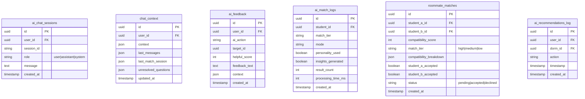

# Roomy 1.0 — Full Platform Architecture

> **Canonical Engineering Blueprint**  
> Version: 1.0  
> Last Updated: January 2026  
> This document contains the complete technical specification for rebuilding Roomy.

---

## Table of Contents

1. [Product Overview](#1-product-overview)
2. [User Roles](#2-user-roles)
3. [Route Map](#3-route-map)
4. [Student Onboarding Wizard](#4-student-onboarding-wizard)
5. [Become Owner Wizard](#5-become-owner-wizard)
6. [Database Schema](#6-database-schema)
7. [Booking & Payment Flow](#7-booking--payment-flow)
8. [Inventory System](#8-inventory-system)
9. [AI System](#9-ai-system)
10. [Edge Functions & Backend Logic](#10-edge-functions--backend-logic)
11. [Admin System](#11-admin-system)
12. [Full System Architecture](#12-full-system-architecture)

---

## 1. Product Overview

### What is Roomy?

Roomy is a comprehensive student housing marketplace platform designed specifically for the Lebanese market. It connects university students with verified dormitory owners, facilitating the entire rental journey from discovery to payment.

### Target Users

| User Type       | Description                                                  |
|-----------------|--------------------------------------------------------------|
| **Students**    | University students in Lebanon seeking affordable, verified housing near their campus |
| **Property Owners** | Dorm operators, landlords, and property managers with rooms/apartments to rent |
| **Administrators** | Platform operators managing verification, disputes, and payouts |

### Core Value Propositions

1. **AI-Powered Matching** - Intelligent dorm recommendations based on preferences, budget, and location
2. **Roommate Compatibility** - 35-question personality assessment for optimal roommate matching
3. **Verified Listings** - Admin-reviewed properties with standardized amenity information
4. **Real-Time Booking** - Live inventory with instant reservation capabilities
5. **Integrated Payments** - Whish payment gateway with secure deposit handling
6. **Multi-Property Support** - Dorms, apartments, and hybrid buildings

### Technology Stack

| Layer       | Technology                          |
|-------------|-----------------------------------|
| Frontend    | React 18, TypeScript, Vite        |
| Styling     | Tailwind CSS, shadcn/ui           |
| State Management | TanStack Query, React Context  |
| Backend     | Supabase (PostgreSQL, Auth, Storage, Realtime) |
| Edge Functions | Deno (Supabase Edge Functions)  |
| Payments    | Whish Payment Gateway             |
| AI          | OpenAI GPT, Google Gemini         |
| Email       | Resend API                       |
| Notifications | WhatsApp Business API            |

---

## 2. User Roles

### Role Definitions

| Role    | Description                                   | Profile Table | Auth Required |
|---------|-----------------------------------------------|---------------|---------------|
| **Public** | Unauthenticated visitors who can browse listings | None          | No            |
| **Student** | Registered students who can book rooms and use AI features | `students`    | Yes           |
| **Owner** | Property owners who list and manage their dorms/apartments | `owners`      | Yes           |
| **Admin** | Platform administrators with full system access | `admins`      | Yes           |

### Permission Matrix

| Action               | Public | Student | Owner | Admin |
|----------------------|--------|---------|-------|-------|
| Browse listings      | ✅     | ✅      | ✅    | ✅    |
| View dorm details    | ✅     | ✅      | ✅    | ✅    |
| Use AI chat          | ✅     | ✅      | ✅    | ✅    |
| Book rooms           | ❌     | ✅      | ❌    | ✅    |
| Save favorites       | ❌     | ✅      | ❌    | ✅    |
| Take personality test | ❌     | ✅      | ❌    | ❌    |
| Message owners       | ❌     | ✅      | ✅    | ✅    |
| List properties      | ❌     | ❌      | ✅    | ✅    |
| Manage inventory     | ❌     | ❌      | ✅    | ✅    |
| View earnings        | ❌     | ❌      | ✅    | ✅    |
| Verify listings      | ❌     | ❌      | ❌    | ✅    |
| Manage users         | ❌     | ❌      | ❌    | ✅    |
| Process payouts      | ❌     | ❌      | ❌    | ✅    |
| View analytics       | ❌     | ❌      | ✅    | ✅    |

### Role Access Flow


### Database Tables for Roles

```sql
-- Role enum type
CREATE TYPE public.app_role AS ENUM ('admin', 'owner', 'student');

-- User roles junction table
CREATE TABLE public.user_roles (
    id UUID PRIMARY KEY DEFAULT gen_random_uuid(),
    user_id UUID REFERENCES auth.users(id) ON DELETE CASCADE NOT NULL,
    role app_role NOT NULL,
    created_at TIMESTAMPTZ DEFAULT now(),
    UNIQUE (user_id, role)
);

-- Security definer function for role checking
CREATE OR REPLACE FUNCTION public.has_role(_user_id UUID, _role app_role)
RETURNS BOOLEAN
LANGUAGE sql
STABLE
SECURITY DEFINER
SET search_path = public
AS $$
  SELECT EXISTS (
    SELECT 1
    FROM public.user_roles
    WHERE user_id = _user_id
      AND role = _role
  )
$$;
```

---

## 3. Route Map

### Public Routes

| Route           | Component           | Description                          |
|-----------------|---------------------|------------------------------------|
| `/`             | `Index.tsx`         | Landing page with hero, features, and CTA |
| `/listings`     | `Listings.tsx`      | Browse all verified dorms with filters |
| `/dorm/:id`     | `DormDetail.tsx`    | Individual dorm detail page         |
| `/apartment/:id` | `ApartmentDetail.tsx` | Individual apartment detail page   |
| `/ai-chat`      | `AIChat.tsx`        | Public AI assistant for dorm discovery |
| `/contact`      | `Contact.tsx`       | Contact form and support info       |
| `/about`        | `About.tsx`         | About Roomy platform                |
| `/faq`          | `FAQ.tsx`           | Frequently asked questions          |
| `/help`         | `HelpCenter.tsx`    | Help center with search             |
| `/help/:slug`   | `HelpArticle.tsx`   | Individual help article             |
| `/legal`        | `LegalHub.tsx`      | Legal documents hub                 |
| `/legal/terms`  | `Terms.tsx`         | Terms of service                   |
| `/legal/privacy` | `Privacy.tsx`      | Privacy policy                    |
| `/legal/cookies` | `Cookies.tsx`      | Cookie policy                    |
| `/legal/accessibility` | `Accessibility.tsx` | Accessibility statement         |

### Authentication Routes

| Route               | Component           | Description                      |
|---------------------|---------------------|--------------------------------|
| `/auth/login`        | `AuthLogin.tsx`     | Login page with email/password  |
| `/auth/signup`       | `AuthSignup.tsx`    | Registration with role selection|
| `/auth/verify-email` | `VerifyEmail.tsx`   | Email verification landing      |
| `/auth/callback`     | `AuthCallback.tsx`  | OAuth callback handler          |
| `/password-reset`    | `PasswordReset.tsx` | Password reset flow             |
| `/account-suspended` | `AccountSuspended.tsx` | Suspended account notice     |

### Student Routes

| Route                 | Component             | Description                      |
|-----------------------|-----------------------|--------------------------------|
| `/student/onboarding`  | `StudentOnboarding.tsx` | 12-step profile wizard         |
| `/student/payments`    | `StudentPayments.tsx`  | Payment history and methods    |
| `/student/wallet`      | `StudentWallet.tsx`    | Student wallet balance         |
| `/onboarding`          | `Onboarding.tsx`       | Initial preference collection  |
| `/ai-match`            | `AIMatch.tsx`          | AI roommate matching interface |
| `/personality-test`    | `PersonalityTest.tsx`  | Big Five personality assessment|
| `/compatibility-test`  | `CompatibilityTest.tsx`| Roommate compatibility quiz   |
| `/messages`            | `Messages.tsx`         | Chat inbox with owners         |
| `/saved-dorms`         | `SavedDorms.tsx`       | Favorited listings             |
| `/wishlists`           | `Wishlists.tsx`        | Organized wishlist folders     |
| `/profile`             | `Profile.tsx`          | Student profile management     |
| `/settings`            | `Settings.tsx`         | Account settings              |
| `/notifications`       | `Notifications.tsx`    | Notification center           |
| `/friends`             | `Friends.tsx`          | Friend connections            |

### Owner Routes

| Route                     | Component               | Description                    |
|---------------------------|-------------------------|--------------------------------|
| `/become-owner`           | `BecomeOwner.tsx`       | Owner registration wizard      |
| `/owner`                  | `OwnerHome.tsx`         | Owner dashboard home           |
| `/owner/home`             | `OwnerHome.tsx`         | Dashboard with metrics         |
| `/owner/listings`         | `OwnerListings.tsx`     | Property listing management    |
| `/owner/listings/add`     | `OwnerAddDorm.tsx`      | Add new property               |
| `/owner/listings/:id/edit`| `OwnerEditDorm.tsx`     | Edit existing property         |
| `/owner/inventory`        | `OwnerInventory.tsx`    | Room/bed inventory             |
| `/owner/inventory/:dormId`| `OwnerDormInventory.tsx`| Specific dorm inventory        |
| `/owner/bookings`         | `OwnerBookings.tsx`     | Reservation management         |
| `/owner/tours`            | `OwnerTours.tsx`        | Tour scheduling                |
| `/owner/earnings`         | `OwnerEarnings.tsx`     | Earnings dashboard             |
| `/owner/stats`            | `OwnerStats.tsx`        | Performance analytics          |
| `/owner/calendar`         | `OwnerCalendar.tsx`     | Availability calendar          |
| `/owner/reviews`          | `OwnerReviews.tsx`      | Review management             |
| `/owner/messages`         | `OwnerMessages.tsx`     | Message inbox                 |
| `/owner/profile`          | `OwnerProfile.tsx`      | Owner profile                 |
| `/owner/settings`         | `OwnerSettings.tsx`     | Account settings              |
| `/owner/help`             | `OwnerHelp.tsx`         | Owner help center             |
| `/owner/wallet`           | `OwnerWallet.tsx`       | Payout wallet                |
| `/owner/payout-methods`   | `OwnerPayoutMethods.tsx`| Payout configuration          |

### Admin Routes

| Route                     | Component               | Description                    |
|---------------------------|-------------------------|--------------------------------|
| `/admin`                  | `AdminDashboard.tsx`    | Admin dashboard hub            |
| `/admin/students`         | `AdminStudents.tsx`     | Student management             |
| `/admin/students/:id`     | `AdminStudentDetail.tsx`| Individual student             |
| `/admin/owners`           | `AdminOwners.tsx`       | Owner management              |
| `/admin/owners/:id`       | `AdminOwnerDetail.tsx`  | Individual owner              |
| `/admin/dorms`            | `AdminDorms.tsx`        | All dorms list               |
| `/admin/dorms/:id`        | `AdminDormDetail.tsx`   | Individual dorm               |
| `/admin/pending-review`   | `AdminPendingReview.tsx`| Verification queue            |
| `/admin/rooms`            | `AdminRooms.tsx`        | Room management              |
| `/admin/rooms/:id`        | `AdminRoomDetail.tsx`   | Individual room              |
| `/admin/beds`             | `AdminBeds.tsx`         | Bed inventory                |
| `/admin/beds/:id`         | `AdminBedDetail.tsx`    | Individual bed               |
| `/admin/reservations`     | `AdminReservations.tsx` | All reservations             |
| `/admin/reservations/:id` | `AdminReservationDetail.tsx` | Individual reservation  |
| `/admin/payments-dashboard` | `AdminPaymentsDashboard.tsx` | Payment overview        |
| `/admin/earnings`         | `AdminEarnings.tsx`     | Platform earnings            |
| `/admin/commission-settings` | `AdminCommissionSettings.tsx` | Fee configuration      |
| `/admin/refunds`          | `AdminRefunds.tsx`      | Refund processing           |
| `/admin/disputes`         | `AdminDisputes.tsx`     | Dispute resolution          |
| `/admin/chats`            | `AdminChats.tsx`        | All conversations           |
| `/admin/analytics`        | `AdminAnalytics.tsx`    | Platform analytics          |
| `/admin/logs`             | `AdminLogs.tsx`         | Activity logs               |
| `/admin/ai-diagnostics`   | `AdminAIDiagnostics.tsx`| AI system health            |
| `/admin/security-monitor` | `AdminSecurityMonitor.tsx` | Security events          |
| `/admin/system-hub`       | `AdminSystemHub.tsx`    | System management           |
| `/admin/universities`     | `AdminUniversities.tsx` | University data             |
| `/admin/amenities`        | `AdminAmenities.tsx`    | Amenity management          |
| `/admin/help-articles`    | `AdminHelpArticles.tsx` | Help content                |
| `/admin/notifications`    | `AdminNotifications.tsx`| Send notifications          |
| `/admin/wallet`           | `AdminWallet.tsx`       | Platform wallet             |
| `/admin/payouts`          | `AdminPayouts.tsx`      | Owner payouts               |
| `/admin/settings`         | `AdminSettings.tsx`     | System settings             |

### Route Access Diagram


---

## 4. Student Onboarding Wizard

### Overview

The Student Onboarding Wizard is a 12-step progressive form that collects student profile information. It features conditional logic, progress persistence, and a mobile-optimized interface.

### Step Table

| Step | Component               | Phase | Required | Data Collected                          |
|-------|------------------------|-------|----------|---------------------------------------|
| 0     | `StudentAirbnbIntroStep` | Intro | Yes      | None (welcome)                        |
| 1     | `StudentStepOverview`    | 1     | Yes      | None (phase intro)                    |
| 2     | `BasicInfoStep`          | 1     | Yes      | full_name, age, gender                |
| 3     | `HometownStep`           | 1     | Yes      | governorate, district, town_village  |
| 4     | `AcademicStep`           | 1     | Yes      | university, major, year_of_study      |
| 5     | `StudentStepOverview`    | 2     | Yes      | None (phase intro)                    |
| 6     | `AccommodationStatusStep`| 2     | Yes      | accommodation_status                  |
| 7     | `HousingPreferencesStep` | 2     | Conditional | city, preferred_housing_area, budget, room_type |
| 8     | `StudentStepOverview`    | 3     | Yes      | None (phase intro)                    |
| 9     | `PersonalityMatchingStep`| 3     | Conditional | personality_scores, compatibility_answers |
| 10    | `ProfileExtrasStep`      | 3     | Yes      | phone_number, profile_photo_url       |
| 11    | `StudentReviewStep`      | Final | Yes      | Review all data                      |

### Data Structure

```typescript
interface WizardFormData {
  // Phase 1: Personal Info
  full_name: string;
  age: number;
  gender: 'male' | 'female';
  profile_photo_url: string;
  
  // Phase 1: Hometown
  governorate: string;
  district: string;
  town_village: string;
  
  // Phase 1: Academic
  university: string;
  major: string;
  year_of_study: number;
  
  // Phase 2: Accommodation
  accommodation_status: 'need_dorm' | 'have_dorm' | 'undecided';
  current_dorm_id?: string;
  current_room_id?: string;
  
  // Phase 2: Housing Preferences (conditional)
  city: string;
  preferred_housing_area: string;
  budget: number;
  room_type: string;
  needs_roommate: boolean;
  
  // Phase 3: Personality (conditional)
  enable_personality_matching: boolean;
  personality_scores?: {
    openness: number;
    conscientiousness: number;
    extraversion: number;
    agreeableness: number;
    neuroticism: number;
  };
  compatibility_answers?: Record<string, string>;
  
  // Phase 3: Extras
  phone_number: string;
}
```

### Conditional Logic


### Step Components

#### Step 0: Welcome Animation

```typescript
// StudentAirbnbIntroStep.tsx
// Animated introduction with Roomy branding
// Auto-advances after 3 seconds
```

#### Step 2: Basic Info

```typescript
// BasicInfoStep.tsx
// Collects: full_name, age, gender
// Validation: Name required, age 16-99, gender required
```

#### Step 3: Hometown

```typescript
// HometownStep.tsx
// Cascading dropdowns: Governorate → District → Town
// Uses residentialAreas.ts data
```

#### Step 4: Academic

```typescript
// AcademicStep.tsx
// University dropdown (14 Lebanese universities)
// Major text input with suggestions
// Year of study: 1-6
```

#### Step 6: Accommodation Status

```typescript
// AccommodationStatusStep.tsx
// Three options:
// - "I need to find a dorm" → Shows housing preferences
// - "I already have a place" → Skips to Phase 3
// - "I'm not sure yet" → Shows housing preferences
```

#### Step 7: Housing Preferences (Conditional)

```typescript
// HousingPreferencesStep.tsx
// Only shown if accommodation_status !== 'have_dorm'
// Collects: city, area, budget slider, room type
```

#### Step 9: Personality Matching (Conditional)

```typescript
// PersonalityMatchingStep.tsx
// 35 compatibility questions + 15 Big Five questions
// Results stored in personality_scores JSON
// Only shown if enable_personality_matching = true
```

### Progress Persistence

```typescript
// Progress saved to localStorage on each step
const STORAGE_KEY = 'student_wizard_progress';

// On mount: Check for saved progress
useEffect(() => {
  const saved = localStorage.getItem(STORAGE_KEY);
  if (saved) {
    const { step, data } = JSON.parse(saved);
    setCurrentStep(step);
    setFormData(data);
  }
}, []);

// On step change: Save progress
useEffect(() => {
  localStorage.setItem(STORAGE_KEY, JSON.stringify({
    step: currentStep,
    data: formData
  }));
}, [currentStep, formData]);
```

---

## 5. Become Owner Wizard

### Overview

The Become Owner Wizard is a comprehensive 30-step wizard for property registration. It supports three property types (Dorm, Apartment, Hybrid) with different flows for each.

### Phase Breakdown

| Phase   | Steps | Description                      |
|---------|-------|--------------------------------|
| Phase 1 | 0-6   | Property basics: type, title, description |
| Phase 2 | 7-14  | Property details: location, amenities, photos |
| Phase 3 | 15-29 | Inventory setup: rooms/apartments configuration |

### Master Step Table

| Step | Component                     | Dorm | Apartment | Hybrid |
|-------|------------------------------|------|-----------|--------|
| 0     | `PropertyTypeStep`            | ✅   | ✅        | ✅     |
| 1     | `TitleStep`                   | ✅   | ✅        | ✅     |
| 2     | `GenderPreferenceStep`        | ✅   | ✅        | ✅     |
| 3     | `HighlightsStep`              | ✅   | ✅        | ✅     |
| 4     | `DescriptionStep`             | ✅   | ✅        | ✅     |
| 5     | `PhaseIntroStep`              | ✅   | ✅        | ✅     |
| 6     | `LocationStep`                | ✅   | ✅        | ✅     |
| 7     | `SubAreaStep`                 | ✅   | ✅        | ✅     |
| 8     | `AddressStep`                 | ✅   | ✅        | ✅     |
| 9     | `ShuttleStep`                 | ✅   | ✅        | ✅     |
| 10    | `NearbyUniversitiesStep`      | ✅   | ✅        | ✅     |
| 11    | `AmenitiesStep`               | ✅   | ✅        | ✅     |
| 12    | `AmenityDetailsStep`          | ✅   | ✅        | ✅     |
| 13    | `CoverPhotoStep`              | ✅   | ✅        | ✅     |
| 14    | `GalleryStep`                 | ✅   | ✅        | ✅     |
| 15    | `CapacityStep`                | ✅   | ✅        | ✅     |
| 16    | `UploadMethodStep`            | ✅   | ✅        | ✅     |
| 17    | `RoomNamesStep` / `ApartmentNamesStep` | ✅   | ✅        | ✅     |
| 18    | `RoomTypesStep` / `ApartmentTypesStep` | ✅   | ✅        | ✅     |
| 19    | `BulkSelectionStep`           | ✅   | ✅        | ✅     |
| 20    | `PricingStep` / `ReservationModesStep` | ✅   | ✅        | ✅     |
| 21    | `TieredPricingStep` / `ApartmentCapacityStep` | ✅   | ✅        | ✅     |
| 22    | `AreaStep` / `ApartmentTieredPricingStep` | ✅   | ✅        | ✅     |
| 23    | `CapacitySetupStep` / `BedroomCountStep` | ✅   | ✅        | ✅     |
| 24    | `OccupancyStep` / `BedroomNamesStep` | ✅   | ✅        | ✅     |
| 25    | `RoomMediaStep` / `BedroomConfigStep` | ✅   | ✅        | ✅     |
| 26    | `ReviewStep` / `BedSetupStep` | ✅   | ✅        | ✅     |
| 27    | - / `BedroomPricingStep`      | ❌   | ✅        | ✅     |
| 28    | - / `ApartmentMediaStep`      | ❌   | ✅        | ✅     |
| 29    | - / `ApartmentReviewStep`     | ❌   | ✅        | ✅     |

### Wizard Form Data Structure

```typescript
interface WizardFormData {
  // Phase 1: Basics
  propertyType: 'dorm' | 'apartment' | 'hybrid';
  title: string;
  genderPreference: 'male' | 'female' | 'mixed';
  highlights: string[];
  description: string;
  
  // Phase 2: Location & Details
  city: string;
  area: string;
  subArea: string;
  address: string;
  shuttle: boolean;
  nearbyUniversities: string[];
  amenities: string[];
  amenityDetails: AmenityDetails;
  coverImage: string;
  galleryImages: string[];
  
  // Phase 3: Inventory
  capacity: number;
  dormRoomCount?: number;
  apartmentCount?: number;
  uploadMethod: 'manual' | 'excel';
  
  // Dorm-specific
  rooms: WizardRoomData[];
  selectedRoomIds: string[];
  completedRoomIds: string[];
  
  // Apartment-specific
  apartments: WizardApartmentData[];
  selectedApartmentIds: string[];
  completedApartmentIds: string[];
}

interface WizardRoomData {
  id: string;
  name: string;
  roomType: 'single' | 'double' | 'triple' | 'quad' | 'studio';
  monthlyPrice: number;
  deposit: number;
  area: number;
  maxCapacity: number;
  enableTieredPricing: boolean;
  pricingTiers?: PricingTier[];
  occupiedBeds: number;
  images: string[];
  videoUrl?: string;
}

interface WizardApartmentData {
  id: string;
  name: string;
  apartmentType: 'studio' | '1br' | '2br' | '3br' | '4br+';
  maxCapacity: number;
  enableFullApartmentReservation: boolean;
  enableBedroomReservation: boolean;
  enableBedReservation: boolean;
  fullApartmentPrice?: number;
  fullApartmentDeposit?: number;
  enableTieredPricing: boolean;
  pricingTiers?: PricingTier[];
  bedrooms: WizardBedroomData[];
  images: string[];
  videoUrl?: string;
}

interface WizardBedroomData {
  id: string;
  name: string;
  maxCapacity: number;
  bedType: 'single' | 'double' | 'bunk';
  bedroomPrice?: number;
  bedroomDeposit?: number;
  beds: WizardBedData[];
}

interface WizardBedData {
  id: string;
  label: string;
  bedType: 'single' | 'double' | 'bunk_top' | 'bunk_bottom';
  monthlyPrice: number;
  deposit: number;
  isOccupied: boolean;
}

interface PricingTier {
  capacity: number;
  monthlyPrice: number;
  deposit: number;
}

interface AmenityDetails {
  wifi?: { speed: string; included: boolean };
  laundry?: { type: 'in-unit' | 'shared' | 'nearby'; cost: string };
  kitchen?: { type: 'full' | 'kitchenette' | 'shared' };
  parking?: { type: 'covered' | 'open' | 'street'; cost: string };
  // ... other amenity-specific details
}
```

### Dorm Flow (Steps 15-26)


### Apartment Flow (Steps 15-29)


### Hybrid Flow


### Step Component Details

#### Step 0: Property Type Selection

```typescript
// PropertyTypeStep.tsx
const options = [
  { id: 'dorm', label: 'Dorm', icon: Building2, description: 'Shared rooms with beds' },
  { id: 'apartment', label: 'Apartment Building', icon: Building, description: 'Self-contained units' },
  { id: 'hybrid', label: 'Hybrid', icon: Layers, description: 'Mix of dorms and apartments' }
];
```

#### Step 11: Amenities Selection

```typescript
// AmenitiesStep.tsx
// Uses amenities.ts configuration
const amenityCategories = {
  essentials: ['wifi', 'kitchenette', 'laundry', 'heating', 'ac', 'furnished', 'tv', 'electricity', 'water'],
  shared: ['study_room', 'common_area', 'garden', 'gym', 'pool'],
  safety: ['security', 'elevator', 'parking', 'cleaning', 'pet_friendly']
};
```

#### Step 20: Reservation Modes (Apartments)

```typescript
// ReservationModesStep.tsx
const modes = [
  { 
    id: 'full_apartment', 
    label: 'Full Apartment', 
    description: 'Rent the entire apartment as one unit' 
  },
  { 
    id: 'bedroom', 
    label: 'Per Bedroom', 
    description: 'Rent individual bedrooms' 
  },
  { 
    id: 'bed', 
    label: 'Per Bed', 
    description: 'Rent individual beds within bedrooms' 
  }
];
// Multiple modes can be enabled simultaneously
```

#### Step 21: Tiered Pricing

```typescript
// TieredPricingStep.tsx
// For rooms with capacity > 1, offer different prices based on occupancy
// Example for a Triple room:
const tiers = [
  { capacity: 1, monthlyPrice: 400, deposit: 200 },  // Solo occupancy
  { capacity: 2, monthlyPrice: 300, deposit: 150 },  // Two people
  { capacity: 3, monthlyPrice: 250, deposit: 125 }   // Full occupancy
];
```

---

## 6. Database Schema

### Entity Relationship Overview


### Core Tables

#### Users & Authentication


#### Properties


#### Pricing


#### Reservations & Payments


#### Reviews


#### Messaging


#### AI & Matching



#### Analytics & Monitoring


### Key Database Functions

```sql
-- Check if user has a specific role
CREATE OR REPLACE FUNCTION public.has_role(_user_id UUID, _role app_role)
RETURNS BOOLEAN AS $$
  SELECT EXISTS (
    SELECT 1 FROM public.user_roles
    WHERE user_id = _user_id AND role = _role
  )
$$ LANGUAGE sql STABLE SECURITY DEFINER;

-- Calculate room availability
CREATE OR REPLACE FUNCTION public.get_room_availability(p_room_id UUID)
RETURNS TABLE (
  total_beds INT,
  available_beds INT,
  occupied_beds INT,
  reserved_beds INT
) AS $$
BEGIN
  RETURN QUERY
  SELECT 
    COUNT(*)::INT as total_beds,
    COUNT(*) FILTER (WHERE availability_status = 'available')::INT,
    COUNT(*) FILTER (WHERE availability_status = 'occupied')::INT,
    COUNT(*) FILTER (WHERE availability_status = 'reserved')::INT
  FROM public.beds
  WHERE room_id = p_room_id AND is_active = true;
END;
$$ LANGUAGE plpgsql STABLE;

-- Calculate owner earnings
CREATE OR REPLACE FUNCTION public.calculate_owner_earnings(
  p_owner_id UUID,
  p_start_date DATE,
  p_end_date DATE
)
RETURNS TABLE (
  total_revenue DECIMAL,
  platform_fees DECIMAL,
  net_earnings DECIMAL,
  pending_payouts DECIMAL
) AS $$
BEGIN
  RETURN QUERY
  SELECT 
    COALESCE(SUM(p.amount), 0) as total_revenue,
    COALESCE(SUM(p.amount * 0.10), 0) as platform_fees,  -- 10% platform fee
    COALESCE(SUM(p.amount * 0.90), 0) as net_earnings,
    COALESCE(SUM(p.amount) FILTER (WHERE p.status = 'completed' AND po.status IS NULL), 0)
  FROM public.payments p
  LEFT JOIN public.owner_payouts po ON p.id = po.payment_id
  WHERE p.owner_id = p_owner_id
    AND p.created_at >= p_start_date
    AND p.created_at <= p_end_date
    AND p.status = 'completed';
END;
$$ LANGUAGE plpgsql STABLE;

-- Full-text search for help articles
CREATE OR REPLACE FUNCTION public.search_help_articles(search_query TEXT)
RETURNS TABLE (
  id UUID,
  title TEXT,
  slug TEXT,
  category TEXT,
  content TEXT,
  rank REAL
) AS $$
BEGIN
  RETURN QUERY
  SELECT 
    ha.id,
    ha.title,
    ha.slug,
    ha.category,
    ha.content,
    ts_rank(ha.search_vector, websearch_to_tsquery('english', search_query)) as rank
  FROM public.help_articles ha
  WHERE ha.search_vector @@ websearch_to_tsquery('english', search_query)
  ORDER BY rank DESC
  LIMIT 20;
END;
$$ LANGUAGE plpgsql STABLE;
```

### RLS Policy Patterns

```sql
-- Students can only view their own data
CREATE POLICY "Students view own data" ON public.students
  FOR SELECT
  TO authenticated
  USING (user_id = auth.uid());

-- Students can update their own profile
CREATE POLICY "Students update own data" ON public.students
  FOR UPDATE
  TO authenticated
  USING (user_id = auth.uid())
  WITH CHECK (user_id = auth.uid());

-- Owners can only view their own dorms
CREATE POLICY "Owners view own dorms" ON public.dorms
  FOR SELECT
  TO authenticated
  USING (
    owner_id IN (
      SELECT id FROM public.owners WHERE user_id = auth.uid()
    )
  );

-- Public can view verified dorms
CREATE POLICY "Public view verified dorms" ON public.dorms
  FOR SELECT
  TO anon, authenticated
  USING (verification_status = 'Verified');

-- Admins can view all data
CREATE POLICY "Admins view all" ON public.students
  FOR ALL
  TO authenticated
  USING (public.has_role(auth.uid(), 'admin'));

-- Messages: Only participants can view
CREATE POLICY "Message participants only" ON public.messages
  FOR SELECT
  TO authenticated
  USING (
    conversation_id IN (
      SELECT id FROM public.conversations
      WHERE user_a_id = auth.uid() OR user_b_id = auth.uid()
    )
    OR
    conversation_id IN (
      SELECT conversation_id FROM public.group_members
      WHERE user_id = auth.uid()
    )
  );
```

---

## 7. Booking & Payment Flow

### Reservation State Machine


### Payment Flow Sequence


### Price Calculation

```typescript
interface BookingCalculation {
  basePrice: number;          // Monthly rent
  deposit: number;            // Security deposit (typically 1 month)
  reservationFee: number;     // Platform reservation fee (5%)
  platformFee: number;        // Platform service fee (5%)
  totalDue: number;           // Total amount to pay now
}

function calculateBookingTotal(
  monthlyPrice: number,
  depositAmount: number
): BookingCalculation {
  const reservationFee = monthlyPrice * 0.05;  // 5% of monthly
  const platformFee = monthlyPrice * 0.05;     // 5% of monthly
  
  return {
    basePrice: monthlyPrice,
    deposit: depositAmount,
    reservationFee,
    platformFee,
    totalDue: depositAmount + reservationFee + platformFee
  };
}
```

### Cancellation Flow


### Payment Status Tracking

| Status               | Description                      | Next Actions          |
|----------------------|--------------------------------|----------------------|
| `pending`            | Payment initiated, awaiting completion | Complete or timeout  |
| `completed`          | Payment successful              | N/A                  |
| `failed`             | Payment failed                 | Retry or cancel       |
| `refunded`           | Full refund processed          | N/A                  |
| `partially_refunded` | Partial refund processed       | N/A                  |
| `disputed`           | Under dispute investigation    | Await resolution      |

---

## 8. Inventory System

### Hierarchy Model


### Bed Availability States

| State         | Description                 | Can Book? | Display |
|---------------|-----------------------------|-----------|---------|
| `available`   | Open for booking            | Yes       | Green   |
| `reserved`    | Paid reservation, not moved in | No    | Yellow  |
| `occupied`    | Student currently living there | No     | Red     |
| `unavailable` | Blocked by owner            | No        | Gray    |
| `maintenance` | Under maintenance          | No        | Orange  |

### Availability Calculation

```typescript
interface InventorySummary {
  totalCapacity: number;
  availableBeds: number;
  reservedBeds: number;
  occupiedBeds: number;
  unavailableBeds: number;
  occupancyRate: number;
}

function calculateInventory(beds: Bed[]): InventorySummary {
  const activeBeds = beds.filter(b => b.is_active);
  
  return {
    totalCapacity: activeBeds.length,
    availableBeds: activeBeds.filter(b => b.availability_status === 'available').length,
    reservedBeds: activeBeds.filter(b => b.availability_status === 'reserved').length,
    occupiedBeds: activeBeds.filter(b => b.availability_status === 'occupied').length,
    unavailableBeds: activeBeds.filter(b => b.availability_status === 'unavailable').length,
    occupancyRate: activeBeds.filter(b => 
      b.availability_status === 'occupied' || b.availability_status === 'reserved'
    ).length / activeBeds.length
  };
}
```

### Pricing Modes

#### Mode 1: Fixed Room Price

```typescript
// All occupants pay the same regardless of roommates
const roomPrice = 500; // $500/month total
const perPersonPrice = roomPrice / currentOccupancy;
```

#### Mode 2: Per-Bed Pricing

```typescript
// Each bed has its own price
const beds = [
  { label: 'Bed A', monthlyPrice: 200 },
  { label: 'Bed B', monthlyPrice: 180 },
  { label: 'Bed C', monthlyPrice: 150 }
];
```

#### Mode 3: Tiered Pricing

```typescript
// Price per person varies by total occupancy
const tiers = [
  { capacity: 1, monthlyPrice: 500 },  // Solo: $500
  { capacity: 2, monthlyPrice: 300 },  // Duo: $300 each
  { capacity: 3, monthlyPrice: 250 }   // Triple: $250 each
];
```

#### Mode 4: Apartment Modes

```typescript
// Apartments can offer multiple booking modes
const apartmentModes = {
  fullApartment: { price: 1500, deposit: 750 },
  perBedroom: { bedroom1: 600, bedroom2: 550 },
  perBed: { bed1: 300, bed2: 280, bed3: 320 }
};
```

### Capacity Views (Database)

```sql
-- Room inventory summary view
CREATE VIEW room_inventory_summary AS
SELECT 
  r.id,
  r.name,
  r.dorm_id,
  r.capacity as max_capacity,
  COUNT(b.id) as total_beds,
  COUNT(b.id) FILTER (WHERE b.availability_status = 'available') as available_beds,
  COUNT(b.id) FILTER (WHERE b.availability_status = 'occupied') as occupied_beds,
  COUNT(b.id) FILTER (WHERE b.availability_status = 'reserved') as reserved_beds,
  r.monthly_price,
  r.available
FROM rooms r
LEFT JOIN beds b ON b.room_id = r.id AND b.is_active = true
GROUP BY r.id;

-- Building inventory summary view
CREATE VIEW building_inventory_summary AS
SELECT 
  d.id,
  d.name,
  d.property_type,
  COUNT(DISTINCT r.id) as total_rooms,
  COUNT(DISTINCT a.id) as total_apartments,
  SUM(CASE WHEN b.availability_status = 'available' THEN 1 ELSE 0 END) as available_beds,
  SUM(CASE WHEN b.availability_status = 'occupied' THEN 1 ELSE 0 END) as occupied_beds,
  d.verification_status
FROM dorms d
LEFT JOIN rooms r ON r.dorm_id = d.id
LEFT JOIN apartments a ON a.building_id = d.id
LEFT JOIN beds b ON (b.room_id = r.id OR b.bedroom_id IN (
  SELECT br.id FROM bedrooms br WHERE br.apartment_id = a.id
)) AND b.is_active = true
GROUP BY d.id;
```

---

## 9. AI System

### AI Architecture Overview


### AI Chat System

#### Chat Flow

```mermaid
sequenceDiagram
    participant U as User
    participant F as Frontend
    participant E as roomy-chat
    participant C as chat_context
    participant AI as OpenAI/Gemini
    participant D as Database
    
    U->>F: Send message
    F->>E: POST /roomy-chat
    
    E->>C: Load user context
    E->>D: Load user preferences
    E->>D: Load recent dorm views
    
    E->>E: Build system prompt
    E->>AI: Send conversation + context
    AI-->>E: Generate response
    
    E->>D: Save to ai_chat_sessions
    E->>C: Update context
    E-->>F: Stream response
    F-->>U: Display response
```

#### System Prompt Structure

```typescript
const buildSystemPrompt = (user: StudentProfile, context: ChatContext) => `
You are Roomy AI, a friendly housing assistant for Lebanese university students.

CURRENT USER:
- Name: ${user.full_name}
- University: ${user.university}
- Budget: $${user.budget}/month
- Preferred Area: ${user.preferred_housing_area}
- Room Type: ${user.room_type_preference}

CONTEXT:
- Recently viewed: ${context.recentDorms.join(', ')}
- Saved dorms: ${context.savedDorms.join(', ')}
- Last search: ${context.lastSearch}

AVAILABLE DORMS IN PREFERENCE:
${context.matchingDorms.map(d => `- ${d.name}: $${d.price}/month in ${d.area}`).join('\n')}

INSTRUCTIONS:
1. Help the user find suitable housing
2. Recommend dorms matching their preferences
3. Answer questions about listings, areas, and universities
4. Never make up information about dorms
5. Guide them to book if they find a match
`;
```

### Roommate Matching System

#### Compatibility Assessment

**35 Compatibility Questions:**

| Category       | Questions | Weight |
|----------------|-----------|--------|
| Sleep Schedule | 5         | 15%    |
| Cleanliness    | 5         | 15%    |
| Noise & Guests | 5         | 15%    |
| Study Habits   | 5         | 15%    |
| Lifestyle      | 5         | 10%    |
| Sharing        | 5         | 10%    |
| Communication  | 5         | 20%    |

**Sample Questions:**

```typescript
const compatibilityQuestions = [
  {
    id: 'sleep_schedule',
    question: 'What time do you usually go to bed?',
    options: [
      { value: 'early', label: 'Before 10 PM' },
      { value: 'normal', label: '10 PM - 12 AM' },
      { value: 'late', label: 'After 12 AM' },
      { value: 'varies', label: 'It varies a lot' }
    ],
    category: 'sleep',
    weight: 1.0
  },
  {
    id: 'cleanliness_level',
    question: 'How would you describe your cleanliness?',
    options: [
      { value: 'very_clean', label: 'Very clean and organized' },
      { value: 'moderate', label: 'Reasonably tidy' },
      { value: 'relaxed', label: 'Relaxed about mess' }
    ],
    category: 'cleanliness',
    weight: 1.0
  }
  // ... 33 more questions
];
```

#### Big Five Personality Test

**15 Questions mapping to:**

| Trait           | Description           | Compatibility Impact |
|-----------------|-----------------------|---------------------|
| Openness        | Creativity, curiosity | Shared interests     |
| Conscientiousness | Organization, reliability | Living habits    |
| Extraversion    | Sociability, energy   | Social needs        |
| Agreeableness   | Cooperation, trust    | Conflict resolution |
| Neuroticism     | Emotional stability   | Stress handling     |

#### Matching Algorithm

```typescript
interface MatchResult {
  studentId: string;
  compatibilityScore: number;
  matchTier: 'high' | 'medium' | 'low';
  breakdown: {
    category: string;
    score: number;
    weight: number;
  }[];
}

function calculateCompatibility(
  studentA: StudentProfile,
  studentB: StudentProfile
): MatchResult {
  const categories = ['sleep', 'cleanliness', 'noise', 'study', 'lifestyle', 'sharing', 'communication'];
  const breakdown = [];
  let totalScore = 0;
  let totalWeight = 0;
  
  for (const category of categories) {
    const weight = categoryWeights[category];
    const aAnswers = studentA.compatibility_answers[category];
    const bAnswers = studentB.compatibility_answers[category];
    
    const categoryScore = compareAnswers(aAnswers, bAnswers);
    breakdown.push({ category, score: categoryScore, weight });
    totalScore += categoryScore * weight;
    totalWeight += weight;
  }
  
  // Add personality factor
  if (studentA.personality_scores && studentB.personality_scores) {
    const personalityScore = comparePersonalities(
      studentA.personality_scores,
      studentB.personality_scores
    );
    totalScore = totalScore * 0.7 + personalityScore * 0.3;
  }
  
  const finalScore = totalScore / totalWeight;
  
  return {
    studentId: studentB.id,
    compatibilityScore: Math.round(finalScore * 100),
    matchTier: finalScore >= 0.8 ? 'high' : finalScore >= 0.6 ? 'medium' : 'low',
    breakdown
  };
}
```

### Dorm Recommendation Engine

#### Input Signals

| Signal             | Source               | Weight |
|--------------------|----------------------|--------|
| Budget match       | Student preferences  | 25%    |
| Location match     | Preferred area       | 20%    |
| University proximity | Nearby universities | 15%    |
| Amenity match      | Preferred amenities  | 15%    |
| Room type match    | Room type preference | 10%    |
| Engagement score   | Views, saves, inquiries | 10%  |
| Review score       | Average rating       | 5%     |

#### Recommendation Flow

```mermaid
flowchart TD
    A[Student Profile] --> B[Extract Preferences]
    B --> C[Query Matching Dorms]
    C --> D[Score Each Dorm]
    
    D --> E[Budget Score]
    D --> F[Location Score]
    D --> G[Amenity Score]
    D --> H[Engagement Score]
    
    E --> I[Weighted Combination]
    F --> I
    G --> I
    H --> I
    
    I --> J[Sort by Score]
    J --> K[Return Top 10]
```

#### Scoring Function

```typescript
function scoreDorm(dorm: Dorm, student: StudentProfile): number {
  let score = 0;
  
  // Budget match (0-25 points)
  if (dorm.monthly_price <= student.budget) {
    const budgetRatio = dorm.monthly_price / student.budget;
    score += 25 * (1 - Math.abs(0.8 - budgetRatio));
  }
  
  // Location match (0-20 points)
  if (dorm.area === student.preferred_housing_area) {
    score += 20;
  } else if (nearbyAreas[student.preferred_housing_area]?.includes(dorm.area)) {
    score += 10;
  }
  
  // University proximity (0-15 points)
  if (dorm.nearby_universities?.includes(student.university)) {
    score += 15;
  }
  
  // Amenity match (0-15 points)
  const matchingAmenities = dorm.amenities.filter(a => 
    student.preferred_amenities?.includes(a)
  );
  score += (matchingAmenities.length / student.preferred_amenities.length) * 15;
  
  // Room type match (0-10 points)
  if (dorm.room_types?.includes(student.room_type_preference)) {
    score += 10;
  }
  
  // Engagement score (0-10 points)
  const engagement = getEngagementScore(dorm.id);
  score += engagement * 10;
  
  // Review score (0-5 points)
  score += (dorm.average_rating / 5) * 5;
  
  return score;
}
```

---

## 10. Edge Functions & Backend Logic

### Function Inventory

| Function                         | Purpose                    | Auth           | Method |
|---------------------------------|----------------------------|----------------|--------|
| `roomy-chat`                    | AI chat assistant          | Public         | POST   |
| `roomy-ai-core`                 | AI matching engine         | JWT            | POST   |
| `train-recommender`             | Retrain AI model           | Public (cron)  | POST   |
| `roomy-create-reservation-checkout` | Create payment session | JWT            | POST   |
| `whish-webhook`                 | Handle payment callbacks   | Public (signed)| POST   |
| `process-owner-payouts`         | Batch payout processing    | Public (cron)  | POST   |
| `create-owner-record`           | Create owner profile       | JWT            | POST   |
| `create-room`                  | Create room with beds       | JWT            | POST   |
| `confirm-room-occupant`         | Confirm move-in            | JWT            | POST   |
| `student-checkout`              | Process checkout           | JWT            | POST   |
| `student-change-room`           | Room transfer              | JWT            | POST   |
| `send-verification-email`       | Email verification         | Public         | POST   |
| `verify-email-token`            | Validate email token       | Public         | POST   |
| `send-password-reset`           | Password reset email       | Public         | POST   |
| `delete-user-account`           | Account deletion           | JWT            | POST   |
| `send-owner-notification`       | WhatsApp/email to owner    | Public         | POST   |
| `send-booking-notification`     | Booking confirmations      | Public         | POST   |
| `send-payout-notification`      | Payout alerts              | Public         | POST   |
| `translate-message`             | Message translation        | Public         | POST   |
| `search-help-articles`          | Help center search         | Public         | GET    |
| `generate-tour-questions`       | AI tour quiz               | JWT            | POST   |
| `sync-device-token`             | Push notification setup   | JWT            | POST   |
| `log-device-event`              | Security event logging     | JWT            | POST   |
| `handle-whish-payout`           | Process single payout      | Public         | POST   |
| `create-whish-wallet`           | Create owner wallet        | JWT            | POST   |
| `check-wallet-balance`          | Get wallet balance         | JWT            | GET    |

### Key Function Implementations

#### roomy-chat

```typescript
// supabase/functions/roomy-chat/index.ts
import "https://deno.land/x/xhr@0.1.0/mod.ts";
import { serve } from "https://deno.land/std@0.168.0/http/server.ts";
import { createClient } from "https://esm.sh/@supabase/supabase-js@2";

serve(async (req) => {
  const { message, sessionId, userId } = await req.json();
  
  const supabase = createClient(
    Deno.env.get('SUPABASE_URL')!,
    Deno.env.get('SUPABASE_ANON_KEY')!
  );
  
  // Load context
  const { data: context } = await supabase
    .from('chat_context')
    .select('*')
    .eq('user_id', userId)
    .single();
  
  // Load user profile if authenticated
  let userProfile = null;
  if (userId) {
    const { data } = await supabase
      .from('students')
      .select('*')
      .eq('user_id', userId)
      .single();
    userProfile = data;
  }
  
  // Build conversation history
  const { data: history } = await supabase
    .from('ai_chat_sessions')
    .select('role, message')
    .eq('session_id', sessionId)
    .order('created_at', { ascending: true })
    .limit(20);
  
  // Query matching dorms
  const { data: dorms } = await supabase
    .from('dorms')
    .select('id, name, monthly_price, area, amenities')
    .eq('verification_status', 'Verified')
    .limit(10);
  
  // Build system prompt
  const systemPrompt = buildSystemPrompt(userProfile, context, dorms);
  
  // Call AI
  const response = await fetch('https://api.openai.com/v1/chat/completions', {
    method: 'POST',
    headers: {
      'Authorization': `Bearer ${Deno.env.get('OPENAI_API_KEY')}`,
      'Content-Type': 'application/json'
    },
    body: JSON.stringify({
      model: 'gpt-5',
      messages: [
        { role: 'system', content: systemPrompt },
        ...history.map(h => ({ role: h.role, content: h.message })),
        { role: 'user', content: message }
      ],
      max_completion_tokens: 1000
    })
  });
  
  const aiResponse = await response.json();
  const reply = aiResponse.choices[0].message.content;
  
  // Save messages
  await supabase.from('ai_chat_sessions').insert([
    { session_id: sessionId, user_id: userId, role: 'user', message },
    { session_id: sessionId, user_id: userId, role: 'assistant', message: reply }
  ]);
  
  return new Response(JSON.stringify({ reply }), {
    headers: { 'Content-Type': 'application/json' }
  });
});
```

#### roomy-create-reservation-checkout

```typescript
// supabase/functions/roomy-create-reservation-checkout/index.ts
import { serve } from "https://deno.land/std@0.168.0/http/server.ts";
import { createClient } from "https://esm.sh/@supabase/supabase-js@2";

serve(async (req) => {
  const { bedId, roomId, apartmentId, studentId, checkInDate } = await req.json();
  
  const supabase = createClient(
    Deno.env.get('SUPABASE_URL')!,
    Deno.env.get('SUPABASE_SERVICE_ROLE_KEY')!
  );
  
  // Get pricing info
  let price, deposit, reservationType;
  
  if (bedId) {
    const { data: bed } = await supabase
      .from('beds')
      .select('monthly_price, deposit, room_id, bedroom_id')
      .eq('id', bedId)
      .single();
    price = bed.monthly_price;
    deposit = bed.deposit;
    reservationType = 'bed';
  }
  
  // Calculate fees
  const reservationFee = price * 0.05;
  const platformFee = price * 0.05;
  const totalAmount = deposit + reservationFee + platformFee;
  
  // Create reservation
  const { data: reservation } = await supabase
    .from('reservations')
    .insert({
      student_id: studentId,
      bed_id: bedId,
      room_id: roomId,
      reservation_type: reservationType,
      status: 'pending_payment',
      monthly_price: price,
      deposit_amount: deposit,
      reservation_fee: reservationFee,
      platform_fee: platformFee,
      total_amount: totalAmount,
      check_in_date: checkInDate
    })
    .select()
    .single();
  
  // Mark bed as reserved
  await supabase
    .from('beds')
    .update({ 
      availability_status: 'reserved',
      reserved_by_user_id: studentId,
      reserved_at: new Date().toISOString()
    })
    .eq('id', bedId);
  
  // Create Whish payment session
  const whishResponse = await fetch('https://api.whish.money/v1/checkout', {
    method: 'POST',
    headers: {
      'Authorization': `Bearer ${Deno.env.get('WHISH_API_KEY')}`,
      'Content-Type': 'application/json'
    },
    body: JSON.stringify({
      amount: totalAmount,
      currency: 'USD',
      reference: reservation.id,
      success_url: `${Deno.env.get('APP_URL')}/booking/success?id=${reservation.id}`,
      cancel_url: `${Deno.env.get('APP_URL')}/booking/cancel?id=${reservation.id}`,
      webhook_url: `${Deno.env.get('SUPABASE_URL')}/functions/v1/whish-webhook`
    })
  });
  
  const { checkout_url, payment_id } = await whishResponse.json();
  
  // Store payment record
  await supabase.from('payments').insert({
    reservation_id: reservation.id,
    student_id: studentId,
    amount: totalAmount,
    status: 'pending',
    whish_payment_id: payment_id
  });
  
  return new Response(JSON.stringify({ 
    checkoutUrl: checkout_url,
    reservationId: reservation.id 
  }));
});
```

#### whish-webhook

```typescript
// supabase/functions/whish-webhook/index.ts
import { serve } from "https://deno.land/std@0.168.0/http/server.ts";
import { createClient } from "https://esm.sh/@supabase/supabase-js@2";

function verifySignature(body: string, signature: string | null, secret: string | undefined): boolean {
  // Implement HMAC verification logic here
  return true; // Placeholder
}

serve(async (req) => {
  const signature = req.headers.get('x-whish-signature');
  const body = await req.text();
  
  // Verify webhook signature
  const isValid = verifySignature(body, signature, Deno.env.get('WHISH_WEBHOOK_SECRET'));
  if (!isValid) {
    return new Response('Invalid signature', { status: 401 });
  }
  
  const event = JSON.parse(body);
  const supabase = createClient(
    Deno.env.get('SUPABASE_URL')!,
    Deno.env.get('SUPABASE_SERVICE_ROLE_KEY')!
  );
  
  switch (event.type) {
    case 'payment.completed':
      // Update payment
      await supabase
        .from('payments')
        .update({ 
          status: 'completed',
          paid_at: new Date().toISOString(),
          transaction_id: event.data.transaction_id
        })
        .eq('whish_payment_id', event.data.payment_id);
      
      // Update reservation
      const { data: payment } = await supabase
        .from('payments')
        .select('reservation_id, student_id')
        .eq('whish_payment_id', event.data.payment_id)
        .single();
      
      await supabase
        .from('reservations')
        .update({ 
          status: 'reserved',
          payment_status: 'completed'
        })
        .eq('id', payment.reservation_id);
      
      // Get reservation details for notifications
      const { data: reservation } = await supabase
        .from('reservations')
        .select(`
          *,
          beds(*, rooms(*, dorms(*, owners(*)))),
          students(*)
        `)
        .eq('id', payment.reservation_id)
        .single();
      
      // Send notifications
      await fetch(`${Deno.env.get('SUPABASE_URL')}/functions/v1/send-booking-notification`, {
        method: 'POST',
        headers: { 'Content-Type': 'application/json' },
        body: JSON.stringify({
          reservationId: payment.reservation_id,
          type: 'booking_confirmed'
        })
      });
      
      break;
      
    case 'payment.failed':
      await supabase
        .from('payments')
        .update({ status: 'failed' })
        .eq('whish_payment_id', event.data.payment_id);
      
      // Release the bed
      const { data: failedPayment } = await supabase
        .from('payments')
        .select('reservation_id')
        .eq('whish_payment_id', event.data.payment_id)
        .single();
      
      const { data: failedReservation } = await supabase
        .from('reservations')
        .select('bed_id')
        .eq('id', failedPayment.reservation_id)
        .single();
      
      await supabase
        .from('beds')
        .update({ 
          availability_status: 'available',
          reserved_by_user_id: null,
          reserved_at: null
        })
        .eq('id', failedReservation.bed_id);
      
      await supabase
        .from('reservations')
        .update({ status: 'expired' })
        .eq('id', failedPayment.reservation_id);
      
      break;
  }
  
  return new Response('OK', { status: 200 });
});
```

### Cron Jobs

| Job                     | Schedule     | Function                 | Purpose                      |
|-------------------------|--------------|--------------------------|------------------------------|
| Expire pending payments | Every 30 min | `expire-pending-reservations` | Release unpaid reservations |
| Process payouts         | Daily 2 AM   | `process-owner-payouts`  | Batch payout to owners        |
| Train recommender       | Weekly Sunday | `train-recommender`      | Update AI model              |
| Send reminders          | Daily 9 AM   | `send-booking-reminders` | Reminder notifications       |
| Cleanup sessions       | Daily 3 AM   | `cleanup-old-sessions`   | Remove old AI sessions       |

---

## 11. Admin System

### Dashboard Overview

```mermaid
flowchart TD
    A[Admin Dashboard] --> B[User Management]
    A --> C[Property Management]
    A --> D[Financial Management]
    A --> E[Analytics]
    A --> F[System Management]
    
    B --> B1[Students]
    B --> B2[Owners]
    B --> B3[Admins]
    
    C --> C1[Dorms]
    C --> C2[Pending Review]
    C --> C3[Rooms/Beds]
    
    D --> D1[Payments]
    D --> D2[Payouts]
    D --> D3[Disputes]
    D --> D4[Refunds]
    
    E --> E1[Platform Analytics]
    E --> E2[AI Diagnostics]
    E --> E3[Security Monitor]
    
    F --> F1[System Hub]
    F --> F2[Logs]
    F --> F3[Help Articles]
```

### User Management

#### Student Management

| Action             | Description               | API                  |
|--------------------|---------------------------|----------------------|
| View all students   | List with filters and search | `GET /students`     |
| View student detail | Full profile with history  | `GET /students/:id`  |
| Suspend student     | Block account access       | `PATCH /students/:id/suspend` |
| Unsuspend student   | Restore account access     | `PATCH /students/:id/unsuspend` |
| View reservations   | Student's booking history  | `GET /students/:id/reservations` |
| View messages      | Student's conversations    | `GET /students/:id/messages` |
| Delete student      | GDPR deletion              | `DELETE /students/:id` |

#### Owner Management

| Action           | Description               | API                  |
|------------------|---------------------------|----------------------|
| View all owners  | List with filters          | `GET /owners`         |
| View owner detail | Profile with properties    | `GET /owners/:id`     |
| Verify owner     | Mark as verified           | `PATCH /owners/:id/verify` |
| Suspend owner    | Block account              | `PATCH /owners/:id/suspend` |
| View earnings    | Owner's financial summary  | `GET /owners/:id/earnings` |
| View payouts     | Payout history             | `GET /owners/:id/payouts` |

### Property Verification Queue

```mermaid
stateDiagram-v2
    [*] --> Pending: Owner submits
    Pending --> UnderReview: Admin picks up
    UnderReview --> Verified: Approved
    UnderReview --> Rejected: Issues found
    Rejected --> Pending: Owner resubmits
    Verified --> [*]
```

#### Verification Checklist

| Check               | Description                 | Required |
|---------------------|-----------------------------|----------|
| Photos              | At least 5 quality photos    | Yes      |
| Description         | Complete description > 100 chars | Yes  |
| Pricing             | Valid pricing set            | Yes      |
| Address             | Valid Lebanese address       | Yes      |
| Amenities           | At least 3 amenities         | Yes      |
| Contact             | Valid phone number           | Yes      |
| University proximity| Near at least 1 university   | No       |
| Safety features     | Listed safety features       | No       |

### Financial Management

#### Payment Dashboard

| Metric           | Description                  |
|------------------|------------------------------|
| Total Revenue    | Sum of all completed payments |
| Platform Fees    | Total platform commission (10%) |
| Pending Payouts  | Amount owed to owners         |
| Processed Payouts| Completed owner payouts       |
| Refunds          | Total refunded amount         |
| Disputes         | Open dispute count            |

#### Payout Processing

```mermaid
sequenceDiagram
    participant A as Admin
    participant D as Dashboard
    participant E as Edge Function
    participant W as Whish
    participant O as Owner
    
    A->>D: View pending payouts
    D->>A: Show aggregated payouts
    
    A->>D: Initiate batch payout
    D->>E: POST /process-owner-payouts
    
    loop For each owner
        E->>W: Transfer to owner wallet
        W-->>E: Transfer confirmation
        E->>D: Update payout status
        E->>O: Send payout notification
    end
    
    E-->>D: Batch complete
    D-->>A: Show results
```

#### Commission Structure

```typescript
const commissionConfig = {
  platformFee: 0.10,      // 10% of monthly rent
  reservationFee: 0.05,   // 5% one-time
  payoutFrequency: 'monthly',
  minPayoutAmount: 50,    // USD
  payoutDelay: 7          // Days after month end
};
```

### Moderation

#### Content Moderation

| Content Type  | Auto-Review       | Manual Review    |
|---------------|-------------------|------------------|
| Dorm photos   | AI safety check   | Admin approval   |
| Descriptions | Profanity filter  | On report        |
| Reviews       | Sentiment analysis| On report        |
| Messages      | Real-time filtering| On report       |

#### Report Handling

```mermaid
flowchart TD
    A[User Report] --> B{Report Type}
    
    B -->|Dorm| C[Property Review Queue]
    B -->|User| D[User Review Queue]
    B -->|Message| E[Message Review Queue]
    B -->|Review| F[Review Moderation Queue]
    
    C --> G{Severity}
    D --> G
    E --> G
    F --> G
    
    G -->|High| H[Immediate Action]
    G -->|Medium| I[24h Review]
    G -->|Low| J[Weekly Review]
    
    H --> K[Suspend/Remove]
    I --> L[Warning/Edit]
    J --> M[Note/Dismiss]
```

### Analytics

#### Key Metrics

| Metric          | Description               | Frequency |
|-----------------|---------------------------|-----------|
| DAU/MAU         | Daily/Monthly active users | Daily     |
| Booking rate    | Reservations / Unique visitors | Daily |
| Conversion funnel | Browse → View → Book     | Weekly    |
| Revenue         | Total and per-source       | Daily     |
| Occupancy rate  | Occupied beds / Total beds | Weekly    |
| AI engagement   | Chat sessions and satisfaction | Weekly |
| Owner NPS       | Net promoter score         | Monthly   |
| Student NPS     | Net promoter score         | Monthly   |

#### Dashboard Widgets

```typescript
const dashboardWidgets = [
  { id: 'total_users', type: 'stat', query: 'SELECT COUNT(*) FROM students' },
  { id: 'active_listings', type: 'stat', query: 'SELECT COUNT(*) FROM dorms WHERE verification_status = \'Verified\'' },
  { id: 'monthly_revenue', type: 'chart', range: '30d' },
  { id: 'booking_funnel', type: 'funnel', stages: ['view', 'inquiry', 'book', 'complete'] },
  { id: 'top_dorms', type: 'table', limit: 10 },
  { id: 'pending_actions', type: 'list', categories: ['reviews', 'payouts', 'disputes'] }
];
```

---

## 12. Full System Architecture

### High-Level Architecture

```mermaid
flowchart TB
    subgraph Client["Frontend (React SPA)"]
        A[React 18]
        B[TanStack Query]
        C[React Router]
        D[Tailwind CSS]
        E[shadcn/ui]
    end
    
    subgraph Supabase["Supabase Platform"]
        F[Auth]
        G[PostgreSQL]
        H[Storage]
        I[Realtime]
        J[Edge Functions]
    end
    
    subgraph External["External Services"]
        K[Whish Payments]
        L[OpenAI / Gemini]
        M[Resend Email]
        N[WhatsApp Business]
    end
    
    A --> F
    A --> G
    A --> H
    A --> I
    
    J --> G
    J --> K
    J --> L
    J --> M
    J --> N
```

### Data Flow Architecture

```mermaid
flowchart LR
    subgraph UserActions["User Actions"]
        U1[Browse Listings]
        U2[Book Room]
        U3[Send Message]
        U4[Leave Review]
    end
    
    subgraph Frontend["Frontend Layer"]
        F1[React Components]
        F2[TanStack Query Cache]
        F3[Supabase Client]
    end
    
    subgraph Backend["Backend Layer"]
        B1[Auth Service]
        B2[Database]
        B3[Edge Functions]
        B4[Realtime]
        B5[Storage]
    end
    
    subgraph Processing["Processing Layer"]
        P1[AI Engine]
        P2[Payment Processing]
        P3[Notification Engine]
    end
    
    U1 --> F1
    U2 --> F1
    U3 --> F1
    U4 --> F1
    
    F1 --> F2
    F2 --> F3
    
    F3 --> B1
    F3 --> B2
    F3 --> B3
    F3 --> B4
    F3 --> B5
    
    B3 --> P1
    B3 --> P2
    B3 --> P3
```

### Authentication Flow

```mermaid
sequenceDiagram
    participant U as User
    participant F as Frontend
    participant A as Supabase Auth
    participant D as Database
    participant E as Edge Function
    
    U->>F: Click Sign Up
    F->>A: signUp(email, password)
    A->>A: Create auth.users record
    A->>E: Trigger send-verification-email
    E->>U: Send verification email
    A-->>F: Return session (unverified)
    
    U->>U: Click email link
    U->>F: Redirect to /auth/callback
    F->>A: Verify token
    A->>D: Mark email verified
    
    F->>D: Check user_roles
    D-->>F: No role found
    F->>U: Redirect to role selection
    
    U->>F: Select "Student"
    F->>D: Insert user_roles (student)
    F->>E: create-student-profile
    E->>D: Insert students record
    
    F->>U: Redirect to onboarding
```

### Booking Flow

```mermaid
sequenceDiagram
    participant S as Student
    participant F as Frontend
    participant E as Edge Function
    participant D as Database
    participant W as Whish
    participant O as Owner
    
    S->>F: Select bed
    F->>D: Check availability
    D-->>F: Bed available
    
    F->>F: Show pricing breakdown
    S->>F: Confirm booking
    
    F->>E: POST /create-reservation-checkout
    E->>D: Create reservation (pending)
    E->>D: Mark bed reserved
    E->>W: Create checkout session
    W-->>E: Return checkout URL
    E-->>F: Return URL
    
    F->>S: Redirect to Whish
    S->>W: Complete payment
    
    W->>E: Webhook: payment.completed
    E->>D: Update reservation (reserved)
    E->>D: Update payment (completed)
    E->>O: Send notification (WhatsApp + Email)
    E->>S: Send confirmation email
    
    O->>F: View new booking
    O->>F: Confirm check-in date
    
    S->>F: Arrive at dorm
    O->>F: Confirm move-in
    F->>E: POST /confirm-room-occupant
    E->>D: Update bed (occupied)
    E->>D: Update reservation (completed)
```

### Real-time Updates

```mermaid
flowchart TD
    A[Database Change] --> B[Postgres Trigger]
    B --> C[Supabase Realtime]
    C --> D[WebSocket Broadcast]
    
    D --> E[Frontend Subscription]
    E --> F[Update React State]
    F --> G[Re-render UI]
    
    subgraph Subscriptions
        H[Messages]
        I[Bed Availability]
        J[Reservation Status]
        K[Notifications]
    end
    
    E --> H
    E --> I
    E --> J
    E --> K
```

### Complete System Diagram

```mermaid
flowchart TB
    subgraph Users["Users"]
        S[Students]
        O[Owners]
        A[Admins]
    end
    
    subgraph Frontend["Frontend (Vite + React)"]
        direction TB
        FE1[Landing Page]
        FE2[Listings Browser]
        FE3[Booking Flow]
        FE4[Student Dashboard]
        FE5[Owner Dashboard]
        FE6[Admin Dashboard]
        FE7[AI Chat]
        FE8[Messages]
    end
    
    subgraph Auth["Authentication"]
        AU1[Email/Password]
        AU2[Google OAuth]
        AU3[Email Verification]
        AU4[Password Reset]
    end
    
    subgraph Database["PostgreSQL Database"]
        direction TB
        DB1[(users & roles)]
        DB2[(dorms & rooms)]
        DB3[(reservations)]
        DB4[(payments)]
        DB5[(conversations)]
        DB6[(ai_sessions)]
    end
    
    subgraph EdgeFunctions["Edge Functions (Deno)"]
        direction TB
        EF1[roomy-chat]
        EF2[roomy-ai-core]
        EF3[create-reservation-checkout]
        EF4[whish-webhook]
        EF5[send-notifications]
        EF6[process-payouts]
    end
    
    subgraph Storage["File Storage"]
        ST1[Dorm Photos]
        ST2[Profile Photos]
        ST3[Message Attachments]
        ST4[Documents]
    end
    
    subgraph External["External Services"]
        EX1[Whish Payments]
        EX2[OpenAI GPT]
        EX3[Google Gemini]
        EX4[Resend Email]
        EX5[WhatsApp API]
    end
    
    subgraph Realtime["Real-time"]
        RT1[Messages]
        RT2[Notifications]
        RT3[Availability Updates]
    end
    
    Users --> Frontend
    Frontend --> Auth
    Frontend --> Database
    Frontend --> EdgeFunctions
    Frontend --> Storage
    Frontend --> Realtime
    
    EdgeFunctions --> Database
    EdgeFunctions --> External
    
    Auth --> Database
    Realtime --> Database
```

---

## Appendix A: Static Configuration Data

### Amenities Configuration

```typescript
// src/config/amenities.ts
export const amenityCategories = {
  essentials: [
    { id: 'wifi', label: 'WiFi', icon: 'Wifi' },
    { id: 'kitchenette', label: 'Kitchenette', icon: 'UtensilsCrossed' },
    { id: 'laundry', label: 'Laundry', icon: 'WashingMachine' },
    { id: 'heating', label: 'Heating', icon: 'Thermometer' },
    { id: 'ac', label: 'Air Conditioning', icon: 'Wind' },
    { id: 'furnished', label: 'Furnished', icon: 'Armchair' },
    { id: 'tv', label: 'TV', icon: 'Tv' },
    { id: 'electricity', label: 'Electricity Included', icon: 'Zap' },
    { id: 'water', label: 'Water Included', icon: 'Droplets' }
  ],
  shared: [
    { id: 'study_room', label: 'Study Room', icon: 'BookOpen' },
    { id: 'common_area', label: 'Common Area', icon: 'Users' },
    { id: 'garden', label: 'Garden', icon: 'TreePine' },
    { id: 'gym', label: 'Gym', icon: 'Dumbbell' },
    { id: 'pool', label: 'Pool', icon: 'Waves' }
  ],
  safety: [
    { id: 'security', label: '24/7 Security', icon: 'Shield' },
    { id: 'elevator', label: 'Elevator', icon: 'ArrowUpDown' },
    { id: 'parking', label: 'Parking', icon: 'Car' },
    { id: 'cleaning', label: 'Cleaning Service', icon: 'Sparkles' },
    { id: 'pet_friendly', label: 'Pet Friendly', icon: 'PawPrint' }
  ]
};
```

### Universities Configuration

```typescript
// src/data/universitiesData.ts
export const universities = [
  // Beirut
  { id: 'aub', name: 'American University of Beirut (AUB)', city: 'Beirut', area: 'Hamra' },
  { id: 'lau-beirut', name: 'Lebanese American University (LAU)', city: 'Beirut', area: 'Achrafieh' },
  { id: 'usj', name: 'Université Saint-Joseph (USJ)', city: 'Beirut', area: 'Achrafieh' },
  { id: 'bau', name: 'Beirut Arab University (BAU)', city: 'Beirut', area: 'Tariq El Jdideh' },
  { id: 'lu', name: 'Lebanese University (LU)', city: 'Beirut', area: 'Hadath' },
  { id: 'liu', name: 'Lebanese International University (LIU)', city: 'Beirut', area: 'Mouseitbeh' },
  { id: 'haigazian', name: 'Haigazian University', city: 'Beirut', area: 'Kantari' },
  { id: 'aust', name: 'American University of Science & Technology (AUST)', city: 'Beirut', area: 'Achrafieh' },
  { id: 'sagesse', name: 'La Sagesse University', city: 'Beirut', area: 'Furn El Chebbak' },
  
  // Byblos
  { id: 'lau-byblos', name: 'LAU Byblos', city: 'Byblos', area: 'Blat' },
  { id: 'aut', name: 'Arts, Sciences & Technology University (AUT)', city: 'Byblos', area: 'Fidar' },
  
  // Keserwan
  { id: 'ndu', name: 'Notre Dame University (NDU)', city: 'Keserwan', area: 'Zouk Mosbeh' },
  { id: 'usek', name: 'Holy Spirit University of Kaslik (USEK)', city: 'Keserwan', area: 'Kaslik' }
];
```

### Listing Locations

```typescript
// src/data/listingLocations.ts
export const listingLocations = {
  Beirut: [
    'Hamra', 'Achrafieh', 'Gemmayzeh', 'Mar Mikhael', 'Badaro', 'Verdun',
    'Ras Beirut', 'Manara', 'Bliss', 'Clemenceau', 'Kantari', 'Sanayeh',
    'Mazraa', 'Tariq El Jdideh', 'Corniche El Mazraa', 'Furn El Chebbak',
    'Hadath', 'Baabda', 'Hazmieh', 'Sin El Fil', 'Dekwaneh', 'Bourj Hammoud',
    'Jdeideh'
  ],
  Byblos: [
    'Blat', 'Fidar', 'Halat', 'Madfoun', 'Jbeil City', 'Amchit', 'Kfar Abida'
  ],
  Keserwan: [
    'Jounieh', 'Zouk Mosbeh', 'Zouk Mikael', 'Kaslik', 'Sahel Alma',
    'Adma', 'Ghazir', 'Harissa', 'Tabarja', 'Safra'
  ]
};
```

### Residential Areas (Hometowns)

```typescript
// src/data/residentialAreas.ts
export const residentialAreas = {
  governorates: [
    'Beirut', 'Mount Lebanon', 'North Lebanon', 'South Lebanon',
    'Bekaa', 'Nabatieh', 'Baalbek-Hermel', 'Akkar'
  ],
  districts: {
    'Beirut': ['Beirut'],
    'Mount Lebanon': ['Baabda', 'Metn', 'Keserwan', 'Jbeil', 'Chouf', 'Aley'],
    'North Lebanon': ['Tripoli', 'Zgharta', 'Koura', 'Bsharri', 'Batroun', 'Minieh-Danniyeh'],
    'South Lebanon': ['Sidon', 'Tyre', 'Jezzine'],
    'Bekaa': ['Zahle', 'West Bekaa', 'Rashaya'],
    'Nabatieh': ['Nabatieh', 'Hasbaya', 'Marjeyoun', 'Bint Jbeil'],
    'Baalbek-Hermel': ['Baalbek', 'Hermel'],
    'Akkar': ['Akkar']
  }
  // Towns/villages omitted for brevity - 100+ entries
};
```

---

## Appendix B: Environment Variables

### Required Secrets

| Variable                 | Description               | Used In               |
|--------------------------|---------------------------|----------------------|
| `SUPABASE_URL`           | Supabase project URL      | Client, Edge Functions |
| `SUPABASE_ANON_KEY`      | Supabase anon key         | Client               |
| `SUPABASE_SERVICE_ROLE_KEY` | Supabase service key   | Edge Functions       |
| `OPENAI_API_KEY`         | OpenAI API key            | AI Edge Functions    |
| `GOOGLE_AI_KEY`          | Google Gemini API key     | AI Edge Functions    |
| `WHISH_API_KEY`          | Whish payment API key     | Payment Functions    |
| `WHISH_WEBHOOK_SECRET`   | Whish webhook signing     | Payment Webhooks     |
| `RESEND_API_KEY`         | Resend email API key      | Email Functions      |
| `WHATSAPP_API_KEY`       | WhatsApp Business API     | Notification Functions |
| `APP_URL`                | Frontend application URL  | Callbacks            |

---

## Appendix C: Development Notes

### Code Organization

```
src/
├── ai-engine/           # AI recommendation algorithms
├── components/          # React components
│   ├── admin/          # Admin dashboard components
│   ├── owner/          # Owner dashboard components
│   ├── student/        # Student-facing components
│   ├── ui/             # shadcn/ui components
│   └── shared/         # Shared components
├── config/             # Static configuration
├── data/               # Static data files
├── hooks/              # Custom React hooks
├── integrations/       # External service clients
│   └── supabase/       # Supabase client and types
├── lib/                # Utility functions
├── pages/              # Route pages
│   ├── admin/          # Admin routes
│   ├── owner/          # Owner routes
│   ├── student/        # Student routes
│   └── auth/           # Auth routes
├── types/              # TypeScript types
└── utils/              # Helper utilities

supabase/
├── functions/          # Edge functions
│   ├── roomy-chat/
│   ├── roomy-ai-core/
│   ├── whish-webhook/
│   └── ...
└── migrations/         # Database migrations
```

### Key Dependencies

```json
{
  "dependencies": {
    "react": "^18.3.1",
    "react-dom": "^18.3.1",
    "react-router-dom": "^6.30.1",
    "@supabase/supabase-js": "^2.76.1",
    "@tanstack/react-query": "^5.83.0",
    "tailwindcss": "^3.x",
    "framer-motion": "^11.18.2",
    "date-fns": "^3.6.0",
    "zod": "^3.25.76",
    "react-hook-form": "^7.61.1",
    "@hookform/resolvers": "^3.10.0",
    "lucide-react": "^0.462.0",
    "recharts": "^3.4.1",
    "sonner": "^1.7.4"
  }
}
```

---

## Document Metadata

| Field             | Value                  |
|-------------------|------------------------|
| Document Version   | 1.0.0                  |
| Created           | January 2026           |
| Platform Version  | Roomy 1.0              |
| Author            | Roomy Engineering Team |
| Format            | Markdown with Mermaid  |
| Compatibility     | VS Code, GitHub, GitLab|

---

*End of Roomy 1.0 Full Platform Architecture Document*
