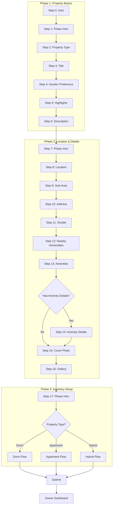
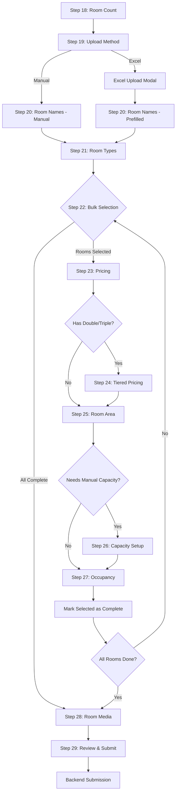
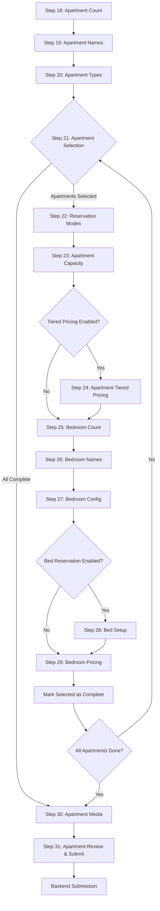
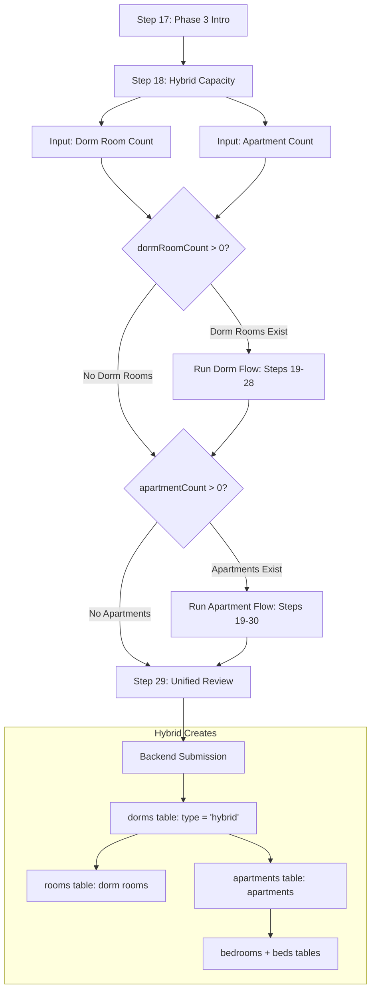
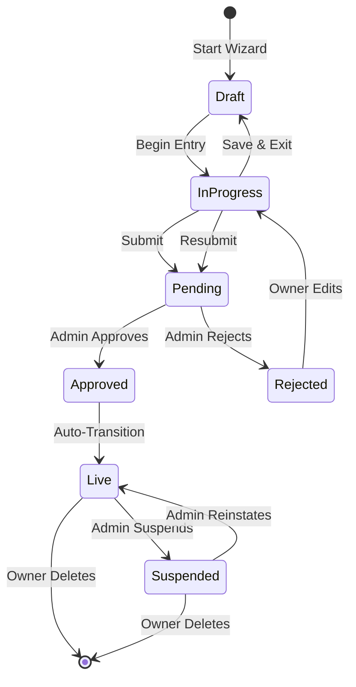
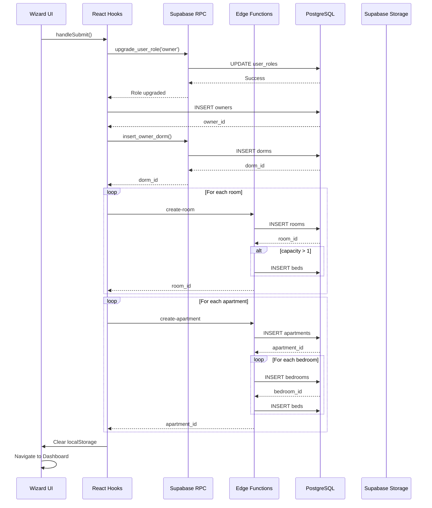
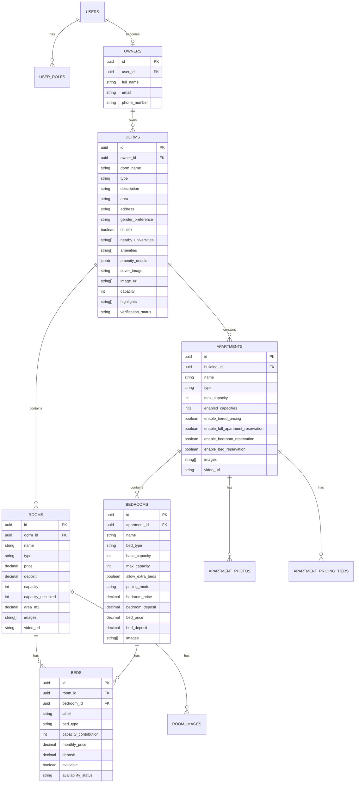

# Become-Owner Wizard Architecture (Roomy 1.0 Canonical)

> **Document Version**: 1.0  
> **Last Updated**: January 2026  
> **Purpose**: Canonical engineering blueprint for rebuilding the Roomy property registration wizard

---

## Table of Contents

1. [Overview](#1-overview)
2. [Supported Property Types](#2-supported-property-types)
3. [Wizard Phases & Step Index](#3-wizard-phases--step-index)
4. [Master Step Table (0–29)](#4-master-step-table-029)
5. [Step-by-Step Specifications](#5-step-by-step-specifications)
6. [Enumerations (Canonical Option Lists)](#6-enumerations-canonical-option-lists)
7. [Data Model (TypeScript Interfaces)](#7-data-model-typescript-interfaces)
8. [Validation & Gating Rules](#8-validation--gating-rules)
9. [Persistence & Resume Logic](#9-persistence--resume-logic)
10. [Backend Submission Contract](#10-backend-submission-contract)
11. [Security, Roles, Verification States](#11-security-roles-verification-states)
12. [Mermaid Diagrams](#12-mermaid-diagrams)

---

## 1. Overview

### 1.1 What This Wizard Does

The **Become-Owner Wizard** is a 30-step, multi-phase registration flow that enables property owners to list their student housing accommodations on the Roomy platform. It collects comprehensive property information, inventory details, pricing structures, and media assets.

### 1.2 Who Uses It

- **Owner Applicants**: Users who want to list their properties on Roomy
- **Property Managers**: Representatives managing multiple properties
- **Real Estate Companies**: Organizations with student housing portfolios

### 1.3 Output Records

Upon successful submission, the wizard creates:

| Entity | Table | Description |
|--------|-------|-------------|
| Property Record | `dorms` | Main building/property information |
| Room Records | `rooms` | Individual dorm rooms (Dorm/Hybrid) |
| Apartment Records | `apartments` | Apartment units (Apartment/Hybrid) |
| Bedroom Records | `bedrooms` | Bedrooms within apartments |
| Bed Records | `beds` | Individual beds for shared occupancy |
| Owner Profile | `owners` | Owner account linked to auth.users |
| User Role | `user_roles` | Role upgrade to 'owner' |

### 1.4 UX Goals

- **Progressive Disclosure**: Complex inventory setup broken into manageable steps
- **Flexibility**: Support for three distinct property types with different inventory models
- **Batch Operations**: Bulk selection and configuration for efficiency
- **Draft Persistence**: Auto-save progress to localStorage
- **Mobile-First**: Responsive design optimized for mobile devices

---

## 2. Supported Property Types

### 2.1 Property Type Definitions

| Type | ID | Description | Inventory Model | Use Case |
|------|-----|-------------|-----------------|----------|
| Dorm Building | `dorm` | Stand-alone dorm with private rooms | Building → Rooms → Beds | Traditional student dormitories |
| Apartment Building | `apartment` | Building with multiple apartment units | Building → Apartments → Bedrooms → Beds | Apartment complexes for students |
| Hybrid | `hybrid` | Mixed property with both rooms and apartments | Both models combined | Converted buildings, mixed-use properties |

### 2.2 Inventory Hierarchy by Type

```
DORM:
└── Building (dorms table)
    └── Rooms (rooms table)
        └── Beds (beds table) [optional for shared rooms]

APARTMENT:
└── Building (dorms table)
    └── Apartments (apartments table)
        └── Bedrooms (bedrooms table)
            └── Beds (beds table)

HYBRID:
└── Building (dorms table)
    ├── Rooms (rooms table)
    │   └── Beds (beds table)
    └── Apartments (apartments table)
        └── Bedrooms (bedrooms table)
            └── Beds (beds table)
```

---

## 3. Wizard Phases & Step Index

### 3.1 Phase Overview

| Phase | Steps | Focus | Shared Across Types |
|-------|-------|-------|---------------------|
| Phase 1 | 0–6 | Property Basics | ✅ Yes |
| Phase 2 | 7–14 | Location & Details | ✅ Yes |
| Phase 3 | 15–29 | Inventory Setup | ❌ Differs by type |

### 3.2 Phase 1: Property Basics (Steps 0–6)

| Step | Key | Purpose |
|------|-----|---------|
| 0 | intro | Welcome screen with resume/start options |
| 1 | phaseIntro1 | Phase 1 introduction animation |
| 2 | propertyType | Select property type (dorm/apartment/hybrid) |
| 3 | title | Enter property name/title |
| 4 | genderPreference | Select gender preference (male/female/mixed) |
| 5 | highlights | Select property highlights (multi-select) |
| 6 | description | Enter property description (AI-assisted) |

### 3.3 Phase 2: Location & Details (Steps 7–14)

| Step | Key | Purpose |
|------|-----|---------|
| 7 | phaseIntro2 | Phase 2 introduction animation |
| 8 | location | Select primary location (city + area) |
| 9 | subArea | Select sub-area or enter address |
| 10 | address | Enter full street address |
| 11 | shuttle | Indicate shuttle service availability |
| 12 | nearbyUniversities | Select nearby universities (multi-select) |
| 13 | amenities | Select available amenities (multi-select) |
| 14 | amenityDetails | Configure amenity-specific details |
| 15 | coverPhoto | Upload cover photo |
| 16 | gallery | Upload gallery images |

### 3.4 Phase 3: Inventory Setup (Steps 17–29)

#### Dorm Flow (Steps 17–28)

| Step | Key | Purpose |
|------|-----|---------|
| 17 | phaseIntro3 | Phase 3 introduction animation |
| 18 | capacity | Enter total room count |
| 19 | uploadMethod | Choose manual or Excel upload |
| 20 | roomNames | Enter/generate room names |
| 21 | roomTypes | Assign room types |
| 22 | bulkSelection | Select rooms to configure |
| 23 | pricing | Set room pricing |
| 24 | tieredPricing | Configure tiered pricing (if applicable) |
| 25 | roomArea | Enter room areas (m²) |
| 26 | capacitySetup | Set room capacities |
| 27 | occupancy | Set current occupancy |
| 28 | roomMedia | Upload room photos/videos |
| 29 | review | Review and submit |

#### Apartment Flow (Steps 17–29)

| Step | Key | Purpose |
|------|-----|---------|
| 17 | phaseIntro3 | Phase 3 introduction animation |
| 18 | apartmentCount | Enter apartment count |
| 19 | apartmentNames | Enter/generate apartment names |
| 20 | apartmentTypes | Assign apartment types |
| 21 | apartmentSelection | Select apartments to configure |
| 22 | reservationModes | Configure booking options |
| 23 | apartmentCapacity | Set apartment capacities |
| 24 | apartmentTieredPricing | Configure tiered pricing |
| 25 | bedroomCount | Set bedroom count per apartment |
| 26 | bedroomNames | Name bedrooms |
| 27 | bedroomConfig | Configure bedroom settings |
| 28 | bedSetup | Configure individual beds |
| 29 | bedroomPricing | Set bedroom/bed pricing |
| 30 | apartmentMedia | Upload apartment photos/videos |
| 31 | apartmentReview | Review and submit |

#### Hybrid Flow

Combines both flows:
1. Steps 0–16: Shared basics and location
2. Step 17: Phase 3 intro
3. Step 18: Hybrid capacity (dormRoomCount + apartmentCount)
4. If dormRoomCount > 0: Run Dorm inventory steps
5. If apartmentCount > 0: Run Apartment inventory steps
6. Unified review and submit

---

## 4. Master Step Table (0–29)

### 4.1 Complete Step Reference

| Step | Key | Component | Applies To | Required Inputs | Validation | Next Step Logic |
|------|-----|-----------|------------|-----------------|------------|-----------------|
| 0 | intro | AirbnbIntroStep | All | None | None | → 1 (start) or resume |
| 1 | phaseIntro1 | StepOverview | All | None | None | → 2 |
| 2 | propertyType | PropertyTypeStep | All | propertyType | Required | → 3 |
| 3 | title | TitleStep | All | title | Required, min 3 chars | → 4 |
| 4 | genderPreference | GenderPreferenceStep | All | genderPreference | Required | → 5 |
| 5 | highlights | HighlightsStep | All | highlights[] | Min 1 selection | → 6 |
| 6 | description | DescriptionStep | All | description | Required, min 50 chars | → 7 |
| 7 | phaseIntro2 | StepOverview | All | None | None | → 8 |
| 8 | location | LocationStep | All | city, area | Both required | → 9 |
| 9 | subArea | SubAreaStep | All | subArea | Optional | → 10 |
| 10 | address | AddressStep | All | address | Required | → 11 |
| 11 | shuttle | ShuttleStep | All | shuttle | Boolean | → 12 |
| 12 | nearbyUniversities | NearbyUniversitiesStep | All | nearbyUniversities[] | Min 1 selection | → 13 |
| 13 | amenities | AmenitiesStep | All | amenities[] | Optional | → 14 |
| 14 | amenityDetails | AmenityDetailsStep | All | amenityDetails | Per-amenity | → 15 |
| 15 | coverPhoto | CoverPhotoStep | All | coverImage | Required | → 16 |
| 16 | gallery | GalleryStep | All | galleryImages[] | Min 3 images | → 17 |
| 17 | phaseIntro3 | StepOverview | All | None | None | → 18 |
| 18 | capacity | CapacityStep / HybridCapacityStep | D/H: capacity, A: apartmentCount | >= 1 | Branches by type | → 19 |
| 19 | uploadMethod | UploadMethodStep | Dorm | uploadMethod | Required for Dorm | → 20 |
| 20 | roomNames | RoomNamesStep | Dorm | rooms[].name | All rooms named | → 21 |
| 21 | roomTypes | RoomTypesStep | Dorm | rooms[].type | All rooms typed | → 22 |
| 22 | bulkSelection | BulkSelectionStep | Dorm | selectedRoomIds[] | >= 1 or all complete | → 23 or → 28 |
| 23 | pricing | RoomPricingStep | Dorm | rooms[].price | All selected priced | → 24 |
| 24 | tieredPricing | TieredPricingStep | Dorm (Double/Triple only) | price_1_student, price_2_students | Skip if no shared rooms | → 25 |
| 25 | roomArea | RoomAreaStep | Dorm | rooms[].area_m2 | Optional | → 26 |
| 26 | capacitySetup | RoomCapacityStep | Dorm | rooms[].capacity | Required for non-auto | → 27 |
| 27 | occupancy | RoomOccupancyStep | Dorm | rooms[].capacity_occupied | <= capacity | → 22 (loop) or → 28 |
| 28 | roomMedia | RoomMediaStep | Dorm | rooms[].images | Optional | → 29 |
| 29 | review | ReviewStep | Dorm | agreedToOwnerTerms | Required | SUBMIT |

### 4.2 Apartment-Specific Steps

| Step | Key | Component | Inputs | Validation |
|------|-----|-----------|--------|------------|
| 18 | apartmentCount | CapacityStep | capacity (apartments) | >= 1 |
| 19 | apartmentNames | ApartmentNamesStep | apartments[].name | All named |
| 20 | apartmentTypes | ApartmentTypesStep | apartments[].type | All typed |
| 21 | apartmentSelection | ApartmentSelectionStep | selectedApartmentIds[] | >= 1 |
| 22 | reservationModes | ApartmentReservationModesStep | reservation flags | >= 1 enabled |
| 23 | apartmentCapacity | ApartmentCapacityStep | maxCapacity, enabledCapacities | Valid |
| 24 | apartmentTieredPricing | ApartmentTieredPricingStep | pricingTiers[] | If enabled |
| 25 | bedroomCount | BedroomCountStep | apartments[].bedroomCount | >= 1 |
| 26 | bedroomNames | BedroomNamesStep | bedrooms[].name | All named |
| 27 | bedroomConfig | BedroomConfigStep | bedType, capacity, allowExtraBeds | Valid |
| 28 | bedSetup | BedSetupStep | beds[] | If bed reservation enabled |
| 29 | bedroomPricing | BedroomPricingStep | pricing per mode | All priced |
| 30 | apartmentMedia | ApartmentMediaStep | apartments[].images | Optional |
| 31 | apartmentReview | ApartmentReviewStep | agreedToOwnerTerms | Required |

---

## 5. Step-by-Step Specifications

### Step 0: Intro

**Purpose**: Welcome screen with options to start fresh or resume saved progress

**UI Controls**:
- Video/animation background
- "Get Started" button
- "Resume" button (if saved progress exists)
- "Clear Progress" option

**Options**: None (action buttons only)

**Validation**: None

**Saved Fields**: None (reads existing saved state)

**Next Step Logic**:
- If "Get Started" → Step 1
- If "Resume" → Saved step position

**Edge Cases**:
- Expired saved progress (> 30 days)
- Corrupted localStorage data

---

### Step 1: Phase Intro 1

**Purpose**: Animated introduction to Phase 1 (Property Basics)

**UI Controls**:
- Isometric room animation
- Phase title: "Step 1"
- Heading: "Tell us about your property"
- Description text

**Options**: None

**Validation**: None

**Saved Fields**: None

**Next Step Logic**: → Step 2

---

### Step 2: Property Type

**Purpose**: Select the type of property being listed

**UI Controls**:
- Three large selection cards with icons
- Icon, label, and description for each option

**Options**:

| Value | Label | Icon | Description |
|-------|-------|------|-------------|
| `dorm` | Dorm Building | Building2 | Stand-alone dorm with private rooms |
| `apartment` | Apartment Building | Building | Building with multiple apartments |
| `hybrid` | Hybrid | Layers | Dorm building with rooms and apartments |

**Validation**: Required selection

**Saved Fields**: `propertyType`

**Next Step Logic**: → Step 3

**Edge Cases**: None

---

### Step 3: Title

**Purpose**: Enter the property name/title

**UI Controls**:
- Text input field
- Character counter
- AI suggestion button (optional)

**Options**: Free text input

**Validation**:
- Required
- Minimum 3 characters
- Maximum 100 characters

**Saved Fields**: `title`

**Next Step Logic**: → Step 4

---

### Step 4: Gender Preference

**Purpose**: Specify who can stay at the property

**UI Controls**:
- Three selection cards with emoji icons

**Options**:

| Value | Label | Emoji | Description |
|-------|-------|-------|-------------|
| `male` | Men only | 👨 | Only male students can stay |
| `female` | Women only | 👩 | Only female students can stay |
| `mixed` | Mixed | 👥 | Open to all genders |

**Validation**: Required selection

**Saved Fields**: `genderPreference`

**Next Step Logic**: → Step 5

---

### Step 5: Highlights

**Purpose**: Select key features that make the property stand out

**UI Controls**:
- Multi-select grid of highlight chips
- "Other" option with text input

**Options**:

| Value | Label |
|-------|-------|
| `modern` | Modern |
| `spacious` | Spacious |
| `quiet` | Quiet |
| `central` | Central Location |
| `affordable` | Affordable |
| `newly_renovated` | Newly Renovated |
| `fully_furnished` | Fully Furnished |
| `private_bathroom` | Private Bathroom |
| `balcony` | Balcony |
| `view` | Great View |
| `security` | 24/7 Security |
| `parking` | Parking Available |

**Validation**: Minimum 1 selection

**Saved Fields**: `highlights[]`

**Next Step Logic**: → Step 6

---

### Step 6: Description

**Purpose**: Provide a detailed property description

**UI Controls**:
- Multiline textarea
- Character counter
- AI auto-generate button
- "Regenerate" option

**Options**: Free text input

**Validation**:
- Required
- Minimum 50 characters
- Maximum 2000 characters

**Saved Fields**: 
- `description`
- `descriptionManuallyEdited` (boolean)

**Next Step Logic**: → Step 7

**Edge Cases**:
- AI generation failure
- Manual edit after AI generation

---

### Step 7: Phase Intro 2

**Purpose**: Animated introduction to Phase 2 (Location & Details)

**UI Controls**:
- Isometric animation (Phase 2 variant)
- Phase title: "Step 2"
- Heading: "Make it stand out"
- Description text

**Options**: None

**Validation**: None

**Saved Fields**: None

**Next Step Logic**: → Step 8

---

### Step 8: Location

**Purpose**: Select property location (city and area)

**UI Controls**:
- City dropdown/select
- Area dropdown/select (filtered by city)

**Options**: See [Section 6.4 Location Taxonomy](#64-unified-location-taxonomy-lebanon)

**Validation**: Both city and area required

**Saved Fields**: `city`, `area`

**Next Step Logic**: → Step 9

---

### Step 9: Sub-Area

**Purpose**: Select or enter specific sub-area/neighborhood

**UI Controls**:
- Sub-area dropdown (if available for selected area)
- Text input for custom sub-area

**Options**: Dynamic based on selected area

**Validation**: Optional

**Saved Fields**: `subArea`

**Next Step Logic**: → Step 10

---

### Step 10: Address

**Purpose**: Enter full street address

**UI Controls**:
- Text input for street address
- Optional: Building name, floor

**Options**: Free text input

**Validation**: Required

**Saved Fields**: `address`

**Next Step Logic**: → Step 11

---

### Step 11: Shuttle

**Purpose**: Indicate if shuttle service is available

**UI Controls**:
- Toggle switch or Yes/No buttons

**Options**:

| Value | Label |
|-------|-------|
| `true` | Shuttle available |
| `false` | No shuttle |

**Validation**: Required selection

**Saved Fields**: `shuttle`

**Next Step Logic**: → Step 12

---

### Step 12: Nearby Universities

**Purpose**: Select universities near the property

**UI Controls**:
- Multi-select list with checkboxes
- Search/filter input
- University logos (optional)

**Options**: See [Section 6.3 Universities](#63-nearby-universities-lebanon)

**Validation**: Minimum 1 selection

**Saved Fields**: `nearbyUniversities[]`

**Next Step Logic**: → Step 13

---

### Step 13: Amenities

**Purpose**: Select available amenities at the property

**UI Controls**:
- Categorized multi-select grid
- Icons for each amenity

**Options**: See [Section 6.9 Amenities](#69-amenities--sub-options)

**Validation**: Optional (no minimum)

**Saved Fields**: `amenities[]`

**Next Step Logic**: 
- If any amenities with sub-options selected → Step 14
- Otherwise → Step 15

---

### Step 14: Amenity Details

**Purpose**: Configure details for selected amenities

**UI Controls**:
- Dynamic form based on selected amenities
- Modal dialogs for complex options
- Sub-option forms per amenity

**Options**: See [Section 6.9 Amenity Sub-options](#69-amenities--sub-options)

**Validation**: Required fields per amenity type

**Saved Fields**: `amenityDetails` (nested object)

**Next Step Logic**: → Step 15

---

### Step 15: Cover Photo

**Purpose**: Upload the main cover photo for the listing

**UI Controls**:
- Image upload zone (drag & drop)
- Image preview with crop option
- Replace button

**Options**: Image file upload

**Validation**:
- Required
- Max file size: 10MB
- Supported formats: JPG, PNG, WebP
- Minimum dimensions: 800x600

**Saved Fields**: `coverImage` (URL after upload)

**Next Step Logic**: → Step 16

---

### Step 16: Gallery

**Purpose**: Upload additional gallery images

**UI Controls**:
- Multi-image upload zone
- Drag to reorder
- Delete individual images
- Counter showing current/max

**Options**: Multiple image files

**Validation**:
- Minimum 3 images
- Maximum 20 images
- Same file constraints as cover photo

**Saved Fields**: `galleryImages[]` (URLs)

**Next Step Logic**: → Step 17

---

### Step 17: Phase Intro 3

**Purpose**: Animated introduction to Phase 3 (Inventory Setup)

**UI Controls**:
- Isometric animation (Phase 3 variant)
- Phase title: "Step 3"
- Heading: "Finish up and publish"
- Description text

**Options**: None

**Validation**: None

**Saved Fields**: None

**Next Step Logic**: → Step 18

---

### Step 18: Capacity / Counts

**Purpose**: Enter the number of rooms or apartments

**Component Variants**:
- **Dorm**: `CapacityStep` - Single room count input
- **Apartment**: `CapacityStep` - Single apartment count input  
- **Hybrid**: `HybridCapacityStep` - Two inputs (dorm rooms + apartments)

**UI Controls**:
- Numeric input(s)
- +/- buttons for easy adjustment
- Summary display

**Dorm Options**:

| Field | Type | Range |
|-------|------|-------|
| capacity | number | 1–2000 |

**Apartment Options**:

| Field | Type | Range |
|-------|------|-------|
| capacity | number | 1–500 |

**Hybrid Options**:

| Field | Type | Range |
|-------|------|-------|
| dormRoomCount | number | 0–2000 |
| apartmentCount | number | 0–500 |

**Validation**:
- Dorm/Apartment: >= 1
- Hybrid: (dormRoomCount + apartmentCount) >= 1

**Saved Fields**: `capacity`, `dormRoomCount`, `apartmentCount`

**Next Step Logic**:
- Dorm → Step 19 (Upload Method)
- Apartment → Step 19 (Apartment Names)
- Hybrid with dormRoomCount > 0 → Dorm flow first
- Hybrid with only apartments → Apartment flow

---

### Step 19: Upload Method (Dorm Only)

**Purpose**: Choose between manual entry or Excel import

**UI Controls**:
- Two large selection cards

**Options**:

| Value | Label | Icon | Description |
|-------|-------|------|-------------|
| `manual` | Manual Entry | Pencil | Enter room details one by one |
| `excel` | Excel Upload | FileSpreadsheet | Upload a spreadsheet with room data |

**Validation**: Required selection

**Saved Fields**: `uploadMethod`

**Next Step Logic**:
- `manual` → Step 20 (Room Names)
- `excel` → Excel upload modal → Step 20 (prefilled)

**Edge Cases**:
- Invalid Excel format
- Missing required columns
- Duplicate room names

---

### Step 20: Room Names (Dorm)

**Purpose**: Name all rooms in the property

**UI Controls**:
- List of text inputs (one per room)
- Auto-fill buttons:
  - "Auto-fill Numbers" (1, 2, 3...)
  - "Auto-fill Letters" (A1, A2, B1...)
- Individual input validation

**Options**: Free text per room

**Validation**:
- All rooms must have names
- Names must be unique
- No empty strings

**Saved Fields**: `rooms[].name`

**Next Step Logic**: → Step 21

---

### Step 21: Room Types (Dorm)

**Purpose**: Assign room types to all rooms

**UI Controls**:
- Dropdown select per room
- "Apply to All" quick action
- Batch selection mode

**Options**: See [Section 6.5 Room Types](#65-room-types-dorm)

**Validation**: All rooms must have types assigned

**Saved Fields**: `rooms[].type`

**Next Step Logic**: → Step 22

**Auto-Capacity Assignment**:

| Room Type | Auto Capacity |
|-----------|---------------|
| Single, Standard Single, High Standard Single, Small Single, Medium Single, Large Single | 1 |
| Double, Standard Double, High Standard Double, Small Double, Medium Double, Large Double | 2 |
| Triple | 3 |
| Quadruple, Large Quadruple | 4 |
| Suite, Studio, Junior Suite, Royal Suite | null (manual) |

---

### Step 22: Bulk Selection (Dorm)

**Purpose**: Select rooms to configure in batch

**UI Controls**:
- Checkbox list of rooms (grouped by type)
- "Select All" / "Deselect All"
- Progress indicator (X of Y configured)
- Skip to review if all complete

**Options**: Multi-select from room list

**Validation**:
- At least 1 room selected, OR
- All rooms already configured

**Saved Fields**: `selectedRoomIds[]`

**Next Step Logic**:
- If rooms selected → Step 23 (Pricing)
- If all complete → Step 28 (Room Media)

---

### Step 23: Pricing (Dorm)

**Purpose**: Set monthly price and deposit for selected rooms

**UI Controls**:
- Price input field (with currency)
- Deposit input field (with currency)
- "Apply" button for each
- Applied indicator (checkmark)
- List of selected rooms with badges

**Options**:

| Field | Type | Range |
|-------|------|-------|
| price | number | 1–100,000 USD |
| deposit | number | 0–100,000 USD |

**Validation**: Price required, deposit optional

**Saved Fields**: `rooms[].price`, `rooms[].deposit`

**Next Step Logic**: 
- If any selected room is Double/Triple → Step 24
- Otherwise → Step 25

---

### Step 24: Tiered Pricing (Dorm)

**Purpose**: Set pricing tiers for shared rooms (Double/Triple)

**UI Controls**:
- Tabs per room type (Double, Triple, etc.)
- Price inputs per occupancy level
- Deposit inputs per occupancy level

**Options**:

For **Double** rooms:

| Field | Description |
|-------|-------------|
| price_1_student | Price when 1 student occupies |
| price_2_students | Price when 2 students occupy |
| deposit_1_student | Deposit for 1 student |
| deposit_2_students | Deposit for 2 students |

For **Triple** rooms:

| Field | Description |
|-------|-------------|
| price_1_student | Price for 1 student |
| price_2_students | Price for 2 students |
| price_3_students | Price for 3 students |
| (deposits similarly) |

**Validation**: All tier prices required

**Saved Fields**: `rooms[].price_X_student(s)`, `rooms[].deposit_X_student(s)`

**Next Step Logic**: → Step 25

**Skip Condition**: Skip if no Double/Triple/Quadruple rooms in selection

---

### Step 25: Room Area (Dorm)

**Purpose**: Enter room area in square meters

**UI Controls**:
- Numeric input
- "Apply" button
- List of selected rooms

**Options**:

| Field | Type | Range |
|-------|------|-------|
| area_m2 | number | 1–1000 m² |

**Validation**: Optional

**Saved Fields**: `rooms[].area_m2`

**Next Step Logic**: → Step 26

---

### Step 26: Capacity Setup (Dorm)

**Purpose**: Set capacity for rooms without auto-capacity

**UI Controls**:
- Dropdown select per room (showing only rooms needing manual capacity)
- Capacity range: 1–10

**Options**: Numeric select 1–10

**Validation**: Required for Suite/Studio types

**Saved Fields**: `rooms[].capacity`

**Next Step Logic**: → Step 27

**Skip Condition**: Skip if all rooms have auto-capacity from type

---

### Step 27: Occupancy (Dorm)

**Purpose**: Set current occupancy for each room

**UI Controls**:
- Dropdown per room (0 to capacity)
- Room name and capacity display

**Options**: Numeric select 0 to room.capacity

**Validation**: Must be <= room capacity

**Saved Fields**: `rooms[].capacity_occupied`

**Next Step Logic**:
- Mark selected rooms as complete
- If more rooms to configure → Step 22 (loop back)
- If all rooms complete → Step 28

---

### Step 28: Room Media (Dorm)

**Purpose**: Upload photos and videos for rooms

**UI Controls**:
- Per-room upload sections (expandable)
- Image upload (multiple)
- Video URL input
- Drag to reorder images
- "Thumbnail" indicator on first image

**Options**:
- Images: Multiple files
- Video: URL (YouTube, Vimeo, or direct)

**Validation**: Optional

**Saved Fields**: `rooms[].images[]`, `rooms[].video_url`

**Next Step Logic**: → Step 29

---

### Step 29: Review (Dorm)

**Purpose**: Review all entered information before submission

**UI Controls**:
- Collapsible sections for each category
- Edit buttons per section
- Terms checkbox
- Submit button

**Sections Displayed**:
1. Property Basics (type, title, gender, highlights, description)
2. Location (city, area, address, shuttle, universities)
3. Amenities (list with details)
4. Photos (cover + gallery preview)
5. Rooms (table with name, type, price, capacity)

**Options**: None (review only)

**Validation**:
- `agreedToOwnerTerms` must be true
- `title` must exist
- `area` must exist

**Saved Fields**: `agreedToOwnerTerms`

**Next Step Logic**: SUBMIT → Backend

---

### Steps 19–31: Apartment Flow

#### Step 19: Apartment Names

**Purpose**: Name all apartments

**UI Controls**:
- List of text inputs
- Auto-fill options:
  - "Numbers" (1, 2, 3...)
  - "Block Numbers" (A1, A2, A3, B1...)
  - "Floor Numbers" (101, 102, 201...)

**Options**: Free text per apartment

**Validation**: All apartments must have unique names

**Saved Fields**: `apartments[].name`

---

#### Step 20: Apartment Types

**Purpose**: Assign types to all apartments

**UI Controls**:
- Type selector per apartment
- "Quick apply to all" button
- Type icons

**Options**: See [Section 6.6 Apartment Types](#66-apartment-types)

**Validation**: All apartments must have types

**Saved Fields**: `apartments[].type`

---

#### Step 21: Apartment Selection

**Purpose**: Select apartments to configure in batch

**UI Controls**:
- Checkbox list of apartments
- Progress indicator
- "Configure All" option

**Options**: Multi-select

**Validation**: At least 1 selected or all complete

**Saved Fields**: `selectedApartmentIds[]`

---

#### Step 22: Reservation Modes

**Purpose**: Configure how the apartment can be booked

**UI Controls**:
- Toggle switches for each mode
- Description text for each option

**Options**:

| Field | Label | Description |
|-------|-------|-------------|
| enableFullApartmentReservation | Whole Apartment | Allow booking the entire apartment |
| enableBedroomReservation | Per Bedroom | Allow booking individual bedrooms |
| enableBedReservation | Per Bed | Allow booking individual beds |

**Validation**: At least one mode must be enabled

**Saved Fields**: 
- `apartments[].enableFullApartmentReservation`
- `apartments[].enableBedroomReservation`
- `apartments[].enableBedReservation`

---

#### Step 23: Apartment Capacity

**Purpose**: Set capacity and enabled capacity levels

**UI Controls**:
- Max capacity input
- Enabled capacities multi-select (1 to max)
- Visual capacity indicator

**Options**:

| Field | Type | Range |
|-------|------|-------|
| maxCapacity | number | 1–20 |
| enabledCapacities | number[] | Subset of 1 to maxCapacity |

**Validation**: At least one capacity enabled

**Saved Fields**: `apartments[].maxCapacity`, `apartments[].enabledCapacities`

---

#### Step 24: Apartment Tiered Pricing

**Purpose**: Set pricing tiers based on occupancy

**UI Controls**:
- Enable/disable toggle
- Price input per enabled capacity level
- Deposit input per level

**Options**:

| Field | Type |
|-------|------|
| enableTieredPricing | boolean |
| pricingTiers[].capacity | number |
| pricingTiers[].monthlyPrice | number |
| pricingTiers[].deposit | number |

**Validation**: All enabled tiers must have prices

**Saved Fields**: `apartments[].enableTieredPricing`, `apartments[].pricingTiers[]`

---

#### Step 25: Bedroom Count

**Purpose**: Set number of bedrooms per apartment

**UI Controls**:
- Numeric input per apartment
- +/- adjustment buttons
- "Apply to all" option

**Options**: Numeric 1–10

**Validation**: >= 1 bedroom per apartment

**Saved Fields**: `apartments[].bedroomCount`, creates `apartments[].bedrooms[]`

---

#### Step 26: Bedroom Names

**Purpose**: Name bedrooms within each apartment

**UI Controls**:
- Grouped by apartment
- Text input per bedroom
- Auto-name options:
  - "Numbered" (Bedroom 1, Bedroom 2)
  - "Descriptive" (Master Bedroom, Guest Room)

**Options**: Free text per bedroom

**Validation**: All bedrooms must have names

**Saved Fields**: `apartments[].bedrooms[].name`

---

#### Step 27: Bedroom Config

**Purpose**: Configure bedroom details

**UI Controls**:
- Bed type selector
- Capacity inputs (base and max)
- Allow extra beds toggle

**Options**:

| Field | Type | Options |
|-------|------|---------|
| bedType | select | See [Section 6.7 Bedroom Bed Types](#67-bedroom-bed-types) |
| baseCapacity | number | 1–4 |
| maxCapacity | number | baseCapacity to 6 |
| allowExtraBeds | boolean | Yes/No |

**Validation**: maxCapacity >= baseCapacity

**Saved Fields**: 
- `bedrooms[].bedType`
- `bedrooms[].baseCapacity`
- `bedrooms[].maxCapacity`
- `bedrooms[].allowExtraBeds`

---

#### Step 28: Bed Setup

**Purpose**: Configure individual beds within bedrooms

**UI Controls**:
- Expandable sections per bedroom
- Bed list with +/- controls
- Bed type selector per bed
- Capacity contribution input

**Options**:

| Field | Type | Description |
|-------|------|-------------|
| label | string | Bed identifier (e.g., "Bed A") |
| bedType | select | See [Section 6.8 Bed Types](#68-bed-setup-options) |
| capacityContribution | number | How many spots this bed provides |
| available | boolean | Is bed currently available |

**Validation**: Total bed capacity must match bedroom maxCapacity

**Saved Fields**: `bedrooms[].beds[]`

**Skip Condition**: Skip if bed reservation is not enabled

---

#### Step 29: Bedroom Pricing

**Purpose**: Set pricing for bedrooms and/or beds

**UI Controls**:
- Pricing mode selector
- Price inputs based on mode
- Deposit inputs

**Options**:

| Mode | Fields Required |
|------|-----------------|
| per_bedroom | bedroomPrice, bedroomDeposit |
| per_bed | bedPrice, bedDeposit |
| both | All four fields |

**Validation**: Required fields based on pricing mode

**Saved Fields**:
- `bedrooms[].pricingMode`
- `bedrooms[].bedroomPrice`
- `bedrooms[].bedroomDeposit`
- `bedrooms[].bedPrice`
- `bedrooms[].bedDeposit`

---

#### Step 30: Apartment Media

**Purpose**: Upload photos and videos for apartments

**UI Controls**:
- Per-apartment upload sections
- Cover photo selector
- Gallery upload
- Video URL input

**Options**: Same as room media

**Validation**: Optional

**Saved Fields**: `apartments[].images[]`, `apartments[].videoUrl`

---

#### Step 31: Apartment Review

**Purpose**: Review and submit apartment listing

**UI Controls**: Same as dorm review

**Validation**: Same as dorm review

**Next Step Logic**: SUBMIT → Backend

---

## 6. Enumerations (Canonical Option Lists)

### 6.1 Property Types

| Value | Label | Icon | Description |
|-------|-------|------|-------------|
| `dorm` | Dorm Building | Building2 | Stand-alone dorm with private rooms |
| `apartment` | Apartment Building | Building | Building with multiple apartments |
| `hybrid` | Hybrid | Layers | Dorm building with rooms and apartments |

### 6.2 Gender Preference

| Value | Label | Emoji | Target Audience |
|-------|-------|-------|-----------------|
| `male` | Men only | 👨 | Male students only |
| `female` | Women only | 👩 | Female students only |
| `mixed` | Mixed | 👥 | All genders welcome |

### 6.3 Nearby Universities (Lebanon)

#### Beirut Region

| ID | Name | Short Name |
|----|------|------------|
| `aub` | American University of Beirut | AUB |
| `lau-beirut` | Lebanese American University (Beirut) | LAU |
| `usj` | Université Saint-Joseph de Beyrouth | USJ |
| `bau` | Beirut Arab University | BAU |
| `lu-hadath` | Lebanese University – Hadath | LU |
| `liu` | Lebanese International University | LIU |
| `haigazian` | Haigazian University | Haigazian |
| `aust` | American University of Science and Technology | AUST |
| `la-sagesse` | Université La Sagesse | ULS |

#### Byblos Region

| ID | Name | Short Name |
|----|------|------------|
| `lau-byblos` | Lebanese American University (Byblos) | LAU Byblos |
| `aut` | Arts, Sciences and Technology University | AUT |

#### Keserwan Region

| ID | Name | Short Name |
|----|------|------------|
| `ndu` | Notre Dame University - Louaize | NDU |
| `usek` | Holy Spirit University of Kaslik | USEK |

#### Multi-Campus Universities (Sub-options)

**Lebanese American University (LAU)**
- LAU Beirut
- LAU Byblos

**Lebanese University (LU)**
- LU Hadath (Main)
- LU Fanar
- LU Tripoli
- LU Saida
- LU Zahle

### 6.4 Unified Location Taxonomy (Lebanon)

#### Primary Location → City → Area → Sub-area/Street

```
BEIRUT (Primary)
├── Beirut (City)
│   ├── Hamra (Area)
│   │   └── Bliss Street (Sub-area)
│   ├── Achrafieh (Area)
│   │   ├── Damascus Street
│   │   ├── Geitawi Street
│   │   ├── Sodeco Square
│   │   └── Alfred Naccash Street
│   ├── Ain El Mraisseh (Area)
│   │   └── Clemenceau Street
│   ├── Verdun (Area)
│   ├── Ras Beirut (Area)
│   ├── Badaro (Area)
│   ├── Mar Mikhael (Area)
│   ├── Gemmayzeh (Area)
│   ├── Sodeco (Area)
│   ├── Sassine (Area)
│   ├── Manara (Area)
│   ├── Sanayeh (Area)
│   ├── Mazraa (Area)
│   ├── Zarif (Area)
│   ├── Tarik Jdideh (Area)
│   ├── Barbir (Area)
│   ├── Tariq El Jdideh (Area)
│   ├── Chiyah (Area)
│   ├── Hadath (Area)
│   ├── Furn El Chebbak (Area)
│   ├── Sin El Fil (Area)
│   ├── Dekwaneh (Area)
│   ├── Jdeideh (Area)
│   └── Hazmieh (Area)

BYBLOS (Primary)
├── Jbeil (City)
│   ├── Blat (Area)
│   ├── Nahr Ibrahim (Area)
│   ├── Halat (Area)
│   ├── Jeddayel (Area)
│   ├── Mastita (Area)
│   ├── Fidar (Area)
│   ├── Habboub (Area)
│   └── Amchit (Area)

KESERWAN (Primary)
├── Jounieh (City)
│   ├── Kaslik (Area)
│   ├── Zouk Mosbeh (Area)
│   ├── Zouk Mikael (Area)
│   ├── Adma (Area)
│   ├── Sarba (Area)
│   └── Haret Sakher (Area)
├── Ghazir (City)
├── Kfarhbab (City)
└── Faraya (City)

TRIPOLI (Primary)
├── Tripoli (City)
│   ├── El Mina (Area)
│   ├── Dam Wal Farz (Area)
│   ├── Kobbe (Area)
│   └── Zahrieh (Area)

SAIDA (Primary)
├── Sidon (City)
│   ├── Old Saida (Area)
│   ├── Majdelyoun (Area)
│   └── Haret Saida (Area)

ZAHLE (Primary)
├── Zahle (City)
│   ├── Kab Elias (Area)
│   ├── Chtaura (Area)
│   └── Rayak (Area)

BAABDA (Primary)
├── Baabda (City)
│   ├── Hadath (Area)
│   ├── Hazmieh (Area)
│   ├── Yarze (Area)
│   └── Louaize (Area)

METN (Primary)
├── Jal El Dib (City)
├── Antelias (City)
├── Dbayeh (City)
├── Bsalim (City)
├── Mansourieh (City)
├── Broummana (City)
├── Beit Mery (City)
└── Bikfaya (City)

ALEY (Primary)
├── Aley (City)
│   ├── Ain Anoub (Area)
│   ├── Bhamdoun (Area)
│   └── Sofar (Area)
```

### 6.5 Room Types (Dorm)

#### Standard Room Types

| Value | Label | Auto Capacity | Description |
|-------|-------|---------------|-------------|
| `Single` | Single | 1 | One-person room |
| `Double` | Double | 2 | Two-person room |
| `Triple` | Triple | 3 | Three-person room |
| `Quadruple` | Quadruple | 4 | Four-person room |
| `Suite` | Suite | Manual | Multi-room suite |
| `Studio` | Studio | Manual | Open-plan studio |

#### Premium Variants

| Value | Label | Auto Capacity | Description |
|-------|-------|---------------|-------------|
| `Junior Suite` | Junior Suite | Manual | Smaller suite |
| `Royal Suite` | Royal Suite | Manual | Luxury suite |
| `Standard Single` | Standard Single | 1 | Basic single room |
| `High Standard Single` | High Standard Single | 1 | Premium single room |
| `Standard Double` | Standard Double | 2 | Basic double room |
| `High Standard Double` | High Standard Double | 2 | Premium double room |

#### Size Variants

| Value | Label | Auto Capacity | Description |
|-------|-------|---------------|-------------|
| `Small Single` | Small Single | 1 | Compact single |
| `Medium Single` | Medium Single | 1 | Average single |
| `Large Single` | Large Single | 1 | Spacious single |
| `Small Double` | Small Double | 2 | Compact double |
| `Medium Double` | Medium Double | 2 | Average double |
| `Large Double` | Large Double | 2 | Spacious double |
| `Large Quadruple` | Large Quadruple | 4 | Spacious quad room |

#### Suite Sub-options

**When Suite is selected:**

1. **Number of Bedrooms?**
   - 1 Bedroom
   - 2 Bedrooms
   - 3+ Bedrooms

2. **For 1-Bedroom Suite:**
   - Number of beds: 1, 2, 3+
   - Allow extra beds?: Yes / No / Maybe

3. **For 2-Bedroom Suite:**
   - Bedroom 1 Type: Single / Double/Master / Other
   - Bedroom 2 Type: Single / Double/Master / Other
   - Per bedroom: Allow extra students?: Yes / No / Maybe

4. **For 3+ Bedroom Suite:**
   - Configure each bedroom individually

#### Studio Sub-options

**When Studio is selected:**

1. **How many separate beds?**
   - 1 bed (single occupant)
   - 2+ beds (shared occupancy)

2. **If 2+ beds:**
   - Enter exact bed count
   - Bed types for each

### 6.6 Apartment Types

| Value | Label | Icon | Description |
|-------|-------|------|-------------|
| `small` | Small Apartment | Home | 1-2 bedroom apartment |
| `medium` | Medium Apartment | Building | 2-3 bedroom apartment |
| `large` | Large Apartment | Building2 | 3+ bedroom apartment |
| `studio` | Studio | Square | Open-plan studio apartment |
| `penthouse` | Penthouse | Crown | Luxury top-floor apartment |

### 6.7 Bedroom Bed Types

| Value | Label | Description | Typical Capacity |
|-------|-------|-------------|------------------|
| `single` | Single Bed | Standard single bed | 1 person |
| `double` | Double Bed | Standard double bed | 1-2 persons |
| `master` | Master Bed | King/Queen in master bedroom | 1-2 persons |
| `king` | King Bed | King-size bed | 1-2 persons |
| `bunk` | Bunk Bed | Stacked bunk beds | 2 persons |

**Note**: Bed type is DESCRIPTIVE ONLY. Actual capacity is owner-defined.

### 6.8 Bed Setup Options

| Value | Label | Capacity Contribution |
|-------|-------|----------------------|
| `single_bed` | Single Bed | 1 |
| `double_bed` | Double Bed | 2 |
| `bunk_bed` | Bunk Bed | 2 |
| `sofa_bed` | Sofa Bed | 1 |
| `floor_mattress` | Floor Mattress | 1 |
| `trundle_bed` | Trundle Bed | 1 |
| `murphy_bed` | Murphy Bed | 1 |
| `futon` | Futon | 1-2 |

### 6.9 Amenities + Sub-options

#### 6.9.1 Essentials Category

| ID | Label | Icon | Has Options | Options |
|----|-------|------|-------------|---------|
| `wifi` | WiFi | Wifi | ✅ Yes | See below |
| `kitchenette` | Kitchenette | CookingPot | ❌ No | — |
| `laundry` | Laundry | WashingMachine | ✅ Yes | See below |
| `heating` | Heating | Thermometer | ❌ No | — |
| `ac` | AC | Snowflake | ❌ No | — |
| `furnished` | Furnished | Sofa | ❌ No | — |
| `tv` | TV | Tv | ❌ No | — |
| `electricity` | Electricity | Zap | ✅ Yes | See below |
| `water` | Water | Droplets | ✅ Yes | See below |

**WiFi Options:**

| Field | Type | Options |
|-------|------|---------|
| included | select | Yes / No |
| billingInfo | text | (if not included) Billing details |

**Laundry Options:**

| Field | Type | Options |
|-------|------|---------|
| washingMachine | boolean | Yes / No |
| dryerAvailable | boolean | Yes / No |
| includedInRent | select | Included / Per-use |
| costPerUse | number | (if per-use) Cost in USD |
| location | select | In-unit / Common area / Nearby |

**Electricity Options:**

| Field | Type | Options |
|-------|------|---------|
| availability | select | 24/7 / Limited hours |
| limitedHours | text | (if limited) Schedule details |
| included | select | Yes / No |
| billingInfo | text | (if not included) Billing info |

**Water Options:**

| Field | Type | Options |
|-------|------|---------|
| waterType | select | Sweet / Salty |
| hotWater | select | 24/7 / Limited / Other |
| hotWaterDetails | text | (if other) Details |

#### 6.9.2 Shared Spaces Category

| ID | Label | Icon | Has Options |
|----|-------|------|-------------|
| `study_room` | Study Room | BookOpen | ❌ No |
| `common_area` | Common Area | Users | ❌ No |
| `garden` | Garden | TreeDeciduous | ❌ No |
| `gym` | Gym | Dumbbell | ❌ No |
| `pool` | Pool | Waves | ❌ No |

#### 6.9.3 Safety Category

| ID | Label | Icon | Has Options | Options |
|----|-------|------|-------------|---------|
| `security` | Security | Shield | ❌ No | — |
| `elevator` | Elevator | ArrowUpDown | ❌ No | — |
| `parking` | Parking | ParkingCircle | ❌ No | — |
| `cleaning_service` | Cleaning Service | Sparkles | ✅ Yes | See below |
| `pet_friendly` | Pet Friendly | PawPrint | ❌ No | — |

**Cleaning Options:**

| Field | Type | Options |
|-------|------|---------|
| frequency | select | Once per week / Twice per week / Three times per week / Custom |
| customSchedule | text | (if custom) Schedule details |

### 6.10 Reservation Modes (Apartment)

| Field | Label | Description |
|-------|-------|-------------|
| `enableFullApartmentReservation` | Whole Apartment | Book the entire apartment as one unit |
| `enableBedroomReservation` | Per Bedroom | Book individual bedrooms |
| `enableBedReservation` | Per Bed | Book individual beds within bedrooms |

**Rules:**
- At least ONE mode must be enabled
- Multiple modes can be enabled simultaneously
- Bed reservation requires bedroom reservation to also be enabled

### 6.11 Pricing Models & Tiering Rules

#### Dorm Room Pricing

| Model | Description | Fields |
|-------|-------------|--------|
| Flat Rate | Single price regardless of occupancy | `price`, `deposit` |
| Tiered | Different prices based on occupancy | `price_X_student(s)`, `deposit_X_student(s)` |

**Tiered Pricing by Room Type:**

| Room Type | Tiers Available |
|-----------|-----------------|
| Single | Flat only (capacity = 1) |
| Double | 1 student, 2 students |
| Triple | 1 student, 2 students, 3 students |
| Quadruple | 1-4 students |
| Suite/Studio | Based on configured capacity |

#### Apartment Pricing

| Model | Description | Fields |
|-------|-------------|--------|
| Flat Rate | Single price for apartment | `fullApartmentPrice`, `fullApartmentDeposit` |
| Tiered | Different prices based on occupancy | `pricingTiers[].monthlyPrice`, `pricingTiers[].deposit` |

**Tiered Pricing Configuration:**

| Field | Type | Description |
|-------|------|-------------|
| enableTieredPricing | boolean | Enable/disable tiered pricing |
| enabledCapacities | number[] | Which occupancy levels are allowed |
| pricingTiers | array | Price and deposit per capacity level |

#### Bedroom Pricing Modes

| Mode | Description | Required Fields |
|------|-------------|-----------------|
| `per_bedroom` | Price the entire bedroom | `bedroomPrice`, `bedroomDeposit` |
| `per_bed` | Price each bed individually | `bedPrice`, `bedDeposit` |
| `both` | Support both pricing options | All four fields |

### 6.12 Upload Method + Excel Template Schema

#### Upload Methods

| Value | Label | Description |
|-------|-------|-------------|
| `manual` | Manual Entry | Enter room details one by one |
| `excel` | Excel Upload | Import from spreadsheet |

#### Excel Template Schema (Dorm Rooms)

| Column | Header | Type | Required | Example |
|--------|--------|------|----------|---------|
| A | Room Name | string | ✅ Yes | 101 |
| B | Room Type | string | ✅ Yes | Single |
| C | Monthly Price | number | ✅ Yes | 300 |
| D | Deposit | number | ❌ No | 150 |
| E | Capacity | number | ❌ No | 1 |
| F | Current Occupancy | number | ❌ No | 0 |
| G | Area (m²) | number | ❌ No | 15 |

**Validation Rules:**
- Room Name: Non-empty, unique
- Room Type: Must match valid room type
- Monthly Price: Positive number
- Deposit: Non-negative number
- Capacity: 1-10 (overrides auto-capacity if provided)
- Current Occupancy: 0 to Capacity
- Area: Positive number

**Error Handling:**
- Missing required columns → Error with column list
- Invalid room type → Error with row number and valid options
- Duplicate room names → Warning, auto-rename with suffix
- Invalid numbers → Error with row and column

#### Excel Template Schema (Apartments)

| Column | Header | Type | Required | Example |
|--------|--------|------|----------|---------|
| A | Apartment Name | string | ✅ Yes | Apt 1A |
| B | Apartment Type | string | ✅ Yes | Medium |
| C | Bedroom Count | number | ✅ Yes | 2 |
| D | Max Capacity | number | ✅ Yes | 4 |
| E | Monthly Price | number | ✅ Yes | 800 |
| F | Deposit | number | ❌ No | 400 |

---

## 7. Data Model (TypeScript Interfaces)

### 7.1 Main Wizard Form Data

```typescript
interface WizardFormData {
  // === PHASE 1: Property Basics ===
  propertyType: 'dorm' | 'apartment' | 'hybrid' | '';
  title: string;
  genderPreference: 'male' | 'female' | 'mixed' | '';
  highlights: string[];
  description: string;
  descriptionManuallyEdited: boolean;
  
  // === PHASE 2: Location & Details ===
  city: string;
  area: string;
  subArea: string;
  address: string;
  shuttle: boolean;
  nearbyUniversities: string[];
  amenities: string[];
  amenityDetails: AmenityDetails;
  coverImage: string;
  galleryImages: string[];
  
  // === PHASE 3: Inventory ===
  // Capacity
  capacity: number;
  dormRoomCount?: number;      // Hybrid only
  apartmentCount?: number;     // Hybrid only
  
  // Upload Method
  uploadMethod: 'manual' | 'excel' | '';
  
  // Dorm-specific inventory
  rooms: WizardRoomData[];
  selectedRoomIds: string[];
  completedRoomIds: string[];
  
  // Apartment-specific inventory
  apartments: WizardApartmentData[];
  selectedApartmentIds: string[];
  completedApartmentIds: string[];
  
  // === Submission ===
  agreedToOwnerTerms: boolean;
}
```

### 7.2 Room Data (Dorm)

```typescript
interface WizardRoomData {
  id: string;                           // UUID
  name: string;                         // Room identifier (e.g., "101")
  type: string;                         // Room type from enum
  bedType?: string;                     // Descriptive bed type
  
  // Basic Pricing
  price: number | null;                 // Monthly price (flat rate)
  deposit: number | null;               // Security deposit
  
  // Tiered Pricing (for Double/Triple/Quadruple)
  price_1_student: number | null;
  price_2_students: number | null;
  price_3_students?: number | null;     // Triple+
  price_4_students?: number | null;     // Quadruple
  deposit_1_student: number | null;
  deposit_2_students: number | null;
  deposit_3_students?: number | null;
  deposit_4_students?: number | null;
  
  // Capacity
  capacity: number | null;              // Total bed spaces
  capacity_occupied: number;            // Currently occupied
  
  // Physical
  area_m2: number | null;               // Room area in m²
  
  // Media
  images: string[];                     // Image URLs
  video_url: string | null;             // Video URL
}
```

### 7.3 Apartment Data

```typescript
interface WizardApartmentData {
  id: string;                           // UUID
  name: string;                         // Apartment identifier (e.g., "1A")
  type: ApartmentType;                  // From APARTMENT_TYPES enum
  
  // Capacity
  maxCapacity: number;                  // Maximum occupants
  enabledCapacities: number[];          // Allowed occupancy levels
  
  // Tiered Pricing
  enableTieredPricing: boolean;
  pricingTiers: ApartmentPricingTier[];
  
  // Bedrooms
  bedroomCount: number;
  bedrooms: WizardBedroomData[];
  
  // Reservation Modes
  enableFullApartmentReservation: boolean;
  enableBedroomReservation: boolean;
  enableBedReservation: boolean;
  
  // Media
  images: string[];
  videoUrl: string | null;
}

type ApartmentType = 'small' | 'medium' | 'large' | 'studio' | 'penthouse';
```

### 7.4 Bedroom Data

```typescript
interface WizardBedroomData {
  id: string;                           // UUID
  apartmentId: string;                  // Parent apartment reference
  name: string;                         // Bedroom name
  
  // Configuration
  bedType: BedroomBedType;              // From enum
  baseCapacity: number;                 // Minimum occupancy
  maxCapacity: number;                  // Maximum occupancy
  allowExtraBeds: boolean;              // Can add extra beds
  
  // Pricing
  pricingMode: PricingMode;
  bedroomPrice?: number;                // Price for whole bedroom
  bedroomDeposit?: number;
  bedPrice?: number;                    // Price per bed
  bedDeposit?: number;
  
  // Beds
  beds: WizardBedData[];
  
  // Media
  images: string[];
}

type BedroomBedType = 'single' | 'double' | 'master' | 'king' | 'bunk';
type PricingMode = 'per_bed' | 'per_bedroom' | 'both';
```

### 7.5 Bed Data

```typescript
interface WizardBedData {
  id: string;                           // UUID
  bedroomId: string;                    // Parent bedroom reference
  
  label: string;                        // Bed identifier (e.g., "Bed A")
  bedType: BedSetupType;                // From enum
  capacityContribution: number;         // How many spots (usually 1-2)
  
  // Pricing (if per-bed pricing enabled)
  monthlyPrice?: number;
  deposit?: number;
  
  // Status
  available: boolean;
}

type BedSetupType = 
  | 'single_bed'
  | 'double_bed'
  | 'bunk_bed'
  | 'sofa_bed'
  | 'floor_mattress'
  | 'trundle_bed'
  | 'murphy_bed'
  | 'futon';
```

### 7.6 Apartment Pricing Tier

```typescript
interface ApartmentPricingTier {
  capacity: number;                     // Occupancy level
  monthlyPrice: number;                 // Price at this level
  deposit?: number;                     // Deposit at this level
}
```

### 7.7 Amenity Details

```typescript
interface AmenityDetails {
  wifi?: WiFiOption;
  electricity?: ElectricityOption;
  water?: WaterOption;
  laundry?: LaundryOption;
  cleaning?: CleaningOption;
}

interface WiFiOption {
  included: 'yes' | 'no';
  billingInfo?: string;                 // If not included
}

interface ElectricityOption {
  availability: '24/7' | 'limited';
  limitedHours?: string;                // If limited
  included: 'yes' | 'no';
  billingInfo?: string;                 // If not included
}

interface WaterOption {
  waterType: 'sweet' | 'salty';
  hotWater: '24/7' | 'limited' | 'other';
  hotWaterDetails?: string;             // If other
}

interface LaundryOption {
  washingMachine: boolean;
  dryerAvailable: boolean;
  includedInRent: 'included' | 'per-use';
  costPerUse?: number;                  // If per-use
  location: 'in-unit' | 'common-area' | 'nearby';
}

interface CleaningOption {
  frequency: 'once' | 'twice' | 'three-times' | 'custom';
  customSchedule?: string;              // If custom
}
```

---

## 8. Validation & Gating Rules

### 8.1 Step-by-Step Validation

| Step | Field | Rule | Error Message |
|------|-------|------|---------------|
| 2 | propertyType | Required | "Please select a property type" |
| 3 | title | Required, min 3 chars | "Title must be at least 3 characters" |
| 4 | genderPreference | Required | "Please select a gender preference" |
| 5 | highlights | Min 1 | "Please select at least one highlight" |
| 6 | description | Required, min 50 chars | "Description must be at least 50 characters" |
| 8 | city | Required | "Please select a city" |
| 8 | area | Required | "Please select an area" |
| 10 | address | Required | "Please enter an address" |
| 12 | nearbyUniversities | Min 1 | "Please select at least one university" |
| 15 | coverImage | Required | "Please upload a cover photo" |
| 16 | galleryImages | Min 3 | "Please upload at least 3 gallery images" |
| 18 | capacity | >= 1 | "Must have at least 1 room/apartment" |
| 19 | uploadMethod | Required (dorm) | "Please select an upload method" |
| 20 | rooms[].name | All non-empty, unique | "All rooms must have unique names" |
| 21 | rooms[].type | All assigned | "All rooms must have a type" |
| 22 | selectedRoomIds | >= 1 or all complete | "Select rooms or all must be complete" |
| 23 | rooms[].price | All selected have price | "All selected rooms need prices" |
| 29 | agreedToOwnerTerms | true | "You must agree to the terms" |

### 8.2 Gating Rules

**Phase Transitions:**
- Cannot enter Phase 2 until all Phase 1 steps complete
- Cannot enter Phase 3 until all Phase 2 steps complete
- Cannot submit until all Phase 3 steps complete

**Loop Exit Conditions:**
- Dorm: All rooms in `completedRoomIds` OR all have required fields
- Apartment: All apartments in `completedApartmentIds` OR all configured

**Skip Conditions:**

| Step | Skip If |
|------|---------|
| 14 (Amenity Details) | No amenities with sub-options selected |
| 19 (Upload Method) | propertyType === 'apartment' |
| 24 (Tiered Pricing) | No Double/Triple/Quadruple rooms selected |
| 26 (Capacity Setup) | All rooms have auto-capacity from type |
| 28 (Bed Setup) | enableBedReservation === false |

### 8.3 Image Validation

| Field | Min | Max | Max Size | Formats |
|-------|-----|-----|----------|---------|
| coverImage | 1 | 1 | 10 MB | JPG, PNG, WebP |
| galleryImages | 3 | 20 | 10 MB each | JPG, PNG, WebP |
| rooms[].images | 0 | 10 | 10 MB each | JPG, PNG, WebP |
| apartments[].images | 0 | 15 | 10 MB each | JPG, PNG, WebP |

**Minimum Dimensions:** 800 x 600 pixels

---

## 9. Persistence & Resume Logic

### 9.1 Storage Configuration

| Key | Value | Description |
|-----|-------|-------------|
| Storage Type | localStorage | Browser local storage |
| Key Format | `roomy_dorm_wizard_{user_id}` | Unique per user |
| Max Age | 30 days | Auto-expire old drafts |

### 9.2 Saved State Structure

```typescript
interface SavedWizardState {
  step: number;                         // Current step index
  formData: WizardFormData;             // Complete form data
  timestamp: string;                    // ISO timestamp
  version: string;                      // Schema version
}
```

### 9.3 Save Triggers

| Trigger | Behavior |
|---------|----------|
| Step change | Save current state |
| Form field change | Debounced save (500ms) |
| Image upload complete | Save immediately |
| Browser close/refresh | Save on beforeunload |

### 9.4 Resume Behavior

1. On wizard mount, check for saved state
2. If found and < 30 days old:
   - Show "Resume" button on intro screen
   - Display last saved date/time
3. If "Resume" clicked:
   - Load saved formData
   - Navigate to saved step
4. If "Start Fresh" clicked:
   - Clear saved state
   - Start from step 0

### 9.5 Clear Conditions

| Condition | Action |
|-----------|--------|
| Successful submission | Clear saved state |
| User clicks "Clear Progress" | Clear with confirmation |
| Saved state > 30 days | Auto-clear on load |
| Schema version mismatch | Clear with warning |

---

## 10. Backend Submission Contract

### 10.1 Submission Sequence

```
1. UI → onBeforeSubmit()
   └── upgrade_user_role('owner')
   └── INSERT owners → owner_id
   └── Return owner_id

2. UI → insert_owner_dorm RPC
   └── INSERT dorms → dorm_id
   └── Set verification_status = 'Pending'

3. For each room (Dorm/Hybrid):
   └── UI → create-room Edge Function
       └── INSERT rooms → room_id
       └── INSERT beds (if capacity > 1)

4. For each apartment (Apartment/Hybrid):
   └── UI → create-apartment Edge Function
       └── INSERT apartments → apartment_id
       └── For each bedroom:
           └── INSERT bedrooms → bedroom_id
           └── INSERT beds (if configured)

5. UI → Clear localStorage
6. UI → Navigate to owner dashboard
```

### 10.2 Database Operations

#### Step 1: Owner Creation

```sql
-- Upgrade user role
SELECT upgrade_user_role(auth.uid(), 'owner');

-- Create owner profile
INSERT INTO owners (user_id, full_name, email, phone_number)
VALUES ($1, $2, $3, $4)
RETURNING id as owner_id;
```

#### Step 2: Property Creation

```sql
-- Create property record
INSERT INTO dorms (
  owner_id,
  dorm_name,
  type,
  description,
  area,
  address,
  gender_preference,
  shuttle,
  nearby_universities,
  amenities,
  amenity_details,
  cover_image,
  image_url,
  capacity,
  highlights,
  verification_status
) VALUES (
  $owner_id,
  $title,
  $propertyType,
  $description,
  $area,
  $address,
  $genderPreference,
  $shuttle,
  $nearbyUniversities,
  $amenities,
  $amenityDetails,
  $coverImage,
  $galleryImages,
  $totalCapacity,
  $highlights,
  'Pending'
) RETURNING id as dorm_id;
```

#### Step 3: Room Creation (Dorm)

Edge Function: `create-room`

```typescript
// Request payload
interface CreateRoomRequest {
  dorm_id: string;
  name: string;
  type: string;
  price: number;
  deposit: number | null;
  capacity: number;
  capacity_occupied: number;
  area_m2: number | null;
  images: string[];
  video_url: string | null;
  
  // Tiered pricing (optional)
  price_1_student?: number;
  price_2_students?: number;
  price_3_students?: number;
  deposit_1_student?: number;
  deposit_2_students?: number;
  deposit_3_students?: number;
}

// Response
interface CreateRoomResponse {
  room_id: string;
  beds_created: number;
}
```

#### Step 4: Apartment Creation

Edge Function: `create-apartment` (to be implemented)

```typescript
interface CreateApartmentRequest {
  building_id: string;
  name: string;
  type: string;
  max_capacity: number;
  enabled_capacities: number[];
  enable_tiered_pricing: boolean;
  pricing_tiers: ApartmentPricingTier[];
  enable_full_apartment_reservation: boolean;
  enable_bedroom_reservation: boolean;
  enable_bed_reservation: boolean;
  images: string[];
  video_url: string | null;
  bedrooms: CreateBedroomRequest[];
}

interface CreateBedroomRequest {
  name: string;
  bed_type: string;
  base_capacity: number;
  max_capacity: number;
  allow_extra_beds: boolean;
  pricing_mode: string;
  bedroom_price: number | null;
  bedroom_deposit: number | null;
  bed_price: number | null;
  bed_deposit: number | null;
  images: string[];
  beds: CreateBedRequest[];
}

interface CreateBedRequest {
  label: string;
  bed_type: string;
  capacity_contribution: number;
  monthly_price: number | null;
  deposit: number | null;
  available: boolean;
}
```

### 10.3 Hybrid Payload Composition

For hybrid properties:

1. Create main dorm record with `type = 'hybrid'`
2. Create all dorm rooms (if dormRoomCount > 0)
3. Create all apartments (if apartmentCount > 0)
4. Both reference the same `dorm_id` as `building_id`

### 10.4 Idempotency Strategy

| Scenario | Strategy |
|----------|----------|
| Duplicate submission | Check for existing dorm with same title + owner_id |
| Partial failure | Transaction rollback, return error |
| Retry after failure | Client retries with same request |
| Room creation failure | Skip failed room, log error, continue |

---

## 11. Security, Roles, Verification States

### 11.1 Access Control

| Action | Required Role | Auth Check |
|--------|---------------|------------|
| Access wizard | authenticated | auth.uid() exists |
| Submit property | authenticated | auth.uid() exists |
| Become owner | authenticated | Role upgrade RPC |

### 11.2 Role Upgrade Flow

```
1. User starts wizard (role = 'student' or no role)
2. User completes wizard and submits
3. onBeforeSubmit() calls upgrade_user_role('owner')
4. System creates owner profile in owners table
5. User now has role = 'owner'
6. User redirected to owner dashboard
```

### 11.3 Verification States

| State | Description | Actions Available |
|-------|-------------|-------------------|
| `Pending` | Submitted, awaiting admin review | Edit, Cancel |
| `Approved` | Admin verified, listing live | Edit, Deactivate |
| `Rejected` | Admin rejected with reason | Edit, Resubmit |
| `Suspended` | Temporarily suspended by admin | Appeal |

### 11.4 State Transitions

```
[Submit] → Pending
Pending → [Admin Approve] → Approved
Pending → [Admin Reject] → Rejected
Rejected → [Owner Resubmit] → Pending
Approved → [Admin Suspend] → Suspended
Suspended → [Admin Reinstate] → Approved
```

### 11.5 RLS Policies (Summary)

| Table | Policy | Rule |
|-------|--------|------|
| dorms | owners_insert | owner_id = auth.uid() owner profile |
| dorms | owners_update | owner_id = auth.uid() owner profile |
| rooms | owners_insert | dorm.owner_id = auth.uid() owner profile |
| rooms | owners_update | dorm.owner_id = auth.uid() owner profile |
| apartments | owners_insert | building.owner_id = auth.uid() owner profile |
| bedrooms | owners_insert | apartment.building.owner_id = auth.uid() owner profile |

---

## 12. Mermaid Diagrams

### 12.1 Overall Wizard Flow



### 12.2 Dorm Inventory Flow (Steps 18-29)



### 12.3 Apartment Inventory Flow (Steps 18-31)



### 12.4 Hybrid Flow



### 12.5 Verification State Diagram



### 12.6 Submission Sequence Diagram



### 12.7 Entity Relationship Diagram



---

## Appendix A: Example Walkthroughs

### A.1 Dorm with Tiered Pricing (Manual Entry)

**Scenario**: Owner lists a 5-room dorm with Double and Triple rooms.

**Steps**:

1. **Intro (0)**: Click "Get Started"
2. **Phase Intro (1)**: View animation, proceed
3. **Property Type (2)**: Select "Dorm Building"
4. **Title (3)**: Enter "Sunrise Student Dorm"
5. **Gender (4)**: Select "Mixed"
6. **Highlights (5)**: Select "Modern", "Central Location", "Fully Furnished"
7. **Description (6)**: Write or generate description
8. **Phase 2 Intro (7)**: Proceed
9. **Location (8)**: City = "Beirut", Area = "Hamra"
10. **Sub-Area (9)**: Enter "Bliss Street"
11. **Address (10)**: Enter "123 Bliss Street"
12. **Shuttle (11)**: Toggle "No"
13. **Universities (12)**: Select "AUB", "LAU Beirut"
14. **Amenities (13)**: Select "WiFi", "AC", "Laundry"
15. **Amenity Details (14)**: WiFi included, Laundry per-use $5
16. **Cover Photo (15)**: Upload main image
17. **Gallery (16)**: Upload 5 images
18. **Phase 3 Intro (17)**: Proceed
19. **Capacity (18)**: Enter 5 rooms
20. **Upload Method (19)**: Select "Manual"
21. **Room Names (20)**: Auto-fill numbers: 101, 102, 103, 104, 105
22. **Room Types (21)**: 
    - 101, 102: Single
    - 103, 104: Double
    - 105: Triple
23. **Bulk Selection (22)**: Select all 5 rooms
24. **Pricing (23)**: Price = $300, Deposit = $150
25. **Tiered Pricing (24)**:
    - Double: 1 student = $350, 2 students = $300
    - Triple: 1 = $400, 2 = $350, 3 = $300
26. **Room Area (25)**: 15 m² for singles, 20 m² for others
27. **Capacity Setup (26)**: Skipped (auto-capacity from types)
28. **Occupancy (27)**: All rooms empty (0 occupied)
29. **Room Media (28)**: Upload 2 photos per room
30. **Review (29)**: Accept terms, submit

**Result**: 
- 1 dorm record
- 5 room records
- Verification status: Pending

---

### A.2 Apartment with Bedroom Reservations

**Scenario**: Owner lists a 2-apartment building with per-bedroom booking.

**Steps**:

1. **Intro (0)**: Click "Get Started"
2. **Property Type (2)**: Select "Apartment Building"
3. **Title (3)**: Enter "Marina View Apartments"
4. **Gender (4)**: Select "Female"
5. **Highlights (5)**: Select "Modern", "View", "Security"
6. **Description (6)**: Generate AI description
7. **Location (8)**: City = "Jounieh", Area = "Kaslik"
8. **Address (10)**: Enter "Marina Tower, Floor 3"
9. **Shuttle (11)**: Toggle "Yes"
10. **Universities (12)**: Select "USEK", "NDU"
11. **Amenities (13)**: Select "WiFi", "Elevator", "Security", "Pool"
12. **Cover Photo (15)**: Upload
13. **Gallery (16)**: Upload 8 images
14. **Apartment Count (18)**: Enter 2
15. **Apartment Names (19)**: "3A", "3B"
16. **Apartment Types (20)**: Both "Medium"
17. **Apartment Selection (21)**: Select "3A"
18. **Reservation Modes (22)**:
    - Whole Apartment: Yes
    - Per Bedroom: Yes
    - Per Bed: No
19. **Apartment Capacity (23)**: Max = 4, Enabled = [2, 3, 4]
20. **Tiered Pricing (24)**:
    - 2 occupants: $800/month
    - 3 occupants: $700/month
    - 4 occupants: $600/month
21. **Bedroom Count (25)**: 2 bedrooms
22. **Bedroom Names (26)**: "Master Bedroom", "Guest Bedroom"
23. **Bedroom Config (27)**:
    - Master: Double bed, capacity 2
    - Guest: Single bed, capacity 1, allow extra beds
24. **Bed Setup (28)**: Skipped (bed reservation disabled)
25. **Bedroom Pricing (29)**:
    - Mode: Per Bedroom
    - Master: $500/month
    - Guest: $350/month
26. **Loop back (21)**: Select "3B", repeat steps 18-25
27. **Apartment Media (30)**: Upload per-apartment photos
28. **Review (31)**: Accept terms, submit

**Result**:
- 1 dorm record (type = apartment)
- 2 apartment records
- 4 bedroom records (2 per apartment)
- Verification status: Pending

---

### A.3 Hybrid Property with Excel Upload

**Scenario**: Owner lists a mixed property with 3 dorm rooms and 1 apartment.

**Steps**:

1. **Property Type (2)**: Select "Hybrid"
2. **Title (3)**: "Campus Living Complex"
3. **Gender (4)**: "Mixed"
4. **Highlights (5)**: "Spacious", "Affordable", "Study Room"
5. **Location (8)**: City = "Byblos", Area = "Blat"
6. **Address (10)**: "University Boulevard 45"
7. **Universities (12)**: "LAU Byblos"
8. **Amenities (13)**: "WiFi", "Study Room", "Laundry", "Parking"
9. **Cover Photo (15)**: Upload
10. **Gallery (16)**: Upload 6 images
11. **Hybrid Capacity (18)**:
    - Dorm Rooms: 3
    - Apartments: 1
12. **Upload Method (19)**: Select "Excel"
13. **Excel Upload**: Upload file with:
    ```
    Room Name, Room Type, Monthly Price, Deposit, Capacity
    R1, Single, 250, 100, 1
    R2, Double, 350, 150, 2
    R3, Studio, 500, 200, 3
    ```
14. **Room Names (20)**: Prefilled from Excel
15. **Room Types (21)**: Prefilled from Excel
16. **Bulk Selection (22)**: Select all 3
17. **Pricing (23)**: Skipped (from Excel)
18. **Tiered Pricing (24)**: Configure for R2 (Double)
19. **Room Area (25)**: Enter areas
20. **Capacity Setup (26)**: R3 capacity = 3
21. **Occupancy (27)**: All empty
22. **Room Media (28)**: Upload photos
23. **Dorm Review (29)**: Continue to apartments
24. **Apartment Names (19)**: "Penthouse A"
25. **Apartment Types (20)**: "Large"
26. **Apartment Selection (21)**: Select
27. **Reservation Modes (22)**: Whole apartment only
28. **Apartment Capacity (23)**: Max = 6
29. **Bedroom Count (25)**: 3 bedrooms
30. **Bedroom Names (26)**: "BR1", "BR2", "BR3"
31. **Bedroom Config (27)**: All double beds
32. **Bedroom Pricing (29)**: $300/bedroom
33. **Apartment Media (30)**: Upload
34. **Unified Review (31)**: Accept terms, submit

**Result**:
- 1 dorm record (type = hybrid)
- 3 room records
- 1 apartment record
- 3 bedroom records
- Verification status: Pending

---

## Appendix B: Error Handling

### B.1 Common Error States

| Error | Cause | User Message | Recovery |
|-------|-------|--------------|----------|
| Image upload failed | Network/size | "Failed to upload image. Please try again." | Retry upload |
| Excel parse error | Invalid format | "Could not parse Excel file. Please check the format." | Re-upload |
| Duplicate room name | User error | "Room names must be unique." | Edit names |
| Submission failed | Backend error | "Failed to submit. Your progress is saved." | Retry later |
| Session expired | Auth timeout | "Your session expired. Please log in again." | Re-login, resume |

### B.2 Validation Error Display

- Inline field errors (red border + message below field)
- Toast notifications for step-level errors
- Modal confirmation for destructive actions

---

## Appendix C: Configuration Files

### C.1 Property Highlights (configurable)

```typescript
const PROPERTY_HIGHLIGHTS = [
  'modern',
  'spacious', 
  'quiet',
  'central',
  'affordable',
  'newly_renovated',
  'fully_furnished',
  'private_bathroom',
  'balcony',
  'view',
  'security',
  'parking'
];
```

### C.2 Step Configuration

```typescript
const WIZARD_STEPS: StepConfig[] = [
  { key: 'intro', component: AirbnbIntroStep, phase: 0 },
  { key: 'phaseIntro1', component: StepOverview, phase: 1 },
  { key: 'propertyType', component: PropertyTypeStep, phase: 1 },
  // ... all 30 steps
];
```

---

## Document Revision History

| Version | Date | Changes |
|---------|------|---------|
| 1.0 | January 2026 | Initial canonical document |

---

*End of Document*
