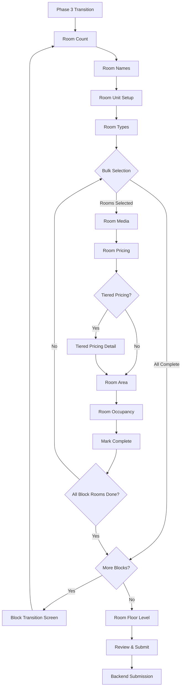
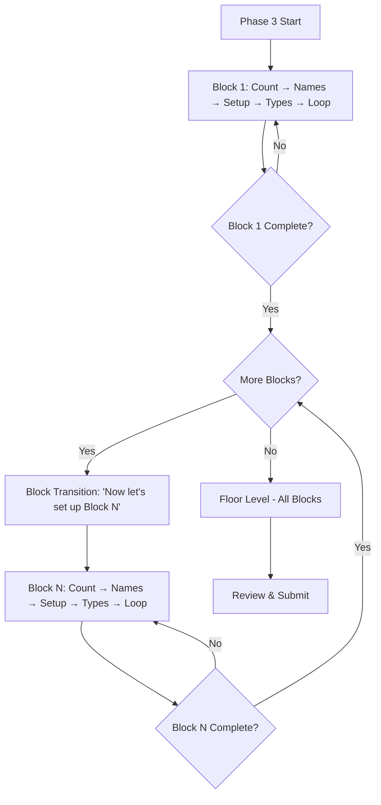
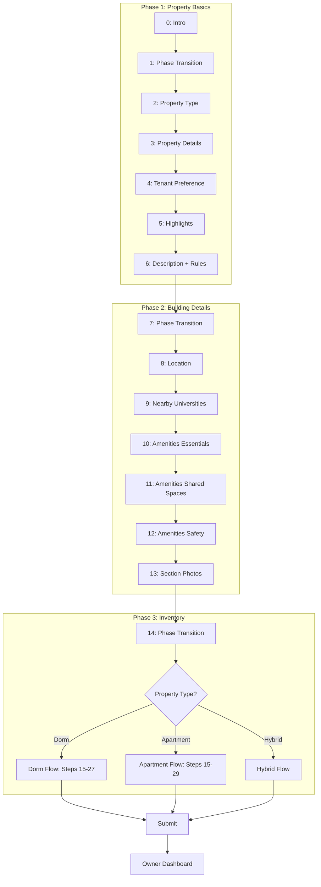

# Become-Owner Wizard Architecture (Roomy 2.0 — Post Phase 3 Rebuild)

> **Document Version**: 2.0  
> **Last Updated**: April 2026  
> **Purpose**: Canonical engineering blueprint for the Roomy property registration wizard  
> **Changelog**: Complete dorm flow redesign (Prompts 1–7), multi-block architecture, canonical room types, building/unit photo tours, floor-level assignment

---

## Table of Contents

1. [Overview](#1-overview)
2. [Supported Property Types](#2-supported-property-types)
3. [Wizard Phases & Step Index](#3-wizard-phases--step-index)
4. [Master Step Table](#4-master-step-table)
5. [Step-by-Step Specifications — Shared (Steps 0–14)](#5-step-by-step-specifications--shared)
6. [Step-by-Step Specifications — Dorm Flow (Steps 15–27)](#6-step-by-step-specifications--dorm-flow)
7. [Step-by-Step Specifications — Apartment Flow (Steps 15–29)](#7-step-by-step-specifications--apartment-flow)
8. [Step-by-Step Specifications — Hybrid Flow](#8-step-by-step-specifications--hybrid-flow)
9. [Canonical Room Type System](#9-canonical-room-type-system)
10. [Multi-Block Architecture](#10-multi-block-architecture)
11. [Building & Unit Photo Tours](#11-building--unit-photo-tours)
12. [Enumerations (Canonical Option Lists)](#12-enumerations-canonical-option-lists)
13. [Data Model (TypeScript Interfaces)](#13-data-model-typescript-interfaces)
14. [Validation & Gating Rules](#14-validation--gating-rules)
15. [Persistence & Resume Logic](#15-persistence--resume-logic)
16. [Backend Submission Contract](#16-backend-submission-contract)
17. [Security, Roles, Verification States](#17-security-roles-verification-states)
18. [Mermaid Diagrams](#18-mermaid-diagrams)
19. [Database Schema Changes (v2.0)](#19-database-schema-changes)

---

## 1. Overview

### 1.1 What This Wizard Does

The **Become-Owner Wizard** is a multi-phase registration flow that enables property owners to list their student housing accommodations on the Roomy platform. It collects comprehensive property information, inventory details, pricing structures, and media assets.

### 1.2 Key Changes in v2.0

| Area | Old (v1.0) | New (v2.0) |
|------|------------|------------|
| Dorm flow steps | 15–29 (15 steps) | 15–27 (13 steps) |
| Upload method | Manual / Excel choice | **Deleted** — always manual |
| Room types | Flat dropdown list | **Canonical type system** — base × size prefix × suffix modifiers |
| Multi-block | Not supported | **Full support** — per-block room config loop |
| Building photos | Cover + gallery | **Section-based** — Exterior, Study Room, Kitchen, etc. via `building_images` table |
| Room media | Post-loop single step | **Inside loop** — per-batch media upload |
| Floor levels | Not supported | **New step** — floor assignment with bulk apply |
| Tenant selection | Gender only | **Tenant preference page** — tenant selection + gender |
| Property details | Title only | **Expanded** — title + multi-block config + block naming |
| Amenities | Single step | **3 separate steps** — Essentials, Shared Spaces, Safety |
| Room unit setup | Not present | **New step** — block-level defaults for kitchenette/balcony/furnished |
| Description | Single textarea | **Two textareas** — description + rules & regulations |
| Highlights | ~35 chips | **Pruned** — ~20 lifestyle-focused chips |
| Review page | Basic summary | **Enhanced** — "Tenant Preference", "Rental Units Setup", "Building Blocks" cards |

### 1.3 Output Records

| Entity | Table | Description |
|--------|-------|-------------|
| Property Record | `dorms` | Main building/property information |
| Room Records | `rooms` | Individual rental units (Dorm/Hybrid) |
| Building Images | `building_images` | Section-categorized building photos |
| Room Images | `room_images` | Space-categorized unit photos |
| Apartment Records | `apartments` | Apartment units (Apartment/Hybrid) |
| Bedroom Records | `bedrooms` | Bedrooms within apartments |
| Bed Records | `beds` | Individual beds for shared occupancy |
| Owner Profile | `owners` | Owner account linked to auth.users |
| User Role | `user_roles` | Role upgrade to 'owner' |

---

## 2. Supported Property Types

### 2.1 Property Type Definitions

| Type | ID | Description | Inventory Model |
|------|-----|-------------|-----------------|
| Dorm Building | `dorm` | Stand-alone dorm with rental units | Building → (Blocks →) Rooms → Beds |
| Apartment Building | `apartment` | Building with apartment units | Building → Apartments → Bedrooms → Beds |
| Hybrid | `hybrid` | Mixed property with both | Both models combined |

### 2.2 Inventory Hierarchy

```
DORM (single block):
└── Building (dorms table)
    └── Rooms (rooms table, block_number = 1)
        └── Beds (beds table)

DORM (multi-block):
└── Building (dorms table, has_multiple_blocks = true)
    ├── Block 1 → Rooms (rooms table, block_number = 1)
    ├── Block 2 → Rooms (rooms table, block_number = 2)
    └── Block N → Rooms (rooms table, block_number = N)

APARTMENT:
└── Building (dorms table)
    └── Apartments (apartments table)
        └── Bedrooms (bedrooms table)
            └── Beds (beds table)
```

---

## 3. Wizard Phases & Step Index

### 3.1 Phase Overview

| Phase | Steps | Focus | Shared Across Types |
|-------|-------|-------|---------------------|
| Phase 1 | 0–6 | Property Basics | ✅ Yes |
| Phase 2 | 7–13 | Location & Details | ✅ Yes |
| Phase 3 | 14–27/29 | Inventory Setup | ❌ Differs by type |

### 3.2 Phase 1: Property Basics (Steps 0–6)

| Step | Page Route | Purpose |
|------|------------|---------|
| 0 | /intro | Welcome screen with resume/start |
| 1 | /phase-1-transition | Phase 1 intro animation (filler) |
| 2 | /property-type-selection | Select property type |
| 3 | /property-details | Property name + multi-block config |
| 4 | /tenant-preference | Tenant selection + gender preference |
| 5 | /highlights | Property highlight chips |
| 6 | /description | Description + rules & regulations |

### 3.3 Phase 2: Building Location & Details (Steps 7–13)

| Step | Page Route | Purpose |
|------|------------|---------|
| 7 | /phase-2-transition | Phase 2 intro animation (filler) |
| 8 | /location | Primary location + area + address |
| 9 | /nearby-universities | University tagging |
| 10 | /amenities-essentials | Essential amenities (WiFi, Kitchen, etc.) |
| 11 | /amenities-shared-spaces | Shared space amenities |
| 12 | /amenities-safety | Safety features |
| 13 | /photos | Building section photos |

### 3.4 Phase 3: Inventory Setup — Dorm Flow (Steps 14–27)

| Step | Page Route | Purpose | Per-Block? |
|------|------------|---------|------------|
| 14 | /phase-3-transition | Phase 3 intro animation (filler) | No |
| 15 | /room-count | Number of rental units | ✅ Yes |
| 16 | /room-names | Name each unit | ✅ Yes |
| 17 | /room-unit-setup | Block-level defaults (kitchenette/balcony/furnished) | ✅ Yes |
| 18 | /room-types | Canonical type assignment | ✅ Yes |
| **Loop Start** | | | |
| 19 | /room-bulk-selection | Select batch to configure | ✅ Yes |
| 20 | /room-media | Upload unit photos (inside loop) | ✅ Yes |
| 21 | /room-pricing | Set pricing | ✅ Yes |
| 22 | /tiered-pricing-detail | Tiered pricing (conditional) | ✅ Yes |
| 23 | /room-area | Room dimensions | ✅ Yes |
| 24 | /room-capacity-setup | Manual capacity (always skipped for dorm) | ✅ Yes |
| 25 | /room-occupancy | Current occupancy (loop exit) | ✅ Yes |
| **Loop End** | | | |
| 26 | /room-floor-level | Floor assignment with bulk apply | No |
| 27 | /review-and-submit | Review & submit (dorm final) | No |

### 3.5 Phase 3: Inventory Setup — Apartment Flow (Steps 14–29)

Apartment flow is **unchanged** from v1.0. See [Section 7](#7-step-by-step-specifications--apartment-flow).

---

## 4. Master Step Table

### 4.1 Dorm Flow — Complete Step Reference

| Step | Route | Component | Required | Next Logic |
|------|-------|-----------|----------|------------|
| 0 | /intro | AirbnbIntroStep | None | → 1 |
| 1 | /phase-1-transition | StepOverview | None | → 2 |
| 2 | /property-type-selection | PropertyTypeStep | propertyType | → 3 |
| 3 | /property-details | PropertyDetailsStep | title; if multi-block: blockCount ≥ 2 | → 4 |
| 4 | /tenant-preference | TenantPreferenceStep | tenantSelection + genderPreference | → 5 |
| 5 | /highlights | HighlightsStep | ≥ 0 (optional) | → 6 |
| 6 | /description | DescriptionStep | description (optional) | → 7 |
| 7 | /phase-2-transition | StepOverview | None | → 8 |
| 8 | /location | LocationStep | city + area | → 9 |
| 9 | /nearby-universities | NearbyUniversitiesStep | ≥ 0 | → 10 |
| 10 | /amenities-essentials | AmenitiesEssentialsStep | ≥ 0 | → 11 |
| 11 | /amenities-shared-spaces | AmenitiesSharedSpacesStep | ≥ 0 | → 12 |
| 12 | /amenities-safety | AmenitiesSafetyStep | ≥ 0 | → 13 |
| 13 | /photos | PhotosStep | ≥ 1 exterior | → 14 |
| 14 | /phase-3-transition | StepOverview | None | → 15 |
| 15 | /room-count | RoomCountStep | capacity ≥ 1 | → 16 |
| 16 | /room-names | RoomNamesStep | All named | → 17 |
| 17 | /room-unit-setup | RoomUnitSetupStep | All 3 defaults set | → 18 |
| 18 | /room-types | RoomTypesStep | All typed + capacity resolved | → 19 |
| 19 | /room-bulk-selection | BulkSelectionStep | ≥ 1 selected or all complete | → 20 or → 26 |
| 20 | /room-media | RoomMediaStep | Optional | → 21 |
| 21 | /room-pricing | RoomPricingStep | All priced | → 22 or → 23 |
| 22 | /tiered-pricing-detail | TieredPricingStep | All tiers filled | → 23 |
| 23 | /room-area | RoomAreaStep | Optional | → 24 |
| 24 | /room-capacity-setup | RoomCapacityStep | Always skipped (dorm) | → 25 |
| 25 | /room-occupancy | RoomOccupancyStep | ≤ capacity | → 19 (loop) or → 26 |
| 26 | /room-floor-level | RoomFloorLevelStep | Optional | → 27 |
| 27 | /review-and-submit | ReviewStep | title + area + terms | SUBMIT |

---

## 5. Step-by-Step Specifications — Shared (Steps 0–14)

### Step 0: Intro (/intro)

- Airbnb-style intro with heading: "It's easy to get started on Tenanters"
- 3 numbered phases with isometric illustrations
- "Get started" button + optional "Resume" button if saved progress exists
- No progress bar on this step

### Step 1: Phase 1 Transition (Filler)

- Full-screen animated MP4 video transition
- Auto-plays, user clicks Next to proceed
- Excluded from progress bar counting

### Step 2: Property Type Selection (/property-type-selection)

- Heading: "What type of property are you listing?"
- 3 single-select cards: Dorm, Apartment, Hybrid
- Determines entire flow branch for Phase 3
- Next disabled until selected

### Step 3: Property Details (/property-details)

**Changed from v1.0** — was just "Title" step, now expanded.

- **Section 1 — Property Name**
  - Heading: "Give your property a name"
  - Single text input, placeholder varies by type
  - Required

- **Section 2 — Multi-Block Configuration** (dorm only)
  - Heading: "Does your building have multiple blocks?"
  - Two single-select cards:
    - "No, it's one building" → `hasMultipleBlocks = false`, `blockCount = 1`
    - "Yes, multiple blocks" → `hasMultipleBlocks = true`, shows block count stepper (2–20)
  - Block naming inputs appear when multi-block selected (e.g., "Block A", "Block B")

- **Section 3 — Reception** (dorm only, if multi-block)
  - "Does your building have a reception?" toggle
  - If yes + multi-block: "Is there a reception per block?" toggle
  - Saved to: `has_reception`, `reception_per_block`

- Next disabled until title entered. If multi-block selected, blockCount must be ≥ 2.

### Step 4: Tenant Preference (/tenant-preference)

**New in v2.0** — replaces old "Gender Preference" step with two sections.

- **Section 1 — Tenant Selection**
  - Heading: "Who are your target tenants?"
  - Sub-heading: "Choose who can rent your units"
  - Three single-select cards:
    - 🎓 "Students only"
    - 💼 "Working professionals"
    - 🏠 "Everyone" / Sub-label: "No tenant restriction"
  - Saved to: `tenant_selection` column on `dorms` table
  - Values: `'student_only'`, `'professional_only'`, `'everyone'`

- **Section 2 — Gender Preference**
  - Heading: "Which gender can stay in your units?"
  - Sub-heading: "You can specify gender restrictions or keep it open to everyone"
  - Three single-select cards:
    - 👨 "Male only"
    - 👩 "Female only"
    - 🤝 "Mixed" / Sub-label: "No gender restriction"
  - Saved to: `gender_preference` column

- Next disabled until BOTH sections have a selection.

### Step 5: Highlights (/highlights)

- Heading: "What makes your place special?"
- **Pruned chip grid** (~20 lifestyle-focused options):
  - peaceful, unique, student-friendly, modern, central, spacious, cozy, affordable
  - quiet-study, social-atmosphere, near-campus, safe-secure, well-maintained, bright-airy
  - pet-friendly, fast-wifi, fully-furnished, recently-renovated, great-views, close-to-shops
- Multi-select toggle chips
- Optional step — can proceed with 0 highlights
- Selected highlights drive auto-generation of description

### Step 6: Description (/description)

**Updated in v2.0** — added rules & regulations textarea.

- **Section 1 — Property Description**
  - Heading: "Describe your place"
  - Large textarea, auto-populated from highlights
  - Once manually edited, `descriptionManuallyEdited` flag prevents auto-overwrites
  - Optional

- **Section 2 — Rules & Regulations** (new)
  - Heading: "Rules and regulations"
  - Sub-heading: "Let tenants know what's expected. This will be shown on your listing page."
  - Large textarea
  - Placeholder: "e.g. No smoking inside the building. Quiet hours from 11PM to 7AM..."
  - Optional
  - `rules_manually_edited` flag: once owner types anything, set true and never auto-overwrite
  - Saved to: `rules_and_regulations` column on `dorms` table

### Step 7: Phase 2 Transition (Filler)

- Full-screen animated MP4 video transition
- Excluded from progress bar counting

### Step 8: Location (/location)

**Unchanged from v1.0.**

- 3-tier Lebanon location taxonomy: Primary Location → Area → Sub-area/Street
- Address auto-generated from selections, editable
- Shuttle toggle
- Next disabled until Primary Location AND Area selected

### Step 9: Nearby Universities (/nearby-universities)

**Unchanged from v1.0.**

- Multi-select checklist filtered by primary location
- Optional step

### Step 10: Amenities — Essentials (/amenities-essentials)

**Updated in v2.0** — dorm-specific label changes.

- Toggle grid of essential amenity cards with detail modals
- For dorm buildings: "Kitchenette" renamed to **"Kitchen"** (dorm kitchens are shared, not private kitchenettes)
- For dorm buildings: Kitchen detail modal includes **billing toggle**: "Included in rent" vs. "Separate fee"
- Amenities: WiFi, Kitchen/Kitchenette, Laundry, Heating, AC, Furnished, TV, Electricity, Water

### Step 11: Amenities — Shared Spaces (/amenities-shared-spaces)

**Updated in v2.0** — added new shared spaces.

- Toggle grid: Study Room, Common Area, Garden, Gym, Pool, **Reception** (new), **Rooftop** (new)
- Simple toggle on/off (no detail modals)
- If "Reception" toggled ON here AND `reception_per_block = true`, photo containers generate per block

### Step 12: Amenities — Safety (/amenities-safety)

**Unchanged** — CCTV, Fire Extinguisher, Security Guard, Smoke Detector, etc.

### Step 13: Photos (/photos)

**Redesigned in v2.0** — section-based building photos replacing cover+gallery.

- Heading: "Add photos of your building"
- **Exterior section** (always shown):
  - Up to 5 exterior photos
  - First image (lowest sort_order) = building cover image across platform
  - Required: ≥ 1 exterior photo
- **Shared space sections** (dynamic — one container per toggled shared space from Steps 10–11):
  - Study Room, Common Area, Garden, Gym, Pool, Kitchen, Laundry
  - **Reception**: If `reception_per_block = false` → one "Reception" container. If `reception_per_block = true` → "Reception — Block 1", "Reception — Block 2", etc.
- **Additional Photos** section (always shown):
  - Catch-all for photos that don't fit other categories
- All photos saved to `building_images` table with `section_type` and `sort_order`
- Drag-to-reorder within sections
- Next disabled until ≥ 1 exterior photo uploaded

### Step 14: Phase 3 Transition (Filler)

- Full-screen animated MP4 video transition
- After this step, flow DIVERGES by property type

---

## 6. Step-by-Step Specifications — Dorm Flow (Steps 15–27)

### Step 15: Room Count (/room-count)

- Heading: "How many rental units does your dorm have?"
- For multi-block: heading dynamically reads "How many rental units does Block [N] have?"
- Numeric stepper input (1–2000)
- Creates N empty room objects with `block_number` set to current block
- Next disabled if < 1

### Step 16: Room Names (/room-names)

**Redesigned in v2.0** — Excel upload deleted, auto-sequencing added.

- Heading: "Name your rental units"
- Scrollable list of N text inputs
- **Auto-sequencing engine**: detects patterns (e.g., "A01", "101", "Room 1") and suggests names for empty fields
- All rooms must have unique, non-empty names
- Next disabled if any name empty

### Step 17: Room Unit Setup (/room-unit-setup) — NEW

- Heading: "Unit setup defaults"
- Sub-heading: "These apply to all units in [Block N / your building]. You can override per unit later."
- **Three questions with 3-option cards each:**

1. **"Do the units have a kitchenette?"**
   - Yes (all) / No (none) / Depends (varies per unit)
   - Saved to: `blockKitchenette` state

2. **"Do the units have a balcony?"**
   - Yes (all) / No (none) / Depends (varies per unit)
   - Saved to: `blockBalcony` state

3. **"Are the units furnished?"**
   - Yes (all) / No (none) / Depends (varies per unit)
   - Saved to: `blockFurnished` state

- If "Yes" → sets all rooms in block to `true` for that attribute
- If "No" → sets all to `false`
- If "Depends" → shows per-room toggle on the Room Types page
- Next disabled until all 3 questions answered

### Step 18: Room Types (/room-types) — FULL REDESIGN

- Heading: "What type are your rental units?"
- Sub-heading: "Assign a type to each unit"
- **See [Section 9: Canonical Room Type System](#9-canonical-room-type-system) for full type derivation logic**

For each room, the page shows:
1. **Capacity selector** (1–4 persons) — always shown
2. **Base type** (Room vs Studio) — shown if block kitchenette = "Depends"
3. **Kitchenette toggle** — shown if block kitchenette = "Depends"
4. **Balcony toggle** — shown if block balcony = "Depends"
5. **Furnished toggle** — shown if block furnished = "Depends"
6. **Bed configuration** — shown for Triple (3) and Quadruple (4) capacity rooms
7. **Suite configuration** — shown when owner selects Suite type

**Canonical type label** auto-computed from selections (e.g., "Large Twin Studio + Balcony").

Next disabled until every room has capacity assigned and all type conflicts resolved.

### Step 19: Room Bulk Selection (/room-bulk-selection) — LOOP ENTRY

- Heading: "Select units to configure"
- Groups rooms by **canonical type** (e.g., all "Single Room" units together, all "Double Studio + Balcony" together)
- Each group shows: type label, room count, individual room chips
- ✅ Green checkmark on configured rooms
- "Select All" / "Select Remaining" buttons
- **Loop logic:**
  - If ALL rooms complete → skip to Step 26 (floor level)
  - Otherwise, Next disabled if no rooms selected

### Step 20: Room Media (/room-media) — MOVED INSIDE LOOP

**Changed from v1.0** — was post-loop Step 28, now first step inside loop.

- Heading: "Add photos of your rental units"
- **Dynamic photo containers** generated per room based on unit type:

| Unit Type | Containers |
|-----------|------------|
| Room (any) | Bedroom, Full Bathroom, Workspace/Study Desk, Balcony* |
| Studio (any) | Bedroom, Kitchenette, Full Bathroom, Workspace/Study Desk, Balcony* |
| Suite (any) | Bedroom 1, Bedroom 2...N, Living Room, Kitchenette*, Full Bathroom 1...N, Workspace/Study Desk, Balcony* |

*Only shown if `has_balcony = true` / `suite_has_kitchenette = true`

- **Shared space containers** also appear:
  - Kitchen (if building has shared kitchen): includes billing toggle "Included" vs "Separate fee"
  - Reception (if `has_reception`): one container, or per-block if `reception_per_block`
- Photos saved to `room_images` table with `space_type`
- All media optional

### Step 21: Room Pricing (/room-pricing)

- Heading: "Set pricing for selected units"
- For each selected room:
  - Room name + canonical type label
  - Monthly Price input (USD)
  - Deposit input (USD)
  - **Tiered Pricing Toggle** — appears for capacity ≥ 2 rooms
- **"Select by type" dropdown** — dynamically populated from distinct canonical types in current batch

### Step 22: Tiered Pricing Detail (/tiered-pricing-detail) — CONDITIONAL

- **Shown only if** any selected room has tiered pricing enabled
- **Skipped if** no tiered pricing → jumps to Step 23
- Per-occupancy-level pricing rows (1 student, 2 students, etc.)
- Monthly price + deposit per tier

### Step 23: Room Area (/room-area)

- Heading: "Room dimensions"
- Area (m²) input per room — optional
- "Apply to all" quick action

### Step 24: Room Capacity Setup (/room-capacity-setup) — ALWAYS SKIPPED for dorm

- Capacity is auto-derived from canonical type system (Single=1, Double=2, Triple=3, Quadruple=4)
- Suite capacity calculated from bedroom configurations
- This step exists for apartment flow only; dorm flow always skips it

### Step 25: Room Occupancy (/room-occupancy) — LOOP EXIT

- Heading: "Current occupancy"
- Per room: "How many students currently live here?" (0 to capacity)
- **Loop exit logic:**
  1. Mark selected rooms as complete → add to `completedRoomIds`
  2. Clear selection
  3. Check: All rooms in current block complete?
     - **NO** → loop back to Step 19
     - **YES** → Check: More blocks? (`current_block_number < block_count`)
       - **YES** → Show block transition screen → go to Step 15 for next block
       - **NO** → Proceed to Step 26

### Step 26: Room Floor Level (/room-floor-level) — NEW

- Heading: "Which floor is each unit on?"
- Sub-heading: "Help tenants find their way around your building"

**Floor dropdown options:**
- B2 — Second basement
- B1 — First basement
- G — Ground floor
- 1, 2, 3... (no enforced maximum)

**Single-block buildings:**
- Scrollable list: `[ Room name ] [ Type label ] Floor: [ dropdown ]`
- Bulk apply at top: "Apply floor to all units: [ dropdown ] [ Apply ]"

**Multi-block buildings:**
- Collapsible sections per block (expanded by default)
- Each block has its own bulk apply
- Per-block headers: "Block 1 (12 units)", "Block 2 (8 units)"

**Floor display on listing:**
- `'G'` → "Ground floor"
- `'B1'` → "Basement 1"
- `'B2'` → "Basement 2"
- `'1'`, `'2'` → "Floor 1", "Floor 2"

- Next always enabled (floor level optional)
- Saved to: `floor_level` column on `rooms` table

### Step 27: Review & Submit (/review-and-submit) — DORM FINAL

**Updated summary cards:**

| Card | Value | Edit → |
|------|-------|--------|
| Location | "Byblos • Blat • Address" | Step 8 |
| **Tenant Preference** (renamed) | "[tenant_selection] - [gender]" e.g. "Students only - Mixed (Co-ed)" | Step 4 |
| **Rental Units Setup** (renamed) | "[N] units - [M] types" where M = distinct canonical labels | Step 18 |
| **Building Blocks** (new, conditional) | "[N] blocks configured" — shown only if `has_multiple_blocks` | Step 3 |
| Photos | "[N] exterior photos, [M] gallery photos across [K] spaces" | Step 13 |
| Description | Shows title text | Step 6 |
| Rooms Pricing | "X/Y rooms priced" | Step 21 |

- All canonical type labels shown as full labels (e.g., "Large Twin Studio + Balcony")
- Owner Agreement checkbox required
- Submit button replaces Next in footer
- On submit: owner profile → dorm record → rooms → beds → building_images → room_images

---

## 7. Step-by-Step Specifications — Apartment Flow (Steps 15–29)

**Apartment flow is unchanged from v1.0.** Steps 15–29 remain as originally documented:

| Step | Purpose |
|------|---------|
| 15 | Apartment Count |
| 16 | *(skipped — no upload method for apartments)* |
| 17 | Apartment Names |
| 18 | Apartment Types |
| 19 | Apartment Selection (loop entry) |
| 20 | Reservation Modes |
| 21 | Apartment Capacity |
| 22 | Apartment Tiered Pricing (conditional) |
| 23 | Bedroom Count |
| 24 | Bedroom Names |
| 25 | Bedroom Configuration |
| 26 | Bed Setup (conditional) |
| 27 | Bedroom Pricing (loop exit) |
| 28 | Apartment Media |
| 29 | Review & Submit |

---

## 8. Step-by-Step Specifications — Hybrid Flow

Hybrid flow combines both:
1. Steps 0–14: Shared basics and location
2. Step 14: Phase 3 intro
3. Hybrid capacity step (dorm room count + apartment count)
4. If dormRoomCount > 0: Run dorm inventory steps
5. If apartmentCount > 0: Run apartment inventory steps
6. Unified review and submit

---

## 9. Canonical Room Type System

### 9.1 Type Derivation Logic

The canonical room type is **computed**, not selected from a flat dropdown. It's assembled from:

```
[Size Prefix] + [Base Type] + [Suffix Modifiers]
```

### 9.2 Components

**Capacity → Base Name:**

| Capacity | Base Name |
|----------|-----------|
| 1 | Single |
| 2 | Double |
| 2 (twin beds) | Twin |
| 3 | Triple |
| 4 | Quadruple |

**Base Type (determined by kitchenette):**

| Has Kitchenette | Type |
|-----------------|------|
| No | Room |
| Yes | Studio |
| N/A | Suite (special — selected by owner) |

**Size Prefix (optional — owner selects):**

| Value | Applied When |
|-------|-------------|
| Small | Owner chooses |
| *(none)* | Default |
| Large | Owner chooses |

**Suffix Modifiers (appended if true):**

| Condition | Suffix |
|-----------|--------|
| `has_balcony = true` | "+ Balcony" |
| `is_furnished = true` | "+ Furnished" |

### 9.3 Example Canonical Labels

| Capacity | Kitchenette | Size | Balcony | Furnished | Canonical Label |
|----------|-------------|------|---------|-----------|-----------------|
| 1 | No | — | No | No | Single Room |
| 1 | Yes | Large | Yes | No | Large Single Studio + Balcony |
| 2 (twin) | Yes | — | Yes | Yes | Twin Studio + Balcony + Furnished |
| 3 | No | Small | No | Yes | Small Triple Room + Furnished |
| 4 | Yes | — | No | No | Quadruple Studio |
| Suite | — | — | Yes | Yes | Suite + Balcony + Furnished |

### 9.4 Bed Configuration (Triple & Quadruple)

For capacity 3 (Triple), owner must resolve bed configuration:
- 3 single beds
- 1 double + 1 single
- 1 triple bed (bunk)

For capacity 4 (Quadruple):
- 4 single beds
- 2 double beds
- 1 double + 2 single
- 2 bunk beds
- etc.

Total bed capacity must equal room capacity.

### 9.5 Suite Configuration

Suites are special — defined by having a **living room**:
- ≥ 1 bedroom (owner configures each)
- Living room (always)
- Optional kitchenette (`suite_has_kitchenette`)
- Configurable bathroom count (`suite_bathroom_count`)
- Total capacity = sum of bedroom capacities

### 9.6 Downstream Effect: Pricing Page

The "Select by type" dropdown on `/room-pricing` is **dynamically generated** from distinct canonical `room_type` values saved on `/room-types`. Never a hardcoded list.

---

## 10. Multi-Block Architecture

### 10.1 State Fields

| Field | Table | Type | Default |
|-------|-------|------|---------|
| `has_multiple_blocks` | `dorms` | boolean | false |
| `block_count` | `dorms` | int | 1 |
| `block_settings` | `dorms` | jsonb | `{}` |
| `has_reception` | `dorms` | boolean | false |
| `reception_per_block` | `dorms` | boolean | false |
| `block_number` | `rooms` | int | 1 |

### 10.2 Block Settings JSON Structure

```json
{
  "blocks": [
    { "number": 1, "name": "Block A", "roomCount": 12 },
    { "number": 2, "name": "Block B", "roomCount": 8 }
  ]
}
```

### 10.3 Per-Block Loop Flow

For multi-block buildings, Steps 15–25 repeat per block:

```
Block 1: Steps 15 → 16 → 17 → 18 → [19–25 loop] → all rooms done
  ↓
Block Transition Screen: "Now let's set up Block 2"
  ↓
Block 2: Steps 15 → 16 → 17 → 18 → [19–25 loop] → all rooms done
  ↓
... (repeat for all blocks)
  ↓
Step 26: Floor Level (all blocks combined)
Step 27: Review & Submit
```

### 10.4 Block Transition Screen

Shown between blocks:
- Heading: "Now let's set up Block [N]"
- Sub-heading: "You've completed Block [N-1]. Let's add the rooms for Block [N]."
- Single "Continue" button → navigates to `/room-count` for next block

---

## 11. Building & Unit Photo Tours

### 11.1 Building Listing Page — 5-Grid Hero

Replace single hero image with Airbnb-style 5-grid layout:

```
+----------------------------------+------------------+------------------+
|                                  |   Image 2        |   Image 3        |
|   Image 1 (Exterior, 60%)       +------------------+------------------+
|                                  |   Image 4        |   Image 5        |
|                                  |                  | [Show all photos]|
+----------------------------------+------------------+------------------+
```

- Image 1: Always building exterior (first `building_images` with `section_type = 'exterior'`)
- Images 2–5: Randomly selected from non-exterior `building_images`, re-randomized each page load
- Adapts to available image count (1→full width, 2→left+right, etc.)
- "Show all photos" → navigates to `/dorm/[id]/photos`

### 11.2 Building Photo Tour Page (/dorm/[id]/photos)

- Standalone page (not modal)
- Back arrow → building listing
- Thumbnail navigation strip below heading
- Sections in order (shown only if ≥ 1 image):
  1. Building Exterior
  2. Study Room
  3. Common Area
  4. Garden
  5. Gym
  6. Pool
  7. Kitchen
  8. Laundry
  9. Reception (or per-block if `reception_per_block`)
  10. Additional Photos
- Each section: left column (section name) + right column (adaptive image grid)
- Image grid adapts: 1→full, 2→side by side, 3→1 large + 2 small, 4→2×2, 5→1 large + 2×2
- Each image clickable → fullscreen lightbox

### 11.3 Unit Photo Tour Page (/dorm/[id]/room/[roomId]/photos)

- Separate from building tour — reads from `room_images` table
- Dynamic sections based on unit type:

| Unit Type | Sections |
|-----------|----------|
| Room | Bedroom, Full Bathroom, Workspace, Balcony* |
| Studio | Bedroom, Kitchenette, Full Bathroom, Workspace, Balcony* |
| Suite | Bedroom 1...N, Living Room, Kitchenette*, Full Bathroom 1...N, Workspace, Balcony* |

*Conditional based on unit attributes

---

## 12. Enumerations (Canonical Option Lists)

### 12.1 Property Types

| Value | Label | Description |
|-------|-------|-------------|
| `dorm` | Dorm Building | Stand-alone dorm with rental units |
| `apartment` | Apartment Building | Building with apartment units |
| `hybrid` | Hybrid | Mix of dorm rooms and apartment units |

### 12.2 Tenant Selection

| Value | Label | Emoji |
|-------|-------|-------|
| `student_only` | Students only | 🎓 |
| `professional_only` | Working professionals | 💼 |
| `everyone` | Everyone | 🏠 |

### 12.3 Gender Preference

| Value | Label | Emoji |
|-------|-------|-------|
| `male` | Male only | 👨 |
| `female` | Female only | 👩 |
| `mixed` | Mixed | 🤝 |

### 12.4 Unit Setup Defaults

| Value | Label |
|-------|-------|
| `yes` | Yes (all units) |
| `no` | No (none) |
| `depends` | Depends (varies per unit) |

### 12.5 Floor Levels

| Value | Display Label |
|-------|---------------|
| `B2` | Second basement |
| `B1` | First basement |
| `G` | Ground floor |
| `1`, `2`, `3`... | Floor 1, Floor 2, Floor 3... |

### 12.6 Amenities — Essentials

| ID | Label (Dorm) | Label (Apartment) | Has Detail Modal |
|----|-------------|-------------------|------------------|
| `wifi` | WiFi | WiFi | ✅ |
| `kitchen` | Kitchen | Kitchenette | ✅ (billing toggle for dorm) |
| `laundry` | Laundry | Laundry | ✅ |
| `heating` | Heating | Heating | ❌ |
| `ac` | AC | AC | ❌ |
| `furnished` | Furnished | Furnished | ❌ |
| `tv` | TV | TV | ❌ |
| `electricity` | Electricity | Electricity | ✅ |
| `water` | Water | Water | ✅ |

### 12.7 Amenities — Shared Spaces

| ID | Label |
|----|-------|
| `study_room` | Study Room |
| `common_area` | Common Area |
| `garden` | Garden |
| `gym` | Gym |
| `pool` | Pool |
| `reception` | Reception |
| `rooftop` | Rooftop |

### 12.8 Building Image Section Types

| Value | Display Label | Notes |
|-------|---------------|-------|
| `exterior` | Building Exterior | Required ≥ 1, max 5, first = cover |
| `study_room` | Study Room | Conditional on amenity |
| `common_area` | Common Area | Conditional on amenity |
| `garden` | Garden | Conditional on amenity |
| `gym` | Gym | Conditional on amenity |
| `pool` | Pool | Conditional on amenity |
| `kitchen` | Kitchen | Conditional on amenity |
| `laundry` | Laundry | Conditional on amenity |
| `reception` | Reception | One or per-block |
| `reception_block_1` | Reception — Block 1 | If `reception_per_block` |
| `additional` | Additional Photos | Always shown |

### 12.9 Room Image Space Types

| Value | Display Label | Shown For |
|-------|---------------|-----------|
| `bedroom` | Bedroom | All types |
| `kitchenette` | Kitchenette | Studio, Suite* |
| `bathroom` | Full Bathroom | All types |
| `workspace` | Workspace / Study Desk | All types |
| `balcony` | Balcony | If `has_balcony` |
| `living_room` | Living Room | Suite only |
| `bedroom_1`, `bedroom_2` | Bedroom 1, 2... | Suite (per configured bedroom) |
| `bathroom_1`, `bathroom_2` | Full Bathroom 1, 2... | Suite (per configured bathroom) |

---

## 13. Data Model (TypeScript Interfaces)

### 13.1 Main Wizard Form Data

```typescript
interface WizardFormData {
  // === PHASE 1: Property Basics ===
  propertyType: 'dorm' | 'apartment' | 'hybrid' | '';
  title: string;
  tenantSelection: 'student_only' | 'professional_only' | 'everyone' | '';  // NEW
  genderPreference: 'male' | 'female' | 'mixed' | '';
  highlights: string[];
  description: string;
  descriptionManuallyEdited: boolean;
  rulesAndRegulations: string;                    // NEW
  rulesManuallyEdited: boolean;                   // NEW
  
  // Multi-block (NEW)
  hasMultipleBlocks: boolean;
  blockCount: number;
  blockSettings: BlockSettings;
  hasReception: boolean;
  receptionPerBlock: boolean;
  
  // === PHASE 2: Location & Details ===
  city: string;
  area: string;
  subArea: string;
  address: string;
  shuttle: boolean;
  nearbyUniversities: string[];
  amenities: string[];
  amenityDetails: AmenityDetails;
  
  // Building photos (NEW — replaces coverImage + galleryImages)
  buildingImages: BuildingImageData[];
  
  // === PHASE 3: Inventory ===
  capacity: number;
  currentBlockNumber: number;           // NEW — tracks which block is being configured
  
  // Dorm-specific
  rooms: WizardRoomData[];
  selectedRoomIds: string[];
  completedRoomIds: string[];
  
  // Block-level defaults (NEW)
  blockKitchenette: 'yes' | 'no' | 'depends' | '';
  blockBalcony: 'yes' | 'no' | 'depends' | '';
  blockFurnished: 'yes' | 'no' | 'depends' | '';
  
  // Apartment-specific (unchanged)
  apartments: WizardApartmentData[];
  selectedApartmentIds: string[];
  completedApartmentIds: string[];
  
  // === Submission ===
  agreedToOwnerTerms: boolean;
}
```

### 13.2 Room Data (Dorm) — Updated

```typescript
interface WizardRoomData {
  id: string;
  name: string;
  type: string;                         // Canonical label (e.g., "Large Twin Studio + Balcony")
  
  // NEW — canonical type components
  capacity: number | null;
  baseType: 'room' | 'studio' | 'suite' | '';
  sizePrefix: 'small' | '' | 'large';
  hasKitchenette: boolean;
  hasBalcony: boolean;
  isFurnished: boolean;
  
  // Suite config (NEW)
  suiteHasKitchenette: boolean;
  suiteBathroomCount: number;
  suiteBedrooms: SuiteBedroomConfig[];
  
  // Bed configuration (NEW — for Triple/Quadruple)
  bedConfiguration: BedConfig[] | null;
  
  // Block & Floor (NEW)
  blockNumber: number;
  floorLevel: string | null;           // 'B2', 'B1', 'G', '1', '2', etc.
  
  // Pricing
  price: number | null;
  deposit: number | null;
  
  // Tiered Pricing
  price_1_student: number | null;
  price_2_students: number | null;
  price_3_students?: number | null;
  price_4_students?: number | null;
  deposit_1_student: number | null;
  deposit_2_students: number | null;
  deposit_3_students?: number | null;
  deposit_4_students?: number | null;
  
  // Occupancy
  capacity_occupied: number;
  
  // Physical
  area_m2: number | null;
  
  // Media (NEW — structured by space type)
  images: string[];                     // Legacy flat array
  roomImages: RoomImageData[];          // NEW — space-categorized
  video_url: string | null;
}

interface SuiteBedroomConfig {
  name: string;
  capacity: number;
  bedType: string;
}

interface BedConfig {
  bedType: string;
  count: number;
}
```

### 13.3 Building Image Data (NEW)

```typescript
interface BuildingImageData {
  id: string;
  sectionType: string;     // From section type enum
  sortOrder: number;
  url: string;
}
```

### 13.4 Room Image Data (NEW)

```typescript
interface RoomImageData {
  id: string;
  roomId: string;
  spaceType: string;       // From space type enum
  sortOrder: number;
  url: string;
}
```

### 13.5 Block Settings

```typescript
interface BlockSettings {
  blocks: BlockConfig[];
}

interface BlockConfig {
  number: number;
  name: string;
  roomCount: number;
}
```

### 13.6 Apartment Data (Unchanged)

```typescript
interface WizardApartmentData {
  id: string;
  name: string;
  type: ApartmentType;
  maxCapacity: number;
  enabledCapacities: number[];
  enableTieredPricing: boolean;
  pricingTiers: ApartmentPricingTier[];
  bedroomCount: number;
  bedrooms: WizardBedroomData[];
  enableFullApartmentReservation: boolean;
  enableBedroomReservation: boolean;
  enableBedReservation: boolean;
  images: string[];
  videoUrl: string | null;
}
```

---

## 14. Validation & Gating Rules

### 14.1 Step-by-Step Validation (Dorm Flow)

| Step | Field | Rule |
|------|-------|------|
| 2 | propertyType | Required |
| 3 | title | Required, min 3 chars |
| 3 | blockCount (if multi-block) | ≥ 2 |
| 4 | tenantSelection | Required |
| 4 | genderPreference | Required |
| 5 | highlights | Optional |
| 6 | description | Optional |
| 8 | city + area | Both required |
| 13 | buildingImages (exterior) | ≥ 1 exterior photo |
| 15 | capacity | ≥ 1 |
| 16 | rooms[].name | All non-empty, unique |
| 17 | blockKitchenette, blockBalcony, blockFurnished | All three answered |
| 18 | rooms[].type + capacity resolved | All rooms typed |
| 19 | selectedRoomIds | ≥ 1 or all complete |
| 21 | rooms[].price | All selected priced |
| 25 | rooms[].capacity_occupied | ≤ capacity |
| 26 | rooms[].floorLevel | Optional |
| 27 | title + area + agreedToOwnerTerms | All required |

### 14.2 Skip Conditions (Dorm Flow)

| Step | Skip If |
|------|---------|
| 22 (Tiered Pricing) | No rooms with tiered pricing enabled |
| 24 (Capacity Setup) | Always skipped for dorm (capacity auto-derived) |

### 14.3 Loop Exit Conditions

**Dorm (per block):**
1. All rooms in current block in `completedRoomIds`
2. If more blocks → block transition → Step 15 for next block
3. If all blocks done → Step 26

**Apartment:**
1. All apartments in `completedApartmentIds`
2. → Step 28 (Apartment Media)

---

## 15. Persistence & Resume Logic

Unchanged from v1.0:
- localStorage key: `roomy_dorm_wizard_{user_id}`
- Max age: 30 days
- Auto-save on step change, debounced on field change
- Resume button on intro if saved state exists

---

## 16. Backend Submission Contract

### 16.1 Submission Sequence (Dorm)

```
1. UI → onBeforeSubmit()
   └── upgrade_user_role('owner')
   └── INSERT owners → owner_id

2. UI → INSERT dorms (with new columns)
   └── has_multiple_blocks, block_count, block_settings
   └── has_reception, reception_per_block
   └── tenant_selection, rules_and_regulations
   └── verification_status = 'Pending'
   → dorm_id

3. For each building image:
   └── INSERT building_images (dorm_id, section_type, sort_order, url)

4. For each room (across all blocks):
   └── INSERT rooms (with new columns)
       └── block_number, floor_level
       └── is_furnished, has_balcony
       └── suite_has_kitchenette, suite_bathroom_count
       └── bed_configuration, suite_bedrooms
   └── INSERT beds (if capacity > 1)
   └── INSERT room_images (room_id, space_type, sort_order, url)

5. Clear localStorage → Navigate to /owner
```

### 16.2 New Database Inserts

```sql
-- Building images
INSERT INTO building_images (dorm_id, section_type, sort_order, url)
VALUES ($dorm_id, $section_type, $sort_order, $url);

-- Room images  
INSERT INTO room_images (room_id, space_type, sort_order, url)
VALUES ($room_id, $space_type, $sort_order, $url);
```

---

## 17. Security, Roles, Verification States

Unchanged from v1.0:

| State | Description |
|-------|-------------|
| `Pending` | Submitted, awaiting admin review |
| `Approved` | Admin verified, listing live |
| `Rejected` | Admin rejected with reason |
| `Suspended` | Temporarily suspended |

Role upgrade: `student` → `owner` via `assign-role` edge function on submit.

---

## 18. Mermaid Diagrams

### 18.1 Dorm Inventory Flow (v2.0)


```mermaid
flowchart TD
    S14[Phase 3 Transition] --> S15[Room Count]
    S15 --> S16[Room Names]
    S16 --> S17[Room Unit Setup]
    S17 --> S18[Room Types]
    
    S18 --> S19{Bulk Selection}
    
    S19 -->|All Complete| BLOCK_CHECK{More Blocks?}
    S19 -->|Rooms Selected| S20[Room Media]
    
    S20 --> S21[Room Pricing]
    
    S21 --> TIER{Tiered Pricing?}
    TIER -->|Yes| S22[Tiered Pricing Detail]
    TIER -->|No| S23[Room Area]
    S22 --> S23
    
    S23 --> S25[Room Occupancy]
    
    S25 --> MARK[Mark Complete]
    MARK --> LOOP{All Block Rooms Done?}
    LOOP -->|No| S19
    LOOP -->|Yes| BLOCK_CHECK
    
    BLOCK_CHECK -->|Yes| BTRANS[Block Transition Screen]
    BTRANS --> S15
    BLOCK_CHECK -->|No| S26[Room Floor Level]
    
    S26 --> S27[Review & Submit]
    S27 --> SUBMIT[Backend Submission]
```

### 18.2 Multi-Block Loop


```mermaid
flowchart TD
    START[Phase 3 Start] --> B1[Block 1: Count → Names → Setup → Types → Loop]
    B1 --> B1_DONE{Block 1 Complete?}
    B1_DONE -->|No| B1
    B1_DONE -->|Yes| B_CHECK{More Blocks?}
    
    B_CHECK -->|Yes| B_TRANS["Block Transition: 'Now let's set up Block N'"]
    B_TRANS --> BN[Block N: Count → Names → Setup → Types → Loop]
    BN --> BN_DONE{Block N Complete?}
    BN_DONE -->|No| BN
    BN_DONE -->|Yes| B_CHECK
    
    B_CHECK -->|No| FLOOR[Floor Level - All Blocks]
    FLOOR --> REVIEW[Review & Submit]
```

### 18.3 Overall Wizard Flow (v2.0)


```mermaid
flowchart TD
    subgraph "Phase 1: Property Basics"
        A[0: Intro] --> B[1: Phase Transition]
        B --> C[2: Property Type]
        C --> D[3: Property Details]
        D --> E[4: Tenant Preference]
        E --> F[5: Highlights]
        F --> G[6: Description + Rules]
    end
    
    subgraph "Phase 2: Building Details"
        G --> H[7: Phase Transition]
        H --> I[8: Location]
        I --> J[9: Nearby Universities]
        J --> K[10: Amenities Essentials]
        K --> L[11: Amenities Shared Spaces]
        L --> M[12: Amenities Safety]
        M --> N[13: Section Photos]
    end
    
    subgraph "Phase 3: Inventory"
        N --> O[14: Phase Transition]
        O --> P{Property Type?}
        P -->|Dorm| DORM[Dorm Flow: Steps 15-27]
        P -->|Apartment| APT[Apartment Flow: Steps 15-29]
        P -->|Hybrid| HYB[Hybrid Flow]
    end
    
    DORM --> SUB[Submit]
    APT --> SUB
    HYB --> SUB
    SUB --> DASH[Owner Dashboard]
```

---

## 19. Database Schema Changes (v2.0)

### 19.1 Dorms Table — New Columns

```sql
ALTER TABLE public.dorms
  ADD COLUMN IF NOT EXISTS has_multiple_blocks boolean DEFAULT false,
  ADD COLUMN IF NOT EXISTS block_count int DEFAULT 1,
  ADD COLUMN IF NOT EXISTS block_settings jsonb DEFAULT '{}',
  ADD COLUMN IF NOT EXISTS has_reception boolean DEFAULT false,
  ADD COLUMN IF NOT EXISTS reception_per_block boolean DEFAULT false,
  ADD COLUMN IF NOT EXISTS rules_and_regulations text DEFAULT NULL,
  ADD COLUMN IF NOT EXISTS tenant_selection text DEFAULT 'student_only';
```

### 19.2 Rooms Table — New Columns

```sql
ALTER TABLE public.rooms
  ADD COLUMN IF NOT EXISTS block_number int DEFAULT 1,
  ADD COLUMN IF NOT EXISTS floor_level text DEFAULT NULL,
  ADD COLUMN IF NOT EXISTS is_furnished boolean DEFAULT NULL,
  ADD COLUMN IF NOT EXISTS has_balcony boolean DEFAULT NULL,
  ADD COLUMN IF NOT EXISTS suite_has_kitchenette boolean DEFAULT NULL,
  ADD COLUMN IF NOT EXISTS suite_bathroom_count int DEFAULT 1,
  ADD COLUMN IF NOT EXISTS bed_configuration jsonb DEFAULT NULL,
  ADD COLUMN IF NOT EXISTS suite_bedrooms jsonb DEFAULT NULL;
```

### 19.3 New Tables

```sql
CREATE TABLE IF NOT EXISTS public.building_images (
  id            UUID PRIMARY KEY DEFAULT gen_random_uuid(),
  dorm_id       UUID REFERENCES public.dorms(id) ON DELETE CASCADE,
  section_type  text NOT NULL,
  sort_order    int DEFAULT 0,
  url           text NOT NULL,
  created_at    timestamptz DEFAULT now()
);

CREATE TABLE IF NOT EXISTS public.room_images (
  id           UUID PRIMARY KEY DEFAULT gen_random_uuid(),
  room_id      UUID REFERENCES public.rooms(id) ON DELETE CASCADE,
  space_type   text NOT NULL,
  sort_order   int DEFAULT 0,
  url          text NOT NULL,
  created_at   timestamptz DEFAULT now()
);
```

---

## Appendix A: Complete Wizard Flow Reference

```
/intro                           Step 0
/phase-1-transition              Step 1 (filler)

PHASE 1: Property Basics
/property-type-selection         Step 2
/property-details                Step 3  (renamed from /property-title)
/tenant-preference               Step 4  (renamed from /gender-preference)
/highlights                      Step 5
/description                     Step 6  (+ rules & regulations)

PHASE 2: Building Location and Details
/phase-2-transition              Step 7 (filler)
/location                        Step 8
/nearby-universities             Step 9
/amenities-essentials            Step 10
/amenities-shared-spaces         Step 11
/amenities-safety                Step 12
/photos                          Step 13 (section-based)

PHASE 3: Inventory Setup
/phase-3-transition              Step 14 (filler)
/room-count                      Step 15 (per-block heading)

[IF has_multiple_blocks: Steps 15-25 repeat per block]
[Block transition screen between blocks]

/room-names                      Step 16 (auto-sequencing)
/room-unit-setup                 Step 17 (NEW — block defaults)
/room-types                      Step 18 (canonical type system)

LOOP (per canonical type batch, per block):
  /room-bulk-selection           Step 19 (LOOP ENTRY)
  /room-media                    Step 20 (MOVED — inside loop)
  /room-pricing                  Step 21
  /tiered-pricing-detail         Step 22 (conditional)
  /room-area                     Step 23
  /room-capacity-setup           Step 24 (always skipped for dorm)
  /room-occupancy                Step 25 (LOOP EXIT)

/room-floor-level                Step 26 (NEW — all blocks)
/review-and-submit               Step 27 (updated summary cards)
```

## Appendix B: Deleted Features

| Feature | Reason |
|---------|--------|
| `/upload-method` page | Removed — always manual entry |
| `uploadMethod` state | Removed from all flows |
| Excel upload for rooms | Deleted entirely |
| `downloadTemplate()` | Deleted |
| Cover image + gallery (flat) | Replaced by section-based `building_images` |
| Room media as post-loop step | Moved inside loop as Step 20 |
| Flat room type dropdown | Replaced by canonical type system |

## Appendix C: Progress Bar Configuration

The progress bar uses 3 segments corresponding to the 3 phases:

```typescript
const phase1Steps = [2, 3, 4, 5, 6];           // 0% → 33%
const phase2Steps = [8, 9, 10, 11, 12, 13];    // 33% → 66%
const phase3Steps = [15, 16, 17, 18, 19, 20, 21, 22, 23, 24, 25, 26, 27]; // 66% → 100%

const FILLER_STEPS = {
  1: 0,       // Phase 1 filler at 0%
  7: 1/3,     // Phase 2 filler at 33%
  14: 2/3,    // Phase 3 filler at 66%
};
```

Filler steps (1, 7, 14) are excluded from phase progress calculation and snap to their phase boundary percentage.

---

## Document Revision History

| Version | Date | Changes |
|---------|------|---------|
| 1.0 | January 2026 | Initial canonical document |
| 2.0 | April 2026 | Complete dorm flow redesign, multi-block architecture, canonical room types, building/unit photo tours, floor-level assignment |

---

*End of Document*
